# Company & Mentor System — Comprehensive Documentation

> Source of truth: `api/dashboard/company/`, `api/dashboard/mentor/`, `api/dashboard/career_lab/`, `api/dashboard/ig/`, `api/dashboard/roles/`, and models in `db/company.py`, `db/mentor.py`, `db/user.py`, `db/task.py`, `db/job.py`, `db/career_lab.py`.
>
> **Response envelope** (`CustomResponse`):
> - Success → `{"message": null, "response": {...payload...}}` or `{"general_message": "...", "response": {...}}`
> - Failure → `{"general_message": "..."}` (business-rule errors) or `{"message": {"field_name": ["error text"]}}` (serializer validation errors)
>
> **Auth**: every endpoint requires a JWT bearer token (`CustomizePermission`) unless explicitly marked **🌐 Public**. `@role_required([...])` enforces a static platform role (e.g. `Admin`, `Mentor`, `Company`); many endpoints additionally layer in-view ownership checks (company owner / accepted co-admin / active mentor grant for that scope) on top of the role check.

---

## Table of Contents

- [Endpoint Index](#endpoint-index)
- [System Architecture](#system-architecture)

**Part A — Company System**
1. [Registration & Onboarding](#1-registration--onboarding)
2. [Admin Management](#2-admin-management)
3. [Listing & Directory](#3-listing--directory)
4. [Job Postings & Applications](#4-job-postings--applications)
5. [Job Engagement Analytics](#5-job-engagement-analytics)
6. [Mu Learner Directory & Talent Pool](#6-mu-learner-directory--talent-pool)
7. [Task Management](#7-task-management)
8. [Feedback & Impact Reporting](#8-feedback--impact-reporting)
9. [Collaboration / Partnership Discovery](#9-collaboration--partnership-discovery)
10. [IG Sponsorship](#10-ig-sponsorship)
11. [Event Templates](#11-event-templates)
12. [Company → Mentor Nomination](#12-company--mentor-nomination)
13. [Dashboard Home Summary](#13-dashboard-home-summary)

**Part B — Mentor System**
14. [Registration & Onboarding](#14-registration--onboarding)
15. [Public Profile & Availability](#15-public-profile--availability)
16. [Overview, Activity & Personal Analytics](#16-overview-activity--personal-analytics)
17. [Listing, Roster & Detail (Admin)](#17-listing-roster--detail-admin)
18. [Admin Assignment & Lifecycle](#18-admin-assignment--lifecycle)
19. [Scope Grants](#19-scope-grants)
20. [Persona Switching](#20-persona-switching)
21. [Mentor–Company Change](#21-mentorcompany-change)
22. [Session Management](#22-session-management)
23. [Availability Slots](#23-availability-slots)
24. [Session Participation](#24-session-participation)
25. [Student Session Requests](#25-student-session-requests)
26. [Task Management](#26-task-management)
27. [IG Opportunities](#27-ig-opportunities)

**Part C — Cross-Cutting Systems**
28. [Career Lab — Hiring Postings](#28-career-lab--hiring-postings)
29. [Interest Group (IG) Core Integration](#29-interest-group-ig-core-integration)
30. [Roles & Permissions](#30-roles--permissions)

**Appendix**
- [End-to-End Sequence Diagrams](#end-to-end-sequence-diagrams)
- [Key Data Model Reference](#key-data-model-reference)

---

## Endpoint Index

Every endpoint documented below, in one place. 🌐 = public (no auth). "Owner+" = company owner or accepted co-admin. Links jump to the module section.

### Part A — Company System

| # | Method | Endpoint | Module | Auth |
|---|---|---|---|---|
| 1 | POST | `company/register/` | [§1 Registration](#1-registration--onboarding) | Auth |
| 2 | PATCH | `company/register/` | [§1](#1-registration--onboarding) | Owner |
| 3 | GET | `company/status/` | [§1](#1-registration--onboarding) | Owner |
| 4 | GET | `company/profile/` | [§1](#1-registration--onboarding) | Owner / active Mentor |
| 5 | PATCH | `company/profile/` | [§1](#1-registration--onboarding) | Owner |
| 6 | GET | `company/profile/public/{slug}/` | [§1](#1-registration--onboarding) | 🌐 |
| 7 | GET | `company/profile/public/{slug}/jobs/` | [§1](#1-registration--onboarding) | 🌐 |
| 8 | POST | `company/admin-link/` | [§2 Admin Mgmt](#2-admin-management) | Owner |
| 9 | POST | `company/admin-link/{link_id}/respond/` | [§2](#2-admin-management) | Invitee |
| 10 | DELETE | `company/admin-link/{link_id}/` | [§2](#2-admin-management) | Owner |
| 11 | DELETE | `company/admin-link/{link_id}/leave/` | [§2](#2-admin-management) | Delegate |
| 12 | GET | `company/admin-link/list/` | [§2](#2-admin-management) | Owner+ |
| 13 | PATCH | `company/verify/{company_id}/` | [§2](#2-admin-management) | Admin |
| 14 | POST | `company/deactivate/` | [§2](#2-admin-management) | Owner |
| 15 | POST | `company/{company_id}/deactivate/` | [§2](#2-admin-management) | Admin |
| 16 | POST | `company/{company_id}/reactivate/` | [§2](#2-admin-management) | Admin |
| 17 | GET | `company/summary/` | [§2](#2-admin-management) | Admin |
| 18 | GET | `company/list/` | [§3 Listing](#3-listing--directory) | Admin |
| 19 | GET | `company/{company_id}/` | [§3](#3-listing--directory) | Admin |
| 20 | POST | `company/jobs/` | [§4 Jobs](#4-job-postings--applications) | Owner+ / active Mentor |
| 21 | GET | `company/jobs/` | [§4](#4-job-postings--applications) | Owner+ / Mentor |
| 22 | GET | `company/jobs/pending/` | [§4](#4-job-postings--applications) | Owner+ |
| 23 | GET | `company/jobs/all/` | [§4](#4-job-postings--applications) | Auth |
| 24 | GET | `company/jobs/{job_id}/` | [§4](#4-job-postings--applications) | Owner+ / Mentor |
| 25 | PATCH | `company/jobs/{job_id}/` | [§4](#4-job-postings--applications) | Owner+ / Mentor |
| 26 | DELETE | `company/jobs/{job_id}/` | [§4](#4-job-postings--applications) | Owner+ / Mentor |
| 27 | POST | `company/jobs/{job_id}/approve/` | [§4](#4-job-postings--applications) | Owner+ |
| 28 | POST | `company/jobs/{job_id}/reject/` | [§4](#4-job-postings--applications) | Owner+ |
| 29 | POST | `company/jobs/{job_id}/request-changes/` | [§4](#4-job-postings--applications) | Owner+ |
| 30 | POST | `company/jobs/{job_id}/view/` | [§4](#4-job-postings--applications) | 🌐 |
| 31 | POST | `company/jobs/{job_id}/apply/` | [§4](#4-job-postings--applications) | Auth (learner) |
| 32 | GET | `company/jobs/{job_id}/applications/` | [§4](#4-job-postings--applications) | Owner+ / Mentor |
| 33 | GET | `company/applications/me/` | [§4](#4-job-postings--applications) | Auth |
| 34 | PATCH | `company/applications/{app_id}/status/` | [§4](#4-job-postings--applications) | Owner+ / Mentor |
| 35 | DELETE | `company/applications/{app_id}/withdraw/` | [§4](#4-job-postings--applications) | Applicant |
| 36 | PATCH | `company/applications/{app_id}/resubmit/` | [§4](#4-job-postings--applications) | Applicant |
| 37 | GET | `company/jobs/{job_id}/analytics/` | [§5 Job Analytics](#5-job-engagement-analytics) | Owner+ / Mentor |
| 38 | GET | `company/analytics/campus/` | [§5](#5-job-engagement-analytics) | Owner+ / Mentor |
| 39 | GET | `company/analytics/campus/trend/` | [§5](#5-job-engagement-analytics) | Owner+ / Mentor |
| 40 | GET | `company/analytics/gigs/` | [§5](#5-job-engagement-analytics) | Owner+ / Mentor |
| 41 | GET | `company/analytics/tasks/` | [§5](#5-job-engagement-analytics) | Owner+ / Mentor |
| 42 | GET | `company/mulearners/` | [§6 Talent Pool](#6-mu-learner-directory--talent-pool) | Owner+ / Mentor |
| 43 | GET | `company/mulearners/shortlist/` | [§6](#6-mu-learner-directory--talent-pool) | Owner+ / Mentor |
| 44 | POST | `company/mulearners/shortlist/` | [§6](#6-mu-learner-directory--talent-pool) | Owner+ / Mentor |
| 45 | DELETE | `company/mulearners/shortlist/{user_id}/` | [§6](#6-mu-learner-directory--talent-pool) | Owner+ / Mentor |
| 46 | GET | `company/talent-pool/analytics/` | [§6](#6-mu-learner-directory--talent-pool) | Owner+ / Mentor |
| 47 | GET | `company/talent-pool/insights/` | [§6](#6-mu-learner-directory--talent-pool) | Owner+ / Mentor |
| 48 | GET | `company/tasks/` | [§7 Tasks](#7-task-management) | Verified company member |
| 49 | POST | `company/tasks/` | [§7](#7-task-management) | Verified company member |
| 50 | GET | `company/tasks/{task_id}/` | [§7](#7-task-management) | Verified company member |
| 51 | PUT | `company/tasks/{task_id}/` | [§7](#7-task-management) | Owner+ |
| 52 | PATCH | `company/tasks/{task_id}/` | [§7](#7-task-management) | Owner+ |
| 53 | DELETE | `company/tasks/{task_id}/` | [§7](#7-task-management) | Owner+ |
| 54 | GET | `company/tasks/templates/` | [§7](#7-task-management) | Verified company member |
| 55 | POST | `company/tasks/templates/` | [§7](#7-task-management) | Owner+ |
| 56 | DELETE | `company/tasks/templates/{template_id}/` | [§7](#7-task-management) | Owner+ |
| 57 | POST | `company/feedback/` | [§8 Feedback](#8-feedback--impact-reporting) | Auth (participant) |
| 58 | GET | `company/feedback/list/` | [§8](#8-feedback--impact-reporting) | Owner+ / Mentor |
| 59 | GET | `company/impact-report/` | [§8](#8-feedback--impact-reporting) | Owner+ / Mentor |
| 60 | PATCH | `company/impact-report/publish/` | [§8](#8-feedback--impact-reporting) | Owner+ |
| 61 | GET | `company/collaborations/` | [§9 Collaboration](#9-collaboration--partnership-discovery) | Owner+ |
| 62 | POST | `company/collaborations/` | [§9](#9-collaboration--partnership-discovery) | Owner+ |
| 63 | GET | `company/collaborations/discover/` | [§9](#9-collaboration--partnership-discovery) | Auth |
| 64 | POST | `company/collaborations/{id}/respond/` | [§9](#9-collaboration--partnership-discovery) | Campus/IG Lead |
| 65 | DELETE | `company/collaborations/{id}/` | [§9](#9-collaboration--partnership-discovery) | Owner+ |
| 66 | POST | `company/ig-sponsorship/{ig_id}/` | [§10 IG Sponsorship](#10-ig-sponsorship) | Owner+ |
| 67 | PATCH | `company/ig-sponsorship/{ig_id}/review/` | [§10](#10-ig-sponsorship) | Admin |
| 68 | GET | `company/ig-sponsorship/{ig_id}/metrics/` | [§10](#10-ig-sponsorship) | Owner+ (approved sponsor) |
| 69 | GET | `company/events/templates/` | [§11 Event Templates](#11-event-templates) | Verified company member |
| 70 | POST | `company/events/templates/` | [§11](#11-event-templates) | Owner+ |
| 71 | DELETE | `company/events/templates/{template_id}/` | [§11](#11-event-templates) | Owner+ |
| 72 | POST | `company/mentor/nominate/` | [§12 Mentor Nomination](#12-company--mentor-nomination) | Owner+ |
| 73 | POST | `company/mentor/apply/` | [§12](#12-company--mentor-nomination) | Auth (not owner) |
| 74 | GET | `company/mentor/list/` | [§12](#12-company--mentor-nomination) | Owner+ |
| 75 | GET | `company/home-summary/` | [§13 Home Summary](#13-dashboard-home-summary) | Owner+ / Mentor |

### Part B — Mentor System

| # | Method | Endpoint | Module | Auth |
|---|---|---|---|---|
| 76 | POST | `mentor/register/` | [§14 Registration](#14-registration--onboarding) | Auth |
| 77 | PATCH | `mentor/register/` | [§14](#14-registration--onboarding) | Applicant |
| 78 | GET | `mentor/status/` | [§14](#14-registration--onboarding) | Applicant |
| 79 | PATCH | `mentor/verify/{mentor_id}/` | [§14](#14-registration--onboarding) | Tier-specific verifier |
| 80 | GET | `mentor/public/profile/{mentor_id}/` | [§15 Public Profile](#15-public-profile--availability) | Auth |
| 81 | GET | `mentor/public/availability/{mentor_id}/` | [§15](#15-public-profile--availability) | Auth |
| 82 | GET | `mentor/overview/` | [§16 Overview](#16-overview-activity--personal-analytics) | Mentor |
| 83 | GET | `mentor/activity/` | [§16](#16-overview-activity--personal-analytics) | Mentor/CampusLead/LeadEnabler |
| 84 | GET | `mentor/analytics/personal/` | [§16](#16-overview-activity--personal-analytics) | Mentor |
| 85 | GET | `mentor/profile/completion/` | [§16](#16-overview-activity--personal-analytics) | Mentor |
| 86 | GET | `mentor/persona/current/` | [§16](#16-overview-activity--personal-analytics) | Auth |
| 87 | GET | `mentor/profile/` | [§16](#16-overview-activity--personal-analytics) | Mentor |
| 88 | PATCH | `mentor/profile/` | [§16](#16-overview-activity--personal-analytics) | Mentor |
| 89 | GET | `mentor/list/` | [§17 Listing/Roster](#17-listing-roster--detail-admin) | Admin |
| 90 | GET | `mentor/roster/` | [§17](#17-listing-roster--detail-admin) | Admin |
| 91 | GET | `mentor/change-requests/` | [§17](#17-listing-roster--detail-admin) | Admin |
| 92 | GET | `mentor/detail/{mentor_id}/` | [§17](#17-listing-roster--detail-admin) | Admin |
| 93 | POST | `mentor/admin/assign/` | [§18 Admin Assignment](#18-admin-assignment--lifecycle) | Admin |
| 94 | DELETE | `mentor/admin/assign/{user_muid}/` | [§18](#18-admin-assignment--lifecycle) | Admin |
| 95 | POST | `mentor/admin/deactivate/{user_mentor_id}/` | [§18](#18-admin-assignment--lifecycle) | Admin |
| 96 | POST | `mentor/admin/reactivate/{user_mentor_id}/` | [§18](#18-admin-assignment--lifecycle) | Admin |
| 97 | GET | `mentor/{mentor_id}/grants/` | [§19 Scope Grants](#19-scope-grants) | Admin / Owner+ (company tier) |
| 98 | DELETE | `mentor/{mentor_id}/grants/{grant_id}/` | [§19](#19-scope-grants) | Admin / Owner+ (company tier) |
| 99 | GET | `mentor/persona/status/` | [§20 Persona Switching](#20-persona-switching) | Mentor |
| 100 | POST | `mentor/persona/switch/` | [§20](#20-persona-switching) | Mentor |
| 101 | POST | `mentor/change-company/` | [§21 Company Change](#21-mentorcompany-change) | Mentor |
| 102 | POST | `mentor/session/create/` | [§22 Sessions](#22-session-management) | Mentor (grant-scoped) |
| 103 | GET | `mentor/session/list/` | [§22](#22-session-management) | Mentor |
| 104 | GET | `mentor/session/list/{session_id}/` | [§22](#22-session-management) | Mentor |
| 105 | PATCH | `mentor/session/update/{session_id}/` | [§22](#22-session-management) | Mentor (owner) |
| 106 | DELETE | `mentor/session/update/{session_id}/` | [§22](#22-session-management) | Mentor (owner) |
| 107 | POST | `mentor/session/complete/{session_id}/` | [§22](#22-session-management) | Mentor (owner) |
| 108 | GET | `mentor/session/available/` | [§22](#22-session-management) | Auth |
| 109 | GET | `mentor/session/admin/list/` | [§22](#22-session-management) | Admin |
| 110 | PATCH | `mentor/session/admin/verify/{session_id}/` | [§22](#22-session-management) | Admin |
| 111 | GET | `mentor/availability/` | [§23 Availability](#23-availability-slots) | Mentor |
| 112 | POST | `mentor/availability/` | [§23](#23-availability-slots) | Mentor |
| 113 | GET | `mentor/availability/{slot_id}/` | [§23](#23-availability-slots) | Mentor (owner) |
| 114 | PATCH | `mentor/availability/{slot_id}/` | [§23](#23-availability-slots) | Mentor (owner) |
| 115 | DELETE | `mentor/availability/{slot_id}/` | [§23](#23-availability-slots) | Mentor (owner) |
| 116 | POST | `mentor/session/participation/join/{session_id}/` | [§24 Participation](#24-session-participation) | Auth (learner) |
| 117 | POST | `mentor/session/participant/add/{session_id}/` | [§24](#24-session-participation) | Mentor (owner) |
| 118 | GET | `mentor/session/participant/history/` | [§24](#24-session-participation) | Auth |
| 119 | GET | `mentor/session/participant/list/{session_id}/` | [§24](#24-session-participation) | Mentor (owner) |
| 120 | PATCH | `mentor/session/participant/update/{link_id}/` | [§24](#24-session-participation) | Mentor (owner) |
| 121 | PATCH | `mentor/session/participant/feedback/{session_id}/` | [§24](#24-session-participation) | Participant |
| 122 | POST | `mentor/session/student/request/` | [§25 Student Requests](#25-student-session-requests) | Auth (student) |
| 123 | GET | `mentor/session/student/my-requests/` | [§25](#25-student-session-requests) | Student |
| 124 | GET | `mentor/session/student-requests/` | [§25](#25-student-session-requests) | Mentor |
| 125 | PATCH | `mentor/session/student-requests/{session_id}/verify/` | [§25](#25-student-session-requests) | Mentor |
| 126 | GET | `mentor/tasks/ig-dropdown/` | [§26 Tasks](#26-task-management) | Mentor |
| 127 | GET | `mentor/tasks/` | [§26](#26-task-management) | Mentor |
| 128 | POST | `mentor/tasks/` | [§26](#26-task-management) | Mentor (active) |
| 129 | GET | `mentor/tasks/{task_id}/` | [§26](#26-task-management) | Mentor (owner) |
| 130 | PUT | `mentor/tasks/{task_id}/` | [§26](#26-task-management) | Mentor (owner, active) |
| 131 | DELETE | `mentor/tasks/{task_id}/` | [§26](#26-task-management) | Mentor (owner, active) |
| 132 | GET | `mentor/opportunities/` | [§27 IG Opportunities](#27-ig-opportunities) | Mentor |
| 133 | POST | `mentor/opportunities/` | [§27](#27-ig-opportunities) | Mentor (active, scoped) |
| 134 | GET | `mentor/opportunities/{opportunity_id}/` | [§27](#27-ig-opportunities) | Mentor (managing) |
| 135 | PATCH | `mentor/opportunities/{opportunity_id}/` | [§27](#27-ig-opportunities) | Mentor (managing, active) |
| 136 | DELETE | `mentor/opportunities/{opportunity_id}/` | [§27](#27-ig-opportunities) | Mentor (managing) |
| 137 | POST | `mentor/opportunities/{opportunity_id}/publish/` | [§27](#27-ig-opportunities) | Mentor (managing, active) |
| 138 | POST | `mentor/opportunities/{opportunity_id}/close/` | [§27](#27-ig-opportunities) | Mentor (managing, active) |
| 139 | GET | `mentor/opportunities/public/` | [§27](#27-ig-opportunities) | 🌐 |

### Part C — Cross-Cutting Systems

| # | Method | Endpoint | Module | Auth |
|---|---|---|---|---|
| 140 | GET | `/dashboard/career-lab/hiring/` | [§28 Hiring](#28-career-lab--hiring-postings) | Admin/Associate |
| 141 | POST | `/dashboard/career-lab/hiring/` | [§28](#28-career-lab--hiring-postings) | Admin/Associate |
| 142 | GET | `/dashboard/career-lab/hiring/{hiring_id}/` | [§28](#28-career-lab--hiring-postings) | Admin/Associate |
| 143 | PUT | `/dashboard/career-lab/hiring/{hiring_id}/` | [§28](#28-career-lab--hiring-postings) | Admin/Associate |
| 144 | DELETE | `/dashboard/career-lab/hiring/{hiring_id}/` | [§28](#28-career-lab--hiring-postings) | Admin/Associate |
| 145 | GET | `/dashboard/career-lab/hiring/csv/` | [§28](#28-career-lab--hiring-postings) | Admin/Associate |
| 146 | POST | `/dashboard/career-lab/hiring/csv/` | [§28](#28-career-lab--hiring-postings) | Admin/Associate |
| 147 | GET | `/public/career-lab/ongoing/` | [§28](#28-career-lab--hiring-postings) | 🌐 |
| 148 | GET | `/public/career-lab/previous/` | [§28](#28-career-lab--hiring-postings) | 🌐 |
| 149 | POST | `/dashboard/ig/{pk}/activate/` | [§29 IG Core](#29-interest-group-ig-core-integration) | Admin / IG Lead |
| 150 | POST | `/dashboard/ig/{pk}/deactivate/` | [§29](#29-interest-group-ig-core-integration) | Admin / IG Lead |
| 151 | GET | `/dashboard/ig/` | [§29](#29-interest-group-ig-core-integration) | Auth |
| 152 | POST | `/dashboard/roles/user-role/` | [§30 Roles](#30-roles--permissions) | Admin |
| 153 | DELETE | `/dashboard/roles/user-role/` | [§30](#30-roles--permissions) | Admin |
| 154 | GET | `/dashboard/roles/` | [§30](#30-roles--permissions) | Admin |

---

## System Architecture

```
                                   ┌───────────────────────┐
                                   │        Admin           │
                                   │  (verify / moderate /  │
                                   │   assign / provision)  │
                                   └───┬────────────┬───────┘
                                       │            │
                          verifies    │            │  verifies
                    ┌──────────────────┘            └───────────────────┐
                    ▼                                                   ▼
          ┌───────────────────┐        nominates /apply       ┌──────────────────┐
          │      COMPANY       │ ───────────────────────────▶ │      MENTOR       │
          │ (register → verify)│ ◀─────────────────────────── │ (register → verify)│
          └───┬───────┬───────┘        change-company          └───┬─────┬───────┘
              │       │                                             │     │
   jobs/tasks │       │ sponsors                          sessions │     │ opportunities
              │       │                                             │     │
              ▼       ▼                                             ▼     ▼
     ┌────────────┐ ┌──────────────┐                      ┌──────────────┐ ┌───────────────┐
     │  Learners   │ │ Interest Grp │◀─────────────────────│  Learners /  │ │  Public board  │
     │ (apply/join)│ │     (IG)      │   IG_MENTOR grant     │   Students   │ │ (opportunities)│
     └─────┬──────┘ └──────────────┘                      └──────────────┘ └───────────────┘
           │
           ▼
   ┌────────────────┐
   │ Feedback /       │
   │ Impact Report    │
   └────────────────┘
```

**Core authority chain (mentor side):** `MentorApplication (PENDING → APPROVED)` → `MentorScopeGrant (active, scope_type + scope_id)` → unlocks Sessions / Tasks / Opportunities for that scope. A mentor can hold several approved applications (one per tier) and switch the active one via **Persona Switching**.

**Core authority chain (company side):** `Company (pending → verified)` → `Organization` provisioned → owner may delegate co-admins (`CompanyAdminLink`) → owner/co-admin/active `COMPANY_MENTOR` can post Jobs/Tasks/Collaborations/Opportunities under that company.

---

# Part A — Company System

The Company system lets an organization register on the platform, get admin-verified, post jobs/gigs/tasks, source talent from the learner base, run feedback/impact reporting, sponsor Interest Groups, and nominate/host mentors. A `Company` row is owned by one platform user (`company_user`) who may delegate up to 5 co-admins via `CompanyAdminLink`.

## 1. Registration & Onboarding

**Flow:**
```
User ──POST register/──▶ Company(status=pending)
                              │
                Admin ───PATCH verify/{id}/───▶ status=verified
                              │                        │
                              │                        ├─▶ Organization auto-created
                              │                        ├─▶ Creator linked (UserOrganizationLink)
                              │                        └─▶ "Company" role granted
                              │
                     status=rejected ◀── Admin (with rejection_reason)
                              │
                User ──PATCH register/──▶ auto-resubmits → status=pending
```

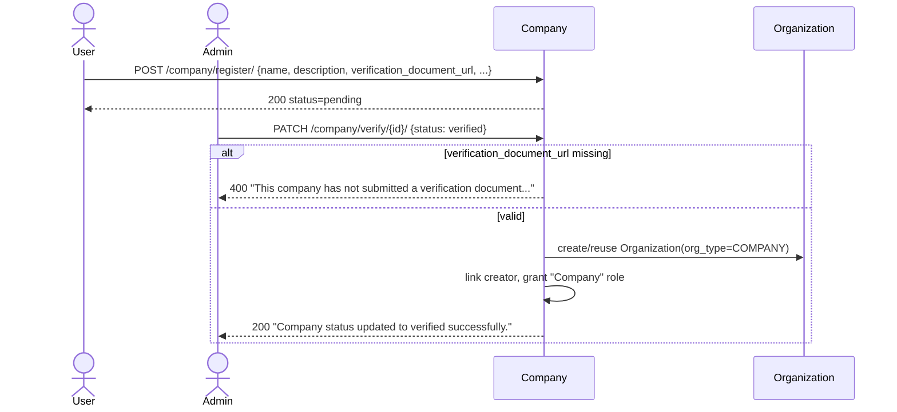

### POST `company/register/`
- **View**: `CompanyRegistrationAPI.post`
- **Permission**: any authenticated user; one registration per account.
- **Request**:
```json
{
  "name": "Acme Corp",
  "description": "Cloud infrastructure company",
  "verification_document_url": "https://docs.example.com/reg-cert.pdf",
  "logo": "https://cdn.example.com/logo.png",
  "short_pitch": "We build cloud-native tooling",
  "industry_sector": "Software",
  "website_link": "https://acme.com",
  "email": "hr@acme.com",
  "location": "Bengaluru",
  "district_id": "uuid",
  "state_id": "uuid",
  "country_id": "uuid",
  "legal_name": "Acme Corp Pvt Ltd",
  "registration_number": "U72900KA2020PTC000000",
  "tax_id": "GSTIN000",
  "company_size": "51-200",
  "linkedin_url": "https://linkedin.com/company/acme",
  "founded_year": 2015,
  "remote_policy": "Hybrid",
  "culture_text": "We value ownership and craftsmanship...",
  "tech_stack": ["Python", "React", "Kubernetes"],
  "perks": "Health insurance, stock options",
  "testimonials": "\"Great place to grow\" — alumnus",
  "gallery": ["https://cdn.example.com/office1.jpg"]
}
```
- **Response `200`**:
```json
{
  "general_message": "Company registration submitted successfully.",
  "response": {
    "id": "6f1a2b3c-...",
    "name": "Acme Corp",
    "slug": "acme-corp",
    "status": "pending",
    "email": "hr@acme.com",
    "industry_sector": "Software",
    "company_size": "51-200",
    "created_at": "2026-08-02T10:00:00Z"
  }
}
```
- **Error `400`** (duplicate registration):
```json
{
  "general_message": "A company request already exists for your account."
}
```
- **Error `400`** (validation):
```json
{
  "message": {
    "name": ["This field is required."],
    "verification_document_url": ["Enter a valid URL."]
  }
}
```

### PATCH `company/register/`
- **Request** (partial, same fields as POST):
```json
{
  "description": "Updated pitch",
  "company_size": "201-500"
}
```
- **Response `200`** (resubmission after rejection):
```json
{
  "general_message": "Company registration updated and resubmitted successfully.",
  "response": {
    "status": "pending"
  }
}
```
- **Error `400`** (already verified):
```json
{
  "general_message": "Your company is already verified. Please use the profile endpoint to update your details."
}
```

### GET `company/status/`
- **Request**: none.
- **Response `200`**:
```json
{
  "response": {
    "id": "uuid",
    "name": "Acme Corp",
    "status": "pending",
    "profile_completeness": 62,
    "verification_sla_message": "Verification typically takes 3-5 business days.",
    "company_id": "uuid"
  }
}
```
- **Error `404`**:
```json
{
  "general_message": "No company request found for your account."
}
```

### GET `company/profile/`
- **Response `200`**: full `CompanyDetailSerializer` object (all registration fields + `profile_completeness`).
- **Error `404`**:
```json
{
  "general_message": "Company profile not found or access denied."
}
```

### PATCH `company/profile/` (owner only)
- **Request**:
```json
{
  "short_pitch": "New one-liner",
  "tech_stack": ["Go", "React"]
}
```
- **Response `200`**:
```json
{
  "general_message": "Company profile updated successfully.",
  "response": {
    "short_pitch": "New one-liner",
    "tech_stack": ["Go", "React"]
  }
}
```

### GET `company/profile/public/{slug}/` 🌐 Public
- **Response `200`**:
```json
{
  "response": {
    "id": "uuid",
    "name": "Acme Corp",
    "slug": "acme-corp",
    "logo": "https://...",
    "description": "...",
    "short_pitch": "...",
    "industry_sector": "Software",
    "website_link": "https://acme.com",
    "location": "Bengaluru",
    "verified_since": "2026-05-01T00:00:00Z",
    "collaboration_summary": {
      "total_partnerships": 4,
      "campus_partnerships": 3,
      "ig_partnerships": 1
    },
    "impact_summary": null
  }
}
```
- **Error `404`** (any non-verified company):
```json
{
  "general_message": "Company not found."
}
```

### GET `company/profile/public/{slug}/jobs/` 🌐 Public
- **Response `200`**:
```json
{
  "data": [
    {
      "id": "uuid",
      "title": "Backend Developer",
      "job_type": "Full-Time",
      "location": "Remote",
      "created_at": "2026-07-01T10:00:00Z"
    }
  ],
  "pagination": {"page": 1, "per_page": 10, "total": 1}
}
```

---

## 2. Admin Management

```
Owner ──POST admin-link/ {muid}──▶ CompanyAdminLink(status=PENDING) ──notif──▶ Invitee
Invitee ──POST admin-link/{id}/respond/ {accept:true}──▶ status=ACCEPTED (now co-admin)
Owner ──DELETE admin-link/{id}/──▶ status=REVOKED
Admin ──POST {company_id}/deactivate/──▶ status=deactivated ─┬─▶ all links REVOKED
                                                              ├─▶ COMPANY_MENTOR grants deactivated
                                                              └─▶ IG sponsorships cleared
```

### POST `company/admin-link/`
- **Request**:
```json
{
  "muid": "john-doe@mulearn"
}
```
- **Response `200`**:
```json
{
  "general_message": "Delegate invited successfully. Awaiting their acceptance.",
  "response": {
    "id": "link-uuid",
    "status": "PENDING"
  }
}
```
- **Error `429`**:
```json
{
  "general_message": "You already have 5 accepted/pending delegates. Revoke one before inviting another."
}
```
- **Error `400`**:
```json
{
  "general_message": "You are already the owner."
}
```
```json
{
  "general_message": "This user is already an accepted delegate."
}
```
- **Error `404`**:
```json
{
  "general_message": "Delegate user not found."
}
```

### POST `company/admin-link/{link_id}/respond/`
- **Request**:
```json
{
  "accept": true
}
```
- **Response `200`**:
```json
{
  "general_message": "Invitation accepted successfully."
}
```
(or `"Invitation declined successfully."` if `accept: false`)
- **Error `404`**:
```json
{
  "general_message": "Pending invitation not found."
}
```

### DELETE `company/admin-link/{link_id}/`
- **Request**: none.
- **Response `200`**:
```json
{
  "general_message": "Delegate revoked successfully."
}
```
- **Error `404`**:
```json
{
  "general_message": "Accepted delegate link not found."
}
```

### DELETE `company/admin-link/{link_id}/leave/`
- **Response `200`**:
```json
{
  "general_message": "You have left as a company delegate successfully."
}
```

### GET `company/admin-link/list/`
- **Response `200`**:
```json
{
  "response": [
    {
      "id": "uuid",
      "user_muid": "john-doe@mulearn",
      "user_name": "John Doe",
      "status": "ACCEPTED",
      "invited_by_name": "Jane Owner",
      "invited_at": "2026-07-01T10:00:00Z",
      "responded_at": "2026-07-01T11:00:00Z",
      "revoked_by_name": null,
      "revoked_at": null
    }
  ]
}
```

### PATCH `company/verify/{company_id}/` (Admin only)
- **Request (approve)**:
```json
{
  "status": "verified"
}
```
- **Request (reject)**:
```json
{
  "status": "rejected",
  "rejection_reason": "Verification document unreadable"
}
```
- **Response `200`**:
```json
{
  "general_message": "Company status updated to verified successfully."
}
```
- **Error `400`**:
```json
{
  "general_message": "Company is already verified."
}
```
```json
{
  "general_message": "This company has not submitted a verification document and cannot be verified."
}
```
```json
{
  "message": {
    "rejection_reason": ["This field is required when rejecting."]
  }
}
```
- **Error `404`**:
```json
{
  "general_message": "Company not found."
}
```

### POST `company/deactivate/` (owner) / `company/{company_id}/deactivate/` (Admin)
- **Request**: none.
- **Response `200`**:
```json
{
  "general_message": "Company deactivated successfully."
}
```
- **Error `403`** (self-service path):
```json
{
  "general_message": "Verified company profile not found."
}
```
- **Error `404`** (admin path):
```json
{
  "general_message": "Verified company not found."
}
```

### POST `company/{company_id}/reactivate/` (Admin only)
- **Response `200`**:
```json
{
  "general_message": "Company reactivated successfully."
}
```
- **Error `404`**:
```json
{
  "general_message": "Deactivated company not found."
}
```

### GET `company/summary/` (Admin only)
- **Response `200`**:
```json
{
  "response": {
    "total_companies": 120,
    "verified_companies": 80,
    "pending_companies": 30,
    "rejected_companies": 5,
    "deactivated_companies": 5,
    "total_jobs": 340,
    "total_company_tasks": 210
  }
}
```

---

## 3. Listing & Directory

### GET `company/list/` (Admin only)
- **Query**: `?status=verified&industry_sector=Software&page=1&per_page=20&search=acme&sort_by=name`
- **Response `200`**:
```json
{
  "data": [
    {
      "id": "uuid",
      "name": "Acme Corp",
      "slug": "acme-corp",
      "status": "verified",
      "email": "hr@acme.com",
      "company_user_name": "Jane Owner",
      "industry_sector": "Software",
      "location": "Bengaluru",
      "verified_at": "2026-05-01T00:00:00Z"
    }
  ],
  "pagination": {"page": 1, "per_page": 20, "total": 80}
}
```

### GET `company/{company_id}/` (Admin only)
- **Response `200`**: full `CompanyDetailSerializer` object.
- **Error `404`**:
```json
{
  "general_message": "Company not found."
}
```

---

## 4. Job Postings & Applications

### Status state machine

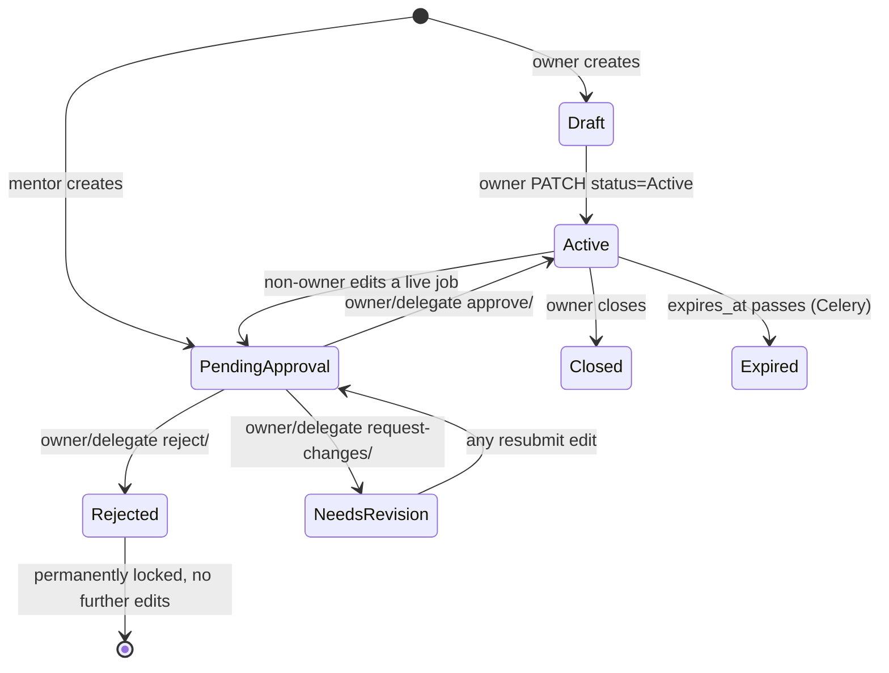

### Sequence — mentor posts a job, owner approves

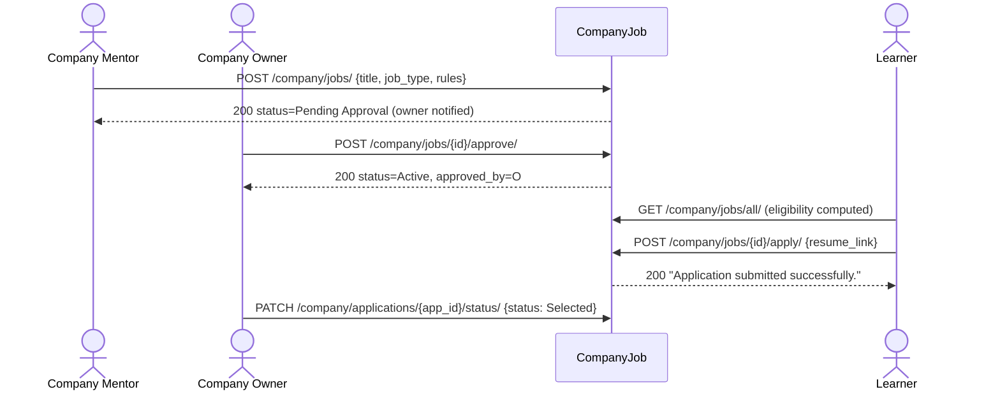

**Workflow narrative:** a company owner/co-admin or an active `COMPANY_MENTOR` creates a job. Owner-created jobs go live as `Draft` (owner then activates via PATCH); mentor-created jobs start as `Pending Approval` and require owner/delegate sign-off. Learners browse `jobs/all/` (with computed rule-based `eligibility`), apply via `apply/`, and the company tracks applications through a status funnel.

### POST `company/jobs/`
- **Request**:
```json
{
  "title": "Backend Developer",
  "experience": "2-4 years",
  "job_description": "Build and maintain REST APIs",
  "location": "Remote",
  "salary_range": "10-15 LPA",
  "job_type": "Full-Time",
  "duration_value": 6,
  "duration_unit": "months",
  "hourly_rate": 500.00,
  "deliverables": {"sprint_reviews": "weekly"},
  "stipend": "5000/month",
  "certificate_provided": "Yes",
  "expires_at": "2026-09-01T00:00:00Z",
  "rules": [
    {"rule_type": "min_karma", "rule_value": "100"}
  ]
}
```
- **Response `200`** (owner path):
```json
{
  "general_message": "Job posted successfully.",
  "response": {
    "id": "job-uuid",
    "status": "Draft",
    "title": "Backend Developer"
  }
}
```
- **Response `200`** (mentor path):
```json
{
  "general_message": "Job submitted for approval successfully.",
  "response": {
    "id": "job-uuid",
    "status": "Pending Approval"
  }
}
```
- **Error `429`**:
```json
{
  "general_message": "You already have 5 pending/needs-revision job postings. Resolve those before submitting more."
}
```
- **Error `400`**:
```json
{
  "message": {
    "rule_value": ["Must reference an active skill id."]
  }
}
```

### GET `company/jobs/` / `company/jobs/pending/` / `company/jobs/all/`
- **Query** (`jobs/all/`): `?job_type=Full-Time&search=backend&sort_by=created_at`
- **Response `200`** (`jobs/all/`, learner view):
```json
{
  "data": [
    {
      "id": "job-uuid",
      "title": "Backend Developer",
      "job_type": "Full-Time",
      "location": "Remote",
      "company_name": "Acme Corp",
      "company_logo": "https://...",
      "eligibility": {
        "eligible": false,
        "rules": [
          {
            "rule_type": "min_karma",
            "rule_value": "100",
            "met": false,
            "message": "Insufficient Karma. Minimum 100 required."
          }
        ]
      }
    }
  ],
  "pagination": {"page": 1, "per_page": 10, "total": 1}
}
```

### GET `company/jobs/{job_id}/`
- **Response `200`**: single job object (same shape as list item, without `eligibility`).
- **Error `404`**:
```json
{
  "general_message": "Job not found or access denied."
}
```

### PATCH `company/jobs/{job_id}/`
- **Request**:
```json
{
  "status": "Active",
  "salary_range": "12-18 LPA"
}
```
- **Response `200`**:
```json
{
  "general_message": "Job updated successfully.",
  "response": {
    "status": "Active",
    "salary_range": "12-18 LPA"
  }
}
```
- **Response `200`** (non-owner edit on Active job, forced back to review):
```json
{
  "general_message": "Job submitted for owner approval (only the company owner can publish directly).",
  "response": {
    "status": "Pending Approval"
  }
}
```
- **Error `403`**:
```json
{
  "general_message": "This job has been rejected and can no longer be edited."
}
```

### DELETE `company/jobs/{job_id}/`
- **Response `200`**:
```json
{
  "general_message": "Job deleted successfully."
}
```

### POST `company/jobs/{job_id}/approve/`
- **Request**: none.
- **Response `200`**:
```json
{
  "general_message": "Job approved and published successfully."
}
```
- **Error `400`**:
```json
{
  "general_message": "Job is not pending approval."
}
```
- **Error `403`**:
```json
{
  "general_message": "You cannot approve your own job posting."
}
```

### POST `company/jobs/{job_id}/reject/`
- **Request**:
```json
{
  "reason": "Salary range not competitive"
}
```
- **Response `200`**:
```json
{
  "general_message": "Job rejected successfully."
}
```
- **Error `400`**:
```json
{
  "general_message": "A rejection reason is required."
}
```

### POST `company/jobs/{job_id}/request-changes/`
- **Request**:
```json
{
  "note": "Please add remote-work eligibility details"
}
```
- **Response `200`**:
```json
{
  "general_message": "Revision requested. Mentor notified."
}
```

### POST `company/jobs/{job_id}/view/` 🌐 Public
- **Request**: none.
- **Response `200`**:
```json
{
  "general_message": "Job view tracked successfully."
}
```
- **Response `200`** (deduped repeat):
```json
{
  "general_message": "Job view already tracked recently."
}
```
- **Error `404`**:
```json
{
  "error_code": "JOB_NOT_FOUND"
}
```

### POST `company/jobs/{job_id}/apply/`
- **Request**:
```json
{
  "resume_link": "https://drive.google.com/resume.pdf",
  "cover_letter": "I'd love to join..."
}
```
- **Response `200`**:
```json
{
  "general_message": "Application submitted successfully.",
  "response": {
    "id": "app-uuid",
    "status": "Pending"
  }
}
```
- **Error `400`**:
```json
{
  "general_message": "You have already applied for this job."
}
```
```json
{
  "general_message": "You cannot apply to your own company's job posting."
}
```
```json
{
  "general_message": "Insufficient Karma. Minimum 100 required."
}
```
- **Error `403`**:
```json
{
  "general_message": "Suspended accounts cannot apply to jobs."
}
```

### GET `company/jobs/{job_id}/applications/`
- **Response `200`**:
```json
{
  "data": [
    {
      "id": "app-uuid",
      "job": "job-uuid",
      "applicant_name": "Learner One",
      "applicant_email": "l1@x.com",
      "resume_link": "https://...",
      "status": "Pending",
      "applied_at": "2026-07-20T10:00:00Z"
    }
  ],
  "pagination": {"page": 1, "per_page": 10, "total": 1}
}
```

### GET `company/applications/me/`
- **Response `200`**:
```json
{
  "data": [
    {
      "job": {
        "id": "job-uuid",
        "title": "Backend Developer",
        "company_name": "Acme Corp"
      },
      "resume_link": "https://...",
      "status": "Pending",
      "applied_at": "2026-07-20T10:00:00Z"
    }
  ],
  "pagination": {"page": 1, "per_page": 10, "total": 1}
}
```

### PATCH `company/applications/{app_id}/status/`
- **Request**:
```json
{
  "status": "Shortlisted"
}
```
or
```json
{
  "status": "Rejected",
  "rejection_reason": "Not enough experience"
}
```
- **Response `200`**:
```json
{
  "general_message": "Application status updated successfully.",
  "response": {
    "status": "Shortlisted"
  }
}
```
- **Error `400`**:
```json
{
  "general_message": "Cannot change the status of a selected application."
}
```

### DELETE `company/applications/{app_id}/withdraw/`
- **Response `200`**:
```json
{
  "general_message": "Application withdrawn successfully."
}
```
- **Error `403`**:
```json
{
  "general_message": "A selected application cannot be withdrawn."
}
```

### PATCH `company/applications/{app_id}/resubmit/`
- **Request**:
```json
{
  "resume_link": "https://new-resume.pdf",
  "cover_letter": "Updated pitch"
}
```
- **Response `200`**:
```json
{
  "general_message": "Application resubmitted successfully.",
  "response": {
    "status": "Pending"
  }
}
```
- **Error `400`**:
```json
{
  "general_message": "Only rejected or withdrawn applications can be resubmitted."
}
```

---

## 5. Job Engagement Analytics

### GET `company/jobs/{job_id}/analytics/`
- **Response `200`**:
```json
{
  "response": {
    "job_id": "uuid",
    "job_title": "Backend Developer",
    "total_views": 340,
    "total_applications": 28,
    "total_hired": 3,
    "conversion_rate_percentage": 8.24
  }
}
```

### GET `company/analytics/campus/`
- **Response `200`**:
```json
{
  "response": {
    "job_applicants_by_campus": [
      {"campus_id": "uuid", "campus_name": "XYZ College", "applicant_count": 12}
    ],
    "task_completers_by_campus": [
      {"campus_id": "uuid", "campus_name": "XYZ College", "completer_count": 8}
    ],
    "event_attendees_by_campus": [
      {"campus_id": "uuid", "campus_name": "XYZ College", "attendee_count": 5}
    ]
  }
}
```

### GET `company/analytics/campus/trend/`
- **Query**: `?campus_id={uuid}&quarters=4` (campus_id required)
- **Response `200`**:
```json
{
  "response": {
    "campus_id": "uuid",
    "campus_name": "XYZ College",
    "trend": [
      {"quarter": "Q1 2026", "active_learners": 40, "job_applicants": 5, "karma_earned": 1200, "sessions_held": 2}
    ]
  }
}
```
- **Error `400`**:
```json
{
  "general_message": "campus_id query parameter is required."
}
```

### GET `company/analytics/gigs/`
- **Response `200`**:
```json
{
  "response": {
    "total_gigs_posted": 20,
    "active_gigs": 10,
    "closed_gigs": 5,
    "average_hourly_rate": 450.75,
    "application_funnel": {
      "Total": 60, "Pending": 20, "In-Review": 10, "Shortlisted": 8,
      "Interview": 5, "Selected": 12, "Rejected": 5
    },
    "conversion_rate": "20.00%"
  }
}
```

### GET `company/analytics/tasks/`
- **Response `200`**:
```json
{
  "response": {
    "total_tasks_submitted": 15,
    "approval_funnel": {
      "Total": 15, "approved": 10, "pending": 3, "rejected": 1, "changes_requested": 1
    },
    "total_completions": 120,
    "completion_rate": "1200.00%",
    "karma_distributed": 3600,
    "learner_satisfaction": {"average_rating": 4.5, "rating_count": 20}
  }
}
```

---

## 6. Mu Learner Directory & Talent Pool

### GET `company/mulearners/`
- **Query**: `?min_karma=100&level=3&college=XYZ&ig=AI/ML&search=jane&sort_by=karma`
- **Response `200`**:
```json
{
  "data": [
    {
      "id": "uuid",
      "full_name": "Jane Learner",
      "muid": "jane-l@mulearn",
      "email": "jane@x.com",
      "karma": 350,
      "level": 3,
      "college": "XYZ College",
      "department": "CSE",
      "graduation_year": 2027
    }
  ],
  "pagination": {"page": 1, "per_page": 20, "total": 500}
}
```

### GET/POST `company/mulearners/shortlist/`
- **POST Request**:
```json
{
  "user_id": "learner-uuid",
  "note": "Strong backend candidate"
}
```
- **POST Response `200`**:
```json
{
  "general_message": "Learner added to shortlist successfully."
}
```
- **GET Response `200`**:
```json
{
  "data": [
    {"id": "uuid", "full_name": "Jane Learner", "karma": 350, "shortlist_note": "Strong backend candidate"}
  ]
}
```
- **Error `400`**:
```json
{
  "general_message": "This learner is already on your shortlist."
}
```

### DELETE `company/mulearners/shortlist/{user_id}/`
- **Response `200`**:
```json
{
  "general_message": "Learner removed from shortlist successfully."
}
```

### GET `company/talent-pool/analytics/`
- **Response `200`**:
```json
{
  "response": {
    "total_learners": 500,
    "level_distribution": [
      {"level_id": "uuid", "level_name": "Level 1", "level_order": 1, "count": 100, "percentage": 20.0}
    ],
    "top_interest_groups": [
      {"ig_id": "uuid", "name": "AI/ML", "learner_count": 40, "total_karma": 12000}
    ]
  }
}
```

### GET `company/talent-pool/insights/`
- **Query**: `?district_id={uuid}` or `?export=csv`
- **Response `200`** (JSON):
```json
{
  "response": {
    "total_learners": 500,
    "top_skills": [
      {"skill_id": "uuid", "skill_name": "Python", "learner_count": 120}
    ],
    "top_colleges": [
      {"college_id": "uuid", "college_name": "XYZ College", "learner_count": 60}
    ]
  }
}
```
- **Response `200`** (`?export=csv`): `Content-Type: text/csv`, attachment `talent_pool_insights.csv`.

---

## 7. Task Management

### Status state machine (shared with Mentor Task Management, §26)

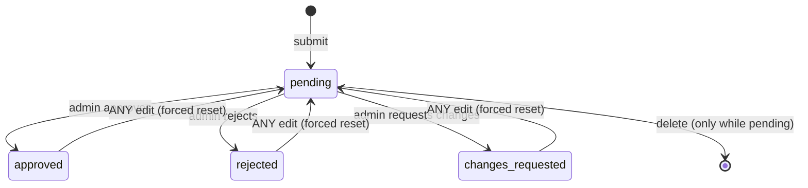

### GET/POST `company/tasks/`
- **Query** (GET): `?approval_status=pending&search=cloud&sort_by=created_at`
- **POST Request**:
```json
{
  "hashtag": "#companychallenge1",
  "title": "Build a REST API",
  "karma": 50,
  "usage_count": 1,
  "description": "Complete the challenge...",
  "type": "task-type-uuid",
  "level": "level-uuid",
  "skill_ids": ["skill-uuid"]
}
```
- **POST Response `200`**:
```json
{
  "general_message": "Task submitted for approval."
}
```
- **GET Response `200`**:
```json
{
  "data": [
    {
      "id": "uuid",
      "hashtag": "#companychallenge1",
      "title": "Build a REST API",
      "karma": 50,
      "type": "Challenge",
      "active": false,
      "approval_status": "pending",
      "requested_by_name": "Jane Doe",
      "skills": [{"id": "uuid", "name": "Python", "code": "PY"}],
      "created_at": "2026-08-01T10:00:00Z"
    }
  ],
  "pagination": {"page": 1, "per_page": 10, "total": 1}
}
```
- **Error `429`**:
```json
{
  "general_message": "You already have 5 pending/changes-requested tasks. Resolve those before submitting more."
}
```
- **Error `400`**:
```json
{
  "message": {
    "hashtag": ["A task with this hashtag already exists."]
  }
}
```

### GET `company/tasks/{task_id}/`
- **Response `200`**: single task object (same shape as list item above).
- **Error `404`**:
```json
{
  "general_message": "Task not found."
}
```

### PUT/PATCH `company/tasks/{task_id}/` (owner/admin only)
- **Request** (PATCH):
```json
{
  "title": "New title",
  "karma": 40,
  "skill_ids": ["skill-uuid-2"]
}
```
- **Response `200`**:
```json
{
  "general_message": "Task updated successfully and submitted for admin review.",
  "response": {
    "approval_status": "pending",
    "active": false
  }
}
```
- **Error `403`**:
```json
{
  "general_message": "You must have a verified company profile to view tasks."
}
```
(or an owner/admin-only message for mutating verbs)

### DELETE `company/tasks/{task_id}/`
- **Response `200`**:
```json
{
  "general_message": "Task deleted successfully.",
  "response": {
    "task_id": "uuid",
    "deleted_at": "2026-08-02T00:00:00Z"
  }
}
```

### GET/POST `company/tasks/templates/`
- **POST Request**:
```json
{
  "title": "Monthly Challenge",
  "hashtag_prefix": "#monthly",
  "description": "...",
  "karma": 50,
  "type_id": "task-type-uuid"
}
```
- **POST Response `200`**:
```json
{
  "general_message": "Task template saved successfully.",
  "response": {"id": "template-uuid"}
}
```
- **GET Response `200`**:
```json
{
  "response": {
    "data": [
      {"id": "uuid", "title": "Monthly Challenge", "hashtag_prefix": "#monthly", "karma": 50, "type_id": "uuid", "type_title": "Challenge"}
    ]
  }
}
```

### DELETE `company/tasks/templates/{template_id}/`
- **Response `200`**:
```json
{
  "general_message": "Task template deleted successfully."
}
```

---

## 8. Feedback & Impact Reporting

### Eligibility gates by interaction type

```
JOB      → application.status ∈ {Selected, Rejected}   (final outcome only)
TASK     → KarmaActivityLog.appraiser_approved == True  (completed + approved)
EVENT    → active EventConnection ticket for that event
SESSION  → session.status == COMPLETED AND caller was a MENTEE participant
```

### POST `company/feedback/`
- **Request**:
```json
{
  "interaction_type": "JOB",
  "entity_id": "job-uuid",
  "rating": 5,
  "comment": "Great experience"
}
```
- **Response `200`**:
```json
{
  "general_message": "Feedback submitted successfully."
}
```
- **Error `400`**:
```json
{
  "general_message": "You can only give feedback after your application has reached a final outcome."
}
```
```json
{
  "general_message": "You have already submitted feedback for this interaction."
}
```
- **Error `404`**:
```json
{
  "general_message": "Job not found."
}
```

### GET `company/feedback/list/`
- **Query**: `?interaction_type=JOB&sort_by=-rating`
- **Response `200`**:
```json
{
  "response": {
    "data": [
      {
        "id": "uuid",
        "interaction_type": "JOB",
        "entity_id": "job-uuid",
        "submitted_by_name": "Jane Doe",
        "rating": 5,
        "comment": "Great experience",
        "created_at": "2026-07-20T10:00:00Z"
      }
    ],
    "pagination": {"page": 1, "per_page": 10, "total": 1}
  }
}
```

### GET `company/impact-report/`
- **Response `200`**:
```json
{
  "response": {
    "company": {"id": "uuid", "name": "Acme Inc"},
    "reach": {
      "total_learners_touched": 120,
      "job_applicants": 40,
      "task_completers": 30,
      "event_attendees": 60,
      "session_mentees": 10
    },
    "quality_signal": {
      "average_rating": 4.5,
      "total_ratings": 25,
      "feedback_average_rating": 4.6,
      "feedback_count": 20,
      "session_average_rating": 4.1,
      "session_rating_count": 5
    },
    "outcome_signal": {"hires": 8, "karma_distributed": 15000}
  }
}
```

### PATCH `company/impact-report/publish/`
- **Request**:
```json
{
  "publish": true
}
```
- **Response `200`**:
```json
{
  "general_message": "Impact report published on your public profile."
}
```

---

## 9. Collaboration / Partnership Discovery

### Status state machine

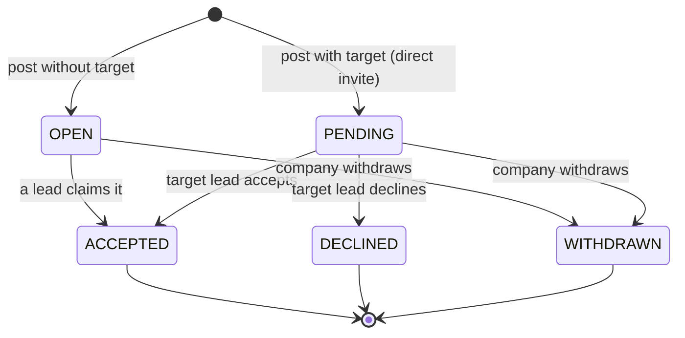

### Sequence — direct invite → acceptance → auto-wired event

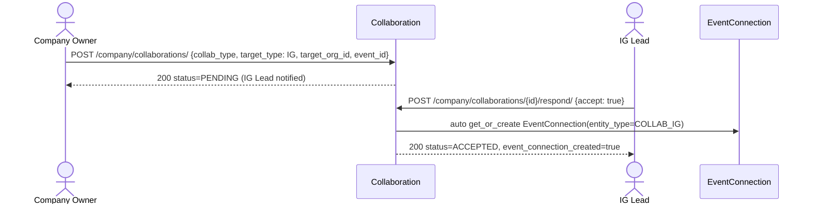

### GET/POST `company/collaborations/`
- **POST Request**:
```json
{
  "collab_type": "EVENT_COHOST",
  "title": "Hackathon Co-host",
  "description": "Joint hackathon with prizes",
  "target_type": "IG",
  "target_org_id": "ig-uuid",
  "event_id": "event-uuid"
}
```
- **POST Response `200`**:
```json
{
  "general_message": "Collaboration posted successfully.",
  "response": {"id": "uuid", "status": "PENDING"}
}
```
- **GET Response `200`**:
```json
{
  "response": {
    "data": [
      {"id": "uuid", "collab_type": "EVENT_COHOST", "title": "Hackathon Co-host", "status": "PENDING", "target_type": "IG", "created_at": "2026-07-01T10:00:00Z"}
    ],
    "pagination": {"page": 1, "per_page": 10, "total": 1}
  }
}
```
- **Error `429`**:
```json
{
  "general_message": "You already have 5 open/pending collaboration posts. Resolve those before posting more."
}
```

### GET `company/collaborations/discover/`
- **Query**: `?collab_type=IG_SPONSORSHIP`
- **Response `200`**:
```json
{
  "response": {
    "data": [
      {"id": "uuid", "collab_type": "IG_SPONSORSHIP", "title": "Looking for IG partner", "company_name": "Acme Corp", "status": "OPEN"}
    ],
    "pagination": {"page": 1, "per_page": 10, "total": 1}
  }
}
```

### POST `company/collaborations/{id}/respond/`
- **Request** (claim OPEN):
```json
{
  "accept": true,
  "target_type": "IG",
  "target_org_id": "ig-uuid"
}
```
- **Request** (respond to PENDING invite):
```json
{
  "accept": false,
  "rejection_reason": "Timing conflict"
}
```
- **Response `200`**:
```json
{
  "general_message": "Collaboration accepted successfully.",
  "response": {"status": "ACCEPTED", "event_connection_created": true}
}
```
- **Error `400`**:
```json
{
  "general_message": "This collaboration is no longer open for a response."
}
```

### DELETE `company/collaborations/{id}/`
- **Response `200`**:
```json
{
  "general_message": "Collaboration withdrawn successfully."
}
```
- **Error `400`**:
```json
{
  "general_message": "Only an open or pending collaboration can be withdrawn."
}
```

---

## 10. IG Sponsorship

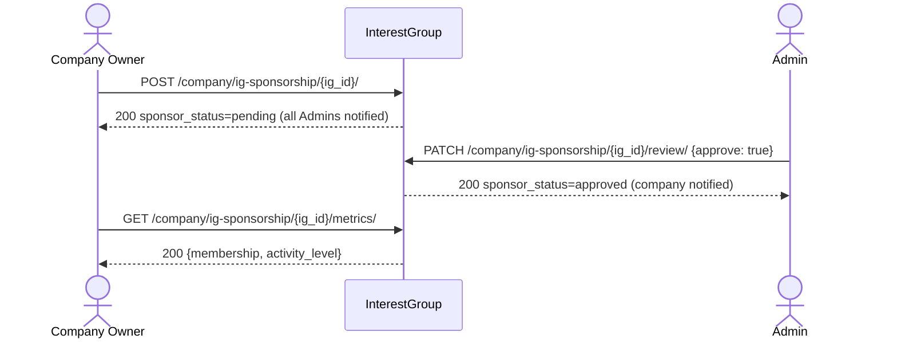

### POST `company/ig-sponsorship/{ig_id}/`
- **Request**: none.
- **Response `200`**:
```json
{
  "general_message": "Sponsorship request submitted. Awaiting admin approval."
}
```
- **Error `400`**:
```json
{
  "general_message": "This Interest Group is already sponsored by another company."
}
```
```json
{
  "general_message": "This Interest Group already has a pending sponsorship request from another company."
}
```

### PATCH `company/ig-sponsorship/{ig_id}/review/` (Admin only)
- **Request**:
```json
{
  "approve": true
}
```
- **Response `200`**:
```json
{
  "general_message": "IG sponsorship approved successfully."
}
```
- **Error `404`**:
```json
{
  "general_message": "No pending sponsorship request found for this Interest Group."
}
```

### GET `company/ig-sponsorship/{ig_id}/metrics/`
- **Response `200`**:
```json
{
  "response": {
    "ig_id": "uuid",
    "ig_name": "Python IG",
    "membership": {"total_members": 150, "new_members_last_30_days": 12},
    "activity_level": {"active_tasks": 5, "task_completions_last_30_days": 40, "sessions_last_30_days": 3}
  }
}
```
- **Error `404`**:
```json
{
  "general_message": "This Interest Group is not sponsored by your company."
}
```

---

## 11. Event Templates

### GET/POST `company/events/templates/`
- **POST Request**:
```json
{
  "title": "Tech Talk",
  "description": "...",
  "event_type": "tech_talk",
  "default_duration_minutes": 90
}
```
- **POST Response `200`**:
```json
{
  "general_message": "Event template saved successfully.",
  "response": {"id": "template-uuid"}
}
```
- **GET Response `200`**:
```json
{
  "response": {
    "data": [
      {"id": "uuid", "title": "Tech Talk", "description": "...", "event_type": "tech_talk", "default_duration_minutes": 90}
    ]
  }
}
```

### DELETE `company/events/templates/{template_id}/`
- **Response `200`**:
```json
{
  "general_message": "Event template deleted successfully."
}
```
- **Error `404`**:
```json
{
  "general_message": "Template not found."
}
```

---

## 12. Company → Mentor Nomination

```
Owner ──POST mentor/nominate/ {muid}──▶ MentorApplication(status=APPROVED, immediate)
User  ──POST mentor/apply/ {company_id}──▶ MentorApplication(status=PENDING) ──▶ Owner reviews later via mentor/verify/
```

### POST `company/mentor/nominate/`
- **Request**:
```json
{
  "muid": "john-doe@mulearn",
  "reason": "Domain expertise in backend systems"
}
```
- **Response `200`**:
```json
{
  "general_message": "User approved as Company Mentor successfully.",
  "response": {
    "id": "uuid",
    "user_id": "uuid",
    "user_name": "John Doe",
    "user_email": "john@x.com",
    "org_name": "Acme Org",
    "mentor_tier": "COMPANY_MENTOR",
    "status": "APPROVED",
    "reason": "Domain expertise in backend systems",
    "verified_at": "2026-08-02T10:00:00Z"
  }
}
```
- **Error `400`**:
```json
{
  "message": {
    "muid": ["You cannot nominate yourself as your company's mentor."]
  }
}
```

### POST `company/mentor/apply/`
- **Request**:
```json
{
  "company_id": "company-uuid",
  "about": "5 years backend experience",
  "expertise": "Backend, DevOps",
  "reason": "I want to mentor students",
  "hours": 5
}
```
- **Response `200`**:
```json
{
  "general_message": "Application submitted successfully. It is pending review by the company owner.",
  "response": {"status": "PENDING"}
}
```
- **Error `400`**:
```json
{
  "message": {
    "company_id": ["You cannot apply to be a mentor for a company you own or co-administer."]
  }
}
```

### GET `company/mentor/list/`
- **Response `200`**:
```json
{
  "response": [
    {"id": "uuid", "user_id": "uuid", "user_name": "John Doe", "mentor_tier": "COMPANY_MENTOR", "status": "APPROVED", "reason": "..."}
  ]
}
```

---

## 13. Dashboard Home Summary

### GET `company/home-summary/`
- **Query**: `?period=30d`
- **Response `200`**:
```json
{
  "response": {
    "company": {"id": "uuid", "name": "Acme", "slug": "acme", "status": "verified", "logo": "https://..."},
    "quick_stats": {"jobs_posted": 12, "total_views": 340, "applications": 55, "hired": 4},
    "stat_cards": [
      {"key": "jobs_posted", "label": "Jobs posted", "value": 12, "delta": 3, "delta_type": "increase", "period": "30d"},
      {"key": "total_views", "label": "Total views", "value": 340, "delta": 340, "delta_type": "increase", "period": "30d"},
      {"key": "applications", "label": "Applications", "value": 55, "delta": 10, "delta_type": "increase", "period": "30d"},
      {"key": "hired", "label": "Hired", "value": 4, "delta": 1, "delta_type": "increase", "period": "30d"}
    ],
    "talent_pool": {"total_learners": 500, "level_distribution": [], "top_interest_groups": []}
  }
}
```
> **Known quirk**: the `total_views` card's `delta` repeats the cumulative total rather than a period-scoped delta, since views aren't timestamped per-event.

---

# Part B — Mentor System

The Mentor system is built on three concepts: a **`UserMentor`** profile (one per user, `about/expertise/hours` + a global `is_active` kill-switch), one or more **`MentorApplication`** rows (one per tier: `IG_MENTOR`, `COMPANY_MENTOR`, `CAMPUS_MENTOR`, or global `MENTOR`), and **`MentorScopeGrant`** rows (the actual source of authority once an application is `APPROVED`). A mentor can hold multiple approved applications across different tiers simultaneously and switch between them via **Persona Switching** (§20).

```
MentorApplication(PENDING) ──verify──▶ APPROVED ──▶ MentorScopeGrant(active) ──▶ unlocks:
                                                          ├── Sessions (§22)
                                                          ├── Tasks (§26)
                                                          └── Opportunities (§27)
```

## 14. Registration & Onboarding

### Application state machine

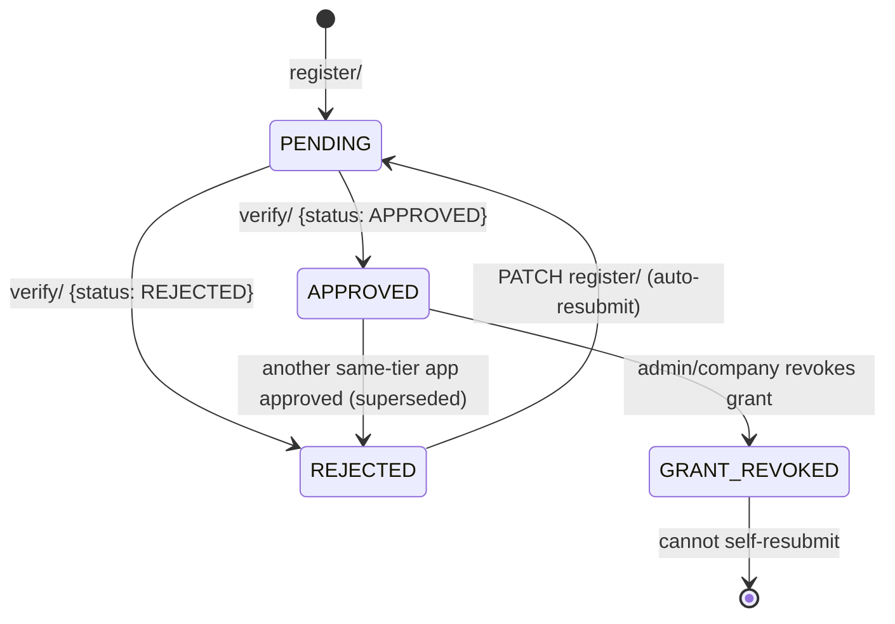

### Sequence — apply → verify (IG tier)

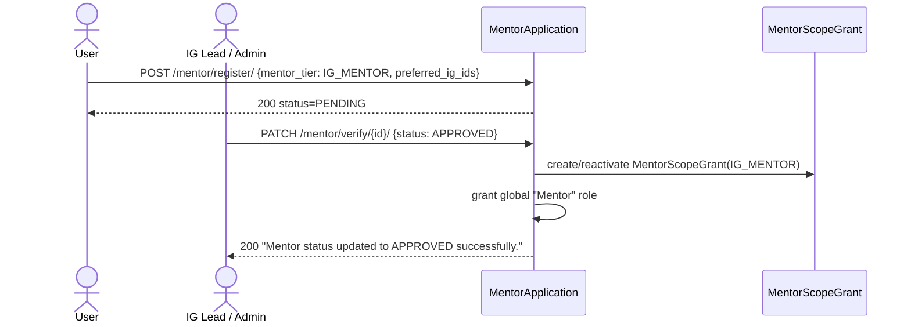

### POST `mentor/register/`
- **Request**:
```json
{
  "mentor_tier": "IG_MENTOR",
  "org": "org-uuid",
  "preferred_ig_ids": ["ig-uuid1", "ig-uuid2"],
  "reason": "I want to give back to the community",
  "about": "5 years in cloud infra",
  "expertise": "AWS, Kubernetes",
  "hours": 5,
  "linkedin": "https://www.linkedin.com/in/janedoe"
}
```
- **Response `200`**:
```json
{
  "general_message": "Mentor registration submitted successfully.",
  "response": {
    "id": "app-uuid",
    "about": "5 years in cloud infra",
    "expertise": "AWS, Kubernetes",
    "hours": 5,
    "reason": "...",
    "preferred_ig_ids": ["ig-uuid1", "ig-uuid2"],
    "mentor_tier": "IG_MENTOR",
    "org": null
  }
}
```
- **Error `400`**:
```json
{
  "general_message": "You already have an active or pending IG mentor application."
}
```

### PATCH `mentor/register/`
- **Request**:
```json
{
  "id": "app-uuid",
  "hours": 10,
  "preferred_ig_ids": ["ig-uuid3"]
}
```
- **Response `200`**:
```json
{
  "general_message": "Mentor application updated successfully.",
  "response": {"hours": 10, "preferred_ig_ids": ["ig-uuid3"]}
}
```
- **Error `400`**:
```json
{
  "general_message": "Your mentor application is already approved. Please use the profile endpoint to update your details."
}
```

### GET `mentor/status/`
- **Response `200`**:
```json
{
  "response": [
    {
      "id": "app-uuid",
      "status": "PENDING",
      "mentor_tier": "IG_MENTOR",
      "organization": "Acme Corp",
      "verified_by": null,
      "verified_at": null,
      "created_at": "2026-07-01T10:00:00Z"
    }
  ]
}
```
- **Error `404`**:
```json
{
  "general_message": "No mentor requests found for your account."
}
```

### PATCH `mentor/verify/{mentor_id}/`
- **Request**:
```json
{
  "status": "APPROVED"
}
```
or
```json
{
  "status": "REJECTED",
  "verification_note": "Insufficient domain experience"
}
```
- **Response `200`**:
```json
{
  "general_message": "Mentor status updated to APPROVED successfully."
}
```
- **Error `403`**:
```json
{
  "general_message": "You cannot verify your own mentor application."
}
```
- **Error `400`**:
```json
{
  "general_message": "This mentor application has already been APPROVED by Jane Owner."
}
```
```json
{
  "general_message": "This user has an open job application to this company and cannot be granted Company Mentor status until that application is resolved."
}
```

---

## 15. Public Profile & Availability

### GET `mentor/public/profile/{mentor_id}/`
- **Response `200`**:
```json
{
  "response": {
    "id": "uuid",
    "user_full_name": "Jane Mentor",
    "about": "5 years in cloud infra",
    "expertise": "AWS, Kubernetes",
    "hours": 5,
    "avg_rating": 4.6,
    "rating_count": 20,
    "applications": [
      {"mentor_tier": "IG_MENTOR", "organization": "AI/ML IG", "status": "APPROVED"}
    ]
  }
}
```
- **Error `403`**:
```json
{
  "general_message": "This user is not an approved mentor."
}
```

### GET `mentor/public/availability/{mentor_id}/`
- **Response `200`**:
```json
{
  "response": [
    {
      "id": "uuid",
      "mentor_user_id": "uuid",
      "ig_id": "ig-uuid",
      "ig_name": "AI/ML",
      "weekday": 1,
      "start_time": "09:00:00",
      "end_time": "10:00:00",
      "timezone": "Asia/Kolkata",
      "is_active": true
    }
  ]
}
```

---

## 16. Overview, Activity & Personal Analytics

### GET `mentor/overview/`
- **Response `200`**:
```json
{
  "response": {
    "scopes": [
      {
        "scope_type": "IG_MENTOR",
        "scope_id": "ig-uuid",
        "scope_name": "AI/ML",
        "metrics": {
          "total_ig_learners": 40, "active_ig_learners": 30, "inactive_ig_learners": 10,
          "upcoming_sessions": 2, "completed_sessions": 5, "pending_tasks": 3,
          "ig_learning_circles": 1, "open_opportunities": 2, "ig_tasks": 6
        }
      }
    ]
  }
}
```
- **Error `403`**:
```json
{
  "general_message": "No active mentor scopes found for this user."
}
```

### GET `mentor/activity/`
- **Response `200`**:
```json
{
  "response": {
    "data": [
      {"id": "session-uuid", "activity_type": "SESSION_CREATED", "title": "Intro to ML", "description": "...", "date": "2026-07-20T10:00:00Z", "status": "SCHEDULED"},
      {"id": "12345", "activity_type": "TASK_APPRAISED", "title": "Build a bot", "date": "2026-07-18T09:00:00Z", "status": "Approved"}
    ],
    "pagination": {"page": 1, "per_page": 10, "total": 2}
  }
}
```

### GET `mentor/analytics/personal/`
- **Response `200`**:
```json
{
  "response": {
    "sessions": {"total": 12, "completed": 8, "upcoming": 3, "cancelled": 1},
    "karma_earned": 250,
    "hours_contributed": 14.5,
    "profile_hours": 100,
    "rating": {"average": 4.3, "count": 20},
    "recent_feedback": [
      {"session_id": "uuid", "session_title": "Intro to ML", "rating": 5, "feedback": "Great session!", "date": "2026-07-20T10:00:00Z"}
    ]
  }
}
```

### GET `mentor/profile/completion/`
- **Response `200`**:
```json
{
  "response": {
    "percentage": 80,
    "checklist": {"about": true, "expertise": true, "hours": false, "linkedin": true, "preferred_igs": true}
  }
}
```

### GET `mentor/persona/current/`
- **Response `200`**:
```json
{
  "response": {
    "active_persona": "mentor",
    "active_scope_type": "IG_MENTOR",
    "active_scope_id": "ig-uuid",
    "available_scopes": [
      {"scope_type": "IG_MENTOR", "scope_id": "ig-uuid"},
      {"scope_type": "CAMPUS_MENTOR", "scope_id": "org-uuid"}
    ]
  }
}
```

### GET `mentor/profile/`
- **Response `200`**:
```json
{
  "response": {
    "about": "...",
    "expertise": "...",
    "hours": 5,
    "linkedin": "https://...",
    "applications": [],
    "avg_rating": 4.6,
    "rating_count": 20
  }
}
```
- **Error `404`**:
```json
{
  "general_message": "No approved mentor profiles found."
}
```

### PATCH `mentor/profile/`
- **Request**:
```json
{
  "about": "Updated bio",
  "hours": 8
}
```
- **Response `200`**:
```json
{
  "general_message": "Mentor profile updated successfully.",
  "response": {"about": "Updated bio", "hours": 8}
}
```

---

## 17. Listing, Roster & Detail (Admin)

### GET `mentor/list/`
- **Query**: `?status=PENDING&mentor_tier=IG_MENTOR`
- **Response `200`**:
```json
{
  "data": [
    {"id": "uuid", "user_id": "uuid", "user_full_name": "Jane Mentor", "user_email": "jane@x.com", "muid": "jane-m", "mentor_tier": "IG_MENTOR", "status": "PENDING", "created_at": "2026-07-01T10:00:00Z"}
  ],
  "pagination": {"page": 1, "per_page": 10, "total": 1}
}
```

### GET `mentor/roster/`
- **Query**: `?mentor_tier=IG_MENTOR&low_rating=true`
- **Response `200`**:
```json
{
  "data": [
    {"id": "uuid", "user_full_name": "Jane Mentor", "avg_rating": 4.6, "rating_count": 20}
  ],
  "pagination": {"page": 1, "per_page": 10, "total": 1}
}
```

### GET `mentor/change-requests/`
- **Response `200`**: same shape as `mentor/list/`, filtered to affiliation-change requests.

### GET `mentor/detail/{mentor_id}/`
- **Response `200`**: single `MentorApplicationListSerializer` object.
- **Error `404`**:
```json
{
  "general_message": "Mentor application not found."
}
```

---

## 18. Admin Assignment & Lifecycle

### POST `mentor/admin/assign/`
- **Request**:
```json
{
  "user_muids": ["MU001", "MU002"],
  "mentor_tier": "CAMPUS_MENTOR",
  "org_id": "org-uuid",
  "ig_ids": ["ig-uuid"],
  "about": "text",
  "expertise": "text",
  "hours": 10
}
```
- **Response `200`**:
```json
{
  "general_message": "Mentors assigned successfully.",
  "response": {"assigned_user_muids": ["MU001", "MU002"]}
}
```
- **Error `400`**:
```json
{
  "message": {
    "user_muids": ["No user found with muid 'MU003'."]
  }
}
```

### DELETE `mentor/admin/assign/{user_muid}/`
- **Query**: `?mentor_tier=CAMPUS_MENTOR` (optional)
- **Response `200`**:
```json
{
  "general_message": "Mentor assignment revoked successfully."
}
```
- **Error `404`**:
```json
{
  "general_message": "No active mentor grants found to revoke."
}
```

### POST `mentor/admin/deactivate/{user_mentor_id}/`
- **Request**:
```json
{
  "reason": "Repeated no-shows to scheduled sessions"
}
```
- **Response `200`**:
```json
{
  "general_message": "Mentor deactivated successfully."
}
```
- **Error `400`**:
```json
{
  "general_message": "Mentor is already deactivated."
}
```

### POST `mentor/admin/reactivate/{user_mentor_id}/`
- **Response `200`**:
```json
{
  "general_message": "Mentor reactivated successfully."
}
```
- **Error `400`**:
```json
{
  "general_message": "Mentor is already active."
}
```

---

## 19. Scope Grants

### GET `mentor/{mentor_id}/grants/`
- **Response `200`**:
```json
{
  "response": [
    {"id": "uuid", "scope_type": "IG_MENTOR", "scope_id": "ig-uuid", "is_active": true, "granted_by_name": "Admin One", "granted_at": "2026-07-01T10:00:00Z", "revoked_by_name": null, "revoked_at": null}
  ]
}
```
- **Error `403`**:
```json
{
  "general_message": "You are not authorized to view this mentor's grants."
}
```

### DELETE `mentor/{mentor_id}/grants/{grant_id}/`
- **Response `200`**:
```json
{
  "general_message": "Grant revoked successfully. The associated application has been rejected."
}
```
- **Error `404`**:
```json
{
  "general_message": "Active grant not found."
}
```

---

## 20. Persona Switching

### GET `mentor/persona/status/`
- **Response `200`**:
```json
{
  "response": {
    "active_persona": "mentor",
    "active_scope_type": "IG_MENTOR",
    "active_scope_id": "ig-uuid",
    "active_scope_name": "AI/ML"
  }
}
```

### POST `mentor/persona/switch/`
- **Request**:
```json
{
  "persona": "mentor",
  "scope_type": "IG_MENTOR",
  "scope_id": "ig-uuid"
}
```
- **Response `200`**: same shape as `GET persona/status/`.
- **Error `403`**:
```json
{
  "general_message": "Your mentor account is deactivated. You cannot switch to a mentor persona."
}
```
```json
{
  "general_message": "You do not hold an active mentor grant for the requested scope."
}
```

---

## 21. Mentor–Company Change

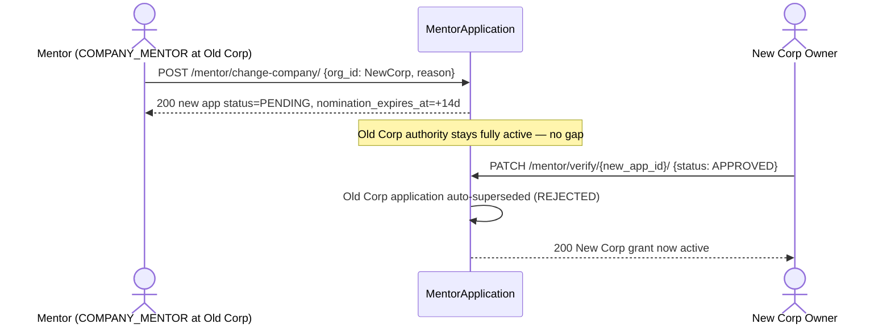

### POST `mentor/change-company/`
- **Request**:
```json
{
  "org_id": "new-org-uuid",
  "reason": "Relocating to a new employer"
}
```
- **Response `200`**:
```json
{
  "general_message": "Request to change affiliation to Acme Corp submitted successfully. It is pending approval.",
  "response": {"id": "new-app-uuid", "mentor_tier": "COMPANY_MENTOR", "org": "new-org-uuid"}
}
```
- **Error `403`**:
```json
{
  "general_message": "You must have an approved mentor application to change your affiliation."
}
```

---

## 22. Session Management

### Status state machine

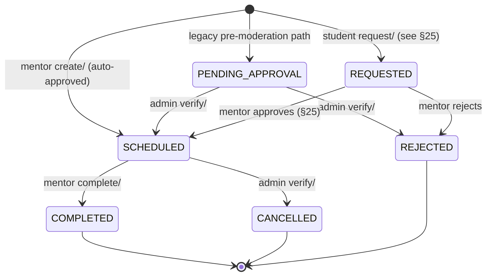

### Sequence — recurring session creation → completion

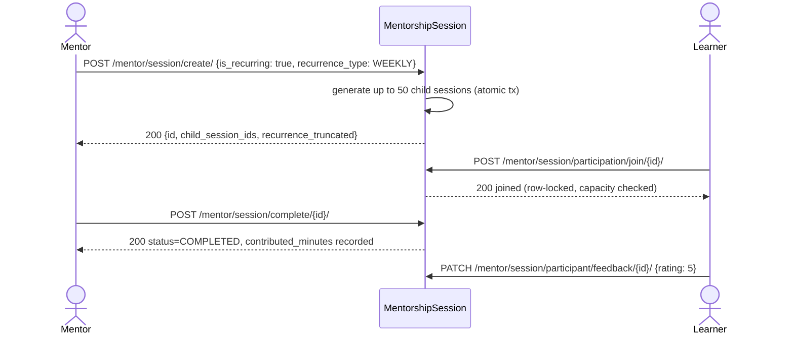

### POST `mentor/session/create/`
- **Request**:
```json
{
  "session_type": "IG_SESSION",
  "entity_id": "ig-uuid",
  "title": "Intro to React",
  "description": "Beginner-friendly walkthrough",
  "mode": "ONLINE",
  "starts_at": "2026-08-10T10:00:00Z",
  "ends_at": "2026-08-10T11:00:00Z",
  "meeting_link": "https://meet.example.com/abc",
  "max_participants": 20,
  "is_recurring": true,
  "recurrence_type": "WEEKLY",
  "recurrence_interval": 1,
  "recurrence_end_date": "2026-09-10"
}
```
- **Response `200`**:
```json
{
  "general_message": "Session created successfully.",
  "response": {
    "id": "session-uuid",
    "status": "SCHEDULED",
    "child_session_ids": ["s2", "s3", "s4"],
    "recurrence_truncated": false
  }
}
```
- **Error `400`**:
```json
{
  "general_message": "You do not have an active mentor grant for this IG."
}
```
```json
{
  "general_message": "Session start time must be before end time."
}
```

### GET `mentor/session/list/` and `mentor/session/list/{session_id}/`
- **Query**: `?status=SCHEDULED&sort_by=-starts_at`
- **Response `200`**:
```json
{
  "data": [
    {
      "id": "uuid", "entity_id": "ig-uuid", "entity_name": "AI/ML", "session_type": "IG_SESSION",
      "title": "Intro to React", "mode": "ONLINE", "starts_at": "2026-08-10T10:00:00Z",
      "ends_at": "2026-08-10T11:00:00Z", "status": "SCHEDULED", "max_participants": 20, "is_recurring": true
    }
  ],
  "pagination": {"page": 1, "per_page": 10, "total": 1}
}
```

### PATCH/DELETE `mentor/session/update/{session_id}/`
- **Request** (PATCH):
```json
{
  "title": "Intro to React (Updated)",
  "apply_to_series": true
}
```
- **Response `200`**:
```json
{
  "general_message": "Session updated successfully. Propagated to 3 other session(s) in the series."
}
```
- **DELETE Response `200`**:
```json
{
  "general_message": "Session deleted successfully."
}
```
- **Error `400`**:
```json
{
  "general_message": "Cannot edit a session that is completed/cancelled/rejected."
}
```

### POST `mentor/session/complete/{session_id}/`
- **Request**: none.
- **Response `200`**:
```json
{
  "general_message": "Session marked as completed."
}
```
- **Error `400`**:
```json
{
  "general_message": "Only a scheduled session can be marked completed (current status: CANCELLED)."
}
```

### GET `mentor/session/available/`
- **Response `200`**:
```json
{
  "data": [
    {"id": "uuid", "title": "Intro to React", "session_type": "IG_SESSION", "starts_at": "2026-08-10T10:00:00Z", "max_participants": 20}
  ],
  "pagination": {"page": 1, "per_page": 10, "total": 1}
}
```

### GET `mentor/session/admin/list/` (Admin)
- **Query**: `?status=SCHEDULED&ig_id={uuid}`
- **Response `200`**: same shape as `session/list/`, all mentors.

### PATCH `mentor/session/admin/verify/{session_id}/` (Admin)
- **Request**:
```json
{
  "status": "CANCELLED",
  "apply_to_series": false
}
```
- **Response `200`**:
```json
{
  "general_message": "Session status updated to CANCELLED successfully."
}
```
- **Error `400`**:
```json
{
  "general_message": "Invalid status transition for this session."
}
```

---

## 23. Availability Slots

### GET `mentor/public/availability/{mentor_id}/` 🌐 Public-facing (auth required, any user)
- covered in §15.

### GET/POST `mentor/availability/`
- **POST Request**:
```json
{
  "ig": "ig-uuid",
  "weekday": 1,
  "start_time": "09:00:00",
  "end_time": "10:00:00",
  "timezone": "Asia/Kolkata",
  "is_active": true,
  "valid_from": "2026-08-01",
  "valid_to": "2026-12-31"
}
```
- **POST Response `200`**:
```json
{
  "general_message": "Availability slot created successfully.",
  "response": {"id": "slot-uuid", "weekday": 1, "start_time": "09:00:00", "end_time": "10:00:00"}
}
```
- **GET Response `200`**:
```json
{
  "data": [
    {"id": "uuid", "ig": "ig-uuid", "ig_name": "AI/ML", "weekday": 1, "start_time": "09:00:00", "end_time": "10:00:00", "is_active": true}
  ],
  "pagination": {"page": 1, "per_page": 10, "total": 1}
}
```
- **Error `403`**:
```json
{
  "general_message": "You are not assigned as a mentor for this Interest Group."
}
```

### GET/PATCH/DELETE `mentor/availability/{slot_id}/`
- **PATCH Request**:
```json
{
  "is_active": false
}
```
- **PATCH Response `200`**:
```json
{
  "general_message": "Availability slot updated successfully.",
  "response": {"is_active": false}
}
```
- **DELETE Response `200`**:
```json
{
  "general_message": "Availability slot deleted successfully."
}
```
- **Error `404`**:
```json
{
  "general_message": "Availability slot not found."
}
```

---

## 24. Session Participation

### POST `mentor/session/participation/join/{session_id}/`
- **Request**: none.
- **Response `200`**:
```json
{
  "general_message": "Successfully joined the session.",
  "response": {"id": "link-uuid", "session_id": "uuid", "user_id": "uuid", "participant_role": "MENTEE", "attendance_status": "INVITED"}
}
```
- **Error `400`**:
```json
{
  "general_message": "Session has reached its maximum participant limit."
}
```
```json
{
  "general_message": "You have already joined this session."
}
```

### POST `mentor/session/participant/add/{session_id}/`
- **Request**:
```json
{
  "muid": "student-muid"
}
```
- **Response `200`**:
```json
{
  "general_message": "Successfully added participant to the session.",
  "response": {"id": "link-uuid", "participant_role": "MENTEE", "attendance_status": "INVITED"}
}
```

### GET `mentor/session/participant/history/`
- **Response `200`**:
```json
{
  "data": [
    {"id": "uuid", "session__title": "Intro to React", "participant_role": "MENTEE", "attendance_status": "ATTENDED"}
  ],
  "pagination": {"page": 1, "per_page": 10, "total": 1}
}
```

### GET `mentor/session/participant/list/{session_id}/`
- **Response `200`**:
```json
{
  "data": [
    {"id": "uuid", "user_full_name": "Learner One", "attendance_status": "INVITED"}
  ],
  "pagination": {"page": 1, "per_page": 10, "total": 1}
}
```
- **Error `403`**:
```json
{
  "general_message": "You don't have permission to view participants for this session."
}
```

### PATCH `mentor/session/participant/update/{link_id}/`
- **Request**:
```json
{
  "attendance_status": "ATTENDED",
  "progress_note": "Engaged well",
  "contributed_minutes": 30
}
```
- **Response `200`**:
```json
{
  "general_message": "Participant record updated successfully.",
  "response": {"attendance_status": "ATTENDED", "contributed_minutes": 30}
}
```
- **Error `400`**:
```json
{
  "general_message": "Contributed minutes must be greater than zero."
}
```

### PATCH `mentor/session/participant/feedback/{session_id}/`
- **Request**:
```json
{
  "feedback": "Great session!",
  "rating": 5
}
```
- **Response `200`**:
```json
{
  "general_message": "Feedback submitted successfully.",
  "response": {"feedback": "Great session!", "rating": 5}
}
```
- **Error `400`**:
```json
{
  "general_message": "You can only leave feedback for sessions you have attended."
}
```

---

## 25. Student Session Requests

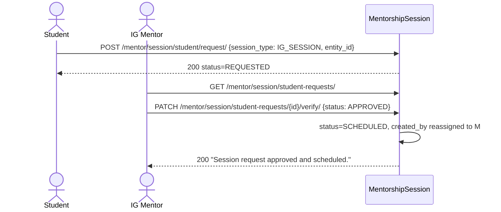

### POST `mentor/session/student/request/`
- **Request**:
```json
{
  "session_type": "IG_SESSION",
  "entity_id": "ig-uuid",
  "title": "Need help with X",
  "mode": "ONLINE",
  "starts_at": "2026-08-15T10:00:00Z",
  "ends_at": "2026-08-15T11:00:00Z",
  "meeting_link": "https://meet.example.com/xyz"
}
```
- **Response `200`**:
```json
{
  "general_message": "Session request submitted successfully. A mentor will review your request shortly.",
  "response": {"id": "uuid", "status": "REQUESTED"}
}
```
- **Error `400`**:
```json
{
  "message": {
    "session_type": ["Only Interest Group sessions can be requested. Company- and campus-scoped sessions are not supported."]
  }
}
```

### GET `mentor/session/student/my-requests/`
- **Response `200`**:
```json
{
  "data": [
    {"id": "uuid", "title": "Need help with X", "status": "REQUESTED", "entity_name": "AI/ML"}
  ],
  "pagination": {"page": 1, "per_page": 10, "total": 1}
}
```

### GET `mentor/session/student-requests/`
- **Response `200`**:
```json
{
  "data": [
    {"id": "uuid", "title": "Need help with X", "requested_by_name": "Learner One", "requested_by_muid": "learner-1", "entity_name": "AI/ML", "status": "REQUESTED"}
  ],
  "pagination": {"page": 1, "per_page": 10, "total": 1}
}
```

### PATCH `mentor/session/student-requests/{session_id}/verify/`
- **Request**:
```json
{
  "status": "APPROVED",
  "starts_at": "2026-08-16T10:00:00Z"
}
```
or
```json
{
  "status": "REJECTED"
}
```
- **Response `200`**:
```json
{
  "general_message": "Session request approved and scheduled. You can manage it from your sessions dashboard."
}
```
- **Error `404`**:
```json
{
  "general_message": "Session request not found or is not in REQUESTED status."
}
```

---

## 26. Task Management

*(Same status state machine as §7 — see diagram there.)*

### GET `mentor/tasks/ig-dropdown/`
- **Response `200`**:
```json
[
  {"id": "ig-uuid-1", "name": "Cloud Computing"},
  {"id": "ig-uuid-2", "name": "AI/ML"}
]
```

### GET/POST `mentor/tasks/`
- **POST Request**:
```json
{
  "hashtag": "#cloud-task-2",
  "title": "Build a Terraform module",
  "karma": 30,
  "usage_count": 1,
  "description": "Write reusable IaC module",
  "type": "task-type-uuid",
  "level": "level-uuid",
  "ig": "ig-uuid",
  "skill_ids": ["skill-uuid-1", "skill-uuid-2"]
}
```
- **POST Response `200`**:
```json
{
  "general_message": "Task submitted for approval."
}
```
- **GET Response `200`**:
```json
{
  "data": [
    {"id": "uuid", "hashtag": "#cloud-task-1", "title": "Deploy a serverless app", "karma": 50, "type": "Special", "ig": "Cloud Computing", "approval_status": "pending", "requested_by_name": "Jane Mentor", "skills": [{"id": "uuid", "name": "AWS", "code": "AWS"}]}
  ],
  "pagination": {"page": 1, "per_page": 10, "total": 1}
}
```
- **Error `400`**:
```json
{
  "message": {
    "ig": ["You are not assigned as a mentor for this Interest Group."]
  }
}
```

### GET `mentor/tasks/{task_id}/`
- **Response `200`**: single task object (owner only).
- **Error `404`**:
```json
{
  "general_message": "Task not found."
}
```

### PUT `mentor/tasks/{task_id}/`
- **Request**:
```json
{
  "title": "Build a Terraform module (updated)",
  "karma": 40,
  "skill_ids": ["skill-uuid-3"]
}
```
- **Response `200`**:
```json
{
  "general_message": "Task updated and re-submitted for approval."
}
```

### DELETE `mentor/tasks/{task_id}/`
- **Response `200`**:
```json
{
  "general_message": "Task deleted successfully."
}
```
- **Error `400`**:
```json
{
  "general_message": "Cannot delete a task with status 'approved'. Only pending tasks can be deleted."
}
```

---

## 27. IG Opportunities

### Status state machine

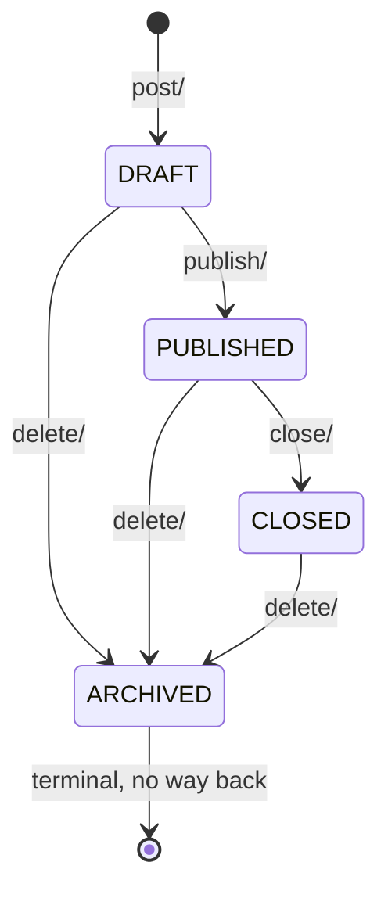

### GET/POST `mentor/opportunities/`
- **POST Request**:
```json
{
  "ig": "ig-uuid",
  "type": "INTERNSHIP",
  "title": "Summer Internship 2026",
  "description": "3-month paid internship",
  "eligibility": "3rd/4th year students",
  "application_url": "https://example.com/apply",
  "starts_at": "2026-09-01T00:00:00Z",
  "ends_at": "2026-09-30T00:00:00Z"
}
```
- **POST Response `200`**:
```json
{
  "general_message": "Opportunity created successfully.",
  "response": {"id": "opp-uuid", "ig": "ig-uuid", "ig_name": "Cloud Computing", "type": "INTERNSHIP", "title": "Summer Internship 2026", "status": "DRAFT", "created_by_name": "Jane Mentor"}
}
```
- **GET Response `200`**:
```json
{
  "data": [
    {"id": "uuid", "title": "Summer Internship 2026", "type": "INTERNSHIP", "status": "DRAFT", "ig_name": "Cloud Computing"}
  ],
  "pagination": {"page": 1, "per_page": 10, "total": 1}
}
```
- **Error `403`**:
```json
{
  "general_message": "You do not hold an active mentor grant for that IG/org."
}
```

### GET `mentor/opportunities/{opportunity_id}/`
- **Response `200`**: single opportunity object.
- **Error `404`**:
```json
{
  "general_message": "Opportunity not found."
}
```

### PATCH `mentor/opportunities/{opportunity_id}/`
- **Request**:
```json
{
  "title": "Summer Internship 2026 (Extended)",
  "ends_at": "2026-10-15T00:00:00Z"
}
```
- **Response `200`**:
```json
{
  "general_message": "Opportunity updated successfully.",
  "response": {"title": "Summer Internship 2026 (Extended)", "ends_at": "2026-10-15T00:00:00Z"}
}
```

### DELETE `mentor/opportunities/{opportunity_id}/`
- **Response `200`**:
```json
{
  "general_message": "Opportunity archived successfully."
}
```

### POST `mentor/opportunities/{opportunity_id}/publish/`
- **Request**: none.
- **Response `200`**:
```json
{
  "general_message": "Opportunity published successfully."
}
```
- **Error `400`**:
```json
{
  "general_message": "Only draft opportunities can be published."
}
```

### POST `mentor/opportunities/{opportunity_id}/close/`
- **Response `200`**:
```json
{
  "general_message": "Opportunity closed successfully."
}
```
- **Error `400`**:
```json
{
  "general_message": "Only published opportunities can be closed."
}
```

### GET `mentor/opportunities/public/` 🌐 Public
- **Query**: `?ig_id={uuid}&org_id={uuid}`
- **Response `200`**:
```json
{
  "data": [
    {
      "id": "opp-uuid", "ig": "ig-uuid", "ig_name": "Cloud Computing", "type": "INTERNSHIP",
      "title": "Summer Internship 2026", "application_url": "https://example.com/apply",
      "starts_at": "2026-09-01T00:00:00Z", "ends_at": "2026-09-30T00:00:00Z", "status": "PUBLISHED"
    }
  ],
  "pagination": {"page": 1, "per_page": 10, "total": 1}
}
```

---

# Part C — Cross-Cutting Systems

## 28. Career Lab — Hiring Postings

A simpler, **admin-curated** external job board — no approval workflow, no applicant tracking, no company self-service (contrast with Company Jobs, §4). Admin roles: `Admins`, `Associate`.

```
Ongoing/Previous is DERIVED, not stored:
  lastdate >= today  → "ongoing"  (shown at /public/career-lab/ongoing/)
  lastdate <  today  → "previous" (shown at /public/career-lab/previous/)
```

### GET `/dashboard/career-lab/hiring/` (Admin/Associate)
- **Query**: `?status=ongoing&organization=Acme&min_vacancies=1`
- **Response `200`**:
```json
{
  "data": [
    {"id": "uuid", "role": "SDE Intern", "organization": "Acme Corp", "title": "Summer Internship", "lastdate": "2026-09-30", "vacancies": 5}
  ],
  "pagination": {"page": 1, "per_page": 10, "total": 1}
}
```

### POST `/dashboard/career-lab/hiring/`
- **Request**:
```json
{
  "role": "SDE Intern",
  "organization": "Acme Corp",
  "title": "Summer Internship",
  "location": "Remote",
  "lastdate": "2026-09-30",
  "applylink": "https://apply.acme.com",
  "vacancies": 5
}
```
- **Response `200`**:
```json
{
  "general_message": "Hiring posting created successfully.",
  "response": {"id": "hiring-uuid", "role": "SDE Intern", "organization": "Acme Corp"}
}
```

### GET/PUT/DELETE `/dashboard/career-lab/hiring/{hiring_id}/`
- **PUT Request** (partial):
```json
{
  "vacancies": 8
}
```
- **PUT Response `200`**:
```json
{
  "general_message": "Hiring posting updated successfully.",
  "response": {"vacancies": 8}
}
```
- **DELETE Response `200`**:
```json
{
  "general_message": "Hiring posting deleted successfully."
}
```
- **Error `404`**:
```json
{
  "general_message": "Hiring posting not found."
}
```

### GET `/dashboard/career-lab/hiring/csv/` — filtered CSV export (same query params as list).

### POST `/dashboard/career-lab/hiring/csv/`
- **Request**: multipart `file` field (CSV with columns `posted_date,role,organization,title,location,lastdate,applylink,jdlink,duration,remuneration,vacancies,extracontent`).
- **Response `200`**:
```json
{
  "general_message": "Imported 42 hiring posting(s).",
  "response": {
    "created": 42,
    "errors": [
      {"row": 7, "errors": {"lastdate": ["This field is required."]}}
    ]
  }
}
```

### GET `/public/career-lab/ongoing/` 🌐 Public
- **Response `200`**:
```json
{
  "data": [
    {"id": "uuid", "role": "SDE Intern", "organization": "Acme Corp", "title": "Summer Internship", "location": "Remote", "lastdate": "2026-09-30", "applylink": "https://...", "jdlink": "https://..."}
  ],
  "pagination": {"page": 1, "per_page": 10, "total": 1}
}
```

### GET `/public/career-lab/previous/` 🌐 Public
- **Response `200`**:
```json
{
  "data": [
    {"id": "uuid", "role": "SDE Intern", "organization": "Acme Corp", "title": "Summer Internship 2025", "location": "Remote", "lastdate": "2025-09-30", "extracontent": "..."}
  ],
  "pagination": {"page": 1, "per_page": 10, "total": 1}
}
```

---

## 29. Interest Group (IG) Core Integration

```
Company IG-Sponsorship (§10) ──┐
                                 ├──▶ InterestGroup ◀──── Mentor IG-Opportunities (§27)
Admin/IGLead activate/deactivate┘         │
                                            └── media_content_links (read-only, auto-populated)
```

### POST `/dashboard/ig/{pk}/activate/`
- **Request**: none.
- **Response `200`**:
```json
{
  "general_message": "AI/ML activated"
}
```
- **Error `400`**:
```json
{
  "general_message": "Interest Group is already active"
}
```
- **Error `404`**:
```json
{
  "general_message": "Interest Group not found"
}
```

### POST `/dashboard/ig/{pk}/deactivate/`
- **Response `200`**:
```json
{
  "general_message": "AI/ML deactivated"
}
```
- **Error `400`**:
```json
{
  "general_message": "Interest Group is already inactive"
}
```

### GET `/dashboard/ig/` (context)
- **Response `200`**:
```json
{
  "data": [
    {
      "id": "uuid", "name": "AI/ML", "code": "AIML", "status": "active", "category": "coder",
      "is_sponsored": true, "sponsor_company_name": "Acme Corp", "sponsor_company_logo": "https://...",
      "media_content_links": [
        {"id": "uuid", "media_content_id": "uuid", "content_type": "video", "title": "Recorded session", "date": "2026-07-15"}
      ]
    }
  ],
  "pagination": {"page": 1, "per_page": 10, "total": 1}
}
```

---

## 30. Roles & Permissions

```
POST /dashboard/roles/user-role/  {role: "Mentor", mentor_tier, ig_ids/org_id}
   └─▶ UserMentor upsert + MentorApplication(APPROVED) + MentorScopeGrant + Mentor role granted

POST /dashboard/roles/user-role/  {role: "Company", company_name, company_description}
   └─▶ Company(verified) + Organization + UserOrganizationLink(verified) — admin-driven equivalent of register→verify

DELETE /dashboard/roles/user-role/  {user_id, role_id}
   └─▶ role-specific cleanup cascade (same _deactivate_company helper as §2 for Company)
```

### POST `/dashboard/roles/user-role/`
- **Request (mentor)**:
```json
{
  "user_id": "uuid",
  "role_id": "mentor-role-uuid",
  "mentor_tier": "IG_MENTOR",
  "ig_ids": ["ig-uuid"]
}
```
- **Request (company)**:
```json
{
  "user_id": "uuid",
  "role_id": "company-role-uuid",
  "company_name": "Acme Corp",
  "company_description": "Cloud infra company"
}
```
- **Response `200`**:
```json
{
  "message": "Role Added Successfully",
  "mentor_profile_created": true
}
```
(or `"company_created": true` for the company path)

### DELETE `/dashboard/roles/user-role/`
- **Request**:
```json
{
  "user_id": "uuid",
  "role_id": "mentor-role-uuid"
}
```
- **Response `200`**:
```json
{
  "general_message": "User Role deleted successfully"
}
```
- **Error `404`**:
```json
{
  "general_message": "Role link not found."
}
```

### GET `/dashboard/roles/` (Admin only, context)
- **Response `200`**:
```json
{
  "data": [
    {"id": "uuid", "title": "Mentor", "description": "...", "members": 120}
  ],
  "pagination": {"page": 1, "per_page": 10, "total": 30}
}
```

---

# End-to-End Sequence Diagrams

### A. Company onboarding → first hire

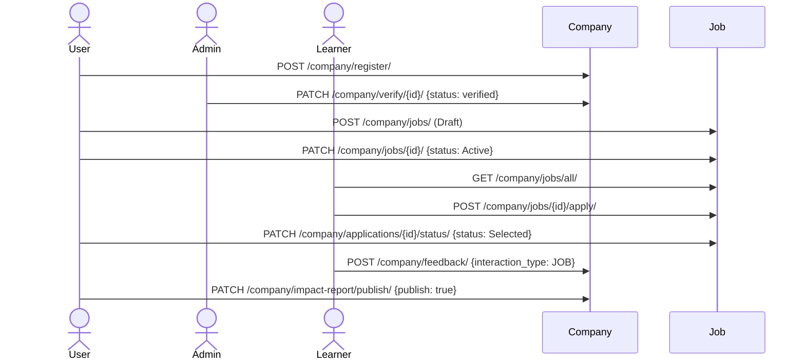

### B. Mentor-sourced job needing approval

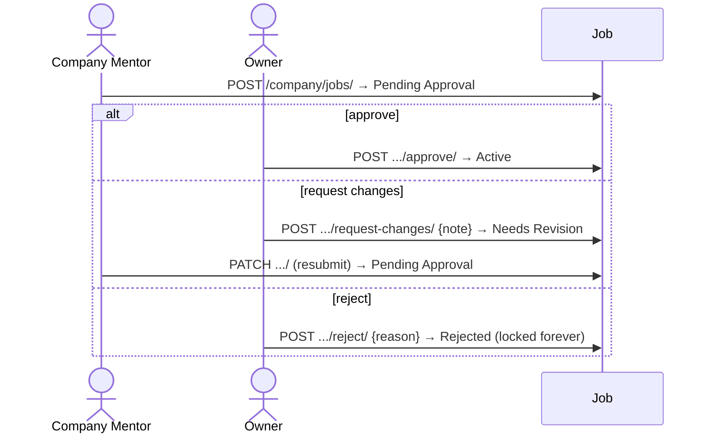

### C. Mentor application → running a session → getting rated

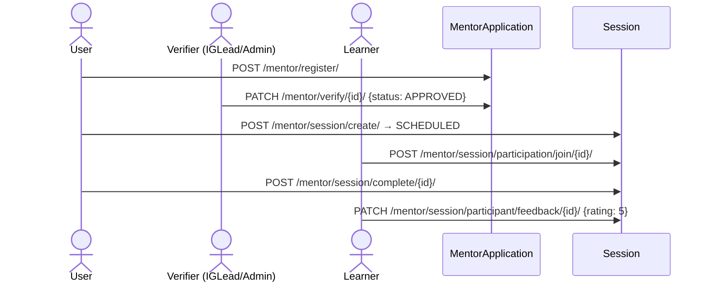

### D. Student requests a session instead of waiting for one

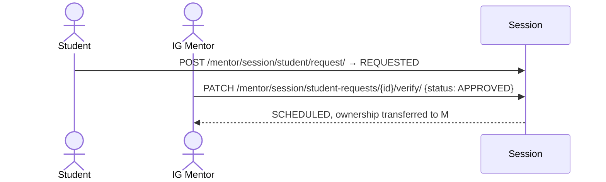

### E. Company sponsors an IG, then posts an opportunity through a company-mentor

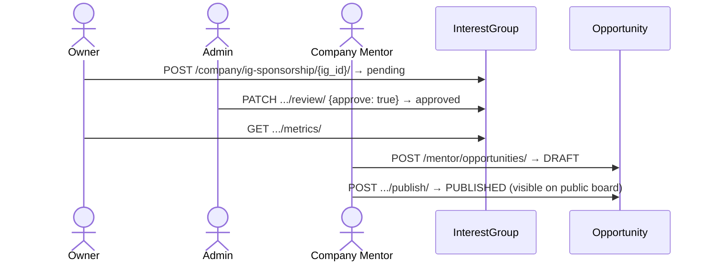

### F. Revoking mentor authority (three triggers, one outcome)

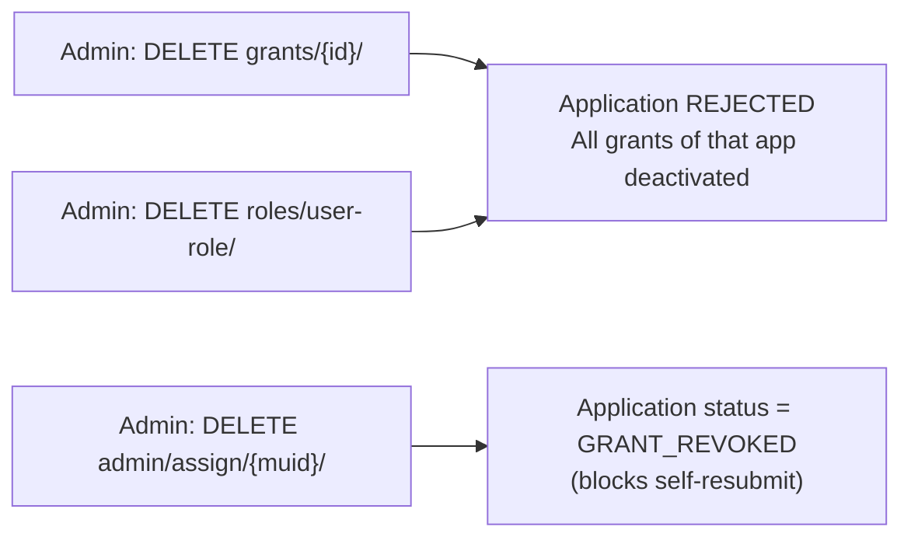

---

# Key Data Model Reference

| Model | Key fields | Notes |
|---|---|---|
| `Company` (`db/company.py`) | `status` (`pending\|verified\|rejected\|deactivated`), unique `name`/`slug`, `org` FK (set on verify), `publish_impact_report` | One owner (`company_user`) + up to 5 accepted co-admins |
| `CompanyAdminLink` | unique `(company, user)`, `status` (`Pending\|Accepted\|Declined\|Revoked`) | Only `Accepted` grants authority |
| `CompanyTalentShortlist` | unique `(company, user)` | |
| `CompanyFeedback` | unique `(company, interaction_type, entity_id, submitted_by)`, `rating` 1–5 | Polymorphic `entity_id` per `interaction_type` |
| `Collaboration` | `collab_type`, `target_type` (`IG\|CAMPUS`), `status` (`OPEN\|PENDING\|ACCEPTED\|DECLINED\|WITHDRAWN`) | Polymorphic `target_org_id` |
| `CompanyJob` | `status` (`Draft\|Pending Approval\|Needs Revision\|Active\|Closed\|Expired\|Rejected`), `total_views`, `expires_at` (auto-expired daily via Celery) | |
| `CompanyJobRule` | `rule_type` (`min_karma\|max_karma\|min_level\|max_level\|skill\|degree\|...`), `rule_value` (string) | Drives computed `eligibility` on `jobs/all/` |
| `UserJobApplication` | unique `(job, user)`, `status` free string | |
| `MentorApplication` (`db/user.py`) | `mentor_tier` (`IG_MENTOR\|MENTOR\|COMPANY_MENTOR\|CAMPUS_MENTOR`), `status` (`PENDING\|APPROVED\|REJECTED\|GRANT_REVOKED`), `preferred_ig_ids` (JSON), `nomination_expires_at` (auto-reject via Celery when overdue) | One row per tier per user |
| `UserMentor` | OneToOne on `user`, `is_active` (global kill-switch), `about/expertise/hours` | One profile regardless of tier count |
| `MentorScopeGrant` | `application` FK, `scope_type`, `scope_id`, `is_active`, `expires_at` (auto-revoke via Celery) | Actual source of authority |
| `MentorshipSession` (`db/mentor.py`) | `session_type` (`IG_SESSION\|CAMPUS_SESSION\|COMPANY_SESSION`), `status` (`REQUESTED\|PENDING_APPROVAL\|SCHEDULED\|COMPLETED\|CANCELLED\|REJECTED`), `is_recurring`, `parent_session_id` | |
| `MentorshipSessionUserLink` | `participant_role` (`MENTOR\|MENTEE`), `attendance_status`, `rating`, `contributed_minutes` | |
| `MentorAvailabilitySlot` | `weekday` (1–7), `start_time`/`end_time`, `valid_from`/`valid_to` | |
| `IgOpportunity` (`db/mentor.py`) | `type` (`CHALLENGE\|INTERNSHIP\|HACKATHON\|JOB`), `status` (`DRAFT\|PUBLISHED\|CLOSED\|ARCHIVED`) | Requires `ig` and/or `org` |
| `TaskList` (`db/task.py`) | `approval_status` (`approved\|pending\|rejected\|changes_requested`), `active`, `submitted_by_company`, globally-unique `hashtag` (never recycled) | Shared by Company and Mentor task-submission flows |
| `InterestGroup` (`db/task.py`) | `status` (`active\|inactive\|requested\|cancelled\|rejected`), `sponsor_status`/`sponsor_company` | |
| `Hiring` (`db/career_lab.py`) | `lastdate` (drives ongoing/previous), no status field | Admin-curated, no approval workflow |
