# Company & Mentor System — Comprehensive Documentation

> Source of truth: `api/dashboard/company/`, `api/dashboard/mentor/`, `api/dashboard/career_lab/`, `api/dashboard/ig/`, `api/dashboard/roles/`, and models in `db/company.py`, `db/mentor.py`, `db/user.py`, `db/task.py`, `db/job.py`, `db/career_lab.py`.
>
> **Response envelope** (`CustomResponse`):
> - Success → `{"message": null, "response": {...payload...}}` or `{"general_message": "...", "response": {...}}`
> - Failure → `{"general_message": "..."}` (business-rule errors) or `{"message": {"field_name": ["error text"]}}` (serializer validation errors)
>
> **Auth**: every endpoint requires a JWT bearer token (`CustomizePermission`) unless explicitly marked **🌐 Public**. `@role_required([...])` enforces a static platform role (e.g. `Admin`, `Mentor`, `Company`); many endpoints additionally layer in-view ownership checks (company owner / accepted co-admin / active mentor grant for that scope) on top of the role check.

---

## Table of Contents

- [Endpoint Index](#endpoint-index)
- [System Architecture](#system-architecture)

**Part A — Company System**
1. [Registration & Onboarding](#1-registration--onboarding)
2. [Admin Management](#2-admin-management)
3. [Listing & Directory](#3-listing--directory)
4. [Job Postings & Applications](#4-job-postings--applications)
5. [Job Engagement Analytics](#5-job-engagement-analytics)
6. [Mu Learner Directory & Talent Pool](#6-mu-learner-directory--talent-pool)
7. [Task Management](#7-task-management)
8. [Feedback & Impact Reporting](#8-feedback--impact-reporting)
9. [Collaboration / Partnership Discovery](#9-collaboration--partnership-discovery)
10. [IG Sponsorship](#10-ig-sponsorship)
11. [Event Templates](#11-event-templates)
12. [Company → Mentor Nomination](#12-company--mentor-nomination)
13. [Dashboard Home Summary](#13-dashboard-home-summary)

**Part B — Mentor System**
14. [Registration & Onboarding](#14-registration--onboarding)
15. [Public Profile & Availability](#15-public-profile--availability)
16. [Overview, Activity & Personal Analytics](#16-overview-activity--personal-analytics)
17. [Listing, Roster & Detail (Admin)](#17-listing-roster--detail-admin)
18. [Admin Assignment & Lifecycle](#18-admin-assignment--lifecycle)
19. [Scope Grants](#19-scope-grants)
20. [Persona Switching](#20-persona-switching)
21. [Mentor–Company Change](#21-mentorcompany-change)
22. [Session Management](#22-session-management)
23. [Availability Slots](#23-availability-slots)
24. [Session Participation](#24-session-participation)
25. [Student Session Requests](#25-student-session-requests)
26. [Task Management](#26-task-management)
27. [IG Opportunities](#27-ig-opportunities)

**Part C — Cross-Cutting Systems**
28. [Career Lab — Hiring Postings](#28-career-lab--hiring-postings)
29. [Interest Group (IG) Core Integration](#29-interest-group-ig-core-integration)
30. [Roles & Permissions](#30-roles--permissions)

**Appendix**
- [End-to-End Sequence Diagrams](#end-to-end-sequence-diagrams)
- [Key Data Model Reference](#key-data-model-reference)

---

## Endpoint Index

Every endpoint documented below, in one place. 🌐 = public (no auth). "Owner+" = company owner or accepted co-admin. Links jump to the module section.

### Part A — Company System

| # | Method | Endpoint | Module | Auth |
|---|---|---|---|---|
| 1 | POST | `company/register/` | [§1 Registration](#1-registration--onboarding) | Auth |
| 2 | PATCH | `company/register/` | [§1](#1-registration--onboarding) | Owner |
| 3 | GET | `company/status/` | [§1](#1-registration--onboarding) | Owner |
| 4 | GET | `company/profile/` | [§1](#1-registration--onboarding) | Owner / active Mentor |
| 5 | PATCH | `company/profile/` | [§1](#1-registration--onboarding) | Owner |
| 6 | GET | `company/profile/public/{slug}/` | [§1](#1-registration--onboarding) | 🌐 |
| 7 | GET | `company/profile/public/{slug}/jobs/` | [§1](#1-registration--onboarding) | 🌐 |
| 8 | POST | `company/admin-link/` | [§2 Admin Mgmt](#2-admin-management) | Owner |
| 9 | POST | `company/admin-link/{link_id}/respond/` | [§2](#2-admin-management) | Invitee |
| 10 | DELETE | `company/admin-link/{link_id}/` | [§2](#2-admin-management) | Owner |
| 11 | DELETE | `company/admin-link/{link_id}/leave/` | [§2](#2-admin-management) | Delegate |
| 12 | GET | `company/admin-link/list/` | [§2](#2-admin-management) | Owner+ |
| 13 | PATCH | `company/verify/{company_id}/` | [§2](#2-admin-management) | Admin |
| 14 | POST | `company/deactivate/` | [§2](#2-admin-management) | Owner |
| 15 | POST | `company/{company_id}/deactivate/` | [§2](#2-admin-management) | Admin |
| 16 | POST | `company/{company_id}/reactivate/` | [§2](#2-admin-management) | Admin |
| 17 | GET | `company/summary/` | [§2](#2-admin-management) | Admin |
| 18 | GET | `company/list/` | [§3 Listing](#3-listing--directory) | Admin |
| 19 | GET | `company/{company_id}/` | [§3](#3-listing--directory) | Admin |
| 20 | POST | `company/jobs/` | [§4 Jobs](#4-job-postings--applications) | Owner+ / active Mentor |
| 21 | GET | `company/jobs/` | [§4](#4-job-postings--applications) | Owner+ / Mentor |
| 22 | GET | `company/jobs/pending/` | [§4](#4-job-postings--applications) | Owner+ |
| 23 | GET | `company/jobs/all/` | [§4](#4-job-postings--applications) | Auth |
| 24 | GET | `company/jobs/{job_id}/` | [§4](#4-job-postings--applications) | Owner+ / Mentor |
| 25 | PATCH | `company/jobs/{job_id}/` | [§4](#4-job-postings--applications) | Owner+ / Mentor |
| 26 | DELETE | `company/jobs/{job_id}/` | [§4](#4-job-postings--applications) | Owner+ / Mentor |
| 27 | POST | `company/jobs/{job_id}/approve/` | [§4](#4-job-postings--applications) | Owner+ |
| 28 | POST | `company/jobs/{job_id}/reject/` | [§4](#4-job-postings--applications) | Owner+ |
| 29 | POST | `company/jobs/{job_id}/request-changes/` | [§4](#4-job-postings--applications) | Owner+ |
| 30 | POST | `company/jobs/{job_id}/view/` | [§4](#4-job-postings--applications) | 🌐 |
| 31 | POST | `company/jobs/{job_id}/apply/` | [§4](#4-job-postings--applications) | Auth (learner) |
| 32 | GET | `company/jobs/{job_id}/applications/` | [§4](#4-job-postings--applications) | Owner+ / Mentor |
| 33 | GET | `company/applications/me/` | [§4](#4-job-postings--applications) | Auth |
| 34 | PATCH | `company/applications/{app_id}/status/` | [§4](#4-job-postings--applications) | Owner+ / Mentor |
| 35 | DELETE | `company/applications/{app_id}/withdraw/` | [§4](#4-job-postings--applications) | Applicant |
| 36 | PATCH | `company/applications/{app_id}/resubmit/` | [§4](#4-job-postings--applications) | Applicant |
| 37 | GET | `company/jobs/{job_id}/analytics/` | [§5 Job Analytics](#5-job-engagement-analytics) | Owner+ / Mentor |
| 38 | GET | `company/analytics/campus/` | [§5](#5-job-engagement-analytics) | Owner+ / Mentor |
| 39 | GET | `company/analytics/campus/trend/` | [§5](#5-job-engagement-analytics) | Owner+ / Mentor |
| 40 | GET | `company/analytics/gigs/` | [§5](#5-job-engagement-analytics) | Owner+ / Mentor |
| 41 | GET | `company/analytics/tasks/` | [§5](#5-job-engagement-analytics) | Owner+ / Mentor |
| 42 | GET | `company/mulearners/` | [§6 Talent Pool](#6-mu-learner-directory--talent-pool) | Owner+ / Mentor |
| 43 | GET | `company/mulearners/shortlist/` | [§6](#6-mu-learner-directory--talent-pool) | Owner+ / Mentor |
| 44 | POST | `company/mulearners/shortlist/` | [§6](#6-mu-learner-directory--talent-pool) | Owner+ / Mentor |
| 45 | DELETE | `company/mulearners/shortlist/{user_id}/` | [§6](#6-mu-learner-directory--talent-pool) | Owner+ / Mentor |
| 46 | GET | `company/talent-pool/analytics/` | [§6](#6-mu-learner-directory--talent-pool) | Owner+ / Mentor |
| 47 | GET | `company/talent-pool/insights/` | [§6](#6-mu-learner-directory--talent-pool) | Owner+ / Mentor |
| 48 | GET | `company/tasks/` | [§7 Tasks](#7-task-management) | Verified company member |
| 49 | POST | `company/tasks/` | [§7](#7-task-management) | Verified company member |
| 50 | GET | `company/tasks/{task_id}/` | [§7](#7-task-management) | Verified company member |
| 51 | PUT | `company/tasks/{task_id}/` | [§7](#7-task-management) | Owner+ |
| 52 | PATCH | `company/tasks/{task_id}/` | [§7](#7-task-management) | Owner+ |
| 53 | DELETE | `company/tasks/{task_id}/` | [§7](#7-task-management) | Owner+ |
| 54 | GET | `company/tasks/templates/` | [§7](#7-task-management) | Verified company member |
| 55 | POST | `company/tasks/templates/` | [§7](#7-task-management) | Owner+ |
| 56 | DELETE | `company/tasks/templates/{template_id}/` | [§7](#7-task-management) | Owner+ |
| 57 | POST | `company/feedback/` | [§8 Feedback](#8-feedback--impact-reporting) | Auth (participant) |
| 58 | GET | `company/feedback/list/` | [§8](#8-feedback--impact-reporting) | Owner+ / Mentor |
| 59 | GET | `company/impact-report/` | [§8](#8-feedback--impact-reporting) | Owner+ / Mentor |
| 60 | PATCH | `company/impact-report/publish/` | [§8](#8-feedback--impact-reporting) | Owner+ |
| 61 | GET | `company/collaborations/` | [§9 Collaboration](#9-collaboration--partnership-discovery) | Owner+ |
| 62 | POST | `company/collaborations/` | [§9](#9-collaboration--partnership-discovery) | Owner+ |
| 63 | GET | `company/collaborations/discover/` | [§9](#9-collaboration--partnership-discovery) | Auth |
| 64 | POST | `company/collaborations/{id}/respond/` | [§9](#9-collaboration--partnership-discovery) | Campus/IG Lead |
| 65 | DELETE | `company/collaborations/{id}/` | [§9](#9-collaboration--partnership-discovery) | Owner+ |
| 66 | POST | `company/ig-sponsorship/{ig_id}/` | [§10 IG Sponsorship](#10-ig-sponsorship) | Owner+ |
| 67 | PATCH | `company/ig-sponsorship/{ig_id}/review/` | [§10](#10-ig-sponsorship) | Admin |
| 68 | GET | `company/ig-sponsorship/{ig_id}/metrics/` | [§10](#10-ig-sponsorship) | Owner+ (approved sponsor) |
| 69 | GET | `company/events/templates/` | [§11 Event Templates](#11-event-templates) | Verified company member |
| 70 | POST | `company/events/templates/` | [§11](#11-event-templates) | Owner+ |
| 71 | DELETE | `company/events/templates/{template_id}/` | [§11](#11-event-templates) | Owner+ |
| 72 | POST | `company/mentor/nominate/` | [§12 Mentor Nomination](#12-company--mentor-nomination) | Owner+ |
| 73 | POST | `company/mentor/apply/` | [§12](#12-company--mentor-nomination) | Auth (not owner) |
| 74 | GET | `company/mentor/list/` | [§12](#12-company--mentor-nomination) | Owner+ |
| 75 | GET | `company/home-summary/` | [§13 Home Summary](#13-dashboard-home-summary) | Owner+ / Mentor |

### Part B — Mentor System

| # | Method | Endpoint | Module | Auth |
|---|---|---|---|---|
| 76 | POST | `mentor/register/` | [§14 Registration](#14-registration--onboarding) | Auth |
| 77 | PATCH | `mentor/register/` | [§14](#14-registration--onboarding) | Applicant |
| 78 | GET | `mentor/status/` | [§14](#14-registration--onboarding) | Applicant |
| 79 | PATCH | `mentor/verify/{mentor_id}/` | [§14](#14-registration--onboarding) | Tier-specific verifier |
| 80 | GET | `mentor/public/profile/{mentor_id}/` | [§15 Public Profile](#15-public-profile--availability) | Auth |
| 81 | GET | `mentor/public/availability/{mentor_id}/` | [§15](#15-public-profile--availability) | Auth |
| 82 | GET | `mentor/overview/` | [§16 Overview](#16-overview-activity--personal-analytics) | Mentor |
| 83 | GET | `mentor/activity/` | [§16](#16-overview-activity--personal-analytics) | Mentor/CampusLead/LeadEnabler |
| 84 | GET | `mentor/analytics/personal/` | [§16](#16-overview-activity--personal-analytics) | Mentor |
| 85 | GET | `mentor/profile/completion/` | [§16](#16-overview-activity--personal-analytics) | Mentor |
| 86 | GET | `mentor/persona/current/` | [§16](#16-overview-activity--personal-analytics) | Auth |
| 87 | GET | `mentor/profile/` | [§16](#16-overview-activity--personal-analytics) | Mentor |
| 88 | PATCH | `mentor/profile/` | [§16](#16-overview-activity--personal-analytics) | Mentor |
| 89 | GET | `mentor/list/` | [§17 Listing/Roster](#17-listing-roster--detail-admin) | Admin |
| 90 | GET | `mentor/roster/` | [§17](#17-listing-roster--detail-admin) | Admin |
| 91 | GET | `mentor/change-requests/` | [§17](#17-listing-roster--detail-admin) | Admin |
| 92 | GET | `mentor/detail/{mentor_id}/` | [§17](#17-listing-roster--detail-admin) | Admin |
| 93 | POST | `mentor/admin/assign/` | [§18 Admin Assignment](#18-admin-assignment--lifecycle) | Admin |
| 94 | DELETE | `mentor/admin/assign/{user_muid}/` | [§18](#18-admin-assignment--lifecycle) | Admin |
| 95 | POST | `mentor/admin/deactivate/{user_mentor_id}/` | [§18](#18-admin-assignment--lifecycle) | Admin |
| 96 | POST | `mentor/admin/reactivate/{user_mentor_id}/` | [§18](#18-admin-assignment--lifecycle) | Admin |
| 97 | GET | `mentor/{mentor_id}/grants/` | [§19 Scope Grants](#19-scope-grants) | Admin / Owner+ (company tier) |
| 98 | DELETE | `mentor/{mentor_id}/grants/{grant_id}/` | [§19](#19-scope-grants) | Admin / Owner+ (company tier) |
| 99 | GET | `mentor/persona/status/` | [§20 Persona Switching](#20-persona-switching) | Mentor |
| 100 | POST | `mentor/persona/switch/` | [§20](#20-persona-switching) | Mentor |
| 101 | POST | `mentor/change-company/` | [§21 Company Change](#21-mentorcompany-change) | Mentor |
| 102 | POST | `mentor/session/create/` | [§22 Sessions](#22-session-management) | Mentor (grant-scoped) |
| 103 | GET | `mentor/session/list/` | [§22](#22-session-management) | Mentor |
| 104 | GET | `mentor/session/list/{session_id}/` | [§22](#22-session-management) | Mentor |
| 105 | PATCH | `mentor/session/update/{session_id}/` | [§22](#22-session-management) | Mentor (owner) |
| 106 | DELETE | `mentor/session/update/{session_id}/` | [§22](#22-session-management) | Mentor (owner) |
| 107 | POST | `mentor/session/complete/{session_id}/` | [§22](#22-session-management) | Mentor (owner) |
| 108 | GET | `mentor/session/available/` | [§22](#22-session-management) | Auth |
| 109 | GET | `mentor/session/admin/list/` | [§22](#22-session-management) | Admin |
| 110 | PATCH | `mentor/session/admin/verify/{session_id}/` | [§22](#22-session-management) | Admin |
| 111 | GET | `mentor/availability/` | [§23 Availability](#23-availability-slots) | Mentor |
| 112 | POST | `mentor/availability/` | [§23](#23-availability-slots) | Mentor |
| 113 | GET | `mentor/availability/{slot_id}/` | [§23](#23-availability-slots) | Mentor (owner) |
| 114 | PATCH | `mentor/availability/{slot_id}/` | [§23](#23-availability-slots) | Mentor (owner) |
| 115 | DELETE | `mentor/availability/{slot_id}/` | [§23](#23-availability-slots) | Mentor (owner) |
| 116 | POST | `mentor/session/participation/join/{session_id}/` | [§24 Participation](#24-session-participation) | Auth (learner) |
| 117 | POST | `mentor/session/participant/add/{session_id}/` | [§24](#24-session-participation) | Mentor (owner) |
| 118 | GET | `mentor/session/participant/history/` | [§24](#24-session-participation) | Auth |
| 119 | GET | `mentor/session/participant/list/{session_id}/` | [§24](#24-session-participation) | Mentor (owner) |
| 120 | PATCH | `mentor/session/participant/update/{link_id}/` | [§24](#24-session-participation) | Mentor (owner) |
| 121 | PATCH | `mentor/session/participant/feedback/{session_id}/` | [§24](#24-session-participation) | Participant |
| 122 | POST | `mentor/session/student/request/` | [§25 Student Requests](#25-student-session-requests) | Auth (student) |
| 123 | GET | `mentor/session/student/my-requests/` | [§25](#25-student-session-requests) | Student |
| 124 | GET | `mentor/session/student-requests/` | [§25](#25-student-session-requests) | Mentor |
| 125 | PATCH | `mentor/session/student-requests/{session_id}/verify/` | [§25](#25-student-session-requests) | Mentor |
| 126 | GET | `mentor/tasks/ig-dropdown/` | [§26 Tasks](#26-task-management) | Mentor |
| 127 | GET | `mentor/tasks/` | [§26](#26-task-management) | Mentor |
| 128 | POST | `mentor/tasks/` | [§26](#26-task-management) | Mentor (active) |
| 129 | GET | `mentor/tasks/{task_id}/` | [§26](#26-task-management) | Mentor (owner) |
| 130 | PUT | `mentor/tasks/{task_id}/` | [§26](#26-task-management) | Mentor (owner, active) |
| 131 | DELETE | `mentor/tasks/{task_id}/` | [§26](#26-task-management) | Mentor (owner, active) |
| 132 | GET | `mentor/opportunities/` | [§27 IG Opportunities](#27-ig-opportunities) | Mentor |
| 133 | POST | `mentor/opportunities/` | [§27](#27-ig-opportunities) | Mentor (active, scoped) |
| 134 | GET | `mentor/opportunities/{opportunity_id}/` | [§27](#27-ig-opportunities) | Mentor (managing) |
| 135 | PATCH | `mentor/opportunities/{opportunity_id}/` | [§27](#27-ig-opportunities) | Mentor (managing, active) |
| 136 | DELETE | `mentor/opportunities/{opportunity_id}/` | [§27](#27-ig-opportunities) | Mentor (managing) |
| 137 | POST | `mentor/opportunities/{opportunity_id}/publish/` | [§27](#27-ig-opportunities) | Mentor (managing, active) |
| 138 | POST | `mentor/opportunities/{opportunity_id}/close/` | [§27](#27-ig-opportunities) | Mentor (managing, active) |
| 139 | GET | `mentor/opportunities/public/` | [§27](#27-ig-opportunities) | 🌐 |

### Part C — Cross-Cutting Systems

| # | Method | Endpoint | Module | Auth |
|---|---|---|---|---|
| 140 | GET | `/dashboard/career-lab/hiring/` | [§28 Hiring](#28-career-lab--hiring-postings) | Admin/Associate |
| 141 | POST | `/dashboard/career-lab/hiring/` | [§28](#28-career-lab--hiring-postings) | Admin/Associate |
| 142 | GET | `/dashboard/career-lab/hiring/{hiring_id}/` | [§28](#28-career-lab--hiring-postings) | Admin/Associate |
| 143 | PUT | `/dashboard/career-lab/hiring/{hiring_id}/` | [§28](#28-career-lab--hiring-postings) | Admin/Associate |
| 144 | DELETE | `/dashboard/career-lab/hiring/{hiring_id}/` | [§28](#28-career-lab--hiring-postings) | Admin/Associate |
| 145 | GET | `/dashboard/career-lab/hiring/csv/` | [§28](#28-career-lab--hiring-postings) | Admin/Associate |
| 146 | POST | `/dashboard/career-lab/hiring/csv/` | [§28](#28-career-lab--hiring-postings) | Admin/Associate |
| 147 | GET | `/public/career-lab/ongoing/` | [§28](#28-career-lab--hiring-postings) | 🌐 |
| 148 | GET | `/public/career-lab/previous/` | [§28](#28-career-lab--hiring-postings) | 🌐 |
| 149 | POST | `/dashboard/ig/{pk}/activate/` | [§29 IG Core](#29-interest-group-ig-core-integration) | Admin / IG Lead |
| 150 | POST | `/dashboard/ig/{pk}/deactivate/` | [§29](#29-interest-group-ig-core-integration) | Admin / IG Lead |
| 151 | GET | `/dashboard/ig/` | [§29](#29-interest-group-ig-core-integration) | Auth |
| 152 | POST | `/dashboard/roles/user-role/` | [§30 Roles](#30-roles--permissions) | Admin |
| 153 | DELETE | `/dashboard/roles/user-role/` | [§30](#30-roles--permissions) | Admin |
| 154 | GET | `/dashboard/roles/` | [§30](#30-roles--permissions) | Admin |

---

## System Architecture

```
                                   ┌───────────────────────┐
                                   │        Admin           │
                                   │  (verify / moderate /  │
                                   │   assign / provision)  │
                                   └───┬────────────┬───────┘
                                       │            │
                          verifies    │            │  verifies
                    ┌──────────────────┘            └───────────────────┐
                    ▼                                                   ▼
          ┌───────────────────┐        nominates /apply       ┌──────────────────┐
          │      COMPANY       │ ───────────────────────────▶ │      MENTOR       │
          │ (register → verify)│ ◀─────────────────────────── │ (register → verify)│
          └───┬───────┬───────┘        change-company          └───┬─────┬───────┘
              │       │                                             │     │
   jobs/tasks │       │ sponsors                          sessions │     │ opportunities
              │       │                                             │     │
              ▼       ▼                                             ▼     ▼
     ┌────────────┐ ┌──────────────┐                      ┌──────────────┐ ┌───────────────┐
     │  Learners   │ │ Interest Grp │◀─────────────────────│  Learners /  │ │  Public board  │
     │ (apply/join)│ │     (IG)      │   IG_MENTOR grant     │   Students   │ │ (opportunities)│
     └─────┬──────┘ └──────────────┘                      └──────────────┘ └───────────────┘
           │
           ▼
   ┌────────────────┐
   │ Feedback /       │
   │ Impact Report    │
   └────────────────┘
```

**Core authority chain (mentor side):** `MentorApplication (PENDING → APPROVED)` → `MentorScopeGrant (active, scope_type + scope_id)` → unlocks Sessions / Tasks / Opportunities for that scope. A mentor can hold several approved applications (one per tier) and switch the active one via **Persona Switching**.

**Core authority chain (company side):** `Company (pending → verified)` → `Organization` provisioned → owner may delegate co-admins (`CompanyAdminLink`) → owner/co-admin/active `COMPANY_MENTOR` can post Jobs/Tasks/Collaborations/Opportunities under that company.

---

# Part A — Company System

The Company system lets an organization register on the platform, get admin-verified, post jobs/gigs/tasks, source talent from the learner base, run feedback/impact reporting, sponsor Interest Groups, and nominate/host mentors. A `Company` row is owned by one platform user (`company_user`) who may delegate up to 5 co-admins via `CompanyAdminLink`.

## 1. Registration & Onboarding

**Flow:**
```
User ──POST register/──▶ Company(status=pending)
                              │
                Admin ───PATCH verify/{id}/───▶ status=verified
                              │                        │
                              │                        ├─▶ Organization auto-created
                              │                        ├─▶ Creator linked (UserOrganizationLink)
                              │                        └─▶ "Company" role granted
                              │
                     status=rejected ◀── Admin (with rejection_reason)
                              │
                User ──PATCH register/──▶ auto-resubmits → status=pending
```

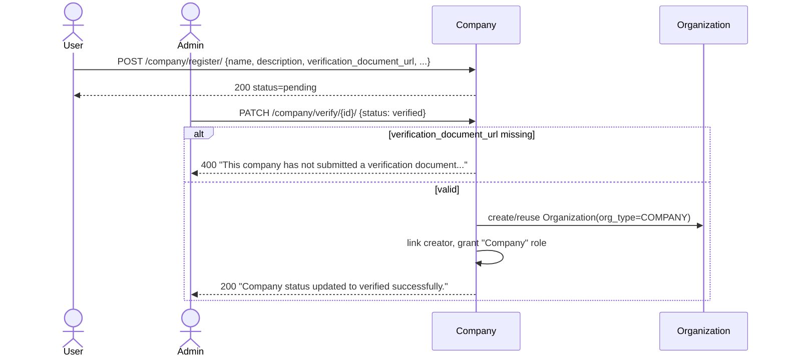
```mermaid
sequenceDiagram
    actor U as User
    actor A as Admin
    participant C as Company
    participant O as Organization

    U->>C: POST /company/register/ {name, description, verification_document_url, ...}
    C-->>U: 200 status=pending
    A->>C: PATCH /company/verify/{id}/ {status: verified}
    alt verification_document_url missing
        C-->>A: 400 "This company has not submitted a verification document..."
    else valid
        C->>O: create/reuse Organization(org_type=COMPANY)
        C->>C: link creator, grant "Company" role
        C-->>A: 200 "Company status updated to verified successfully."
    end
```

### POST `company/register/`
- **Roles**: Open to any authenticated user (`CustomizePermission` only — no `@role_required` gate, no static Company/Admin role needed). The only in-view identity check is that the requester does not already have a `Company` row tied to their `user_id`.
- **Constraints**: `CompanyRegistrationAPI.post` first checks `Company.objects.filter(company_user_id=user_id).exists()` and rejects with "A company request already exists for your account." if any row exists regardless of its status (pending/verified/rejected/deactivated) — i.e. one company registration per user account, enforced at the account level, not just "one active one." The payload is validated by `CompanyRegisterSerializer`: `verification_document_url` is required; `description` capped at 5000 chars, `culture_text` at 3000 chars, `short_pitch` at 150 words; `perks` must be a list of strings (max 2000 entries), `testimonials`/`gallery` must be lists of dict objects; and `district_id`/`state_id`/`country_id`, if supplied, must nest correctly (district's zone.state must match state, and that state's country must match country). On save, the serializer auto-derives a unique slug from the company name (appending `-1`, `-2`, ... on collision) and force-sets `status="pending"` — the client cannot set status directly.
- **Usage Scenario**: A representative of a new company creates their mu-Learn account and, wanting to post jobs/tasks or sponsor interest groups, submits this form once with their company's details and a verification document URL. The registration lands in `pending` status; the company cannot do anything company-scoped until a platform admin verifies it via `PATCH company/verify/{company_id}/`. If they already have any registration on file (even a rejected one), this endpoint refuses and they must instead use the PATCH endpoint to resubmit.
- **View**: `CompanyRegistrationAPI.post`
- **Permission**: any authenticated user; one registration per account.
- **Request**:
```json
{
  "name": "Acme Corp",
  "description": "Cloud infrastructure company",
  "verification_document_url": "https://docs.example.com/reg-cert.pdf",
  "logo": "https://cdn.example.com/logo.png",
  "short_pitch": "We build cloud-native tooling",
  "industry_sector": "Software",
  "website_link": "https://acme.com",
  "email": "hr@acme.com",
  "location": "Bengaluru",
  "district_id": "uuid",
  "state_id": "uuid",
  "country_id": "uuid",
  "legal_name": "Acme Corp Pvt Ltd",
  "registration_number": "U72900KA2020PTC000000",
  "tax_id": "GSTIN000",
  "company_size": "51-200",
  "linkedin_url": "https://linkedin.com/company/acme",
  "founded_year": 2015,
  "remote_policy": "Hybrid",
  "culture_text": "We value ownership and craftsmanship...",
  "tech_stack": ["Python", "React", "Kubernetes"],
  "perks": "Health insurance, stock options",
  "testimonials": "\"Great place to grow\" — alumnus",
  "gallery": ["https://cdn.example.com/office1.jpg"]
}
```
- **Response `200`**:
```json
{
  "general_message": "Company registration submitted successfully.",
  "response": {
    "id": "6f1a2b3c-...",
    "name": "Acme Corp",
    "slug": "acme-corp",
    "status": "pending",
    "email": "hr@acme.com",
    "industry_sector": "Software",
    "company_size": "51-200",
    "created_at": "2026-08-02T10:00:00Z"
  }
}
```
- **Error `400`** (duplicate registration):
```json
{
  "general_message": "A company request already exists for your account."
}
```
- **Error `400`** (validation):
```json
{
  "message": {
    "name": ["This field is required."],
    "verification_document_url": ["Enter a valid URL."]
  }
}
```

### PATCH `company/register/`
- **Roles**: Open to any authenticated user; the in-view ownership check is that a `Company` row must exist with `company_user_id == user_id` — i.e. only the original registrant who submitted the request can edit/resubmit it. There is no co-admin or mentor access to this endpoint (co-admins only get authority after the company is verified, via `CompanyAdminLink`).
- **Constraints**: 404s "No company registration request found for your account." if the user never registered. If the company's `status == "verified"`, the endpoint refuses with "Your company is already verified. Please use the profile endpoint to update your details." — this route is exclusively for pre-verification (pending) or previously-rejected registrations. Field-level validation mirrors `CompanyRegisterSerializer` via `CompanyUpdateSerializer`, applied as a **partial** update so only supplied fields change. Critically, if the company's current status is `"rejected"`, a successful patch force-resets `status="pending"` and clears `rejection_reason` — any edit to a rejected registration automatically resubmits it for another admin review cycle; if status is `"pending"`, the edit is saved in place without changing status. If `name` changes, the serializer regenerates a unique slug.
- **Usage Scenario**: An admin rejected a company's registration citing a bad or missing verification document; the company owner logs back in, corrects the flagged fields, and PATCHes this endpoint, which automatically flips the record back to `pending` so it re-enters the admin review queue. Alternatively, a still-pending applicant simply wants to fix a typo before an admin gets to it — the same endpoint lets them edit without disturbing the pending status.
- **Request** (partial, same fields as POST):
```json
{
  "description": "Updated pitch",
  "company_size": "201-500"
}
```
- **Response `200`** (resubmission after rejection):
```json
{
  "general_message": "Company registration updated and resubmitted successfully.",
  "response": {
    "status": "pending"
  }
}
```
- **Error `400`** (already verified):
```json
{
  "general_message": "Your company is already verified. Please use the profile endpoint to update your details."
}
```

### GET `company/status/`
- **Roles**: Open to any authenticated user. In-view scoping is strictly by `company_user_id == user_id` (the registrant) — there's no co-admin or mentor path here, since this is meant purely for the person who submitted the registration to check on it.
- **Constraints**: Returns 404 "No company request found for your account." if the user has never registered a company (any status). Otherwise returns the full `CompanyDetailSerializer` representation (all model fields plus derived `profile_completeness`, `verification_sla_message`) with an explicit `company_id` key injected. No status filtering — a verified, rejected, pending, or deactivated company's owner can all call this and see their current state.
- **Usage Scenario**: After submitting a registration, a company representative periodically checks this endpoint (e.g. from a "registration status" screen) to see whether they're still pending, have been verified (and can now move on to profile/job management), or were rejected (with a `rejection_reason` to act on via the PATCH register endpoint).
- **Request**: none.
- **Response `200`**:
```json
{
  "response": {
    "id": "uuid",
    "name": "Acme Corp",
    "status": "pending",
    "profile_completeness": 62,
    "verification_sla_message": "Verification typically takes 3-5 business days.",
    "company_id": "uuid"
  }
}
```
- **Error `404`**:
```json
{
  "general_message": "No company request found for your account."
}
```

### GET `company/profile/`
- **Roles**: Open to any authenticated user at the permission-class level, but the in-view helper `_get_company_for_user` (delegating to `get_verified_company_for_mentor`) restricts the actual data returned to: the company's registrant/owner (`company_user_id == user_id`), OR an accepted `CompanyAdminLink` co-admin, OR a user holding an active `COMPANY_MENTOR` `MentorScopeGrant` scoped to that company's Organization. Unlike `CompanyStatusAPI`, this only resolves **verified** companies — pending/rejected/deactivated registrations return nothing here.
- **Constraints**: Returns 404 "Company profile not found or access denied." if none of the above three relationships resolve to a verified company for the caller. On success it returns the same rich `CompanyDetailSerializer` payload (including internal-only fields like `verified_by`, `rejection_reason`, `deleted_at`). No query parameters or filtering are supported — always returns "my company."
- **Usage Scenario**: Once a company is verified, its owner (or a co-admin they delegated to, or a mentor granted `COMPANY_MENTOR` scope) opens their company dashboard, which calls this endpoint to populate the editable profile view with full internal detail, including admin verification metadata not shown on the public profile.
- **Response `200`**: full `CompanyDetailSerializer` object (all registration fields + `profile_completeness`).
- **Error `404`**:
```json
{
  "general_message": "Company profile not found or access denied."
}
```

### PATCH `company/profile/` (owner only)
- **Roles**: Open to any authenticated user at the permission level, but the in-view check is `Company.objects.filter(company_user_id=user_id, status="verified").first()` — this is stricter than the GET: **only the original owner/registrant** may edit a verified profile. Accepted co-admins and `COMPANY_MENTOR` grantees, despite having read access via `GET company/profile/`, are explicitly excluded from editing.
- **Constraints**: 404s "Company profile not found or access denied." unless the caller is the owner of a `status="verified"` company. Validated via `CompanyUpdateSerializer` with `partial=True` — same field-level rules as the register-PATCH endpoint. If `name` changes, a new unique slug is generated and, because the company is verified and therefore has a linked `Organization`, that Organization's `title` is also renamed to keep it in sync — this is the one place a company rename propagates to the Organization record used for org-membership checks elsewhere (e.g. mentor nomination eligibility).
- **Usage Scenario**: A verified company's owner updates their public-facing marketing content — logo, description, perks, tech stack, gallery images — to keep their `company/profile/public/{slug}/` page current for prospective mulearn talent browsing jobs. Because only the owner (not co-admins) can hit this endpoint, a co-admin who wants a profile change must ask the owner to make it.
- **Request**:
```json
{
  "short_pitch": "New one-liner",
  "tech_stack": ["Go", "React"]
}
```
- **Response `200`**:
```json
{
  "general_message": "Company profile updated successfully.",
  "response": {
    "short_pitch": "New one-liner",
    "tech_stack": ["Go", "React"]
  }
}
```

### GET `company/profile/public/{slug}/` 🌐 Public
- **Roles**: Fully public — `permission_classes = []` on `PublicCompanyProfileAPI`. No authentication or role of any kind is required; any anonymous visitor can call it.
- **Constraints**: Resolves by `Company.objects.filter(slug=slug, status="verified")` — only verified companies are visible; pending/rejected/deactivated companies 404 with "Company not found." regardless of slug validity, so deactivation (which does not delete the slug/row) effectively hides the public profile again. The response is built by `PublicCompanyProfileSerializer`, which deliberately excludes internal fields and instead exposes marketing-safe derived data: `collaboration_summary` (counts of ACCEPTED `Collaboration` rows only, split by campus vs IG partnerships) and `impact_summary`, which is `null` unless the company has explicitly opted in via `publish_impact_report=True`.
- **Usage Scenario**: A prospective candidate or partner organization browses to a company's public page (e.g. linked from a job posting or search) to read about its culture, perks, and track record before applying or requesting a partnership. Because it's public and slug-based, this URL is shareable outside the platform, and it automatically disappears (404s) if the company is later deactivated.
- **Response `200`**:
```json
{
  "response": {
    "id": "uuid",
    "name": "Acme Corp",
    "slug": "acme-corp",
    "logo": "https://...",
    "description": "...",
    "short_pitch": "...",
    "industry_sector": "Software",
    "website_link": "https://acme.com",
    "location": "Bengaluru",
    "verified_since": "2026-05-01T00:00:00Z",
    "collaboration_summary": {
      "total_partnerships": 4,
      "campus_partnerships": 3,
      "ig_partnerships": 1
    },
    "impact_summary": null
  }
}
```
- **Error `404`** (any non-verified company):
```json
{
  "general_message": "Company not found."
}
```

### GET `company/profile/public/{slug}/jobs/` 🌐 Public
- **Roles**: Fully public — `permission_classes = []` on `PublicCompanyJobListAPI`. No authentication required.
- **Constraints**: First resolves the company via `Company.objects.filter(slug=slug, status="verified")`, 404ing "Company not found." for any non-verified or nonexistent slug (same gating as the profile endpoint — deactivating a company hides its jobs list too). Jobs are then filtered to `CompanyJob.objects.filter(company=company, status='Active', is_deleted=False)` — only currently active, non-deleted job postings are exposed publicly; draft, closed, or still-pending-review postings never appear here regardless of caller. Results are paginated with search over `title`/`location`/`job_type` and sorting by `title`/`created_at`.
- **Usage Scenario**: A candidate viewing a company's public profile clicks through to see its open positions; this endpoint powers that "current openings" list, sourced live from the company's active job postings so closed or still-pending-review postings never leak to the public.
- **Response `200`**:
```json
{
  "data": [
    {
      "id": "uuid",
      "title": "Backend Developer",
      "job_type": "Full-Time",
      "location": "Remote",
      "created_at": "2026-07-01T10:00:00Z"
    }
  ],
  "pagination": {"page": 1, "per_page": 10, "total": 1}
}
```

---

## 2. Admin Management

```
Owner ──POST admin-link/ {muid}──▶ CompanyAdminLink(status=PENDING) ──notif──▶ Invitee
Invitee ──POST admin-link/{id}/respond/ {accept:true}──▶ status=ACCEPTED (now co-admin)
Owner ──DELETE admin-link/{id}/──▶ status=REVOKED
Admin ──POST {company_id}/deactivate/──▶ status=deactivated ─┬─▶ all links REVOKED
                                                              ├─▶ COMPANY_MENTOR grants deactivated
                                                              └─▶ IG sponsorships cleared
```

### POST `company/admin-link/`
- **Roles**: Enforced entirely in-view, not via `@role_required`: the caller must own a `status="verified"` company (owner-only). Delegates (accepted co-admins) cannot themselves create further delegates — only the true owner can invite.
- **Constraints**: 403s "Verified company profile not found." if the caller isn't a verified company owner. The invitee is looked up by `muid`; 404s "Delegate user not found." if no such user exists, and rejects "You are already the owner." if the invitee is the caller themself. If an existing link with that user is already `ACCEPTED`, it rejects "This user is already an accepted delegate." A hard cap of 5 is enforced by counting links in `ACCEPTED` or `PENDING` status — hitting or exceeding 5 returns a 429. If a prior (declined/revoked) link exists for that user, it is reused/reset to `PENDING` rather than creating a duplicate row (`unique_together = ('company', 'user')`). On success a best-effort notification is sent to the invitee, and the invite sits `PENDING` until they respond.
- **Usage Scenario**: A verified company's owner is going on leave or wants to spread out approval workload (e.g. reviewing job postings, mentor nominations), so they invite a trusted colleague by muid to become a co-admin. The colleague doesn't gain any authority until they explicitly accept via the respond endpoint; the owner is capped at 5 concurrent pending+accepted delegates to keep the access list auditable.
- **Request**:
```json
{
  "muid": "john-doe@mulearn"
}
```
- **Response `200`**:
```json
{
  "general_message": "Delegate invited successfully. Awaiting their acceptance.",
  "response": {
    "id": "link-uuid",
    "status": "PENDING"
  }
}
```
- **Error `429`**:
```json
{
  "general_message": "You already have 5 accepted/pending delegates. Revoke one before inviting another."
}
```
- **Error `400`**:
```json
{
  "general_message": "You are already the owner."
}
```
```json
{
  "general_message": "This user is already an accepted delegate."
}
```
- **Error `404`**:
```json
{
  "general_message": "Delegate user not found."
}
```

### POST `company/admin-link/{link_id}/respond/`
- **Roles**: No static role or ownership check beyond identity — enforced by matching `id=link_id, user_id=user_id, status=PENDING`, meaning only the specific invited user (the addressee of that exact pending invite) can respond to it; anyone else, including the company owner, gets a 404 as if the link didn't exist for them.
- **Constraints**: 404s "Pending invitation not found." if no row matches that `link_id` + caller + `PENDING` status combination — this also blocks double-responding, since once accepted/declined the row no longer matches `PENDING`. The `accept` boolean in the request body (default `True` if omitted) determines whether the link becomes `ACCEPTED` or `DECLINED`; `responded_at` is stamped either way.
- **Usage Scenario**: The invited colleague receives the "Company Delegate Invitation" notification from the previous endpoint and calls this to accept (becoming a fully authorized co-admin, immediately able to act on owner-or-admin-gated endpoints like mentor nomination) or decline (leaving them with no authority and freeing a slot under the company's 5-delegate cap).
- **Request**:
```json
{
  "accept": true
}
```
- **Response `200`**:
```json
{
  "general_message": "Invitation accepted successfully."
}
```
(or `"Invitation declined successfully."` if `accept: false`)
- **Error `404`**:
```json
{
  "general_message": "Pending invitation not found."
}
```

### DELETE `company/admin-link/{link_id}/`
- **Roles**: Owner-only, enforced in-view: the caller must own a `status="verified"` company. A co-admin cannot revoke another co-admin's link, nor their own (that's the separate "leave" endpoint below), and cannot revoke via this route even with accepted status if they aren't the literal owner.
- **Constraints**: 403s "Verified company profile not found." if the caller isn't a verified owner. The target link must belong to that owner's company and currently be `ACCEPTED` — attempting to revoke a pending, declined, or already-revoked link 404s "Accepted delegate link not found." (idempotent against double-revocation). On success the link transitions to `REVOKED`, stamping `revoked_by`/`revoked_at`, and a best-effort notification is sent to the removed delegate.
- **Usage Scenario**: A company owner decides a previously-delegated co-admin should no longer have approval authority (e.g. the colleague left the team, or trust was misplaced) and revokes their link directly. From that moment the co-admin no longer has authority for any company action gated on it (mentor nomination, admin-link listing, etc.).
- **Request**: none.
- **Response `200`**:
```json
{
  "general_message": "Delegate revoked successfully."
}
```
- **Error `404`**:
```json
{
  "general_message": "Accepted delegate link not found."
}
```

### DELETE `company/admin-link/{link_id}/leave/`
- **Roles**: Self-service only, enforced in-view by matching `id=link_id, user_id=user_id, status=ACCEPTED` — the caller must be the delegate named on that specific accepted link; the company owner cannot use this route to remove someone else (that requires the owner-only revoke endpoint above).
- **Constraints**: 404s "Accepted delegate link not found." if the caller has no accepted link with that `link_id`. On success, identical state transition to the revoke endpoint — status becomes `REVOKED`, `revoked_by`/`revoked_at` stamped (with the leaving user as the revoker) — and a best-effort notification is sent to the company's owner informing them the delegate left.
- **Usage Scenario**: A co-admin who accepted a delegation invite later wants out (e.g. changing roles, no longer wanting the responsibility) and voluntarily removes their own authority without needing the owner to act, while still notifying the owner so they're aware their co-admin coverage just dropped.
- **Response `200`**:
```json
{
  "general_message": "You have left as a company delegate successfully."
}
```

### GET `company/admin-link/list/`
- **Roles**: Enforced in-view: the caller must be either the verified company's owner or an accepted co-admin of that company. Declined/revoked/pending-invitee users cannot view the list.
- **Constraints**: 403s "Verified company profile not found or access denied." if the caller matches neither relationship to any verified company. When authorized, returns **every** `CompanyAdminLink` row for that company regardless of status (pending, accepted, declined, revoked) ordered by `-created_at` — a full historical audit trail, not just currently-active delegates.
- **Usage Scenario**: A company owner (or one of their co-admins) reviews who currently has delegate authority and who has had it in the past — e.g. auditing before inviting a new delegate to see how close they are to the 5-slot cap, or investigating when/why a particular co-admin was revoked.
- **Response `200`**:
```json
{
  "response": [
    {
      "id": "uuid",
      "user_muid": "john-doe@mulearn",
      "user_name": "John Doe",
      "status": "ACCEPTED",
      "invited_by_name": "Jane Owner",
      "invited_at": "2026-07-01T10:00:00Z",
      "responded_at": "2026-07-01T11:00:00Z",
      "revoked_by_name": null,
      "revoked_at": null
    }
  ]
}
```

### PATCH `company/verify/{company_id}/` (Admin only)
- **Roles**: Gated by `@role_required([RoleType.ADMIN.value])` — only users holding the platform `ADMIN` role may call this at all; there is no company-side self-service path to verification.
- **Constraints**: Runs inside `transaction.atomic()` with `select_for_update()` on the `Company` row to avoid a race between two concurrent verify calls. 404s "Company not found." for an unknown `company_id`. Rejects "Company is already verified." if already verified. Body is validated by `CompanyVerifySerializer`: `status` must be `"verified"` or `"rejected"`; if rejecting, `rejection_reason` is required; if verifying, the company must already have a non-empty `verification_document_url` on file. On a `"verified"` transition, the serializer stamps `verified_by`/`verified_at`, ensures a linked `Organization` exists (creating one if it doesn't), links the company's owner into that org via `UserOrganizationLink`, and grants the owner the platform `COMPANY` role. On a `"rejected"` transition, only `rejection_reason` and status change — no org/role side effects — and the company can later be resubmitted by its owner via PATCH `company/register/`.
- **Usage Scenario**: A platform admin reviews the queue of `pending` company registrations, checks the submitted verification document and details, and either approves it — instantly provisioning the company's Organization, linking its owner, and granting the COMPANY role so they can start posting jobs/tasks — or rejects it with a reason the owner will see and can act on to resubmit.
- **Request (approve)**:
```json
{
  "status": "verified"
}
```
- **Request (reject)**:
```json
{
  "status": "rejected",
  "rejection_reason": "Verification document unreadable"
}
```
- **Response `200`**:
```json
{
  "general_message": "Company status updated to verified successfully."
}
```
- **Error `400`**:
```json
{
  "general_message": "Company is already verified."
}
```
```json
{
  "general_message": "This company has not submitted a verification document and cannot be verified."
}
```
```json
{
  "message": {
    "rejection_reason": ["This field is required when rejecting."]
  }
}
```
- **Error `404`**:
```json
{
  "general_message": "Company not found."
}
```

### POST `company/deactivate/` (owner) / `company/{company_id}/deactivate/` (Admin)
- **Roles**: The self-service path (`company/deactivate/`) is owner-only, enforced in-view (`company_user_id == user_id`, `status="verified"`) — no `@role_required` decorator, any authenticated user can call it but it only succeeds for the literal owner of a currently-verified company. The admin path (`company/{company_id}/deactivate/`) is gated by `@role_required([RoleType.ADMIN.value])` and can target **any** company by ID, not just one the caller owns.
- **Constraints**: Both routes 403/404 if the target isn't currently `status="verified"` (also blocks re-deactivating an already-deactivated company). Both funnel into the same `_deactivate_company()` helper, which sets `status="deactivated"` and stamps deletion metadata; revokes **all** currently `ACCEPTED` `CompanyAdminLink` rows to `REVOKED`; deactivates any active `COMPANY_MENTOR` `MentorScopeGrant`s scoped to the company's org; and clears any Interest Group's sponsor pointer to this company. The self-service path notifies co-admins plus admins (passive visibility only); the admin path additionally notifies the company owner directly and writes a `SystemActionLog` entry with `action_type=COMPANY_DEACTIVATED` and remarks "deactivated by platform admin," giving it a distinct, attributable audit trail.
- **Usage Scenario**: A company that's shutting down its mulearn presence has its owner voluntarily deactivate it via the self-service route, immediately hiding its public profile and job board and stripping co-admin/mentor authority. Alternatively, a platform admin discovers a company committing fraud or policy violations and force-deactivates it via the admin route without needing the owner's cooperation, with a full audit-log record.
- **Request**: none.
- **Response `200`**:
```json
{
  "general_message": "Company deactivated successfully."
}
```
- **Error `403`** (self-service path):
```json
{
  "general_message": "Verified company profile not found."
}
```
- **Error `404`** (admin path):
```json
{
  "general_message": "Verified company not found."
}
```

### POST `company/{company_id}/reactivate/` (Admin only)
- **Roles**: Gated by `@role_required([RoleType.ADMIN.value])` — platform ADMIN role only; there is no self-service reactivation path for a company owner.
- **Constraints**: 404s "Deactivated company not found." unless `company_id` resolves to a company currently `status="deactivated"` — this can only undo a deactivation, not verify a pending company or restore a rejected one. On success `status` is set back to `"verified"` and deletion metadata is cleared. Notably this endpoint does **not** restore anything `_deactivate_company()` revoked — revoked `CompanyAdminLink`s stay `REVOKED` and deactivated `COMPANY_MENTOR` grants stay inactive; cleared IG sponsorships are not reinstated either, deliberately, so reactivation doesn't silently resurrect stale co-admin authority. Only the owner is notified.
- **Usage Scenario**: After investigating a previously deactivated company and resolving whatever issue prompted it, a platform admin reactivates it so it's publicly visible and can post jobs/tasks again — but the owner will need to re-invite any co-admins and re-nominate any company mentors from scratch, since that delegated authority was intentionally not auto-restored.
- **Response `200`**:
```json
{
  "general_message": "Company reactivated successfully."
}
```
- **Error `404`**:
```json
{
  "general_message": "Deactivated company not found."
}
```

### GET `company/summary/` (Admin only)
- **Roles**: Gated by `@role_required([RoleType.ADMIN.value])` — platform ADMIN role only; this is an admin-dashboard aggregate endpoint, not something a company owner can call.
- **Constraints**: No query parameters or filters — always computes global counts across the entire `Company` table (`total_companies` plus per-status breakdowns for verified/pending/rejected/deactivated). It also reports `total_jobs` (all `CompanyJob` rows, unfiltered by status) and `total_company_tasks`, deliberately scoped by the `submitted_by_company` FK rather than a role-link join, to avoid double-counting a task when a user holds more than one matching role link.
- **Usage Scenario**: A platform admin lands on the company-management section of the admin dashboard and this endpoint powers the top-level stat tiles, giving them an at-a-glance sense of registration volume and review backlog before drilling into the list.
- **Response `200`**:
```json
{
  "response": {
    "total_companies": 120,
    "verified_companies": 80,
    "pending_companies": 30,
    "rejected_companies": 5,
    "deactivated_companies": 5,
    "total_jobs": 340,
    "total_company_tasks": 210
  }
}
```

---

## 3. Listing & Directory

### GET `company/list/` (Admin only)
- **Roles**: Gated by `@role_required([RoleType.ADMIN.value])` — platform ADMIN role only; this is the admin's company-management table, not a directory for companies or general users.
- **Constraints**: Starts from every company regardless of status (including pending/rejected/deactivated — unlike the public directory) and optionally narrows by exact-match query params (`status`, `industry_sector`, `company_size`, `district_id`, `state_id`, `country_id`). Paginated with free-text search over `name`/`slug`/`email`/`industry_sector` and sortable by `name`/`status`/`created_at`. Serialized via a lighter-weight `CompanyListSerializer` projection rather than the full detail serializer.
- **Usage Scenario**: An admin working the verification queue filters this list down to `status=pending` to see what needs review, or filters by geography to audit regional registration activity, then clicks into individual rows (via `GET company/{company_id}/`) to inspect and act on a specific one.
- **Query**: `?status=verified&industry_sector=Software&page=1&per_page=20&search=acme&sort_by=name`
- **Response `200`**:
```json
{
  "data": [
    {
      "id": "uuid",
      "name": "Acme Corp",
      "slug": "acme-corp",
      "status": "verified",
      "email": "hr@acme.com",
      "company_user_name": "Jane Owner",
      "industry_sector": "Software",
      "location": "Bengaluru",
      "verified_at": "2026-05-01T00:00:00Z"
    }
  ],
  "pagination": {"page": 1, "per_page": 20, "total": 80}
}
```

### GET `company/{company_id}/` (Admin only)
- **Roles**: Gated by `@role_required([RoleType.ADMIN.value])` — platform ADMIN role only. This is the admin's detail-drilldown counterpart to the owner-facing `GET company/profile/`; a company owner cannot use this route to view their own record.
- **Constraints**: Looks up strictly by `id`; 404s "Company not found." for any nonexistent `company_id`, with no status restriction — an admin can fetch a pending, verified, rejected, or deactivated company's full record this way. Returns the same rich `CompanyDetailSerializer` payload as `GET company/profile/`, giving the admin full internal visibility including `rejection_reason`, `verified_by`, `deleted_at`/`deleted_by`.
- **Usage Scenario**: After filtering the admin company list down to a candidate row (e.g. a pending registration awaiting review, or a company flagged for a policy issue), an admin opens this endpoint to see the complete submitted profile before deciding to verify, reject, or deactivate it.
- **Response `200`**: full `CompanyDetailSerializer` object.
- **Error `404`**:
```json
{
  "general_message": "Company not found."
}
```

---

## 4. Job Postings & Applications

### Status state machine

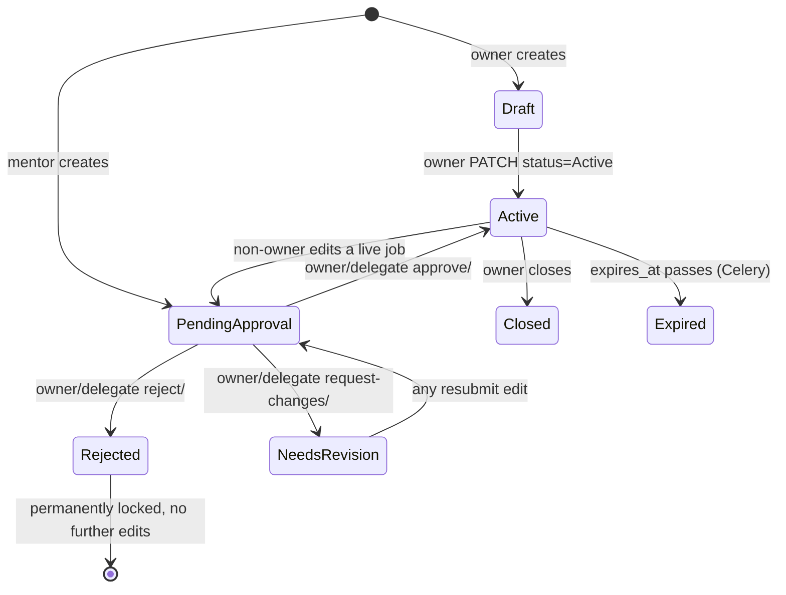
```mermaid
stateDiagram-v2
    [*] --> Draft: owner creates
    [*] --> PendingApproval: mentor creates
    Draft --> Active: owner PATCH status=Active
    PendingApproval --> Active: owner/delegate approve/
    PendingApproval --> Rejected: owner/delegate reject/
    PendingApproval --> NeedsRevision: owner/delegate request-changes/
    NeedsRevision --> PendingApproval: any resubmit edit
    Active --> PendingApproval: non-owner edits a live job
    Active --> Closed: owner closes
    Active --> Expired: expires_at passes (Celery)
    Rejected --> [*]: permanently locked, no further edits
```

### Sequence — mentor posts a job, owner approves

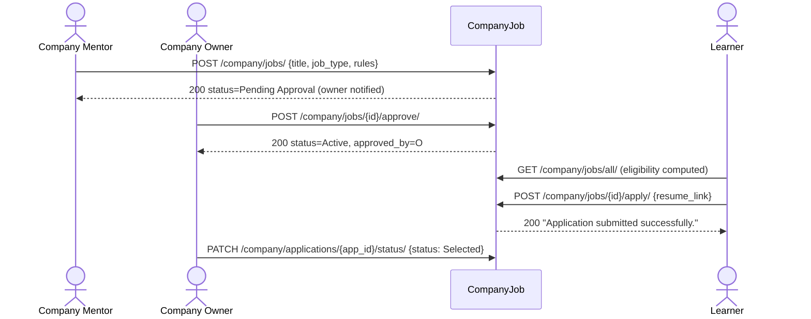
```mermaid
sequenceDiagram
    actor M as Company Mentor
    actor O as Company Owner
    participant J as CompanyJob
    actor L as Learner

    M->>J: POST /company/jobs/ {title, job_type, rules}
    J-->>M: 200 status=Pending Approval (owner notified)
    O->>J: POST /company/jobs/{id}/approve/
    J-->>O: 200 status=Active, approved_by=O
    L->>J: GET /company/jobs/all/ (eligibility computed)
    L->>J: POST /company/jobs/{id}/apply/ {resume_link}
    J-->>L: 200 "Application submitted successfully."
    O->>J: PATCH /company/applications/{app_id}/status/ {status: Selected}
```

**Workflow narrative:** a company owner/co-admin or an active `COMPANY_MENTOR` creates a job. Owner-created jobs go live as `Draft` (owner then activates via PATCH); mentor-created jobs start as `Pending Approval` and require owner/delegate sign-off. Learners browse `jobs/all/` (with computed rule-based `eligibility`), apply via `apply/`, and the company tracks applications through a status funnel.

### POST `company/jobs/`
- **Roles**: Requires a verified company relationship via `_get_company_for_user` (owner, accepted co-admin, or active `COMPANY_MENTOR` grant holder) — anyone else gets 403 "Verified company profile not found or access denied." Both owner/delegate and mentor can call this same endpoint, but the resulting job state differs by role. A mentor whose `UserMentor.is_active` is False is blocked with "Your mentor account is deactivated..." — this check only applies to non-owner/delegate callers.
- **Constraints**: Jobs are always created ignoring any client-sent `status` — owner/delegate creations start as `Draft`, mentor creations start as `Pending Approval`. A non-owner mentor is capped at 5 simultaneous jobs in `Pending Approval` or `Needs Revision` status for that company (429 "You already have 5 pending/needs-revision job postings..."); owners/delegates are exempt. `duration_value` and `duration_unit` must be supplied together or neither. Each `rules` entry with `rule_type == 'skill'` must reference an active `Skill.id`. On a mentor-created job, the company owner is notified.
- **Usage Scenario**: A company owner drafts a new "Backend Developer" role directly (lands as Draft, they later PATCH it Active), or a nominated Company Mentor for that org posts a gig on the company's behalf, which lands as Pending Approval and triggers a notification to the owner, kicking off the approval workflow.
- **Request**:
```json
{
  "title": "Backend Developer",
  "experience": "2-4 years",
  "job_description": "Build and maintain REST APIs",
  "location": "Remote",
  "salary_range": "10-15 LPA",
  "job_type": "Full-Time",
  "duration_value": 6,
  "duration_unit": "months",
  "hourly_rate": 500.00,
  "deliverables": {"sprint_reviews": "weekly"},
  "stipend": "5000/month",
  "certificate_provided": "Yes",
  "expires_at": "2026-09-01T00:00:00Z",
  "rules": [
    {"rule_type": "min_karma", "rule_value": "100"}
  ]
}
```
- **Response `200`** (owner path):
```json
{
  "general_message": "Job posted successfully.",
  "response": {
    "id": "job-uuid",
    "status": "Draft",
    "title": "Backend Developer"
  }
}
```
- **Response `200`** (mentor path):
```json
{
  "general_message": "Job submitted for approval successfully.",
  "response": {
    "id": "job-uuid",
    "status": "Pending Approval"
  }
}
```
- **Error `429`**:
```json
{
  "general_message": "You already have 5 pending/needs-revision job postings. Resolve those before submitting more."
}
```
- **Error `400`**:
```json
{
  "message": {
    "rule_value": ["Must reference an active skill id."]
  }
}
```

### GET `company/jobs/` / `company/jobs/pending/` / `company/jobs/all/`

#### GET `company/jobs/`
- **Roles**: Requires `_get_company_for_user` to resolve a company (owner, accepted co-admin, or active company mentor); otherwise 404. Visibility branches internally: owner/delegate see **all** of the company's non-deleted jobs; a plain mentor only sees jobs that are `Active` OR were created by themselves — a mentor cannot browse other mentors' pending/rejected drafts.
- **Constraints**: Filters to `is_deleted=False` always. Supports search over `title`, `location`, `job_type` and sort by `title`/`created_at`. No status filter is applied for owners (returns every lifecycle state); mentors are implicitly restricted to Active + own-created regardless of status.
- **Usage Scenario**: The company's internal jobs dashboard — an owner reviewing their full posting history including drafts and rejected postings, or a mentor checking on their own submitted-but-not-yet-approved postings alongside the company's already-live listings.

#### GET `company/jobs/pending/`
- **Roles**: Owner or accepted co-admin only — a plain mentor (even the one who created the pending jobs) gets 403 "You are not authorized to view pending jobs." Requires a resolvable company at all (404 otherwise).
- **Constraints**: Returns only jobs with `status='Pending Approval'` and `is_deleted=False` for the company. Supports search across `title`, `location`, `job_type`, and `created_by__full_name` (letting an owner search "pending jobs by mentor X"), sorted by `title`/`created_at`.
- **Usage Scenario**: The company owner's approval queue/inbox — used right before calling approve/reject/request-changes, to triage all mentor-submitted postings awaiting sign-off.

#### GET `company/jobs/all/`
- **Roles**: Despite being labeled "public," this still requires `permission_classes = [CustomizePermission]` — any authenticated (JWT-valid) platform user, not scoped to company/mentor roles and not truly anonymous. Any logged-in learner can call it.
- **Constraints**: Returns only `status='Active'`, `is_deleted=False`, `company__status="verified"` jobs — no draft/pending/rejected/expired/closed leakage. Supports search over `title`, `location`, `job_type`, `company__name` and sort by `title`/`created_at`. The caller's `user_id` is passed into serializer context, which computes and attaches a per-rule `eligibility` block (karma/level/skill rule pass/fail) for that specific caller.
- **Usage Scenario**: A learner browsing the public job/gig board across all companies, seeing which active postings they're eligible for (karma/level/skill rules evaluated live) before deciding where to apply.

- **Query** (`jobs/all/`): `?job_type=Full-Time&search=backend&sort_by=created_at`
- **Response `200`** (`jobs/all/`, learner view):
```json
{
  "data": [
    {
      "id": "job-uuid",
      "title": "Backend Developer",
      "job_type": "Full-Time",
      "location": "Remote",
      "company_name": "Acme Corp",
      "company_logo": "https://...",
      "eligibility": {
        "eligible": false,
        "rules": [
          {
            "rule_type": "min_karma",
            "rule_value": "100",
            "met": false,
            "message": "Insufficient Karma. Minimum 100 required."
          }
        ]
      }
    }
  ],
  "pagination": {"page": 1, "per_page": 10, "total": 1}
}
```

### GET `company/jobs/{job_id}/`
- **Roles**: Requires `_get_company_for_user` to resolve a company for the caller (owner, accepted co-admin, or active mentor); the job must also belong to that resolved company or 404 "Job not found or access denied." No further per-status restriction — any of the three actor types can view any of "their" company's jobs at any status via this detail endpoint (unlike list `GET jobs/` there's no mentor-only-sees-Active-or-own filter here).
- **Constraints**: Filters `is_deleted=False`. No rule/eligibility computation is included since no learner context is passed here (dashboard-only view).
- **Usage Scenario**: A mentor or owner opens a specific job posting's detail page from their internal jobs list to review its full description, rules, and approval metadata before editing or acting on it.
- **Response `200`**: single job object (same shape as list item, without `eligibility`).
- **Error `404`**:
```json
{
  "general_message": "Job not found or access denied."
}
```

### PATCH `company/jobs/{job_id}/`
- **Roles**: Caller must resolve a company via `_get_company_for_user` and the job must belong to it, or 404. Only the owner (or accepted co-admin) may set `status=Active` directly or edit an already-Active job's non-status fields without forcing re-approval; a non-owner (mentor) attempting either is silently downgraded to `Pending Approval` rather than rejected outright.
- **Constraints**: A `Rejected` job is permanently locked — any PATCH attempt 403s with "A rejected job cannot be edited. Create a new posting instead." A job in `Needs Revision` being patched toward `Active` or `Pending Approval` is forced to `Pending Approval` regardless of caller (resubmission always re-enters review). Requesting `status=Active` as a non-owner is rewritten to `Pending Approval`. Editing any non-status field of an `Active` job as a non-owner also forces the job back to `Pending Approval`. When the resulting transition lands on `Pending Approval` via a non-owner, the owner is notified. `duration_value`/`duration_unit` pairing is still validated; `rules` are updated non-destructively.
- **Usage Scenario**: A mentor edits the description of their live job posting to fix a typo — because they're not the owner, the edit silently reverts the job to Pending Approval so the owner must re-approve the new content before it's visible again; alternatively the owner directly PATCHes a Draft job's status to Active to publish it without any approval step.
- **Request**:
```json
{
  "status": "Active",
  "salary_range": "12-18 LPA"
}
```
- **Response `200`**:
```json
{
  "general_message": "Job updated successfully.",
  "response": {
    "status": "Active",
    "salary_range": "12-18 LPA"
  }
}
```
- **Response `200`** (non-owner edit on Active job, forced back to review):
```json
{
  "general_message": "Job submitted for owner approval (only the company owner can publish directly).",
  "response": {
    "status": "Pending Approval"
  }
}
```
- **Error `403`**:
```json
{
  "general_message": "This job has been rejected and can no longer be edited."
}
```

### DELETE `company/jobs/{job_id}/`
- **Roles**: Same access gate as GET detail — caller must resolve a company via `_get_company_for_user` (owner, accepted co-admin, or active mentor) and the job must belong to that company, else 404. No additional creator restriction — any of the three actor types tied to the company can delete any of the company's jobs, not just ones they created.
- **Constraints**: Performs a soft delete only (`is_deleted=True`) — the row and any applications against it are preserved for audit/history. No status-based restriction (a Draft, Active, or even Rejected job can all be deleted this way).
- **Usage Scenario**: A company owner or mentor removes a stale or duplicate job posting from the company's active listings; the record is retained in the database but excluded from all subsequent queries.
- **Response `200`**:
```json
{
  "general_message": "Job deleted successfully."
}
```

### POST `company/jobs/{job_id}/approve/`
- **Roles**: Strictly owner or accepted co-admin — a mentor, even one with an active `COMPANY_MENTOR` grant, cannot approve. Self-approval is explicitly blocked: if the caller created the job, the request 403s with "You cannot approve your own job posting." (relevant for a delegate/co-admin who also authored the job).
- **Constraints**: Row is locked with `select_for_update()` inside a transaction to prevent concurrent approve/reject races. Only jobs with `company__status="verified"` and `is_deleted=False` are eligible. The job must currently be `status == 'Pending Approval'`, otherwise "Job is not pending approval." On success: `status → Active`, `approved_by`/`approved_at` stamped, and the mentor who created the job is notified.
- **Usage Scenario**: After a Company Mentor submits a new gig for review, the company owner opens their pending-approval queue and approves it, immediately publishing it as Active and visible on the public `jobs/all/` board; the mentor receives a notification confirming their posting went live.
- **Request**: none.
- **Response `200`**:
```json
{
  "general_message": "Job approved and published successfully."
}
```
- **Error `400`**:
```json
{
  "general_message": "Job is not pending approval."
}
```
- **Error `403`**:
```json
{
  "general_message": "You cannot approve your own job posting."
}
```

### POST `company/jobs/{job_id}/reject/`
- **Roles**: Same owner/accepted-co-admin-only gate as approve. No explicit self-reject block is coded (unlike approve), though in practice a mentor cannot reach owner status to call this at all.
- **Constraints**: A non-blank `reason` is required in the request body or it 400s. Row locked via `select_for_update()` in a transaction; job must have `company__status="verified"`, `is_deleted=False`, and `status == 'Pending Approval'` ("Job is not pending approval." otherwise). On success: `status → Rejected`, `rejection_reason` stored, and per the state machine this is a terminal/locked state — `PATCH jobs/{id}/` subsequently refuses all edits to a Rejected job. The mentor is notified with the rejection reason.
- **Usage Scenario**: An owner reviews a mentor-submitted job that doesn't meet the company's posting standards (e.g. missing compensation details) and rejects it with an explanatory reason; the mentor is notified and, since Rejected is permanently locked, must create an entirely new posting rather than editing the rejected one.
- **Request**:
```json
{
  "reason": "Salary range not competitive"
}
```
- **Response `200`**:
```json
{
  "general_message": "Job rejected successfully."
}
```
- **Error `400`**:
```json
{
  "general_message": "A rejection reason is required."
}
```

### POST `company/jobs/{job_id}/request-changes/`
- **Roles**: Owner or accepted co-admin only, matching approve/reject.
- **Constraints**: A non-blank `note` is required (400 "A revision note is required." otherwise); the note is stored by reusing the `rejection_reason` field. Row locked via `select_for_update()`; job must be `is_deleted=False`, `status == 'Pending Approval'`, and `company__status="verified"` — otherwise 404 "Job not found or not pending approval." On success: `status → Needs Revision`, and the mentor who created the job is notified with the note text. A `Needs Revision` job resubmitted via PATCH is automatically forced back into `Pending Approval` regardless of who edits it.
- **Usage Scenario**: The owner likes a mentor's job posting overall but wants the salary range clarified before publishing; instead of outright rejecting, they request changes with a note, the mentor edits the job (auto re-entering Pending Approval), and the owner re-reviews via approve/reject once more.
- **Request**:
```json
{
  "note": "Please add remote-work eligibility details"
}
```
- **Response `200`**:
```json
{
  "general_message": "Revision requested. Mentor notified."
}
```

### POST `company/jobs/{job_id}/view/` 🌐 Public
- **Roles**: `permission_classes = []` — fully unauthenticated/public endpoint, no JWT required at all. This is the only job-related write endpoint with no auth.
- **Constraints**: Only increments the view counter for jobs that are `status='Active'` and `is_deleted=False` (404 otherwise). De-duplicates rapid repeat views: keyed by job id + client IP (from `X-Forwarded-For` or `REMOTE_ADDR`) in Django cache with a 1-hour TTL — a duplicate within the window returns success without incrementing. Increment uses an atomic DB-level `F()` update. This is explicitly framed in code as an anti-scripting measure protecting the conversion-rate analytics fed by `total_views`.
- **Usage Scenario**: The public job listing/detail page fires this endpoint client-side whenever a visitor (logged in or anonymous) opens a specific active job posting, feeding the view count that later powers `GET jobs/{job_id}/analytics/`'s conversion-rate metric — repeated page reloads by the same visitor within an hour don't inflate the count.
- **Request**: none.
- **Response `200`**:
```json
{
  "general_message": "Job view tracked successfully."
}
```
- **Response `200`** (deduped repeat):
```json
{
  "general_message": "Job view already tracked recently."
}
```
- **Error `404`**:
```json
{
  "error_code": "JOB_NOT_FOUND"
}
```

### POST `company/jobs/{job_id}/apply/`
- **Roles**: Any authenticated user — effectively any learner. In-view checks exclude suspended accounts (403 "Suspended accounts cannot apply to jobs.") and — via serializer validation — the company's own owner, an accepted co-admin, or an active `COMPANY_MENTOR` grant holder for that company (conflict-of-interest block: "You cannot apply to your own company's job posting.").
- **Constraints**: Target job must be `status='Active'`, `is_deleted=False`, `company__status="verified"` or 404 "Active job not found." Duplicate applications are blocked ("You have already applied for this job.", also backstopped by a DB unique constraint). Every rule on the job is evaluated (min/max karma from the wallet, min/max level, skill rules) — the first unmet rule's message is raised as the validation error (e.g. "Insufficient Karma. Minimum 100 required."). `resume_link` is a required, non-blank field.
- **Usage Scenario**: A learner browsing `jobs/all/` finds an Active gig they're eligible for (per the pre-computed `eligibility` block) and submits a resume link and cover letter to apply; if they've already applied, are suspended, or fail a karma/level/skill rule, the application is rejected with a specific reason before it's ever recorded.
- **Request**:
```json
{
  "resume_link": "https://drive.google.com/resume.pdf",
  "cover_letter": "I'd love to join..."
}
```
- **Response `200`**:
```json
{
  "general_message": "Application submitted successfully.",
  "response": {
    "id": "app-uuid",
    "status": "Pending"
  }
}
```
- **Error `400`**:
```json
{
  "general_message": "You have already applied for this job."
}
```
```json
{
  "general_message": "You cannot apply to your own company's job posting."
}
```
```json
{
  "general_message": "Insufficient Karma. Minimum 100 required."
}
```
- **Error `403`**:
```json
{
  "general_message": "Suspended accounts cannot apply to jobs."
}
```

### GET `company/jobs/{job_id}/applications/`
- **Roles**: Requires `_get_company_for_user` to resolve a company for the caller (owner, accepted co-admin, or active company mentor), and the job must belong to that company, else 404. Any of the three company-linked actor types can view applications for any job under that company — not restricted to the job's own creator.
- **Constraints**: Returns all applications for the job regardless of status (full funnel visibility). Supports search over `user__full_name`/`status` and sort by `applied_at`/`status`, paginated.
- **Usage Scenario**: A company owner or mentor reviewing who has applied to a specific job posting, to begin moving applicants through the hiring funnel (In-Review → Shortlisted → Interview → Selected/Rejected).
- **Response `200`**:
```json
{
  "data": [
    {
      "id": "app-uuid",
      "job": "job-uuid",
      "applicant_name": "Learner One",
      "applicant_email": "l1@x.com",
      "resume_link": "https://...",
      "status": "Pending",
      "applied_at": "2026-07-20T10:00:00Z"
    }
  ],
  "pagination": {"page": 1, "per_page": 10, "total": 1}
}
```

### GET `company/applications/me/`
- **Roles**: Any authenticated user, applicant-only — filtered strictly to the caller's own applications. No company-side access to this endpoint.
- **Constraints**: Filters to applications on jobs that are not deleted; no status filter, so it includes Withdrawn/Rejected/Selected history. Supports search over `job__title`, `job__company__name`, `status`, sorted by `applied_at`/`status`.
- **Usage Scenario**: A learner checks "my applications" to track the status of every job/gig they've applied to across companies — e.g. seeing one is Shortlisted while another was Rejected with a reason, to decide whether to resubmit or withdraw.
- **Response `200`**:
```json
{
  "data": [
    {
      "job": {
        "id": "job-uuid",
        "title": "Backend Developer",
        "company_name": "Acme Corp"
      },
      "resume_link": "https://...",
      "status": "Pending",
      "applied_at": "2026-07-20T10:00:00Z"
    }
  ],
  "pagination": {"page": 1, "per_page": 10, "total": 1}
}
```

### PATCH `company/applications/{app_id}/status/`
- **Roles**: Requires `_get_company_for_user` to resolve a company for the caller (owner, accepted co-admin, or active mentor); the application must belong to a job under that company, else 404. Any of the three company-linked actor types can update status for any application on the company's jobs — not restricted to the job's creator.
- **Constraints**: Once an application's status is `'Selected'`, it becomes locked — any further attempt to change status 400s with "Cannot change the status of a selected application." Setting `status='Rejected'` requires a non-blank `rejection_reason`. No explicit enum-transition graph is otherwise enforced beyond the Selected-lock.
- **Usage Scenario**: After reviewing applicants, a company owner or mentor moves a strong candidate's application from Shortlisted to Interview, and eventually to Selected — locking that record from further status changes — while rejecting others with a stated reason.
- **Request**:
```json
{
  "status": "Shortlisted"
}
```
or
```json
{
  "status": "Rejected",
  "rejection_reason": "Not enough experience"
}
```
- **Response `200`**:
```json
{
  "general_message": "Application status updated successfully.",
  "response": {
    "status": "Shortlisted"
  }
}
```
- **Error `400`**:
```json
{
  "general_message": "Cannot change the status of a selected application."
}
```

### DELETE `company/applications/{app_id}/withdraw/`
- **Roles**: Any authenticated user, applicant-only; a mismatch (wrong owner or nonexistent) returns 404. Company-side actors cannot withdraw on a learner's behalf.
- **Constraints**: A `'Selected'` application cannot be withdrawn (403). This is a soft state transition, not a hard delete: status is set to `'Withdrawn'` rather than deleting the row, explicitly to preserve the audit trail and prevent an apply→withdraw→re-apply cycle from erasing a Rejected outcome from the company's history. A withdrawn application can later be reinstated via the resubmit endpoint.
- **Usage Scenario**: A learner who applied to a gig but changed their mind (or accepted an offer elsewhere) withdraws their application before the company acts on it; the record remains visible to the company as "Withdrawn" rather than disappearing.
- **Response `200`**:
```json
{
  "general_message": "Application withdrawn successfully."
}
```
- **Error `403`**:
```json
{
  "general_message": "A selected application cannot be withdrawn."
}
```

### PATCH `company/applications/{app_id}/resubmit/`
- **Roles**: Any authenticated user, applicant-only; 404 otherwise.
- **Constraints**: Only applications currently in `'Rejected'` or `'Withdrawn'` status are eligible — applications in Pending/In-Review/Shortlisted/Interview/Selected cannot be resubmitted via this endpoint. On save, `resume_link`/`cover_letter` can be updated, `status` is force-reset back to `'Pending'`, and `rejection_reason` is cleared — re-entering the funnel from the top.
- **Usage Scenario**: A learner whose application was rejected for a weak resume updates their resume link and cover letter and resubmits, putting the application back to Pending status so the company reconsiders it as a fresh submission.
- **Request**:
```json
{
  "resume_link": "https://new-resume.pdf",
  "cover_letter": "Updated pitch"
}
```
- **Response `200`**:
```json
{
  "general_message": "Application resubmitted successfully.",
  "response": {
    "status": "Pending"
  }
}
```
- **Error `400`**:
```json
{
  "general_message": "Only rejected or withdrawn applications can be resubmitted."
}
```

---

## 5. Job Engagement Analytics

### GET `company/jobs/{job_id}/analytics/`
- **Roles**: Requires `_get_company_for_user` to resolve a company for the caller (owner, accepted co-admin, or active mentor); job must belong to that company else 404. Same three-actor-type access as the job detail/applications endpoints — no creator-only restriction.
- **Constraints**: Purely a read/aggregation endpoint, no state preconditions. Computes `total_views` (fed by the `view/` endpoint's dedup'd increments), `total_applications` (all applications regardless of status), `total_hired` (Selected count), and `conversion_rate_percentage` = applications/views*100, guarded against division-by-zero.
- **Usage Scenario**: A company owner checks how a specific job posting is performing — e.g. "500 views, 40 applications, 3 hired, 8% conversion" — to decide whether to tweak the listing, boost visibility, or close it out.
- **Response `200`**:
```json
{
  "response": {
    "job_id": "uuid",
    "job_title": "Backend Developer",
    "total_views": 340,
    "total_applications": 28,
    "total_hired": 3,
    "conversion_rate_percentage": 8.24
  }
}
```

### GET `company/analytics/campus/`
- **Roles**: Requires `_get_company_for_user` to resolve a company (owner, accepted co-admin, or active mentor); 404 otherwise. No further per-actor distinction.
- **Constraints**: Restricted to organizations of type College. Returns top-10 campuses for three separate surfaces: job applicants, task completers, and event attendees. Event attendee resolution only runs if the company has a linked org (skipped otherwise, returns empty list) and requires resolving a polymorphic `EventConnection.entity_id` filtered to active user tickets for events organised by that company.
- **Usage Scenario**: A company reviewing which specific college campuses are driving the most engagement with their jobs/tasks/events — e.g. discovering that one campus accounts for a disproportionate share of applicants — to inform where to focus future recruiting/outreach or campus visits.
- **Response `200`**:
```json
{
  "response": {
    "job_applicants_by_campus": [
      {"campus_id": "uuid", "campus_name": "XYZ College", "applicant_count": 12}
    ],
    "task_completers_by_campus": [
      {"campus_id": "uuid", "campus_name": "XYZ College", "completer_count": 8}
    ],
    "event_attendees_by_campus": [
      {"campus_id": "uuid", "campus_name": "XYZ College", "attendee_count": 5}
    ]
  }
}
```

### GET `company/analytics/campus/trend/`
- **Roles**: Same company-resolution gate as the other analytics endpoints; 404 if not resolvable. No further per-actor distinction.
- **Constraints**: Requires a `campus_id` query parameter (400 if missing); the referenced org must exist and be a College (404 "Campus organization not found." otherwise). Accepts an optional `quarters` param (default 4, falls back to 4 on a non-integer value). Computes the true first-day-of-quarter start boundary and runs bulk aggregation queries over karma earned/active learners, job applicants (restricted to the company's own jobs), and event/session count (restricted to events organised by the company) — all scoped to users linked to the specified campus org.
- **Usage Scenario**: A company wants to see whether engagement from a particular partner campus is trending up or down quarter-over-quarter — karma earned, active learners, job applicants, and sessions held — to justify continuing or expanding that campus partnership.
- **Query**: `?campus_id={uuid}&quarters=4` (campus_id required)
- **Response `200`**:
```json
{
  "response": {
    "campus_id": "uuid",
    "campus_name": "XYZ College",
    "trend": [
      {"quarter": "Q1 2026", "active_learners": 40, "job_applicants": 5, "karma_earned": 1200, "sessions_held": 2}
    ]
  }
}
```
- **Error `400`**:
```json
{
  "general_message": "campus_id query parameter is required."
}
```

### GET `company/analytics/gigs/`
- **Roles**: Same company-resolution gate (`_get_company_for_user`); 404 if not resolvable. No further per-actor-type restriction beyond company resolution.
- **Constraints**: Scoped strictly to `job_type='Gig'` jobs belonging to the company. Reports total gigs posted, active/closed gig counts, average hourly rate (0.0 if none), and a full application funnel breakdown zero-filled for statuses with no rows. `conversion_rate` = Selected / Total applications * 100, guarded against division by zero.
- **Usage Scenario**: A company running short-term freelance gigs checks aggregate performance across all its gig postings — e.g. average pay offered and what fraction of applicants ultimately get selected — separate from its longer-term job/internship postings.
- **Response `200`**:
```json
{
  "response": {
    "total_gigs_posted": 20,
    "active_gigs": 10,
    "closed_gigs": 5,
    "average_hourly_rate": 450.75,
    "application_funnel": {
      "Total": 60, "Pending": 20, "In-Review": 10, "Shortlisted": 8,
      "Interview": 5, "Selected": 12, "Rejected": 5
    },
    "conversion_rate": "20.00%"
  }
}
```

### GET `company/analytics/tasks/`
- **Roles**: Same company-resolution gate (`_get_company_for_user`); 404 if not resolvable. No further in-view actor-type distinction.
- **Constraints**: Scoped to `TaskList` rows submitted by the company. Breaks down by approval status (zero-filled), counts completions via karma-activity logs referencing those task ids, sums karma distributed, and joins company feedback filtered to the TASK interaction type to compute average rating. `completion_rate` is guarded against zero approved tasks.
- **Usage Scenario**: A company that submits learning tasks (rather than/in addition to jobs) checks how many of its submitted tasks were approved by platform admins, how many learners completed them, total karma paid out, and average learner satisfaction rating — to gauge the ROI of its task-sponsorship program.
- **Response `200`**:
```json
{
  "response": {
    "total_tasks_submitted": 15,
    "approval_funnel": {
      "Total": 15, "approved": 10, "pending": 3, "rejected": 1, "changes_requested": 1
    },
    "total_completions": 120,
    "completion_rate": "1200.00%",
    "karma_distributed": 3600,
    "learner_satisfaction": {"average_rating": 4.5, "rating_count": 20}
  }
}
```

---

## 6. Mu Learner Directory & Talent Pool

### GET `company/mulearners/`
- **Roles**: Requires `_get_company_for_user` to resolve *any* verified company relationship (owner, accepted co-admin, or active mentor) — 403 "Access denied. Verified company profile required." otherwise. No further per-actor-type distinction; all three can browse the full directory identically.
- **Constraints**: Only returns users with a public profile (`is_public=True`) — non-public profiles never appear in the company-facing directory. Supports a wide filter set: `min_karma`/`max_karma`, `level`, `college`/`department`, `graduation_year`, `ig`, `skill`, `achievement`, `task` (users who completed a specific task). All filters are ANDed and results deduplicated to avoid row-multiplication from the joins.
- **Usage Scenario**: A company scouting for candidates for an upcoming role searches the MuLearner directory for public-profile learners with, say, minimum 200 karma, Level 3+, a specific skill tag, and from a target college — narrowing down a talent shortlist before posting a job or reaching out directly.
- **Query**: `?min_karma=100&level=3&college=XYZ&ig=AI/ML&search=jane&sort_by=karma`
- **Response `200`**:
```json
{
  "data": [
    {
      "id": "uuid",
      "full_name": "Jane Learner",
      "muid": "jane-l@mulearn",
      "email": "jane@x.com",
      "karma": 350,
      "level": 3,
      "college": "XYZ College",
      "department": "CSE",
      "graduation_year": 2027
    }
  ],
  "pagination": {"page": 1, "per_page": 20, "total": 500}
}
```

### GET/POST `company/mulearners/shortlist/`

#### GET `company/mulearners/shortlist/`
- **Roles**: Requires `_get_company_for_user` to resolve a verified company relationship (owner, accepted co-admin, or active mentor). Code comment explicitly frames this as intentionally "read-open, no-owner-gate" — any company actor can view the shared shortlist, not just whoever added each entry.
- **Constraints**: Returns every shortlist row for the company (not filtered by which actor created each entry), ordered most-recently-shortlisted first, each with its stored note. No pagination is applied here (unlike the main directory endpoint).
- **Usage Scenario**: A hiring manager at the company reviews the shared list of learners the team has bookmarked as promising candidates (with notes like "strong React skills, met at hackathon"), regardless of which team member added each one.

#### POST `company/mulearners/shortlist/`
- **Roles**: Same as GET — any actor for whom `_get_company_for_user` resolves a company; shared, not creator-restricted list — any of the three can add to the same company-wide shortlist.
- **Constraints**: The target user must have a public profile, else 404 "User not found." Uses get-or-create keyed on (company, user) — if the pairing already exists, the endpoint returns "This learner is already on your shortlist." rather than duplicating the row. `note` is optional freeform text stored with the entry.
- **Usage Scenario**: After browsing the MuLearner directory and spotting a strong candidate, a company mentor bookmarks them to the shared shortlist with a note ("great portfolio, follow up after finals") so the whole hiring team can see the candidate later without re-searching.

- **POST Request**:
```json
{
  "user_id": "learner-uuid",
  "note": "Strong backend candidate"
}
```
- **POST Response `200`**:
```json
{
  "general_message": "Learner added to shortlist successfully."
}
```
- **GET Response `200`**:
```json
{
  "data": [
    {"id": "uuid", "full_name": "Jane Learner", "karma": 350, "shortlist_note": "Strong backend candidate"}
  ]
}
```
- **Error `400`**:
```json
{
  "general_message": "This learner is already on your shortlist."
}
```

### DELETE `company/mulearners/shortlist/{user_id}/`
- **Roles**: Same company-resolution gate — owner, accepted co-admin, or active mentor. Any of the three can remove any entry from the shared shortlist, not just entries they personally added.
- **Constraints**: The shortlist entry must exist for the company+user pair or 404 "Shortlist entry not found." Performs a hard delete (unlike jobs/applications, there's no soft-delete/audit preservation here).
- **Usage Scenario**: A company mentor removes a learner from the shortlist after they've already been hired elsewhere or are no longer a fit, keeping the shared candidate list current for the rest of the team.
- **Response `200`**:
```json
{
  "general_message": "Learner removed from shortlist successfully."
}
```

### GET `company/talent-pool/analytics/`
- **Roles**: Requires `_get_company_for_user` to resolve a company (owner, accepted co-admin, or active mentor); 404 otherwise.
- **Constraints**: Restricted to non-suspended, public-profile learners, explicitly excluding users holding the `COMPANY` role — company accounts themselves never appear in "the talent pool." Accepts optional filters (`karma_min`/`karma_max`, `level_order_min`, work/gig interest flags, `ig_ids`, `district_id`); invalid non-numeric filter values return a 400 with `error_code: INVALID_FILTER_VALUE`. Returns total learner count, a per-level distribution, and top-5 Interest Groups by learner count.
- **Usage Scenario**: A company gauges the overall shape of the platform's public, hireable talent pool — e.g. "how many learners are Level 4+ and interested in gig work" — before deciding how aggressively to post jobs/gigs or what seniority bar to set in eligibility rules.
- **Response `200`**:
```json
{
  "response": {
    "total_learners": 500,
    "level_distribution": [
      {"level_id": "uuid", "level_name": "Level 1", "level_order": 1, "count": 100, "percentage": 20.0}
    ],
    "top_interest_groups": [
      {"ig_id": "uuid", "name": "AI/ML", "learner_count": 40, "total_karma": 12000}
    ]
  }
}
```

### GET `company/talent-pool/insights/`
- **Roles**: Same company-resolution gate (`_get_company_for_user`); 404 if not resolvable.
- **Constraints**: Reuses the identical public/non-suspended/non-COMPANY-role filter set as talent-pool analytics (same optional filters and `INVALID_FILTER_VALUE` 400 handling). Computes top-10 skills and top-10 colleges by learner count. When `export=csv` is set, streams a CSV attachment instead of the normal JSON envelope.
- **Usage Scenario**: A company preparing a workforce-planning report pulls the top in-demand skills and feeder colleges among the (optionally district-filtered) available talent pool, exporting it as a CSV for an internal hiring-strategy deck rather than consuming it as JSON.
- **Query**: `?district_id={uuid}` or `?export=csv`
- **Response `200`** (JSON):
```json
{
  "response": {
    "total_learners": 500,
    "top_skills": [
      {"skill_id": "uuid", "skill_name": "Python", "learner_count": 120}
    ],
    "top_colleges": [
      {"college_id": "uuid", "college_name": "XYZ College", "learner_count": 60}
    ]
  }
}
```
- **Response `200`** (`?export=csv`): `Content-Type: text/csv`, attachment `talent_pool_insights.csv`.

---

## 7. Task Management

### Status state machine (shared with Mentor Task Management, §26)

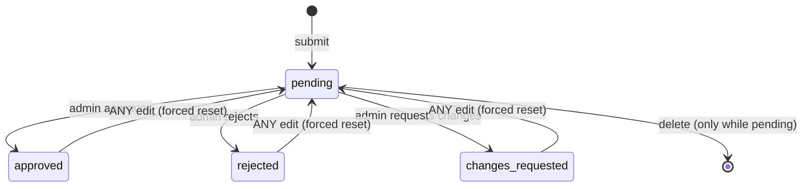
```mermaid
stateDiagram-v2
    [*] --> pending: submit
    pending --> approved: admin approves
    pending --> rejected: admin rejects
    pending --> changes_requested: admin requests changes
    approved --> pending: ANY edit (forced reset)
    changes_requested --> pending: ANY edit (forced reset)
    rejected --> pending: ANY edit (forced reset)
    pending --> [*]: delete (only while pending)
```

### GET/POST `company/tasks/`

#### GET `company/tasks/`
- **Roles**: Any authenticated user who resolves to a verified company via `get_verified_company()` — either the Company's creator or a user holding an active `COMPANY_MENTOR` grant. No static `@role_required` decorator; the permission is purely the in-view membership check. Read access is not restricted to owner/co-admin — any verified company member can list tasks.
- **Constraints**: Returns only tasks submitted by the resolved company, excluding soft-deleted rows. Supports an optional `approval_status` filter plus pagination/search/sort. If the caller has no verified company profile the endpoint returns 403 rather than an empty list.
- **Usage Scenario**: A company mentor opens the "My Tasks" tab of the company dashboard to review every task the company has ever submitted, filtering to `approval_status=pending` to see what's still awaiting admin review versus `approved` to see what's live and earning karma for learners.

#### POST `company/tasks/`
- **Roles**: Same verified-company-member gate as GET (creator or active COMPANY_MENTOR) — no explicit owner/co-admin requirement for *creating* a task (unlike edit/delete, which require owner-or-accepted-co-admin).
- **Constraints**: Enforces a cap of 5 tasks in `pending` or `changes_requested` status per company — exceeding it returns 429 "You already have 5 pending/changes-requested tasks. Resolve those before submitting more." New tasks are always force-created with `approval_status="pending"`, `active=False`, regardless of what the client sends. `hashtag` must be globally unique across all tasks, including soft-deleted ones. An optional `skill_ids` list is validated against active skills; invalid/inactive skill ids are silently skipped at this layer.
- **Usage Scenario**: A company mentor drafts a new bounty-style task (e.g. "Build a demo integrating our SDK") tied to an Interest Group, submits it, and it sits in the admin approval queue with `active=False` until a platform admin reviews and activates it so learners can start claiming karma.

- **Query** (GET): `?approval_status=pending&search=cloud&sort_by=created_at`
- **POST Request**:
```json
{
  "hashtag": "#companychallenge1",
  "title": "Build a REST API",
  "karma": 50,
  "usage_count": 1,
  "description": "Complete the challenge...",
  "type": "task-type-uuid",
  "level": "level-uuid",
  "skill_ids": ["skill-uuid"]
}
```
- **POST Response `200`**:
```json
{
  "general_message": "Task submitted for approval."
}
```
- **GET Response `200`**:
```json
{
  "data": [
    {
      "id": "uuid",
      "hashtag": "#companychallenge1",
      "title": "Build a REST API",
      "karma": 50,
      "type": "Challenge",
      "active": false,
      "approval_status": "pending",
      "requested_by_name": "Jane Doe",
      "skills": [{"id": "uuid", "name": "Python", "code": "PY"}],
      "created_at": "2026-08-01T10:00:00Z"
    }
  ],
  "pagination": {"page": 1, "per_page": 10, "total": 1}
}
```
- **Error `429`**:
```json
{
  "general_message": "You already have 5 pending/changes-requested tasks. Resolve those before submitting more."
}
```
- **Error `400`**:
```json
{
  "message": {
    "hashtag": ["A task with this hashtag already exists."]
  }
}
```

### GET `company/tasks/{task_id}/`
- **Roles**: Any verified company member (creator or active COMPANY_MENTOR) — same as list; no owner/co-admin restriction for read.
- **Constraints**: Looks up the task scoped to the company and non-deleted; a task belonging to a different company, deleted, or nonexistent returns 404 "Task not found." rather than leaking existence.
- **Usage Scenario**: A company mentor clicks into a specific task from the list view to inspect its full detail — description, karma, linked skills, rejection reason if any — before deciding whether to edit and resubmit it.
- **Response `200`**: single task object (same shape as list item above).
- **Error `404`**:
```json
{
  "general_message": "Task not found."
}
```

### PUT/PATCH `company/tasks/{task_id}/` (owner/admin only)

#### PUT `company/tasks/{task_id}/`
- **Roles**: Requires owner or accepted co-admin status; plain COMPANY_MENTOR grantees without owner/co-admin status are rejected with 403 "You must be the company owner or an accepted co-admin to edit tasks."
- **Constraints**: Regardless of the task's current approval state, a successful PUT unconditionally resets it to `approval_status="pending"`, `active=False`, and clears `rejection_reason`/review metadata — any prior approval, rejection, or changes-requested state is wiped and the task re-enters the admin review queue. `hashtag` uniqueness is re-validated. `skill_ids`, if supplied, fully replaces the task's skill links.
- **Usage Scenario**: The company owner corrects a rejected task's description and karma value after an admin left feedback, submits the full replacement payload, and the task automatically flips back to "pending" for another admin review pass.

#### PATCH `company/tasks/{task_id}/`
- **Roles**: Same as PUT — owner or accepted co-admin only. 403 otherwise.
- **Constraints**: Partial-update variant; any subset of `title`, `hashtag`, `description`, `karma`, `ig_id`, `type_id`, `channel_id`, `level_id`, `skill_ids` may be supplied. `hashtag` must start with `#` and is checked case-insensitively for uniqueness. `ig_id`/`type_id` must reference existing rows; `skill_ids` must all be active skills or the whole request is rejected (unlike POST/PUT's silent-skip behavior). Like PUT, a successful PATCH force-resets `active=False`, `approval_status="pending"`, and clears review metadata — no partial state survives an edit.
- **Usage Scenario**: A co-admin makes a quick single-field fix — bumping the karma value or swapping the linked Interest Group — without resending the entire task payload, and the task automatically re-queues for admin approval.

- **Request** (PATCH):
```json
{
  "title": "New title",
  "karma": 40,
  "skill_ids": ["skill-uuid-2"]
}
```
- **Response `200`**:
```json
{
  "general_message": "Task updated successfully and submitted for admin review.",
  "response": {
    "approval_status": "pending",
    "active": false
  }
}
```
- **Error `403`**:
```json
{
  "general_message": "You must have a verified company profile to view tasks."
}
```
(or an owner/admin-only message for mutating verbs)

### DELETE `company/tasks/{task_id}/`
- **Roles**: Owner or accepted co-admin only; 403 for a plain mentor or unrelated user.
- **Constraints**: Performs a soft delete (`is_deleted=True`); the record is never physically removed. This is explicitly distinct from the `active` flag, which tracks the pending-approval/activation lifecycle, not deletion. A task not found under the company (or already deleted) returns 404.
- **Usage Scenario**: A company owner realizes a submitted task is no longer relevant (e.g. duplicate submission or outdated bounty) and removes it from the pipeline before an admin gets to review it, keeping the pending-task quota (5 max) available for other submissions.
- **Response `200`**:
```json
{
  "general_message": "Task deleted successfully.",
  "response": {
    "task_id": "uuid",
    "deleted_at": "2026-08-02T00:00:00Z"
  }
}
```

### GET/POST `company/tasks/templates/`

#### GET `company/tasks/templates/`
- **Roles**: Any verified company member (creator or active COMPANY_MENTOR) — no owner/co-admin restriction for listing.
- **Constraints**: Returns all task templates for the company, ordered most-recent-first. No pagination is applied. Templates are company-scoped only — no cross-company visibility.
- **Usage Scenario**: Before drafting a new recurring task (e.g. a monthly "write a blog post" bounty), a company mentor checks the saved templates list to reuse the standard title/hashtag-prefix/description/karma structure instead of retyping it.

#### POST `company/tasks/templates/`
- **Roles**: Owner or accepted co-admin only; 403 "You must be the company owner or an accepted co-admin to save templates." otherwise.
- **Constraints**: Only `title` is required; `hashtag_prefix`, `description`, `karma`, `type_id` are all optional and stored as-is with no FK existence validation on `type_id` and no uniqueness check.
- **Usage Scenario**: After finalizing the wording and karma value for a task type the company posts repeatedly (e.g. quarterly hackathon bounties), the owner saves it as a template so future task submissions can start from a consistent baseline.

- **POST Request**:
```json
{
  "title": "Monthly Challenge",
  "hashtag_prefix": "#monthly",
  "description": "...",
  "karma": 50,
  "type_id": "task-type-uuid"
}
```
- **POST Response `200`**:
```json
{
  "general_message": "Task template saved successfully.",
  "response": {"id": "template-uuid"}
}
```
- **GET Response `200`**:
```json
{
  "response": {
    "data": [
      {"id": "uuid", "title": "Monthly Challenge", "hashtag_prefix": "#monthly", "karma": 50, "type_id": "uuid", "type_title": "Challenge"}
    ]
  }
}
```

### DELETE `company/tasks/templates/{template_id}/`
- **Roles**: Owner or accepted co-admin only.
- **Constraints**: Template must belong to the caller's company, else 404 "Template not found." Deletion is a hard delete, not soft-delete, unlike task deletion itself.
- **Usage Scenario**: A co-admin cleans up an outdated or unused task template that no longer reflects the company's current bounty structure.
- **Response `200`**:
```json
{
  "general_message": "Task template deleted successfully."
}
```

---

## 8. Feedback & Impact Reporting

### Eligibility gates by interaction type

```
JOB      → application.status ∈ {Selected, Rejected}   (final outcome only)
TASK     → KarmaActivityLog.appraiser_approved == True  (completed + approved)
EVENT    → active EventConnection ticket for that event
SESSION  → session.status == COMPLETED AND caller was a MENTEE participant
```

### POST `company/feedback/`
- **Roles**: Any authenticated platform user (learner/applicant/mentee) — not company-side at all. There is no static role requirement; eligibility is entirely determined by whether the caller actually participated in the referenced interaction.
- **Constraints**: `interaction_type` must be one of `JOB`/`TASK`/`EVENT`/`SESSION`; `rating` must be an integer 1-5. Eligibility per type: **JOB** — caller must have an application with status `Selected`/`Rejected` (a final outcome); **TASK** — caller must have a karma-activity-log row with `appraiser_approved=True` for that task (a rejected submission does not unlock feedback); **EVENT** — caller must hold an active user ticket for a company-organised event; **SESSION** — the session must be `COMPLETED` and the caller must be linked as a `MENTEE`. Duplicate feedback is blocked: one submission per `(company, interaction_type, entity_id, submitted_by)` tuple — a second submission fails with no rating override/upsert.
- **Usage Scenario**: After a learner's job application is marked "Rejected" or "Selected", the platform prompts them to leave a 1-5 rating and optional comment on their experience with the hiring company, which then feeds into that company's aggregate quality signal.
- **Request**:
```json
{
  "interaction_type": "JOB",
  "entity_id": "job-uuid",
  "rating": 5,
  "comment": "Great experience"
}
```
- **Response `200`**:
```json
{
  "general_message": "Feedback submitted successfully."
}
```
- **Error `400`**:
```json
{
  "general_message": "You can only give feedback after your application has reached a final outcome."
}
```
```json
{
  "general_message": "You have already submitted feedback for this interaction."
}
```
- **Error `404`**:
```json
{
  "general_message": "Job not found."
}
```

### GET `company/feedback/list/`
- **Roles**: Company-side; resolved via `_get_company_for_user` (creator or active COMPANY_MENTOR) — no owner/co-admin restriction, any verified company member can view received feedback.
- **Constraints**: Scoped to the caller's own company's feedback, ordered most-recent-first; optional `interaction_type` filter. No verified-company profile returns 404.
- **Usage Scenario**: A company mentor reviews the stream of structured feedback learners have left across jobs, tasks, events, and mentorship sessions to spot recurring complaints or praise before compiling a broader retrospective.
- **Query**: `?interaction_type=JOB&sort_by=-rating`
- **Response `200`**:
```json
{
  "response": {
    "data": [
      {
        "id": "uuid",
        "interaction_type": "JOB",
        "entity_id": "job-uuid",
        "submitted_by_name": "Jane Doe",
        "rating": 5,
        "comment": "Great experience",
        "created_at": "2026-07-20T10:00:00Z"
      }
    ],
    "pagination": {"page": 1, "per_page": 10, "total": 1}
  }
}
```

### GET `company/impact-report/`
- **Roles**: Company-side; any verified company member (creator or active mentor); 404 if no company profile.
- **Constraints**: Computed live and shared with the public-profile opt-in summary so the two never drift. **Reach** = deduplicated union of job applicants, task completers, event attendees, and session mentees — a learner touched via multiple surfaces is counted once. **Quality signal** blends company feedback ratings with mentorship-session ratings into a count-weighted combined average. **Outcome signal** = count of Selected applications plus total karma distributed on the company's tasks.
- **Usage Scenario**: A company owner pulls up the Impact Report before a quarterly stakeholder review to show concrete reach/quality/outcome numbers — e.g. "212 learners touched, 4.6 average rating, 18 hires, 3,400 karma distributed" — justifying continued investment in the platform partnership.
- **Response `200`**:
```json
{
  "response": {
    "company": {"id": "uuid", "name": "Acme Inc"},
    "reach": {
      "total_learners_touched": 120,
      "job_applicants": 40,
      "task_completers": 30,
      "event_attendees": 60,
      "session_mentees": 10
    },
    "quality_signal": {
      "average_rating": 4.5,
      "total_ratings": 25,
      "feedback_average_rating": 4.6,
      "feedback_count": 20,
      "session_average_rating": 4.1,
      "session_rating_count": 5
    },
    "outcome_signal": {"hires": 8, "karma_distributed": 15000}
  }
}
```

### PATCH `company/impact-report/publish/`
- **Roles**: Owner or accepted co-admin only; 403 "You must be the company owner or an accepted co-admin." otherwise.
- **Constraints**: Simple boolean toggle (defaults to publish if the field is omitted). Sets `publish_impact_report` only — the underlying report data itself is unaffected, only its visibility on the public profile.
- **Usage Scenario**: After reviewing a strong Impact Report, the company owner opts in to displaying a summarized version on the company's public profile page as a credibility signal to prospective applicants and partner IGs/campuses; they can later toggle it off if the numbers dip.
- **Request**:
```json
{
  "publish": true
}
```
- **Response `200`**:
```json
{
  "general_message": "Impact report published on your public profile."
}
```

---

## 9. Collaboration / Partnership Discovery

### Status state machine

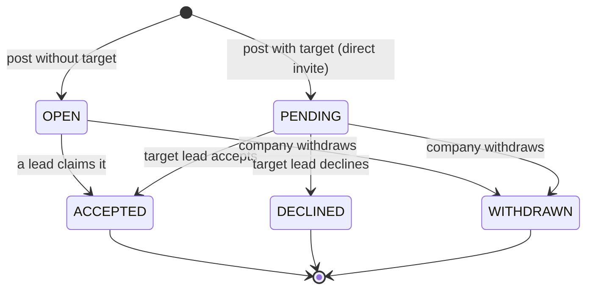
```mermaid
stateDiagram-v2
    [*] --> OPEN: post without target
    [*] --> PENDING: post with target (direct invite)
    OPEN --> ACCEPTED: a lead claims it
    PENDING --> ACCEPTED: target lead accepts
    PENDING --> DECLINED: target lead declines
    OPEN --> WITHDRAWN: company withdraws
    PENDING --> WITHDRAWN: company withdraws
    ACCEPTED --> [*]
    DECLINED --> [*]
    WITHDRAWN --> [*]
```

### Sequence — direct invite → acceptance → auto-wired event

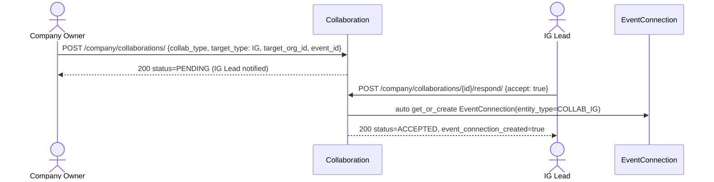
```mermaid
sequenceDiagram
    actor O as Company Owner
    participant Col as Collaboration
    actor IL as IG Lead
    participant EC as EventConnection

    O->>Col: POST /company/collaborations/ {collab_type, target_type: IG, target_org_id, event_id}
    Col-->>O: 200 status=PENDING (IG Lead notified)
    IL->>Col: POST /company/collaborations/{id}/respond/ {accept: true}
    Col->>EC: auto get_or_create EventConnection(entity_type=COLLAB_IG)
    Col-->>IL: 200 status=ACCEPTED, event_connection_created=true
```

### GET/POST `company/collaborations/`

#### GET `company/collaborations/`
- **Roles**: Company-side; resolved via a stricter resolver than the usual `_get_company_for_user` — it does not accept a bare `COMPANY_MENTOR` grant, only owner or an ACCEPTED co-admin. 403 "Verified company profile not found." if unresolved.
- **Constraints**: Returns the company's own collaboration posts in any status, ordered most-recent-first, with pagination/search on `title`/`description`.
- **Usage Scenario**: A company owner checks the status of all collaboration proposals they've posted — which are still `OPEN` for discovery, which are `PENDING` a specific IG/campus's response, and which were `ACCEPTED`/`DECLINED`/`WITHDRAWN`.

#### POST `company/collaborations/`
- **Roles**: Owner or accepted co-admin only; 403 otherwise.
- **Constraints**: Caps active (`OPEN`+`PENDING`) collaborations at 5 per company — 429 "You already have 5 open/pending collaboration posts. Resolve those before posting more." `collab_type` must be a recognized value; `title` is required. If `target_type` is supplied it must be `IG` or `CAMPUS`. If an `event_id` is supplied, the event must belong to the company's own org. Status is auto-derived: supplying both `target_type` and `target_org_id` creates a directed invite in `PENDING` status and notifies the target campus/IG's lead(s); omitting either creates an `OPEN` discovery post.
- **Usage Scenario**: A company owner wants to co-host a hackathon with a specific Interest Group — they post a `PENDING` collaboration directly naming that IG's `target_org_id`, which fires a notification to the IG's lead(s) awaiting their response; alternatively they post an `OPEN` "looking for a campus partner" listing without naming anyone, visible via the discovery feed.

- **POST Request**:
```json
{
  "collab_type": "EVENT_COHOST",
  "title": "Hackathon Co-host",
  "description": "Joint hackathon with prizes",
  "target_type": "IG",
  "target_org_id": "ig-uuid",
  "event_id": "event-uuid"
}
```
- **POST Response `200`**:
```json
{
  "general_message": "Collaboration posted successfully.",
  "response": {"id": "uuid", "status": "PENDING"}
}
```
- **GET Response `200`**:
```json
{
  "response": {
    "data": [
      {"id": "uuid", "collab_type": "EVENT_COHOST", "title": "Hackathon Co-host", "status": "PENDING", "target_type": "IG", "created_at": "2026-07-01T10:00:00Z"}
    ],
    "pagination": {"page": 1, "per_page": 10, "total": 1}
  }
}
```
- **Error `429`**:
```json
{
  "general_message": "You already have 5 open/pending collaboration posts. Resolve those before posting more."
}
```

### GET `company/collaborations/discover/`
- **Roles**: Any authenticated user (no company-side membership check) — intended for campus/IG leads browsing opportunities, but the endpoint itself does not gate by role.
- **Constraints**: Only returns collaborations with `status=OPEN` (undirected discovery posts) — `PENDING` directed invites are never visible here since they're targeted at a specific recipient. Optional `collab_type` filter.
- **Usage Scenario**: An IG lead browses the open collaboration marketplace looking for a company willing to co-host a workshop, finds a matching `EVENT_COHOST` post, and proceeds to the respond endpoint to claim it on behalf of their IG.
- **Query**: `?collab_type=IG_SPONSORSHIP`
- **Response `200`**:
```json
{
  "response": {
    "data": [
      {"id": "uuid", "collab_type": "IG_SPONSORSHIP", "title": "Looking for IG partner", "company_name": "Acme Corp", "status": "OPEN"}
    ],
    "pagination": {"page": 1, "per_page": 10, "total": 1}
  }
}
```

### POST `company/collaborations/{id}/respond/`
- **Roles**: A campus lead or IG lead, verified in-view: for a campus target the caller must hold the static `CAMPUS_LEAD` role and a verified org link to that campus; for an IG target the caller must hold the dynamic per-IG lead role (`f'{ig.code} IGLead'`). Company owners themselves cannot call this endpoint — it's exclusively the responding party.
- **Constraints**: Row-locked. Only `OPEN` or `PENDING` collaborations are respondable; any other status returns "This collaboration is no longer open for a response." For an `OPEN` post, the responder supplies `target_type`/`target_org_id` to claim it; for a `PENDING` post, the existing target on the record is used (the recipient can't redirect it elsewhere). Accepting sets status `ACCEPTED`; declining sets status `DECLINED` with a stored `rejection_reason`. On acceptance where the collaboration has a linked event, an `EventConnection` row is auto-created (idempotently) so Collaboration never duplicates EventConnection's bookkeeping. The company is notified of the outcome either way.
- **Usage Scenario**: An IG lead sees a directly-invited `PENDING` collaboration proposal for a joint hackathon, reviews the details, and accepts it — which flips the record to `ACCEPTED`, auto-wires an `EventConnection` collaborator row if an event is attached, and notifies the company owner that their proposal was accepted.
- **Request** (claim OPEN):
```json
{
  "accept": true,
  "target_type": "IG",
  "target_org_id": "ig-uuid"
}
```
- **Request** (respond to PENDING invite):
```json
{
  "accept": false,
  "rejection_reason": "Timing conflict"
}
```
- **Response `200`**:
```json
{
  "general_message": "Collaboration accepted successfully.",
  "response": {"status": "ACCEPTED", "event_connection_created": true}
}
```
- **Error `400`**:
```json
{
  "general_message": "This collaboration is no longer open for a response."
}
```

### DELETE `company/collaborations/{id}/`
- **Roles**: Owner or accepted co-admin of the collaboration's own company; 403 "You are not authorized to withdraw this collaboration." otherwise.
- **Constraints**: Only collaborations in `OPEN` or `PENDING` status can be withdrawn — anything already `ACCEPTED`/`DECLINED`/`WITHDRAWN` returns "Only an open or pending collaboration can be withdrawn." Sets status to `WITHDRAWN` (not a hard delete); this frees up a slot against the 5-active-collaboration cap for future posts.
- **Usage Scenario**: A company owner posted a directed collaboration invite to a campus but circumstances changed (e.g. budget cut) before the campus lead responded, so they withdraw the proposal rather than leaving it hanging or waiting for a decline.
- **Response `200`**:
```json
{
  "general_message": "Collaboration withdrawn successfully."
}
```
- **Error `400`**:
```json
{
  "general_message": "Only an open or pending collaboration can be withdrawn."
}
```

---

## 10. IG Sponsorship

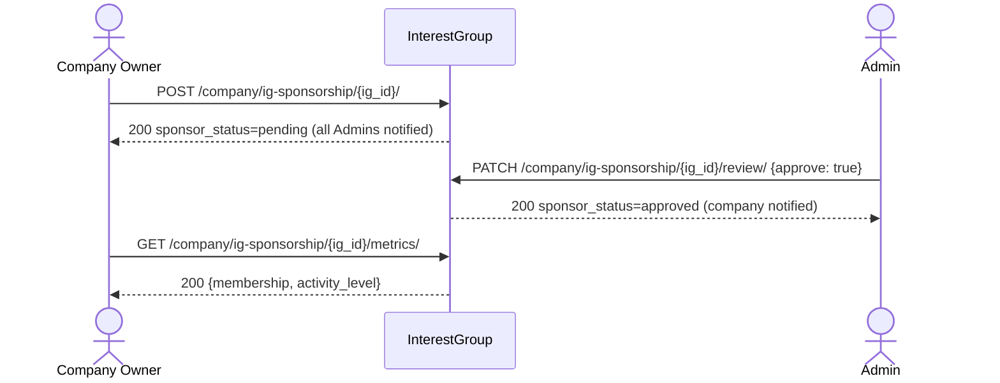
```mermaid
sequenceDiagram
    actor O as Company Owner
    participant IG as InterestGroup
    actor A as Admin

    O->>IG: POST /company/ig-sponsorship/{ig_id}/
    IG-->>O: 200 sponsor_status=pending (all Admins notified)
    A->>IG: PATCH /company/ig-sponsorship/{ig_id}/review/ {approve: true}
    IG-->>A: 200 sponsor_status=approved (company notified)
    O->>IG: GET /company/ig-sponsorship/{ig_id}/metrics/
    IG-->>O: 200 {membership, activity_level}
```

### POST `company/ig-sponsorship/{ig_id}/`
- **Roles**: Owner or accepted co-admin only; 403 "You must be the company owner or an accepted co-admin." otherwise.
- **Constraints**: Row-locked on the Interest Group. Exclusivity: if the IG is already `approved`-sponsored by a *different* company, the request is rejected. Pending-request dedup: if a *different* company already has a `pending` request awaiting review, rejected — prevents a second company's request from silently overwriting the first's in-flight request. On success, sets sponsor status to `pending` and notifies every platform admin for review.
- **Usage Scenario**: A company wanting to formally back a popular Interest Group (e.g. sponsor the "Cloud Computing" IG with funding/swag/mentorship) submits a sponsorship request, which queues for platform-admin review before the company's branding/benefits are attached to the IG.
- **Request**: none.
- **Response `200`**:
```json
{
  "general_message": "Sponsorship request submitted. Awaiting admin approval."
}
```
- **Error `400`**:
```json
{
  "general_message": "This Interest Group is already sponsored by another company."
}
```
```json
{
  "general_message": "This Interest Group already has a pending sponsorship request from another company."
}
```

### PATCH `company/ig-sponsorship/{ig_id}/review/` (Admin only)
- **Roles**: Platform admin only — enforced by a static `@role_required([RoleType.ADMIN.value])` decorator, not an in-view ownership check. This is the one endpoint in this group gated by a hard role decorator rather than company-ownership logic.
- **Constraints**: Only operates on an IG currently in `pending` sponsor status; otherwise 404 "No pending sponsorship request found for this Interest Group." `approve` defaults to `True`. Approving keeps the requesting company as sponsor; rejecting *clears* the sponsor company reference entirely so a rejected request leaves no dangling pointer. The requesting company is notified only on approval — rejections do not trigger a notification via this path.
- **Usage Scenario**: A platform admin reviews a queue of pending IG sponsorship requests and approves the one from a legitimate, verified company sponsoring the "AI/ML" IG, formally attaching that company as the IG's recognised sponsor and unlocking the IG metrics endpoint for them.
- **Request**:
```json
{
  "approve": true
}
```
- **Response `200`**:
```json
{
  "general_message": "IG sponsorship approved successfully."
}
```
- **Error `404`**:
```json
{
  "general_message": "No pending sponsorship request found for this Interest Group."
}
```

### GET `company/ig-sponsorship/{ig_id}/metrics/`
- **Roles**: Owner or accepted co-admin of the *sponsoring* company only; 403 if not owner/co-admin.
- **Constraints**: The IG must be found with `approved` sponsor status AND the caller's company as the current sponsor — any other company (even a past or rejected/pending requester) gets 404 "This Interest Group is not sponsored by your company." Metrics are computed over a rolling 30-day window: active member count and new members, active task count, task completions, and session count.
- **Usage Scenario**: A company that sponsors an Interest Group checks its dashboard periodically to see whether its sponsorship dollars are translating into member growth and activity — e.g. confirming 15 new members and 40 task completions in the past month to justify renewing the sponsorship.
- **Response `200`**:
```json
{
  "response": {
    "ig_id": "uuid",
    "ig_name": "Python IG",
    "membership": {"total_members": 150, "new_members_last_30_days": 12},
    "activity_level": {"active_tasks": 5, "task_completions_last_30_days": 40, "sessions_last_30_days": 3}
  }
}
```
- **Error `404`**:
```json
{
  "general_message": "This Interest Group is not sponsored by your company."
}
```

---

## 11. Event Templates

### GET/POST `company/events/templates/`

#### GET `company/events/templates/`
- **Roles**: Any verified company member (creator or active COMPANY_MENTOR); no owner/co-admin restriction to list. 403 if no verified company profile.
- **Constraints**: Returns all event templates for the company, ordered most-recent-first. Unpaginated list.
- **Usage Scenario**: A company mentor planning a new tech talk checks the saved event templates to reuse the standard duration and description format from a previous, similar event.

#### POST `company/events/templates/`
- **Roles**: Owner or accepted co-admin only; 403 "You must be the company owner or an accepted co-admin to save templates." otherwise.
- **Constraints**: Only `title` is required. `description`, `event_type`, `default_duration_minutes` are optional and stored without further validation (no enum check on `event_type`, no numeric bound on duration).
- **Usage Scenario**: After running a successful recruiting webinar, the company owner saves its structure (title, description, 60-minute default duration) as a reusable template so future recruiting events for other roles can be scaffolded quickly.

- **POST Request**:
```json
{
  "title": "Tech Talk",
  "description": "...",
  "event_type": "tech_talk",
  "default_duration_minutes": 90
}
```
- **POST Response `200`**:
```json
{
  "general_message": "Event template saved successfully.",
  "response": {"id": "template-uuid"}
}
```
- **GET Response `200`**:
```json
{
  "response": {
    "data": [
      {"id": "uuid", "title": "Tech Talk", "description": "...", "event_type": "tech_talk", "default_duration_minutes": 90}
    ]
  }
}
```

### DELETE `company/events/templates/{template_id}/`
- **Roles**: Owner or accepted co-admin only.
- **Constraints**: Template must belong to the caller's company, else 404 "Template not found." Hard delete, no soft-delete flag.
- **Usage Scenario**: A co-admin removes an event template for an event format the company no longer runs (e.g. an old hackathon format that's been superseded).
- **Response `200`**:
```json
{
  "general_message": "Event template deleted successfully."
}
```
- **Error `404`**:
```json
{
  "general_message": "Template not found."
}
```

---

## 12. Company → Mentor Nomination

```
Owner ──POST mentor/nominate/ {muid}──▶ MentorApplication(status=APPROVED, immediate)
User  ──POST mentor/apply/ {company_id}──▶ MentorApplication(status=PENDING) ──▶ Owner reviews later via mentor/verify/
```

### POST `company/mentor/nominate/`
- **Roles**: Only the verified company owner or an accepted co-admin; 403 "You must be the company owner or an accepted co-admin to nominate mentors." otherwise. Notably this also permits accepted co-admins, consistent with the rest of the company-admin delegation model.
- **Constraints**: The nominee is identified by `muid` and must resolve to an existing platform user. Self-nomination is explicitly blocked. The nominee must already appear as a member of the company's own org — a company can only nominate someone already affiliated with its own org, not an arbitrary platform user. Duplicate-nomination guard: any existing non-`REJECTED`/non-`GRANT_REVOKED` `COMPANY_MENTOR` application for that user+org blocks a new nomination. Critically, **nomination IS approval** — there is no separate pending step; the mentor tier is granted immediately upon nomination. The platform admin only receives a passive notification/audit-log entry, with no approval authority over this tier.
- **Usage Scenario**: A company owner wants to fast-track a trusted team member (already part of the company's org) into the Company Mentor role without waiting on admin review — they nominate by muid and the mentor grant is active immediately, with the platform admin only informed after the fact for audit purposes.
- **Request**:
```json
{
  "muid": "john-doe@mulearn",
  "reason": "Domain expertise in backend systems"
}
```
- **Response `200`**:
```json
{
  "general_message": "User approved as Company Mentor successfully.",
  "response": {
    "id": "uuid",
    "user_id": "uuid",
    "user_name": "John Doe",
    "user_email": "john@x.com",
    "org_name": "Acme Org",
    "mentor_tier": "COMPANY_MENTOR",
    "status": "APPROVED",
    "reason": "Domain expertise in backend systems",
    "verified_at": "2026-08-02T10:00:00Z"
  }
}
```
- **Error `400`**:
```json
{
  "message": {
    "muid": ["You cannot nominate yourself as your company's mentor."]
  }
}
```

### POST `company/mentor/apply/`
- **Roles**: Any authenticated platform user may self-apply — no company-side role required to call the endpoint (this is the applicant-only self-onboarding path, distinct from nomination).
- **Constraints**: `company_id` must reference an existing verified company. Self-application is blocked two ways: the company's own owner cannot apply to their own company, and anyone who is already an owner or accepted co-admin of that company is blocked as a conflict of interest, since they'd otherwise be able to review/approve their own application. Duplicate-application guard mirrors nomination. Unlike nomination, applying does **not** auto-approve — it sits `PENDING` until reviewed by the company owner via `mentor/verify/{mentor_id}/` (owner is the sole verifier for this tier).
- **Usage Scenario**: An external learner who admires a company's work applies directly to become that company's mentor, submitting an "about"/"expertise"/"reason" pitch and available hours; the application then waits in the company owner's review queue rather than being granted immediately.
- **Request**:
```json
{
  "company_id": "company-uuid",
  "about": "5 years backend experience",
  "expertise": "Backend, DevOps",
  "reason": "I want to mentor students",
  "hours": 5
}
```
- **Response `200`**:
```json
{
  "general_message": "Application submitted successfully. It is pending review by the company owner.",
  "response": {"status": "PENDING"}
}
```
- **Error `400`**:
```json
{
  "message": {
    "company_id": ["You cannot apply to be a mentor for a company you own or co-administer."]
  }
}
```

### GET `company/mentor/list/`
- **Roles**: Owner or accepted co-admin only; 403 "You must be the company owner or an accepted co-admin to view mentor applications." for a plain COMPANY_MENTOR grantee or unrelated user.
- **Constraints**: Requires the company to have a resolved org (404 otherwise). Lists all `COMPANY_MENTOR`-tier applications scoped to that org — this includes both nominated (auto-approved) and self-applied (pending/approved/rejected) records in one combined list, distinguishable by `status`.
- **Usage Scenario**: The company owner reviews the full roster and history of everyone who has ever been nominated as or applied to be a Company Mentor — approving pending self-applications, or auditing who was fast-tracked via nomination.
- **Response `200`**:
```json
{
  "response": [
    {"id": "uuid", "user_id": "uuid", "user_name": "John Doe", "mentor_tier": "COMPANY_MENTOR", "status": "APPROVED", "reason": "..."}
  ]
}
```

---

## 13. Dashboard Home Summary

### GET `company/home-summary/`
- **Roles**: Any verified company member (creator or active COMPANY_MENTOR); 404 "Company profile not found or access denied." if unresolved. No owner/co-admin restriction — read-only aggregate view.
- **Constraints**: Aggregates the company's jobs and applications. `quick_stats` covers all-time totals; `stat_cards` layers a period-scoped delta on top, driven by an optional `period` query param (default `"30d"`). Also embeds the full `talent_pool` payload (shared with the talent-pool analytics endpoint) in the same response so the dashboard home doesn't need a second call.
- **Usage Scenario**: A company owner lands on their dashboard home page after logging in and immediately sees a quick-glance summary — jobs posted, total views, applications received, hires made, each with a recent-period delta — plus an embedded talent-pool snapshot, without navigating to separate analytics pages.
- **Query**: `?period=30d`
- **Response `200`**:
```json
{
  "response": {
    "company": {"id": "uuid", "name": "Acme", "slug": "acme", "status": "verified", "logo": "https://..."},
    "quick_stats": {"jobs_posted": 12, "total_views": 340, "applications": 55, "hired": 4},
    "stat_cards": [
      {"key": "jobs_posted", "label": "Jobs posted", "value": 12, "delta": 3, "delta_type": "increase", "period": "30d"},
      {"key": "total_views", "label": "Total views", "value": 340, "delta": 340, "delta_type": "increase", "period": "30d"},
      {"key": "applications", "label": "Applications", "value": 55, "delta": 10, "delta_type": "increase", "period": "30d"},
      {"key": "hired", "label": "Hired", "value": 4, "delta": 1, "delta_type": "increase", "period": "30d"}
    ],
    "talent_pool": {"total_learners": 500, "level_distribution": [], "top_interest_groups": []}
  }
}
```
> **Known quirk**: the `total_views` card's `delta` repeats the cumulative total rather than a period-scoped delta, since views aren't timestamped per-event.

---

# Part B — Mentor System

The Mentor system is built on three concepts: a **`UserMentor`** profile (one per user, `about/expertise/hours` + a global `is_active` kill-switch), one or more **`MentorApplication`** rows (one per tier: `IG_MENTOR`, `COMPANY_MENTOR`, `CAMPUS_MENTOR`, or global `MENTOR`), and **`MentorScopeGrant`** rows (the actual source of authority once an application is `APPROVED`). A mentor can hold multiple approved applications across different tiers simultaneously and switch between them via **Persona Switching** (§20).

```
MentorApplication(PENDING) ──verify──▶ APPROVED ──▶ MentorScopeGrant(active) ──▶ unlocks:
                                                          ├── Sessions (§22)
                                                          ├── Tasks (§26)
                                                          └── Opportunities (§27)
```

## 14. Registration & Onboarding

### Application state machine

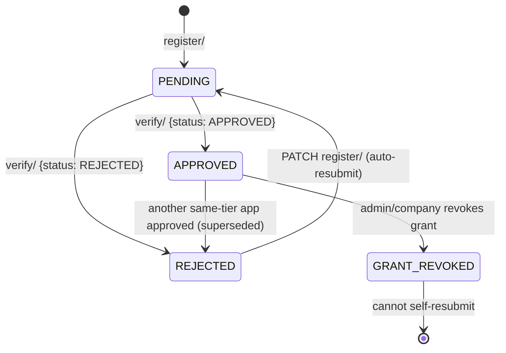
```mermaid
stateDiagram-v2
    [*] --> PENDING: register/
    PENDING --> APPROVED: verify/ {status: APPROVED}
    PENDING --> REJECTED: verify/ {status: REJECTED}
    REJECTED --> PENDING: PATCH register/ (auto-resubmit)
    APPROVED --> REJECTED: another same-tier app approved (superseded)
    APPROVED --> GRANT_REVOKED: admin/company revokes grant
    GRANT_REVOKED --> [*]: cannot self-resubmit
```

### Sequence — apply → verify (IG tier)

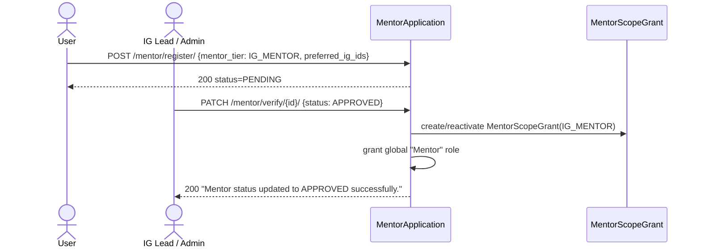
```mermaid
sequenceDiagram
    actor U as User
    actor IL as IG Lead / Admin
    participant MA as MentorApplication
    participant SG as MentorScopeGrant

    U->>MA: POST /mentor/register/ {mentor_tier: IG_MENTOR, preferred_ig_ids}
    MA-->>U: 200 status=PENDING
    IL->>MA: PATCH /mentor/verify/{id}/ {status: APPROVED}
    MA->>SG: create/reactivate MentorScopeGrant(IG_MENTOR)
    MA->>MA: grant global "Mentor" role
    MA-->>IL: 200 "Mentor status updated to APPROVED successfully."
```

### POST `mentor/register/`
- **Roles**: Any authenticated user (JWT-valid) may call this — there is no `@role_required` gate, since this is how a plain learner first becomes a mentor applicant. `mentor_tier` is restricted to `IG_MENTOR`, `COMPANY_MENTOR`, or `CAMPUS_MENTOR` — the global `MENTOR` tier is not self-selectable, it is only ever admin-assigned via `mentor/admin/assign/`.
- **Constraints**: For `IG_MENTOR`, a second application is blocked if the user already has a PENDING or APPROVED `IG_MENTOR` application for *any* org. For `COMPANY_MENTOR`/`CAMPUS_MENTOR`, `org` is required and uniqueness is scoped per-org. The serializer validates `org.org_type` matches the tier (Company for COMPANY_MENTOR, College for CAMPUS_MENTOR), requires at least one valid `preferred_ig_ids` entry, and a well-formed LinkedIn URL if supplied. `about`/`expertise`/`hours` upsert the single `UserMentor` profile row (one per user, independent of how many tier applications they hold) rather than living on the application itself. Admins (or the relevant IG leads/company owner) are notified per tier.
- **Usage Scenario**: A learner who wants to become an IG mentor submits `mentor_tier=IG_MENTOR`, a list of `preferred_ig_ids`, a bio, and LinkedIn URL; a company employee instead submits `mentor_tier=COMPANY_MENTOR` with `org` set to their employer. The application lands as PENDING and is picked up later by `mentor/list/` (admin review queue) or the tier-specific verifier via `mentor/verify/{id}/`.
- **Request**:
```json
{
  "mentor_tier": "IG_MENTOR",
  "org": "org-uuid",
  "preferred_ig_ids": ["ig-uuid1", "ig-uuid2"],
  "reason": "I want to give back to the community",
  "about": "5 years in cloud infra",
  "expertise": "AWS, Kubernetes",
  "hours": 5,
  "linkedin": "https://www.linkedin.com/in/janedoe"
}
```
- **Response `200`**:
```json
{
  "general_message": "Mentor registration submitted successfully.",
  "response": {
    "id": "app-uuid",
    "about": "5 years in cloud infra",
    "expertise": "AWS, Kubernetes",
    "hours": 5,
    "reason": "...",
    "preferred_ig_ids": ["ig-uuid1", "ig-uuid2"],
    "mentor_tier": "IG_MENTOR",
    "org": null
  }
}
```
- **Error `400`**:
```json
{
  "general_message": "You already have an active or pending IG mentor application."
}
```

### PATCH `mentor/register/`
- **Roles**: The caller must own the application being edited — there is no role check because this is self-service editing of one's own pending/rejected application.
- **Constraints**: Requires `id` in the body; 404s if the application doesn't belong to the caller. An APPROVED application cannot be edited here at all — "Your mentor application is already approved. Please use the profile endpoint to update your details." If REJECTED, a successful save resurrects it to PENDING and clears the verification note (resubmission); otherwise it's a plain in-place PENDING edit. The same one-active-application-per-tier(+org) uniqueness is re-enforced, `preferred_ig_ids` can never be cleared to empty, and org/tier type-matching is re-validated.
- **Usage Scenario**: An applicant whose Campus Mentor application was rejected for a weak "reason" edits the `reason` field and resubmits via this endpoint, flipping the application back to PENDING for the admin queue; alternatively an applicant with a still-PENDING application tweaks their `preferred_ig_ids` before it's reviewed.
- **Request**:
```json
{
  "id": "app-uuid",
  "hours": 10,
  "preferred_ig_ids": ["ig-uuid3"]
}
```
- **Response `200`**:
```json
{
  "general_message": "Mentor application updated successfully.",
  "response": {"hours": 10, "preferred_ig_ids": ["ig-uuid3"]}
}
```
- **Error `400`**:
```json
{
  "general_message": "Your mentor application is already approved. Please use the profile endpoint to update your details."
}
```

### GET `mentor/status/`
- **Roles**: Any authenticated user can check their own status; always scoped to the caller.
- **Constraints**: Returns 404 "No mentor requests found for your account." if the user has never submitted an application. Otherwise returns every application the user has ever filed (all tiers/orgs), each with status, tier, resolved organization title, verifier metadata, and — only for REJECTED rows — a rejection reason.
- **Usage Scenario**: After submitting an IG Mentor application, a user polls this endpoint from their dashboard to see it sitting PENDING, and later to see it flip to APPROVED (with the verifier's name shown) or REJECTED (with the rejection reason surfaced to them for a resubmit via PATCH `mentor/register/`).
- **Response `200`**:
```json
{
  "response": [
    {
      "id": "app-uuid",
      "status": "PENDING",
      "mentor_tier": "IG_MENTOR",
      "organization": "Acme Corp",
      "verified_by": null,
      "verified_at": null,
      "created_at": "2026-07-01T10:00:00Z"
    }
  ]
}
```
- **Error `404`**:
```json
{
  "general_message": "No mentor requests found for your account."
}
```

### PATCH `mentor/verify/{mentor_id}/`
- **Roles**: There is no static `@role_required` — authorization is entirely computed in-view and is **tier-dependent**: for `COMPANY_MENTOR`, only the target company's verified owner or an accepted co-admin can verify — an Admin can only step in if the org has no verified Company row at all. For `IG_MENTOR`, either a platform Admin **or** the lead of at least one of the application's `preferred_ig_ids` can verify. For every other tier (`CAMPUS_MENTOR`, `MENTOR`), only an Admin can verify.
- **Constraints**: Self-verification is always blocked (403 "You cannot verify your own mentor application."). An already-decided application is re-checked under a row lock and rejected with "This mentor application has already been {status} by {actor_name}." to prevent a race between two concurrent verifiers. Rejection requires a non-blank verification note. Approval triggers: a conflict-of-interest guard for COMPANY_MENTOR that blocks approval if the user has an open job application to that company ("This user has an open job application to this company and cannot be granted Company Mentor status until that application is resolved."); supersession of any other APPROVED application of the *same tier* held by the same user (marked REJECTED, its grants deactivated); creation/reactivation of a `MentorScopeGrant`; assignment of the global `MENTOR` role; and, for COMPANY_MENTOR, auto-verification of the org link. Every verify decision is logged.
- **Usage Scenario**: An IG lead opens the pending-applications queue, sees a new IG_MENTOR application naming their IG in `preferred_ig_ids`, and PATCHes `status=APPROVED` — this both grants the applicant an `IG_MENTOR` scope grant for that IG and the global Mentor role. Separately, a verified company's owner reviews and approves a `COMPANY_MENTOR` application from one of their employees (unless that employee still has an open job application at the same company, which blocks approval until resolved).
- **Request**:
```json
{
  "status": "APPROVED"
}
```
or
```json
{
  "status": "REJECTED",
  "verification_note": "Insufficient domain experience"
}
```
- **Response `200`**:
```json
{
  "general_message": "Mentor status updated to APPROVED successfully."
}
```
- **Error `403`**:
```json
{
  "general_message": "You cannot verify your own mentor application."
}
```
- **Error `400`**:
```json
{
  "general_message": "This mentor application has already been APPROVED by Jane Owner."
}
```
```json
{
  "general_message": "This user has an open job application to this company and cannot be granted Company Mentor status until that application is resolved."
}
```

---

## 15. Public Profile & Availability

### GET `mentor/public/profile/{mentor_id}/`
- **Roles**: Any authenticated user (mentor or not) can view another mentor's public profile; `mentor_id` here is the `UserMentor` profile id, not the application id.
- **Constraints**: 404 if no `UserMentor` row matches. 403 "This user is not an approved mentor." if the underlying user has no APPROVED application at all (of any tier) — a purely PENDING or REJECTED applicant's profile is not publicly visible. Response includes rolled-up `avg_rating`/`rating_count` aggregating both session-mentee ratings and company-side feedback for company sessions, weighted together.
- **Usage Scenario**: A learner browsing IG opportunities clicks through to an IG mentor's public profile to check their expertise, hours, and rating before requesting a session with them.
- **Response `200`**:
```json
{
  "response": {
    "id": "uuid",
    "user_full_name": "Jane Mentor",
    "about": "5 years in cloud infra",
    "expertise": "AWS, Kubernetes",
    "hours": 5,
    "avg_rating": 4.6,
    "rating_count": 20,
    "applications": [
      {"mentor_tier": "IG_MENTOR", "organization": "AI/ML IG", "status": "APPROVED"}
    ]
  }
}
```
- **Error `403`**:
```json
{
  "general_message": "This user is not an approved mentor."
}
```

### GET `mentor/public/availability/{mentor_id}/`
- **Roles**: No role restriction — public to any authenticated user, mirroring the public-profile endpoint.
- **Constraints**: Same approved-mentor gate as the public profile endpoint (404 if no `UserMentor` row, 403 "This user is not an approved mentor." if the user holds no APPROVED application). Only returns slots where `is_active=True`; inactive/paused slots are hidden from public view.
- **Usage Scenario**: Before requesting a mentorship session, a learner checks a mentor's public availability slots (weekday/time ranges) to pick a time that overlaps, without needing to message the mentor first.
- **Response `200`**:
```json
{
  "response": [
    {
      "id": "uuid",
      "mentor_user_id": "uuid",
      "ig_id": "ig-uuid",
      "ig_name": "AI/ML",
      "weekday": 1,
      "start_time": "09:00:00",
      "end_time": "10:00:00",
      "timezone": "Asia/Kolkata",
      "is_active": true
    }
  ]
}
```

---

## 16. Overview, Activity & Personal Analytics

### GET `mentor/overview/`
- **Roles**: No `@role_required`; effectively self-scoped since everything is derived from the caller's own approved applications/IG links, so a non-mentor simply gets an empty scope list.
- **Constraints**: If the caller has zero active scopes (no APPROVED CAMPUS_MENTOR/COMPANY_MENTOR application and no active IG mentor link), returns 403 "No active mentor scopes found for this user." Per-scope metrics are cached for 15 minutes, so freshly-changed underlying data can lag up to that window.
- **Usage Scenario**: A Campus Mentor logs into their dashboard landing page and sees aggregated metrics for their college — total/active/inactive learners, upcoming/completed campus sessions, pending task reviews — pulled from cache if computed within the last 15 minutes.
- **Response `200`**:
```json
{
  "response": {
    "scopes": [
      {
        "scope_type": "IG_MENTOR",
        "scope_id": "ig-uuid",
        "scope_name": "AI/ML",
        "metrics": {
          "total_ig_learners": 40, "active_ig_learners": 30, "inactive_ig_learners": 10,
          "upcoming_sessions": 2, "completed_sessions": 5, "pending_tasks": 3,
          "ig_learning_circles": 1, "open_opportunities": 2, "ig_tasks": 6
        }
      }
    ]
  }
}
```
- **Error `403`**:
```json
{
  "general_message": "No active mentor scopes found for this user."
}
```

### GET `mentor/activity/`
- **Roles**: `@role_required` — the caller must hold at least one of the global Mentor, Campus Lead, or Lead Enabler roles.
- **Constraints**: Combines two independently-sourced activity streams for the caller: sessions they created as `SESSION_CREATED` entries, and karma-activity-log rows they appraised as `TASK_APPRAISED` entries. The two lists are merged and sorted by date descending, then paginated.
- **Usage Scenario**: A mentor checks their own activity feed to see a chronological log of the sessions they've scheduled and the karma-task appraisals they've made recently, useful as a lightweight audit trail of their mentoring footprint.
- **Response `200`**:
```json
{
  "response": {
    "data": [
      {"id": "session-uuid", "activity_type": "SESSION_CREATED", "title": "Intro to ML", "description": "...", "date": "2026-07-20T10:00:00Z", "status": "SCHEDULED"},
      {"id": "12345", "activity_type": "TASK_APPRAISED", "title": "Build a bot", "date": "2026-07-18T09:00:00Z", "status": "Approved"}
    ],
    "pagination": {"page": 1, "per_page": 10, "total": 2}
  }
}
```

### GET `mentor/analytics/personal/`
- **Roles**: `@role_required` — global Mentor role required.
- **Constraints**: All figures are scoped to the caller. Session counts break out total/completed/upcoming/cancelled. `hours_contributed` is derived from the mentor's own contributed-minutes across sessions, distinct from `profile_hours` (the mentor's self-reported commitment). Ratings/feedback are read from the mentee side of the mentor's own sessions since ratings are recorded on the rating mentee's link, not the mentor's own link; `recent_feedback` returns the 10 most recent non-empty entries.
- **Usage Scenario**: A mentor reviews their personal analytics dashboard to see how many sessions they've run, karma they've earned for mentoring, total hours contributed, and their average rating with recent freeform feedback comments from mentees.
- **Response `200`**:
```json
{
  "response": {
    "sessions": {"total": 12, "completed": 8, "upcoming": 3, "cancelled": 1},
    "karma_earned": 250,
    "hours_contributed": 14.5,
    "profile_hours": 100,
    "rating": {"average": 4.3, "count": 20},
    "recent_feedback": [
      {"session_id": "uuid", "session_title": "Intro to ML", "rating": 5, "feedback": "Great session!", "date": "2026-07-20T10:00:00Z"}
    ]
  }
}
```

### GET `mentor/profile/completion/`
- **Roles**: `@role_required` — global Mentor role.
- **Constraints**: Checklist covers `about`, `expertise`, `hours`, and `linkedin`. `preferred_igs` is conditionally included only if the caller holds an APPROVED `IG_MENTOR` application — for a non-IG mentor tier it's excluded from the percentage denominator entirely, so a Company/Campus mentor is never penalized for lacking IGs.
- **Usage Scenario**: A newly-approved mentor is nudged by the frontend to complete their profile (about/expertise/hours/LinkedIn, plus preferred IGs if they're an IG mentor) using this checklist and percentage to drive a "profile completeness" progress bar.
- **Response `200`**:
```json
{
  "response": {
    "percentage": 80,
    "checklist": {"about": true, "expertise": true, "hours": false, "linkedin": true, "preferred_igs": true}
  }
}
```

### GET `mentor/persona/current/`
- **Roles**: No `@role_required` decorator (distinct from `GET mentor/persona/status/` in §20, which does require Mentor). Any authenticated user can call it; a non-mentor simply gets `active_persona='learner'` and an empty `available_scopes` list.
- **Constraints**: Reads (but does not create) the caller's settings row, defaulting to `'learner'` if none exists. `available_scopes` lists every scope from the caller's active `MentorScopeGrant`s, but only where the parent application is APPROVED **and** the mentor profile is active — a deactivated mentor's grants are filtered out entirely, so a deactivated mentor sees zero available scopes here even though the grant rows themselves remain active.
- **Usage Scenario**: The frontend calls this on page load to decide whether to show mentor-persona UI at all and, if the user holds multiple mentor scopes (e.g. both an IG and a Campus grant), to populate a scope-switcher dropdown with the eligible options.
- **Response `200`**:
```json
{
  "response": {
    "active_persona": "mentor",
    "active_scope_type": "IG_MENTOR",
    "active_scope_id": "ig-uuid",
    "available_scopes": [
      {"scope_type": "IG_MENTOR", "scope_id": "ig-uuid"},
      {"scope_type": "CAMPUS_MENTOR", "scope_id": "org-uuid"}
    ]
  }
}
```

### GET `mentor/profile/`
- **Roles**: `@role_required` — global Mentor role.
- **Constraints**: Looks up the caller's single `UserMentor` row; 404 "No approved mentor profiles found." if none exists. Response is enriched with `linkedin` from `Socials` and returns the profile plus every associated `MentorApplication`, not just one tier.
- **Usage Scenario**: A mentor visits their own profile settings page and sees their bio, expertise, hours, LinkedIn, computed rating, and the full list of mentor applications they've filed across tiers.
- **Response `200`**:
```json
{
  "response": {
    "about": "...",
    "expertise": "...",
    "hours": 5,
    "linkedin": "https://...",
    "applications": [],
    "avg_rating": 4.6,
    "rating_count": 20
  }
}
```
- **Error `404`**:
```json
{
  "general_message": "No approved mentor profiles found."
}
```

### PATCH `mentor/profile/`
- **Roles**: `@role_required` — global Mentor role.
- **Constraints**: 404 "Mentor profile not found." if no profile row exists. Only `about`, `expertise`, `hours`, and `linkedin` are editable here — tier, org, and preferred IGs are NOT editable via this endpoint (those live on `MentorApplication` and are changed via PATCH `mentor/register/` while PENDING, or `mentor/change-company/` once approved).
- **Usage Scenario**: An approved mentor updates their bio/expertise text or corrects their weekly-hours commitment and LinkedIn URL without touching their underlying tier/org application.
- **Request**:
```json
{
  "about": "Updated bio",
  "hours": 8
}
```
- **Response `200`**:
```json
{
  "general_message": "Mentor profile updated successfully.",
  "response": {"about": "Updated bio", "hours": 8}
}
```

---

## 17. Listing, Roster & Detail (Admin)

### GET `mentor/list/`
- **Roles**: Admin-only.
- **Constraints**: The admin review queue over mentor applications, filterable by `status` and `mentor_tier`. It deliberately excludes "change request" rows: a PENDING application is treated as a change-request (hidden here, surfaced only via `mentor/change-requests/`) only when the same user already holds an APPROVED application of the same tier. A PENDING application for a genuinely different tier still appears here as a fresh application needing review.
- **Usage Scenario**: An admin opens the "pending mentor applications" screen, filters to `status=PENDING&mentor_tier=CAMPUS_MENTOR`, and works through first-time Campus Mentor applications for review/verification.
- **Query**: `?status=PENDING&mentor_tier=IG_MENTOR`
- **Response `200`**:
```json
{
  "data": [
    {"id": "uuid", "user_id": "uuid", "user_full_name": "Jane Mentor", "user_email": "jane@x.com", "muid": "jane-m", "mentor_tier": "IG_MENTOR", "status": "PENDING", "created_at": "2026-07-01T10:00:00Z"}
  ],
  "pagination": {"page": 1, "per_page": 10, "total": 1}
}
```

### GET `mentor/roster/`
- **Roles**: Admin-only.
- **Constraints**: Lists users holding at least one active scope grant on an APPROVED application, optionally filtered by `mentor_tier`, then further filtered to an active mentor profile — so a deactivated mentor never appears in the roster even if their grants are still technically active. The `low_rating=true` filter surfaces mentors averaging below 3.0 across at least 5 rated sessions.
- **Usage Scenario**: An admin filters the roster to `mentor_tier=COMPANY_MENTOR&low_rating=true` to identify underperforming company mentors (sub-3.0 average over 5+ sessions) as candidates for a quality-improvement conversation or deactivation.
- **Query**: `?mentor_tier=IG_MENTOR&low_rating=true`
- **Response `200`**:
```json
{
  "data": [
    {"id": "uuid", "user_full_name": "Jane Mentor", "avg_rating": 4.6, "rating_count": 20}
  ],
  "pagination": {"page": 1, "per_page": 10, "total": 1}
}
```

### GET `mentor/change-requests/`
- **Roles**: Admin-only.
- **Constraints**: Surfaces exactly the rows `mentor/list/` excludes: PENDING applications whose user already holds an APPROVED application of the same tier (i.e. an existing mentor requesting to change org/details within their current tier, or re-applying after some change). The exclusion/inclusion logic is computed identically in both views and must stay in sync.
- **Usage Scenario**: An admin reviews this separate queue to see mentors who are already active but have requested an affiliation change (e.g. a Campus Mentor requesting to switch which college they're scoped to), keeping these apart from brand-new first-time applications.
- **Response `200`**: same shape as `mentor/list/`, filtered to affiliation-change requests.

### GET `mentor/detail/{mentor_id}/`
- **Roles**: Admin-only.
- **Constraints**: `mentor_id` here is the `MentorApplication` id (not the `UserMentor` profile id used by the public-profile/availability endpoints) — 404 if it doesn't exist.
- **Usage Scenario**: From the admin review queue (`mentor/list/`), an admin clicks into a specific application row to see its full detail — reason, preferred IGs, verification note history — before deciding to verify it via `mentor/verify/{mentor_id}/`.
- **Response `200`**: single `MentorApplicationListSerializer` object.
- **Error `404`**:
```json
{
  "general_message": "Mentor application not found."
}
```

---

## 18. Admin Assignment & Lifecycle

### POST `mentor/admin/assign/`
- **Roles**: Admin-only. This is the only path that can assign the global `MENTOR` tier directly (self-registration only allows IG/Company/Campus tiers) and generally the only path for admin-forced/bulk assignment bypassing the normal apply→verify flow.
- **Constraints**: Accepts a list of `user_muids` (min 1) plus one `mentor_tier` applied to all of them; any invalid or suspended muid fails the whole batch. `org_id` is required for CAMPUS_MENTOR/COMPANY_MENTOR, `ig_ids` is required for IG_MENTOR. Each user's application is created (or reactivated if it exists but isn't APPROVED) with `status=APPROVED` directly — no PENDING/verify step — and is idempotent: re-assigning an existing tier/org combination reactivates the grant rather than erroring. All writes for the whole batch run in one transaction.
- **Usage Scenario**: An admin bulk-promotes a list of trusted long-time community members directly to `MENTOR` (global) status ahead of a program launch, or bulk-assigns a cohort of company employees as `COMPANY_MENTOR` for a newly onboarded partner org, skipping the normal application/review cycle entirely.
- **Request**:
```json
{
  "user_muids": ["MU001", "MU002"],
  "mentor_tier": "CAMPUS_MENTOR",
  "org_id": "org-uuid",
  "ig_ids": ["ig-uuid"],
  "about": "text",
  "expertise": "text",
  "hours": 10
}
```
- **Response `200`**:
```json
{
  "general_message": "Mentors assigned successfully.",
  "response": {"assigned_user_muids": ["MU001", "MU002"]}
}
```
- **Error `400`**:
```json
{
  "message": {
    "user_muids": ["No user found with muid 'MU003'."]
  }
}
```

### DELETE `mentor/admin/assign/{user_muid}/`
- **Roles**: Admin-only.
- **Constraints**: 404 if the muid doesn't resolve to a user, or if that user has no mentor profile at all. Optional `?mentor_tier=` scopes revocation to one tier; omitted, it revokes every APPROVED application the user holds. Revocation sets application status to `GRANT_REVOKED` — explicitly **not** `REJECTED`, because REJECTED would let the user "fix and resubmit" it back to PENDING via the register-PATCH endpoint, defeating the revoke. It also deactivates matching scope grants and, for IG_MENTOR, the corresponding IG mentor-assignment links. The global `MENTOR` role is stripped from the user only if, after this operation, they hold zero remaining APPROVED applications of any tier.
- **Usage Scenario**: An admin discovers a Campus Mentor has left the institution and revokes just their `CAMPUS_MENTOR` grant via `?mentor_tier=CAMPUS_MENTOR`, while their unrelated `IG_MENTOR` status (if any) and the associated global Mentor role remain untouched; alternatively omits the query param to strip all mentor status from a user entirely (e.g. a policy violation).
- **Query**: `?mentor_tier=CAMPUS_MENTOR` (optional)
- **Response `200`**:
```json
{
  "general_message": "Mentor assignment revoked successfully."
}
```
- **Error `404`**:
```json
{
  "general_message": "No active mentor grants found to revoke."
}
```

### POST `mentor/admin/deactivate/{user_mentor_id}/`
- **Roles**: Admin-only.
- **Constraints**: `user_mentor_id` is the `UserMentor` profile id. 404 if no profile matches; 400 "Mentor is already deactivated." if already inactive. Requires a `reason` (required, max 500 chars). Sets the mentor profile's `is_active=False` — this is the platform-wide mentor kill-switch: it blocks session/event/opportunity creation, blocks switching into the mentor persona at all, hides all scopes in `persona/current/`, and removes the mentor from the roster — notably it does NOT touch the underlying application/grant rows, which stay APPROVED/active; it's a single global flag layered on top.
- **Usage Scenario**: An admin temporarily suspends a mentor under investigation for a conduct complaint — their tier grants remain on record for later reinstatement, but they immediately lose the ability to act as a mentor anywhere in the product (can't create sessions, can't switch into mentor persona) until reactivated.
- **Request**:
```json
{
  "reason": "Repeated no-shows to scheduled sessions"
}
```
- **Response `200`**:
```json
{
  "general_message": "Mentor deactivated successfully."
}
```
- **Error `400`**:
```json
{
  "general_message": "Mentor is already deactivated."
}
```

### POST `mentor/admin/reactivate/{user_mentor_id}/`
- **Roles**: Admin-only.
- **Constraints**: 404 if no profile matches; 400 "Mentor is already active." if already active. Simply flips the mentor profile back to active, restoring all the gates described above (session creation, persona switch, roster visibility) without needing to re-verify any application.
- **Usage Scenario**: After an investigation clears a previously-deactivated mentor, an admin reactivates their account and they can immediately resume mentoring — switch into their mentor persona, create sessions — without going through re-verification.
- **Response `200`**:
```json
{
  "general_message": "Mentor reactivated successfully."
}
```
- **Error `400`**:
```json
{
  "general_message": "Mentor is already active."
}
```

---

## 19. Scope Grants

### GET `mentor/{mentor_id}/grants/`
- **Roles**: No static role decorator — authorization is computed in-view: an Admin can view any mentor's grants, and additionally the company owner/accepted delegate of the specific COMPANY_MENTOR application's org can view their own employee's grants. Anyone else gets 403.
- **Constraints**: `mentor_id` is the `MentorApplication` id, not the `UserMentor` id. 404 if it doesn't exist. Returns all scope-grant rows tied to that one application (active and revoked).
- **Usage Scenario**: A company owner reviewing one of their COMPANY_MENTOR employees opens the grants tab to see the full grant/revoke history for that mentor's authority at their company; separately, a platform admin audits the same for any mentor across the platform.
- **Response `200`**:
```json
{
  "response": [
    {"id": "uuid", "scope_type": "IG_MENTOR", "scope_id": "ig-uuid", "is_active": true, "granted_by_name": "Admin One", "granted_at": "2026-07-01T10:00:00Z", "revoked_by_name": null, "revoked_at": null}
  ]
}
```
- **Error `403`**:
```json
{
  "general_message": "You are not authorized to view this mentor's grants."
}
```

### DELETE `mentor/{mentor_id}/grants/{grant_id}/`
- **Roles**: Same in-view authorization as the grants-list endpoint — Admin or the owning company for COMPANY_MENTOR applications; no static role decorator.
- **Constraints**: 404s if the application or an *active* grant matching `grant_id` isn't found. Per explicit product decision, revoking **any single grant is all-or-nothing at the application level**: it rejects the entire parent application, deactivates **every** other active grant tied to that same application (not just the targeted one), and — if the application was IG_MENTOR-scoped — deactivates the corresponding IG mentor assignments too. If the user has zero remaining APPROVED applications of any tier after this, the global `MENTOR` role is stripped. The mentor's employment/org-link record is explicitly left untouched.
- **Usage Scenario**: A company owner revokes a single scope grant they mistakenly issued to an employee-mentor; because grant revocation is all-or-nothing per application, this action rejects that mentor's entire COMPANY_MENTOR application rather than leaving a partially-authorized state, and if that was their only mentor tier, they also lose the global Mentor role and drop out of `mentor/roster/`.
- **Response `200`**:
```json
{
  "general_message": "Grant revoked successfully. The associated application has been rejected."
}
```
- **Error `404`**:
```json
{
  "general_message": "Active grant not found."
}
```

---

## 20. Persona Switching

### GET `mentor/persona/status/`
- **Roles**: `@role_required` — global Mentor role required, unlike the more permissive `mentor/persona/current/`.
- **Constraints**: Creates a settings row if missing (default persona `'learner'`), unlike `persona/current/`. Resolves `active_scope_name` by scope type. Does not itself re-check whether the mentor profile is active — it just reports whatever is currently stored (a deactivated mentor's stale active-mentor-persona state would still be echoed back here until they next try to switch, at which point `POST persona/switch/` blocks the switch).
- **Usage Scenario**: The mentor dashboard header calls this on load to display "You're currently acting as: [Global Mentor / Campus Mentor for X College / IG Mentor for Y IG]" alongside a switcher UI.
- **Response `200`**:
```json
{
  "response": {
    "active_persona": "mentor",
    "active_scope_type": "IG_MENTOR",
    "active_scope_id": "ig-uuid",
    "active_scope_name": "AI/ML"
  }
}
```

### POST `mentor/persona/switch/`
- **Roles**: `@role_required` — global Mentor role.
- **Constraints**: Switching to `persona="learner"` always succeeds and clears the active scope. Switching to `persona="mentor"` is blocked outright (403 "Your mentor account is deactivated. You cannot switch to a mentor persona.") if the mentor profile is inactive. If `scope_type`/`scope_id` are supplied, the target must be one of the caller's own active grants or it 403s with "You do not hold an active mentor grant for the requested scope." If no scope is specified, it falls back to the most-recently-granted active scope. If the caller has zero active grants at all, it 403s "You do not have an active mentor role to switch to."
- **Usage Scenario**: A mentor who holds both an `IG_MENTOR` grant and a `CAMPUS_MENTOR` grant switches their active persona from "learner" into `mentor`/`scope_type=CAMPUS_MENTOR`/`scope_id=<their college org id>` before creating a campus session, then later switches into their `IG_MENTOR` scope instead when they want to act on IG-scoped work — each switch strictly validated against grants they actually hold.
- **Request**:
```json
{
  "persona": "mentor",
  "scope_type": "IG_MENTOR",
  "scope_id": "ig-uuid"
}
```
- **Response `200`**: same shape as `GET persona/status/`.
- **Error `403`**:
```json
{
  "general_message": "Your mentor account is deactivated. You cannot switch to a mentor persona."
}
```
```json
{
  "general_message": "You do not hold an active mentor grant for the requested scope."
}
```

---

## 21. Mentor–Company Change

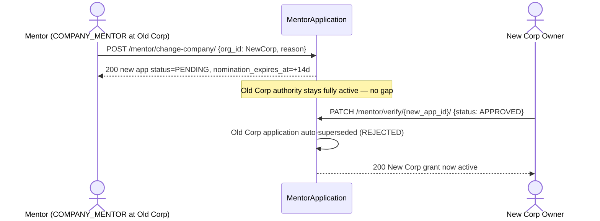
```mermaid
sequenceDiagram
    actor M as Mentor (COMPANY_MENTOR at Old Corp)
    participant MA as MentorApplication
    actor O as New Corp Owner

    M->>MA: POST /mentor/change-company/ {org_id: NewCorp, reason}
    MA-->>M: 200 new app status=PENDING, nomination_expires_at=+14d
    Note over MA: Old Corp authority stays fully active — no gap
    O->>MA: PATCH /mentor/verify/{new_app_id}/ {status: APPROVED}
    MA->>MA: Old Corp application auto-superseded (REJECTED)
    MA-->>O: 200 New Corp grant now active
```

### POST `mentor/change-company/`
- **Roles**: `@role_required` — must already be an approved mentor of some kind; there's no separate verifier role for this endpoint itself (it just creates a new PENDING application which then goes through the normal `mentor/verify/{id}/` tier-based authorization).
- **Constraints**: Requires `org_id`. Requires the caller to already have at least one APPROVED application (403 "You must have an approved mentor application to change your affiliation." otherwise) — the tier of that most-recent APPROVED application is preserved onto the new request; the caller cannot pick a different tier here, only a different org within their existing tier. Blocks a duplicate PENDING/APPROVED application for the same tier+new-org combo. Creates a new PENDING application with a 14-day nomination expiry, carrying over `preferred_ig_ids`. The mentor's **current** approved authority at their existing org is left untouched and only revoked once the new application is approved (via the supersession logic) — so there's no authority gap while the change request is pending; if rejected, the original affiliation is simply unaffected.
- **Usage Scenario**: A Company Mentor who changes employers submits a change-company request naming their new employer's org; they keep acting as a mentor for their old company until the new company's owner approves the new application, at which point the old approved application is automatically superseded/revoked and authority moves cleanly to the new org with zero downtime.
- **Request**:
```json
{
  "org_id": "new-org-uuid",
  "reason": "Relocating to a new employer"
}
```
- **Response `200`**:
```json
{
  "general_message": "Request to change affiliation to Acme Corp submitted successfully. It is pending approval.",
  "response": {"id": "new-app-uuid", "mentor_tier": "COMPANY_MENTOR", "org": "new-org-uuid"}
}
```
- **Error `403`**:
```json
{
  "general_message": "You must have an approved mentor application to change your affiliation."
}
```

---

## 22. Session Management

### Status state machine

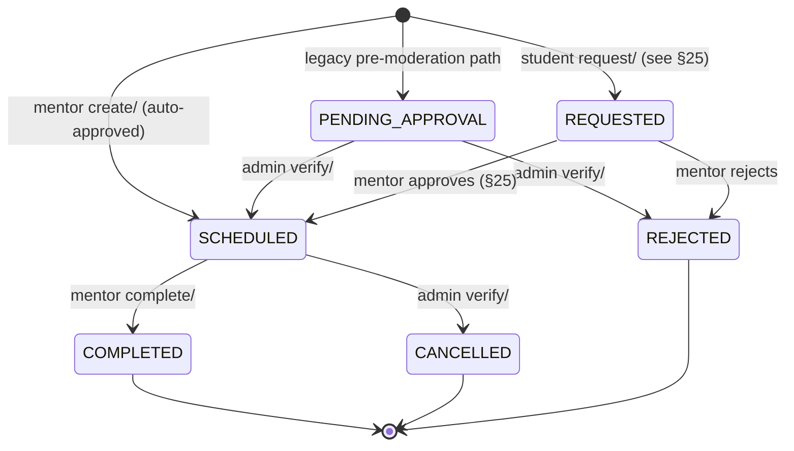
```mermaid
stateDiagram-v2
    [*] --> SCHEDULED: mentor create/ (auto-approved)
    [*] --> REQUESTED: student request/ (see §25)
    [*] --> PENDING_APPROVAL: legacy pre-moderation path
    PENDING_APPROVAL --> SCHEDULED: admin verify/
    PENDING_APPROVAL --> REJECTED: admin verify/
    REQUESTED --> SCHEDULED: mentor approves (§25)
    REQUESTED --> REJECTED: mentor rejects
    SCHEDULED --> COMPLETED: mentor complete/
    SCHEDULED --> CANCELLED: admin verify/
    COMPLETED --> [*]
    CANCELLED --> [*]
    REJECTED --> [*]
```

### Sequence — recurring session creation → completion

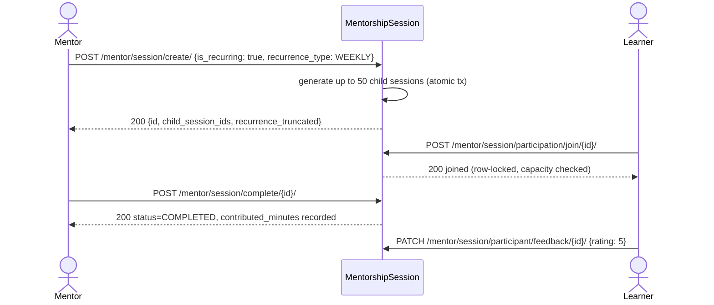
```mermaid
sequenceDiagram
    actor M as Mentor
    participant S as MentorshipSession
    actor L as Learner

    M->>S: POST /mentor/session/create/ {is_recurring: true, recurrence_type: WEEKLY}
    S->>S: generate up to 50 child sessions (atomic tx)
    S-->>M: 200 {id, child_session_ids, recurrence_truncated}
    L->>S: POST /mentor/session/participation/join/{id}/
    S-->>L: 200 joined (row-locked, capacity checked)
    M->>S: POST /mentor/session/complete/{id}/
    S-->>M: 200 status=COMPLETED, contributed_minutes recorded
    L->>S: PATCH /mentor/session/participant/feedback/{id}/ {rating: 5}
```

### POST `mentor/session/create/`
- **Roles**: Requires the static Mentor role plus an active mentor profile (403 "Your mentor account is deactivated. Please contact an administrator." otherwise). The caller must additionally hold a global `MENTOR`-scope grant, or an active grant of the scope matching `session_type` (`IG_MENTOR`/`CAMPUS_MENTOR`/`COMPANY_MENTOR`) for the given `entity_id`.
- **Constraints**: `session_type` and `entity_id` are required, or the request fails with "You do not have an active mentor grant for this {entity_type}." Duplicate sessions (same title + start time + entity + creator) are rejected. `starts_at` must be strictly before `ends_at`. Mode/venue rules apply: ONLINE sessions must not set `venue`; OFFLINE must not set `meeting_link`; HYBRID requires both. If `is_recurring=true`, `recurrence_type`, a positive `recurrence_interval`, and `recurrence_end_date` are all required. On save, the session is auto-approved (status=SCHEDULED immediately, no pending-approval gate). If recurring, child sessions are generated by walking DAILY/WEEKLY/MONTHLY steps, capped at 50 occurrences; if the cap is hit before reaching the requested end date, `recurrence_truncated=True` is returned.
- **Usage Scenario**: An approved IG mentor wants to run a weekly office-hours series for their Interest Group; they POST once with `is_recurring=true`, `recurrence_type=WEEKLY`, and an end date three months out, and the API immediately creates the parent session plus up to 50 weekly child sessions without the mentor having to create each occurrence by hand.
- **Request**:
```json
{
  "session_type": "IG_SESSION",
  "entity_id": "ig-uuid",
  "title": "Intro to React",
  "description": "Beginner-friendly walkthrough",
  "mode": "ONLINE",
  "starts_at": "2026-08-10T10:00:00Z",
  "ends_at": "2026-08-10T11:00:00Z",
  "meeting_link": "https://meet.example.com/abc",
  "max_participants": 20,
  "is_recurring": true,
  "recurrence_type": "WEEKLY",
  "recurrence_interval": 1,
  "recurrence_end_date": "2026-09-10"
}
```
- **Response `200`**:
```json
{
  "general_message": "Session created successfully.",
  "response": {
    "id": "session-uuid",
    "status": "SCHEDULED",
    "child_session_ids": ["s2", "s3", "s4"],
    "recurrence_truncated": false
  }
}
```
- **Error `400`**:
```json
{
  "general_message": "You do not have an active mentor grant for this IG."
}
```
```json
{
  "general_message": "Session start time must be before end time."
}
```

### GET `mentor/session/list/` and `mentor/session/list/{session_id}/`
- **Roles**: Static Mentor role required for both. No active-mentor check — a deactivated mentor can still view their own past sessions. Ownership is enforced in-view (`created_by_id=user_id`) rather than by permission class for the detail variant.
- **Constraints**: Scoped strictly to sessions the caller created; a mentor never sees another mentor's sessions through this endpoint. The list supports an optional `status` filter and pagination/search/sort. The detail variant 404s "Session not found." if the session isn't found, owned, or is soft-deleted.
- **Usage Scenario**: A mentor opens their dashboard's "My Sessions" tab and filters by `status=SCHEDULED` to see their upcoming sessions, or clicks into one to see full details (recurrence info, meeting link/venue, max participants) before editing or completing it.
- **Query**: `?status=SCHEDULED&sort_by=-starts_at`
- **Response `200`**:
```json
{
  "data": [
    {
      "id": "uuid", "entity_id": "ig-uuid", "entity_name": "AI/ML", "session_type": "IG_SESSION",
      "title": "Intro to React", "mode": "ONLINE", "starts_at": "2026-08-10T10:00:00Z",
      "ends_at": "2026-08-10T11:00:00Z", "status": "SCHEDULED", "max_participants": 20, "is_recurring": true
    }
  ],
  "pagination": {"page": 1, "per_page": 10, "total": 1}
}
```

### PATCH/DELETE `mentor/session/update/{session_id}/`

#### PATCH `mentor/session/update/{session_id}/`
- **Roles**: Static Mentor role plus active mentor profile required. Ownership requires `created_by_id=user_id`; no other mentor may edit the session even if they share scope over the same IG/org.
- **Constraints**: 404 if not found/owned. Editing is blocked outright if the session is COMPLETED, CANCELLED, or REJECTED ("Cannot edit a session that is {status}."). Re-validates `starts_at < ends_at` and the ONLINE/OFFLINE/HYBRID venue/meeting_link consistency rules, auto-clearing the now-irrelevant field on a mode switch. Editing a live session no longer reverts it to pending approval. If `apply_to_series=true` and the session is recurring, logistics fields (title/description/mode/venue/meeting_link/max_participants — explicitly NOT start/end times, which stay per-occurrence) are bulk-propagated to every other sibling session still in SCHEDULED status.
- **Usage Scenario**: A mentor running a recurring weekly session needs to change the Zoom link for all future occurrences at once; they PATCH the current occurrence with the new `meeting_link` and `apply_to_series=true`, and every other still-scheduled session in that series picks up the new link while each occurrence's own start/end time is left untouched.

#### DELETE `mentor/session/update/{session_id}/`
- **Roles**: Static Mentor role plus active mentor profile required. Ownership enforced the same way as PATCH — only the session's creator may delete it.
- **Constraints**: 404 if not found/owned. Deletion is a soft delete — the session is excluded from future list/detail/available queries but the row and its history remain. Unlike PATCH, there is no explicit status guard blocking deletion of a COMPLETED session.
- **Usage Scenario**: A mentor created a session by mistake or needs to cancel it entirely (as opposed to just cancelling — which is an admin-only status transition); they call DELETE to remove it from their own and students' session lists.

- **Request** (PATCH):
```json
{
  "title": "Intro to React (Updated)",
  "apply_to_series": true
}
```
- **Response `200`**:
```json
{
  "general_message": "Session updated successfully. Propagated to 3 other session(s) in the series."
}
```
- **DELETE Response `200`**:
```json
{
  "general_message": "Session deleted successfully."
}
```
- **Error `400`**:
```json
{
  "general_message": "Cannot edit a session that is completed/cancelled/rejected."
}
```

### POST `mentor/session/complete/{session_id}/`
- **Roles**: Static Mentor role plus active mentor profile required. Ownership enforced via the session's creator.
- **Constraints**: 404 if not found/owned. Only a session currently `SCHEDULED` can be completed — any other status returns "Only a scheduled session can be marked completed (current status: {status})." On success the session flips to COMPLETED, and the mentor's own participant link is updated to `attendance_status=ATTENDED` with `contributed_minutes` set to the session duration. This exists specifically so a mentor doesn't have to wait for the periodic status-transition job to auto-complete the session.
- **Usage Scenario**: Right after wrapping up a live mentoring session, the mentor taps "Mark Complete" in the dashboard instead of waiting for the nightly status-transition job, which immediately credits their own contributed-minutes record and unlocks feedback submission for attendees whose attendance the mentor also marks.
- **Request**: none.
- **Response `200`**:
```json
{
  "general_message": "Session marked as completed."
}
```
- **Error `400`**:
```json
{
  "general_message": "Only a scheduled session can be marked completed (current status: CANCELLED)."
}
```

### GET `mentor/session/available/`
- **Roles**: No role decorator beyond the class-level authentication check — any authenticated user (student, mentor, or otherwise) can call this; it's the learner-facing browse endpoint.
- **Constraints**: Returns only SCHEDULED, non-deleted sessions restricted by relevance to the caller: IG sessions where the user has an active IG link, campus sessions matching a college org the user is linked to, and ALL company sessions (open to every authenticated user regardless of company affiliation).
- **Usage Scenario**: A student browsing the mentorship section of the app sees a combined feed of upcoming sessions relevant to them — their IG's mentor office hours, their college's campus sessions, and any open company sessions — so they can decide which to join.
- **Response `200`**:
```json
{
  "data": [
    {"id": "uuid", "title": "Intro to React", "session_type": "IG_SESSION", "starts_at": "2026-08-10T10:00:00Z", "max_participants": 20}
  ],
  "pagination": {"page": 1, "per_page": 10, "total": 1}
}
```

### GET `mentor/session/admin/list/` (Admin)
- **Roles**: Static Admin role only — mentors, even global ones, cannot use this route.
- **Constraints**: No ownership filter — returns all non-deleted sessions system-wide. Supports optional `status` and `ig_id` filters (the latter also implicitly restricts to IG sessions).
- **Usage Scenario**: A platform admin audits all mentorship activity across every IG/campus/company to spot stale pending sessions or review session volume by status before deciding whether to cancel or moderate any of them.
- **Query**: `?status=SCHEDULED&ig_id={uuid}`
- **Response `200`**: same shape as `session/list/`, all mentors.

### PATCH `mentor/session/admin/verify/{session_id}/` (Admin)
- **Roles**: Static Admin role only.
- **Constraints**: Session must exist and not be soft-deleted. Only two admin transitions are allowed, enforced before the serializer even runs: `PENDING_APPROVAL → SCHEDULED` or `PENDING_APPROVAL → REJECTED` (legacy pre-moderation path), and `SCHEDULED → CANCELLED`. Any other requested status for the session's current state returns 400 "Invalid status transition for this session." If `apply_to_series=true` and the session is recurring, the same status change is bulk-applied to every sibling session sharing the same series root that is still in the *same pre-update source status*.
- **Usage Scenario**: An admin discovers a mentor is running a recurring IG session series that violates policy; they PATCH the parent session with `status=CANCELLED, apply_to_series=true` to cancel every remaining scheduled occurrence in one call instead of cancelling each child individually.
- **Request**:
```json
{
  "status": "CANCELLED",
  "apply_to_series": false
}
```
- **Response `200`**:
```json
{
  "general_message": "Session status updated to CANCELLED successfully."
}
```
- **Error `400`**:
```json
{
  "general_message": "Invalid status transition for this session."
}
```

---

## 23. Availability Slots

### GET `mentor/public/availability/{mentor_id}/` 🌐 Public-facing (auth required, any user)
- covered in §15.

### GET/POST `mentor/availability/`

#### GET `mentor/availability/`
- **Roles**: Static Mentor role required. No active-mentor check — a deactivated mentor can still view (but POST below blocks creation).
- **Constraints**: Scoped to the caller's own slots only — mentors cannot see each other's availability through this endpoint (see the separate public endpoint for that). Optional `ig_id` and `is_active` query filters.
- **Usage Scenario**: A mentor opens their "Availability" settings page to review the weekly time slots they've published for students to see when booking or requesting sessions.

#### POST `mentor/availability/`
- **Roles**: Static Mentor role plus active mentor profile required.
- **Constraints**: `ig` is optional on a slot — omitting it creates a mentor-level slot that applies across all the mentor's IGs. If an `ig` IS supplied, the caller must hold an active mentor assignment for that IG, else 403 "You are not assigned as a mentor for this Interest Group." Requires `start_time < end_time`, `weekday` between 1 (Monday) and 7 (Sunday), and if both given `valid_from <= valid_to`.
- **Usage Scenario**: A mentor sets up a recurring "Tuesdays 4-6pm" availability window either for a specific IG they mentor or generally, so students can see when the mentor is reachable before requesting a session.

- **POST Request**:
```json
{
  "ig": "ig-uuid",
  "weekday": 1,
  "start_time": "09:00:00",
  "end_time": "10:00:00",
  "timezone": "Asia/Kolkata",
  "is_active": true,
  "valid_from": "2026-08-01",
  "valid_to": "2026-12-31"
}
```
- **POST Response `200`**:
```json
{
  "general_message": "Availability slot created successfully.",
  "response": {"id": "slot-uuid", "weekday": 1, "start_time": "09:00:00", "end_time": "10:00:00"}
}
```
- **GET Response `200`**:
```json
{
  "data": [
    {"id": "uuid", "ig": "ig-uuid", "ig_name": "AI/ML", "weekday": 1, "start_time": "09:00:00", "end_time": "10:00:00", "is_active": true}
  ],
  "pagination": {"page": 1, "per_page": 10, "total": 1}
}
```
- **Error `403`**:
```json
{
  "general_message": "You are not assigned as a mentor for this Interest Group."
}
```

### GET/PATCH/DELETE `mentor/availability/{slot_id}/`

#### GET `mentor/availability/{slot_id}/`
- **Roles**: Static Mentor role, same view as list with `slot_id` supplied.
- **Constraints**: The slot must belong to the caller; otherwise 404 "Availability slot not found." — this also implicitly prevents a mentor from viewing another mentor's slot detail by ID guessing.
- **Usage Scenario**: A mentor clicks into one of their availability entries in the settings UI to review or prepare to edit its exact time window and validity dates.

#### PATCH `mentor/availability/{slot_id}/`
- **Roles**: Static Mentor role plus active mentor profile required. Ownership enforced via the caller's own slots.
- **Constraints**: 404 if not found/owned. Unlike POST, the PATCH path does not re-check IG mentor assignment when `ig` is changed — it only re-runs the field-level validation (start<end, weekday range, valid_from<=valid_to), resolving unspecified fields from the existing instance.
- **Usage Scenario**: A mentor adjusts their Tuesday office-hours slot to run 5-7pm instead of 4-6pm, or temporarily deactivates it (`is_active=false`) while on leave without deleting the record.

#### DELETE `mentor/availability/{slot_id}/`
- **Roles**: Static Mentor role plus active mentor profile required. Ownership via the caller's own slots.
- **Constraints**: 404 if not found/owned. This is a hard delete, not a soft delete — the row is permanently removed, unlike sessions which use a deleted flag.
- **Usage Scenario**: A mentor permanently removes an availability slot they no longer offer, e.g. after switching to a different weekly schedule.

- **PATCH Request**:
```json
{
  "is_active": false
}
```
- **PATCH Response `200`**:
```json
{
  "general_message": "Availability slot updated successfully.",
  "response": {"is_active": false}
}
```
- **DELETE Response `200`**:
```json
{
  "general_message": "Availability slot deleted successfully."
}
```
- **Error `404`**:
```json
{
  "general_message": "Availability slot not found."
}
```

---

## 24. Session Participation

### POST `mentor/session/participation/join/{session_id}/`
- **Roles**: No role decorator — any authenticated user can self-join a session they're eligible for; enforced purely through eligibility logic.
- **Constraints**: Row-locked to prevent race conditions on capacity checks. Session must be `SCHEDULED` ("Only scheduled sessions can be joined." otherwise). Eligibility mirrors the available-sessions visibility rule: IG sessions require an active IG link, campus sessions require a verified link to that college org, company sessions are open to everyone. If `max_participants` is set, the current participant count is compared against it and join is rejected once at/over capacity. Duplicate joins are blocked.
- **Usage Scenario**: A student sees an open IG mentorship session in their available-sessions feed and taps "Join"; the system verifies they're still an active IG member, checks the seat count under a row lock so two simultaneous joins can't both squeeze past capacity, and registers them as an invited mentee.
- **Request**: none.
- **Response `200`**:
```json
{
  "general_message": "Successfully joined the session.",
  "response": {"id": "link-uuid", "session_id": "uuid", "user_id": "uuid", "participant_role": "MENTEE", "attendance_status": "INVITED"}
}
```
- **Error `400`**:
```json
{
  "general_message": "Session has reached its maximum participant limit."
}
```
```json
{
  "general_message": "You have already joined this session."
}
```

### POST `mentor/session/participant/add/{session_id}/`
- **Roles**: Static Mentor role plus active mentor profile required. The session must additionally have been created by the calling mentor, else "You do not have permission to add participants to this session." — this is the mentor-initiated counterpart to self-join, restricted to the session owner (not just any mentor with matching scope).
- **Constraints**: Row-locked, same pattern as self-join. The target user is looked up by `muid` and must exist and not be suspended. Session must be `SCHEDULED`. Capacity check identical to self-join. Duplicate-participant check identical to self-join.
- **Usage Scenario**: A mentor wants to proactively add a specific student (who may not have discovered the session in their feed) to a session by their muid — e.g. inviting a mentee they're already coaching outside the platform's discovery flow.
- **Request**:
```json
{
  "muid": "student-muid"
}
```
- **Response `200`**:
```json
{
  "general_message": "Successfully added participant to the session.",
  "response": {"id": "link-uuid", "participant_role": "MENTEE", "attendance_status": "INVITED"}
}
```

### GET `mentor/session/participant/history/`
- **Roles**: No role decorator — any authenticated user, viewing only their own participation history (as either mentor or mentee links).
- **Constraints**: No status or ownership constraints beyond the implicit self-filter; returns every participation link the caller has (any role, any attendance status).
- **Usage Scenario**: A student or mentor reviews their full session history — including sessions they attended as a mentee, sessions they ran as a mentor, and past feedback/ratings — from a personal activity page.
- **Response `200`**:
```json
{
  "data": [
    {"id": "uuid", "session__title": "Intro to React", "participant_role": "MENTEE", "attendance_status": "ATTENDED"}
  ],
  "pagination": {"page": 1, "per_page": 10, "total": 1}
}
```

### GET `mentor/session/participant/list/{session_id}/`
- **Roles**: Static Mentor role. Ownership check in-view: the session must have been created by the caller, else 403 "You don't have permission to view participants for this session." — note this check does not also require the session to be non-deleted, unlike most other session lookups.
- **Constraints**: No further constraints; lists all participant rows for the session (mentor + all mentees, all attendance statuses).
- **Usage Scenario**: A mentor pulls up the roster for their upcoming or completed session to see who's joined, invited, or attended, ahead of running or grading the session.
- **Response `200`**:
```json
{
  "data": [
    {"id": "uuid", "user_full_name": "Learner One", "attendance_status": "INVITED"}
  ],
  "pagination": {"page": 1, "per_page": 10, "total": 1}
}
```
- **Error `403`**:
```json
{
  "general_message": "You don't have permission to view participants for this session."
}
```

### PATCH `mentor/session/participant/update/{link_id}/`
- **Roles**: Static Mentor role plus active mentor profile required. Ownership check via the participant link's parent session — only the session's own mentor/owner can update any participant's record on that session, not just any mentor.
- **Constraints**: 404 if the link doesn't exist. Editable fields are `attendance_status`, `progress_note`, `contributed_minutes`. `contributed_minutes`, when provided, must be strictly greater than zero. There is no server-side check that `attendance_status` transitions follow any particular order.
- **Usage Scenario**: After a session wraps up, the mentor marks each mentee's `attendance_status` as ATTENDED or NO_SHOW, logs a short progress note, and records how many minutes that mentee actually engaged, feeding into that mentee's participation record.
- **Request**:
```json
{
  "attendance_status": "ATTENDED",
  "progress_note": "Engaged well",
  "contributed_minutes": 30
}
```
- **Response `200`**:
```json
{
  "general_message": "Participant record updated successfully.",
  "response": {"attendance_status": "ATTENDED", "contributed_minutes": 30}
}
```
- **Error `400`**:
```json
{
  "general_message": "Contributed minutes must be greater than zero."
}
```

### PATCH `mentor/session/participant/feedback/{session_id}/`
- **Roles**: No role decorator — any participant (mentee or mentor) of the session can submit feedback for themselves; enforced purely by the participant-link lookup, not a role check.
- **Constraints**: The caller must already be a participant of the session, else 404 "You are not a participant of this session." — a participant can only submit feedback on their *own* link, never someone else's. At least one of `feedback` or `rating` must be supplied; `rating`, if provided, must be an integer 1-5. Critically, feedback can only be submitted if the caller's own attendance status is ATTENDED — any other status raises "You can only leave feedback for sessions you have attended."
- **Usage Scenario**: A mentee who was marked ATTENDED for a session logs back in afterward to rate the session 1-5 stars and leave written feedback about the mentor's guidance, which then feeds into the mentor's aggregate rating shown on their public profile.
- **Request**:
```json
{
  "feedback": "Great session!",
  "rating": 5
}
```
- **Response `200`**:
```json
{
  "general_message": "Feedback submitted successfully.",
  "response": {"feedback": "Great session!", "rating": 5}
}
```
- **Error `400`**:
```json
{
  "general_message": "You can only leave feedback for sessions you have attended."
}
```

---

## 25. Student Session Requests

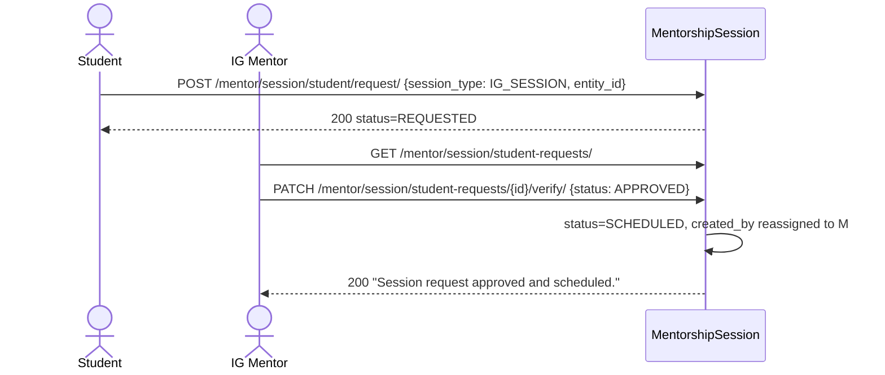
```mermaid
sequenceDiagram
    actor S as Student
    actor M as IG Mentor
    participant Sess as MentorshipSession

    S->>Sess: POST /mentor/session/student/request/ {session_type: IG_SESSION, entity_id}
    Sess-->>S: 200 status=REQUESTED
    M->>Sess: GET /mentor/session/student-requests/
    M->>Sess: PATCH /mentor/session/student-requests/{id}/verify/ {status: APPROVED}
    Sess->>Sess: status=SCHEDULED, created_by reassigned to M
    Sess-->>M: 200 "Session request approved and scheduled."
```

### POST `mentor/session/student/request/`
- **Roles**: No role decorator — any authenticated user (student/learner) can request a session; the only gate is entity membership, checked in the serializer, not a static role.
- **Constraints**: Only IG sessions are accepted — company/campus session types are explicitly rejected ("Only Interest Group sessions can be requested. Company- and campus-scoped sessions are not supported."). The requester must hold an active link to the target IG. `starts_at` must be strictly in the future and before `ends_at`. The same ONLINE/OFFLINE/HYBRID venue/meeting_link rules as session create apply. Duplicate-request guard blocks resubmitting an identical pending request. On success the session is created with `status=REQUESTED` and the student is immediately registered as an INVITED mentee.
- **Usage Scenario**: A student wants dedicated 1-on-1 time with a mentor from their Interest Group but sees no open slot on the calendar; they submit a request specifying a proposed time and topic, which then surfaces to IG mentors for approval.
- **Request**:
```json
{
  "session_type": "IG_SESSION",
  "entity_id": "ig-uuid",
  "title": "Need help with X",
  "mode": "ONLINE",
  "starts_at": "2026-08-15T10:00:00Z",
  "ends_at": "2026-08-15T11:00:00Z",
  "meeting_link": "https://meet.example.com/xyz"
}
```
- **Response `200`**:
```json
{
  "general_message": "Session request submitted successfully. A mentor will review your request shortly.",
  "response": {"id": "uuid", "status": "REQUESTED"}
}
```
- **Error `400`**:
```json
{
  "message": {
    "session_type": ["Only Interest Group sessions can be requested. Company- and campus-scoped sessions are not supported."]
  }
}
```

### GET `mentor/session/student/my-requests/`
- **Roles**: No role decorator — any authenticated user viewing their own submitted requests.
- **Constraints**: Filtered strictly to sessions the caller personally requested and not soft-deleted; optional `status` query filter.
- **Usage Scenario**: A student checks back on the status of a session they requested earlier to see whether a mentor has approved (now SCHEDULED, with possibly adjusted time/logistics) or rejected it.
- **Response `200`**:
```json
{
  "data": [
    {"id": "uuid", "title": "Need help with X", "status": "REQUESTED", "entity_name": "AI/ML"}
  ],
  "pagination": {"page": 1, "per_page": 10, "total": 1}
}
```

### GET `mentor/session/student-requests/`
- **Roles**: Static Mentor role. Visibility is scope-driven: a caller holding a global `MENTOR`-scope grant sees ALL requested sessions system-wide (admin-level visibility); any other mentor tier sees only IG session requests whose entity is one of the IGs they actively mentor — a company/campus mentor who also separately mentors an IG will see those IG requests too. A mentor with no active scopes at all sees nothing.
- **Constraints**: Only sessions in `status=REQUESTED` and not deleted are ever returned through this endpoint.
- **Usage Scenario**: An IG mentor checks their "Incoming Requests" queue each morning to see which students have asked for a session with them so they can approve or reject each one.
- **Response `200`**:
```json
{
  "data": [
    {"id": "uuid", "title": "Need help with X", "requested_by_name": "Learner One", "requested_by_muid": "learner-1", "entity_name": "AI/ML", "status": "REQUESTED"}
  ],
  "pagination": {"page": 1, "per_page": 10, "total": 1}
}
```

### PATCH `mentor/session/student-requests/{session_id}/verify/`
- **Roles**: Static Mentor role plus active mentor profile required. In-view scope check: a global MENTOR-scope holder may act on anything; any other mentor tier may only act on an IG session request for an IG they hold an active `IG_MENTOR` grant for — otherwise 403 "You do not have permission to act on this session request."
- **Constraints**: The session must currently be `REQUESTED` and not deleted, else 404 "Session request not found or is not in REQUESTED status." On approval: optional overrides for start/end/mode/meeting_link/venue are re-validated with the same rules as session create; the session transitions directly REQUESTED → SCHEDULED (mentor approval is the sole trust gate, no separate admin step), and ownership is reassigned to the approving mentor (so it now shows in their own session dashboard and can be edited/completed/deleted through the normal mentor session endpoints) while the original requester is permanently preserved for audit. On rejection: the session transitions REQUESTED → REJECTED with no other side effects.
- **Usage Scenario**: An IG mentor reviews a pending student request, decides the proposed time doesn't work, and approves it with an adjusted `starts_at`/`meeting_link` — the session immediately goes live as SCHEDULED under the mentor's own ownership, ready to be managed like any mentor-created session.
- **Request**:
```json
{
  "status": "APPROVED",
  "starts_at": "2026-08-16T10:00:00Z"
}
```
or
```json
{
  "status": "REJECTED"
}
```
- **Response `200`**:
```json
{
  "general_message": "Session request approved and scheduled. You can manage it from your sessions dashboard."
}
```
- **Error `404`**:
```json
{
  "general_message": "Session request not found or is not in REQUESTED status."
}
```

---

## 26. Task Management

*(Same status state machine as §7 — see diagram there.)*

### GET `mentor/tasks/ig-dropdown/`
- **Roles**: Static Mentor role only (no active-mentor check).
- **Constraints**: Returns only the Interest Groups where the caller has an active mentor assignment — used purely to populate a valid-IG selector on the task-creation form; no other business logic.
- **Usage Scenario**: When a mentor opens the "Submit a Task" form, the IG dropdown is populated from this endpoint so they can only pick an IG they're actually authorized to submit tasks for.
- **Response `200`**:
```json
[
  {"id": "ig-uuid-1", "name": "Cloud Computing"},
  {"id": "ig-uuid-2", "name": "AI/ML"}
]
```

### GET/POST `mentor/tasks/`

#### GET `mentor/tasks/`
- **Roles**: Static Mentor role only.
- **Constraints**: Filtered strictly to tasks the caller submitted — a mentor never sees another mentor's submitted tasks here. Optional `approval_status` filter.
- **Usage Scenario**: A mentor checks the status of tasks they've proposed for their IG — e.g. filtering to `approval_status=pending` to see which submissions are still awaiting admin review.

#### POST `mentor/tasks/`
- **Roles**: Static Mentor role plus active mentor profile required.
- **Constraints**: `ig` is a required, non-nullable field, and the caller must hold an active mentor assignment for that IG ("You are not assigned as a mentor for this Interest Group." otherwise). `hashtag` must be globally unique across all tasks. An optional `skill_ids` list replaces any existing skill links, silently skipping any id that isn't an active skill. Regardless of what the mentor submits, the task is force-saved with `approval_status='pending'` and `active=False` — it never goes live without admin approval.
- **Usage Scenario**: A mentor wants to add a new hands-on task to their IG's curriculum; they submit title, description, karma value, type/level, and relevant skills, and the task sits in a pending queue (invisible to learners) until an admin reviews and approves it.

- **POST Request**:
```json
{
  "hashtag": "#cloud-task-2",
  "title": "Build a Terraform module",
  "karma": 30,
  "usage_count": 1,
  "description": "Write reusable IaC module",
  "type": "task-type-uuid",
  "level": "level-uuid",
  "ig": "ig-uuid",
  "skill_ids": ["skill-uuid-1", "skill-uuid-2"]
}
```
- **POST Response `200`**:
```json
{
  "general_message": "Task submitted for approval."
}
```
- **GET Response `200`**:
```json
{
  "data": [
    {"id": "uuid", "hashtag": "#cloud-task-1", "title": "Deploy a serverless app", "karma": 50, "type": "Special", "ig": "Cloud Computing", "approval_status": "pending", "requested_by_name": "Jane Mentor", "skills": [{"id": "uuid", "name": "AWS", "code": "AWS"}]}
  ],
  "pagination": {"page": 1, "per_page": 10, "total": 1}
}
```
- **Error `400`**:
```json
{
  "message": {
    "ig": ["You are not assigned as a mentor for this Interest Group."]
  }
}
```

### GET `mentor/tasks/{task_id}/`
- **Roles**: Static Mentor role only.
- **Constraints**: The task must exist and be owned by the caller, else 404 "Task not found." — a mentor cannot view another mentor's submitted task through this route even if it's for a shared IG.
- **Usage Scenario**: A mentor opens one of their submitted tasks to review its full details, including linked skills, before deciding to edit it.
- **Response `200`**: single task object (owner only).
- **Error `404`**:
```json
{
  "general_message": "Task not found."
}
```

### PUT `mentor/tasks/{task_id}/`
- **Roles**: Static Mentor role plus active mentor profile required. Ownership via the caller's own submitted tasks.
- **Constraints**: 404 if not found/owned. Same field validation as create (`hashtag` uniqueness excluding self, `ig` must be one the mentor still actively mentors). Regardless of current `approval_status`, editing forces the task back to `approval_status='pending'`, `active=False`, and clears any prior rejection state — meaning even a previously-approved live task is deactivated and must be re-approved by an admin after any edit.
- **Usage Scenario**: A mentor notices a typo in a task they already got approved and fixes it; the fix automatically pulls the task off the live/active list and re-queues it for admin re-approval, so the correction can't silently bypass review.
- **Request**:
```json
{
  "title": "Build a Terraform module (updated)",
  "karma": 40,
  "skill_ids": ["skill-uuid-3"]
}
```
- **Response `200`**:
```json
{
  "general_message": "Task updated and re-submitted for approval."
}
```

### DELETE `mentor/tasks/{task_id}/`
- **Roles**: Static Mentor role plus active mentor profile required. Ownership via the caller's own submitted tasks.
- **Constraints**: 404 if not found/owned. Deletion is only permitted when the task is still `pending`; approved or rejected tasks return "Cannot delete a task with status '{approval_status}'. Only pending tasks can be deleted." — this is a hard delete, not a soft-delete/archive.
- **Usage Scenario**: A mentor submitted a task by mistake and wants to withdraw it before an admin reviews it; once it's been approved (and potentially already used by learners) it can no longer be deleted through this endpoint, only edited (which re-queues it) since deleting an approved/live task could orphan learner progress tied to it.
- **Response `200`**:
```json
{
  "general_message": "Task deleted successfully."
}
```
- **Error `400`**:
```json
{
  "general_message": "Cannot delete a task with status 'approved'. Only pending tasks can be deleted."
}
```

---

## 27. IG Opportunities

### Status state machine

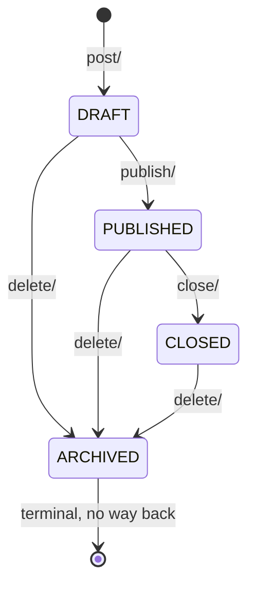
```mermaid
stateDiagram-v2
    [*] --> DRAFT: post/
    DRAFT --> PUBLISHED: publish/
    PUBLISHED --> CLOSED: close/
    DRAFT --> ARCHIVED: delete/
    PUBLISHED --> ARCHIVED: delete/
    CLOSED --> ARCHIVED: delete/
    ARCHIVED --> [*]: terminal, no way back
```

### GET/POST `mentor/opportunities/`

#### GET `mentor/opportunities/`
- **Roles**: Static Mentor role only. Visibility is scope-driven, not purely ownership-driven: results include opportunities the caller created, UNIONed with opportunities whose IG matches one of the caller's active `IG_MENTOR` grants, UNIONed with opportunities whose org matches one of the caller's active `COMPANY_MENTOR`/`CAMPUS_MENTOR` grants.
- **Constraints**: No status filter is applied server-side — all statuses (DRAFT/PUBLISHED/CLOSED/ARCHIVED) the caller manages are returned together.
- **Usage Scenario**: An IG mentor who also manages several posted internship/hackathon opportunities for their group opens their opportunities dashboard to see everything they've created or have scope authority over, across every lifecycle stage.

#### POST `mentor/opportunities/`
- **Roles**: Static Mentor role plus an active mentor profile (403 "Your mentor account is deactivated and cannot post opportunities." otherwise).
- **Constraints**: The request must supply at least one of `ig` or `org`. Authorization is scope-based and combinatorial: if only `ig` is given, the caller needs an active `IG_MENTOR` grant for it; if only `org` is given, the caller needs an active `COMPANY_MENTOR` or `CAMPUS_MENTOR` grant for it; if BOTH are given (a campus+IG opportunity), the caller must hold authority over BOTH simultaneously — otherwise 403 "You do not hold an active mentor grant for that IG/org." An opportunity is always force-created with `status=DRAFT` regardless of any status value in the payload.
- **Usage Scenario**: A company mentor wants to post a new internship opportunity for their organization's students; they submit title, description, eligibility, and an application URL, and the opportunity is created as an unpublished DRAFT that only they (and other mentors with matching scope) can see until they explicitly publish it.

- **POST Request**:
```json
{
  "ig": "ig-uuid",
  "type": "INTERNSHIP",
  "title": "Summer Internship 2026",
  "description": "3-month paid internship",
  "eligibility": "3rd/4th year students",
  "application_url": "https://example.com/apply",
  "starts_at": "2026-09-01T00:00:00Z",
  "ends_at": "2026-09-30T00:00:00Z"
}
```
- **POST Response `200`**:
```json
{
  "general_message": "Opportunity created successfully.",
  "response": {"id": "opp-uuid", "ig": "ig-uuid", "ig_name": "Cloud Computing", "type": "INTERNSHIP", "title": "Summer Internship 2026", "status": "DRAFT", "created_by_name": "Jane Mentor"}
}
```
- **GET Response `200`**:
```json
{
  "data": [
    {"id": "uuid", "title": "Summer Internship 2026", "type": "INTERNSHIP", "status": "DRAFT", "ig_name": "Cloud Computing"}
  ],
  "pagination": {"page": 1, "per_page": 10, "total": 1}
}
```
- **Error `403`**:
```json
{
  "general_message": "You do not hold an active mentor grant for that IG/org."
}
```

### GET `mentor/opportunities/{opportunity_id}/`
- **Roles**: Static Mentor role. Access requires the caller to either be the opportunity's creator, or hold an active `IG_MENTOR` grant matching its IG, or an active `COMPANY_MENTOR`/`CAMPUS_MENTOR` grant matching its org.
- **Constraints**: If the opportunity doesn't exist or the caller lacks management access, the response is a uniform 404 "Opportunity not found." (rather than a distinct 403), which avoids leaking the existence of opportunities the caller can't manage.
- **Usage Scenario**: A campus mentor who shares scope over an organization opens the detail view of an opportunity a colleague mentor posted for that same org, to review its full description and eligibility criteria before deciding to edit or close it.
- **Response `200`**: single opportunity object.
- **Error `404`**:
```json
{
  "general_message": "Opportunity not found."
}
```

### PATCH `mentor/opportunities/{opportunity_id}/`
- **Roles**: Static Mentor role plus an active mentor profile (403 "Your mentor account is deactivated and cannot edit opportunities." otherwise). Same management-access gate as GET (creator OR matching IG/org scope grant).
- **Constraints**: 404 if missing or access denied. Editable fields are limited to `title`, `description`, `eligibility`, `application_url`, `starts_at`, `ends_at` — `ig`, `org`, `type`, and `status` are not editable through this endpoint. Notably there is no status-based restriction — an opportunity can be edited regardless of whether it's DRAFT, PUBLISHED, or even CLOSED.
- **Usage Scenario**: A mentor updates the `application_url` or extends the `ends_at` deadline on an opportunity that's already published and actively receiving applicants, without needing to unpublish it first.
- **Request**:
```json
{
  "title": "Summer Internship 2026 (Extended)",
  "ends_at": "2026-10-15T00:00:00Z"
}
```
- **Response `200`**:
```json
{
  "general_message": "Opportunity updated successfully.",
  "response": {"title": "Summer Internship 2026 (Extended)", "ends_at": "2026-10-15T00:00:00Z"}
}
```

### DELETE `mentor/opportunities/{opportunity_id}/`
- **Roles**: Static Mentor role. Same management-access gate as GET/PATCH (no explicit active-mentor check on this particular route, unlike PATCH/publish/close).
- **Constraints**: 404 if missing or access denied. This is a soft "delete" — status is set to `ARCHIVED` (not removed from the database). There is no precondition on the opportunity's current status before archiving (a DRAFT, PUBLISHED, or CLOSED opportunity can all be archived directly).
- **Usage Scenario**: A mentor decommissions an opportunity that's no longer relevant (e.g. the internship program ended) so it stops appearing in their active management list and, being non-PUBLISHED, is already excluded from the public listing.
- **Response `200`**:
```json
{
  "general_message": "Opportunity archived successfully."
}
```

### POST `mentor/opportunities/{opportunity_id}/publish/`
- **Roles**: Static Mentor role plus an active mentor profile (403 "Your mentor account is deactivated and cannot publish opportunities." otherwise). Same management-access gate.
- **Constraints**: 404 if missing or access denied. Strict state-machine precondition: the opportunity must currently be `DRAFT`, else "Only draft opportunities can be published." On success, status flips to PUBLISHED.
- **Usage Scenario**: After finishing drafting an internship posting and double-checking the eligibility text, the mentor clicks "Publish" to make it visible on the public opportunities listing that any user can browse.
- **Request**: none.
- **Response `200`**:
```json
{
  "general_message": "Opportunity published successfully."
}
```
- **Error `400`**:
```json
{
  "general_message": "Only draft opportunities can be published."
}
```

### POST `mentor/opportunities/{opportunity_id}/close/`
- **Roles**: Static Mentor role plus an active mentor profile (403 "Your mentor account is deactivated and cannot close opportunities." otherwise). Same management-access gate.
- **Constraints**: 404 if missing or access denied. Strict state-machine precondition: the opportunity must currently be `PUBLISHED`, else "Only published opportunities can be closed." This completes the DRAFT → PUBLISHED → CLOSED → (ARCHIVED via delete) lifecycle; there is no code path that reopens a CLOSED opportunity back to PUBLISHED.
- **Usage Scenario**: Once an internship's application deadline passes or all slots are filled, the mentor closes the opportunity so it immediately disappears from the public listing while the record itself (and its application history) remains intact for their own records.
- **Response `200`**:
```json
{
  "general_message": "Opportunity closed successfully."
}
```
- **Error `400`**:
```json
{
  "general_message": "Only published opportunities can be closed."
}
```

### GET `mentor/opportunities/public/` 🌐 Public
- **Roles**: Fully public/unauthenticated endpoint, no login required.
- **Constraints**: Only opportunities with `status=PUBLISHED` are ever returned, further filtered to exclude expired ones — an opportunity is excluded once its `ends_at` has passed (opportunities with no `ends_at` are treated as never-expiring and always included); this expiry filtering exists client-side in the query because, unlike sessions and jobs, there is no periodic job that auto-transitions expired opportunities to CLOSED. Optional `ig_id` and `org_id` filters narrow the listing.
- **Usage Scenario**: A prospective applicant (who may not even have a MuLearn account) browses the public opportunities board filtered to a specific Interest Group or organization to find internships, hackathons, or other postings currently accepting applications.
- **Query**: `?ig_id={uuid}&org_id={uuid}`
- **Response `200`**:
```json
{
  "data": [
    {
      "id": "opp-uuid", "ig": "ig-uuid", "ig_name": "Cloud Computing", "type": "INTERNSHIP",
      "title": "Summer Internship 2026", "application_url": "https://example.com/apply",
      "starts_at": "2026-09-01T00:00:00Z", "ends_at": "2026-09-30T00:00:00Z", "status": "PUBLISHED"
    }
  ],
  "pagination": {"page": 1, "per_page": 10, "total": 1}
}
```

---

# Part C — Cross-Cutting Systems

## 28. Career Lab — Hiring Postings

A simpler, **admin-curated** external job board — no approval workflow, no applicant tracking, no company self-service (contrast with Company Jobs, §4). Admin roles: `Admins`, `Associate`.

```
Ongoing/Previous is DERIVED, not stored:
  lastdate >= today  → "ongoing"  (shown at /public/career-lab/ongoing/)
  lastdate <  today  → "previous" (shown at /public/career-lab/previous/)
```

### GET `/dashboard/career-lab/hiring/` (Admin/Associate)
- **Roles**: `@role_required([RoleType.ADMIN.value, RoleType.ASSOCIATE.value])` — a valid JWT plus one of the two roles ("Admins" or "Associate") is required.
- **Constraints**: Results are all postings ordered by most-recently-posted, run through a shared filter helper (status=ongoing/previous derived by comparing `lastdate` to today, plus optional organization/role/location/duration/title filters, vacancy and date-range filters that silently no-op on unparseable values) before pagination/search/sort.
- **Usage Scenario**: A Career Lab admin or associate opens the hiring-postings dashboard to review, filter, and paginate through the full set of postings (both ongoing and expired) before deciding what to edit, archive, or export.
- **Query**: `?status=ongoing&organization=Acme&min_vacancies=1`
- **Response `200`**:
```json
{
  "data": [
    {"id": "uuid", "role": "SDE Intern", "organization": "Acme Corp", "title": "Summer Internship", "lastdate": "2026-09-30", "vacancies": 5}
  ],
  "pagination": {"page": 1, "per_page": 10, "total": 1}
}
```

### POST `/dashboard/career-lab/hiring/`
- **Roles**: `@role_required([RoleType.ADMIN.value, RoleType.ASSOCIATE.value])`, same as GET — Admin or Associate only.
- **Constraints**: `role`, `organization`, and `lastdate` are required; `title`, `location`, `applylink`, `jdlink`, `duration`, `remuneration`, `vacancies`, `extracontent`, `posted_date` are optional. On save, `created_by`/`updated_by` are both stamped from the caller.
- **Usage Scenario**: A Career Lab admin manually adds a new external hiring/internship posting they've sourced (e.g. from a partner company email) so it appears on the public ongoing-hiring feed once its `lastdate` is in the future.
- **Request**:
```json
{
  "role": "SDE Intern",
  "organization": "Acme Corp",
  "title": "Summer Internship",
  "location": "Remote",
  "lastdate": "2026-09-30",
  "applylink": "https://apply.acme.com",
  "vacancies": 5
}
```
- **Response `200`**:
```json
{
  "general_message": "Hiring posting created successfully.",
  "response": {"id": "hiring-uuid", "role": "SDE Intern", "organization": "Acme Corp"}
}
```

### GET/PUT/DELETE `/dashboard/career-lab/hiring/{hiring_id}/`

#### GET `/dashboard/career-lab/hiring/{hiring_id}/`
- **Roles**: `@role_required([RoleType.ADMIN.value, RoleType.ASSOCIATE.value])`.
- **Constraints**: 404 "Hiring posting not found." if the id doesn't exist. Otherwise returns the full posting record.
- **Usage Scenario**: An admin clicks into a single posting from the list view to inspect its full details (e.g. before editing or verifying the apply link) without re-fetching the whole paginated list.

#### PUT `/dashboard/career-lab/hiring/{hiring_id}/`
- **Roles**: `@role_required([RoleType.ADMIN.value, RoleType.ASSOCIATE.value])`.
- **Constraints**: 404 if the id doesn't exist. Despite being a PUT, it is implemented as a **partial** update — omitted fields are left unchanged; only fields present in the payload are validated/applied. `updated_by` is re-stamped on every save, while `created_by`/`created_at` are untouched.
- **Usage Scenario**: An admin corrects a typo in a posting's title, extends its `lastdate` deadline, or updates the `applylink`/`vacancies` after the partner company sends updated details.

#### DELETE `/dashboard/career-lab/hiring/{hiring_id}/`
- **Roles**: `@role_required([RoleType.ADMIN.value, RoleType.ASSOCIATE.value])`.
- **Constraints**: 404 if missing; otherwise a hard delete — there is no soft-delete/status flag on the Hiring model, and no cascade to other tables.
- **Usage Scenario**: An admin permanently removes a duplicate or erroneously-entered posting, or purges a stale/expired listing that will never be needed again (as opposed to just letting it age into the "previous" bucket).

- **PUT Request** (partial):
```json
{
  "vacancies": 8
}
```
- **PUT Response `200`**:
```json
{
  "general_message": "Hiring posting updated successfully.",
  "response": {"vacancies": 8}
}
```
- **DELETE Response `200`**:
```json
{
  "general_message": "Hiring posting deleted successfully."
}
```
- **Error `404`**:
```json
{
  "general_message": "Hiring posting not found."
}
```

### GET `/dashboard/career-lab/hiring/csv/` — filtered CSV export (same query params as list).
- **Roles**: `@role_required([RoleType.ADMIN.value, RoleType.ASSOCIATE.value])`.
- **Constraints**: Applies the same filter logic as the list endpoint to the full postings table (no pagination — the entire matching set is exported) and streams it out as a CSV attachment.
- **Usage Scenario**: An admin exports the current hiring postings (optionally filtered, e.g. only "previous"/expired ones) to hand off to another team, archive offline, or as the basis for a bulk edit-then-reimport workflow via the CSV POST endpoint.

### POST `/dashboard/career-lab/hiring/csv/`
- **Roles**: `@role_required([RoleType.ADMIN.value, RoleType.ASSOCIATE.value])`.
- **Constraints**: Requires a `file`; missing file returns "No CSV file provided." Decoded as UTF-8-with-BOM tolerant; a decode failure returns an error. System-generated columns (`id`, `created_by`, `created_at`, `updated_by`, `updated_at`) are stripped from each row if present, so a previously-exported CSV can be re-imported unchanged. This is **create-only — existing rows are never updated**, so re-importing an exported CSV always creates duplicates rather than upserting. Each row is validated independently; valid rows are saved immediately, invalid rows are collected with row numbers (starting at 2, accounting for the header) without aborting the whole import. The response always returns success with `{"created": n, "errors": [...]}`  — a CSV with all-invalid rows still "succeeds" with `created=0` and a populated errors array.
- **Usage Scenario**: An admin bulk-uploads a spreadsheet of dozens of new postings collected from partner companies (e.g. at the start of a placement season) instead of creating them one at a time, then reviews the per-row `errors` array to fix and re-upload just the rows that failed validation.
- **Request**: multipart `file` field (CSV with columns `posted_date,role,organization,title,location,lastdate,applylink,jdlink,duration,remuneration,vacancies,extracontent`).
- **Response `200`**:
```json
{
  "general_message": "Imported 42 hiring posting(s).",
  "response": {
    "created": 42,
    "errors": [
      {"row": 7, "errors": {"lastdate": ["This field is required."]}}
    ]
  }
}
```

### GET `/public/career-lab/ongoing/` 🌐 Public
- **Roles**: Fully public — no authentication or role check of any kind.
- **Constraints**: Queryset is derived, not stored — a posting is "ongoing" purely by comparing today's date to `lastdate`, with no separate status column. Includes `applylink`/`jdlink` (needed so a visitor can act on the posting) but **omits `extracontent`**; there is no pagination on this endpoint (unlike the previous-hiring public endpoint) — the full filtered list is returned in one response.
- **Usage Scenario**: An anonymous visitor to the public careers/job-board page browses currently-open hiring postings and clicks through via `applylink`/`jdlink` to apply — no mulearn account needed.
- **Response `200`**:
```json
{
  "data": [
    {"id": "uuid", "role": "SDE Intern", "organization": "Acme Corp", "title": "Summer Internship", "location": "Remote", "lastdate": "2026-09-30", "applylink": "https://...", "jdlink": "https://..."}
  ],
  "pagination": {"page": 1, "per_page": 10, "total": 1}
}
```

### GET `/public/career-lab/previous/` 🌐 Public
- **Roles**: Fully public — no authentication required.
- **Constraints**: Queryset is the strict complement of "ongoing" (`lastdate < today` vs `lastdate >= today`), so every posting falls into exactly one bucket with no gap or overlap. **Omits `applylink`/`jdlink`** (an expired posting shouldn't invite applications) but **includes `extracontent`** (e.g. archival notes) — the inverse field selection from the ongoing serializer. Unlike the ongoing endpoint, this one **is paginated**.
- **Usage Scenario**: A visitor or researcher browses the public archive of past/expired hiring postings (e.g. to see what kinds of roles a company has historically posted), paging through results since the archive can grow large over time.
- **Response `200`**:
```json
{
  "data": [
    {"id": "uuid", "role": "SDE Intern", "organization": "Acme Corp", "title": "Summer Internship 2025", "location": "Remote", "lastdate": "2025-09-30", "extracontent": "..."}
  ],
  "pagination": {"page": 1, "per_page": 10, "total": 1}
}
```

---

## 29. Interest Group (IG) Core Integration

```
Company IG-Sponsorship (§10) ──┐
                                 ├──▶ InterestGroup ◀──── Mentor IG-Opportunities (§27)
Admin/IGLead activate/deactivate┘         │
                                            └── media_content_links (read-only, auto-populated)
```

### POST `/dashboard/ig/{pk}/activate/`
- **Roles**: `@role_required([RoleType.ADMIN.value, RoleType.IG_LEAD.value])` — Admin or the platform-wide "IG Lead" role. This is the global IG Lead role, not the per-IG dynamic `"{code} IGLead"` role used elsewhere — a per-IG lead who only holds that dynamic role cannot activate/deactivate via this endpoint.
- **Constraints**: 404-style failure if `pk` doesn't resolve. Guard: if the IG is already active, returns "Interest Group is already active" without modifying anything (idempotency guard, not a silent no-op success). Otherwise flips status to active. No notification is fired on activate/deactivate (unlike IG create/update/delete).
- **Usage Scenario**: An admin or the org-wide IG Lead re-enables an Interest Group that had been paused/deactivated (e.g. after resolving whatever caused it to be deactivated), making it visible again wherever active-only IG lists are surfaced.
- **Request**: none.
- **Response `200`**:
```json
{
  "general_message": "AI/ML activated"
}
```
- **Error `400`**:
```json
{
  "general_message": "Interest Group is already active"
}
```
- **Error `404`**:
```json
{
  "general_message": "Interest Group not found"
}
```

### POST `/dashboard/ig/{pk}/deactivate/`
- **Roles**: Same as activate — Admin or the global "IG Lead" role.
- **Constraints**: 404-style failure if missing. Guard: if the IG is already inactive, returns "Interest Group is already inactive" with no change. Deactivating does **not** cascade to members/mentors/leads — membership links, mentor grants, and per-IG lead roles are all left untouched; it only flips the status flag, which downstream consumers use to filter it out of "active" views.
- **Usage Scenario**: An admin or the IG Lead role takes down an Interest Group that's gone dormant or is being restructured, hiding it from the public/active IG listing without deleting its data, members, or associated roles (which a full delete would remove).
- **Response `200`**:
```json
{
  "general_message": "AI/ML deactivated"
}
```
- **Error `400`**:
```json
{
  "general_message": "Interest Group is already inactive"
}
```

### GET `/dashboard/ig/` (context)
- **Roles**: No `@role_required` decorator on this method — any authenticated user (any role, or no special role at all) can call this. This is broader than POST/PUT/DELETE on the same class, which are all restricted to Admin/IG Lead.
- **Constraints**: Returns **all** Interest Groups regardless of status (active/inactive/requested/cancelled/rejected all included — no implicit filter), annotated with a member count (every membership link regardless of assignment type or active flag). No per-IG role filtering is applied to the listing itself.
- **Usage Scenario**: Any logged-in user (e.g. viewing an admin-style IG management table, or a mentor wanting to browse all groups including inactive/requested ones) fetches the full, unfiltered roster of Interest Groups with member counts — distinct from the public IG listing, which only surfaces active ones to anonymous/general users.
- **Response `200`**:
```json
{
  "data": [
    {
      "id": "uuid", "name": "AI/ML", "code": "AIML", "status": "active", "category": "coder",
      "is_sponsored": true, "sponsor_company_name": "Acme Corp", "sponsor_company_logo": "https://...",
      "media_content_links": [
        {"id": "uuid", "media_content_id": "uuid", "content_type": "video", "title": "Recorded session", "date": "2026-07-15"}
      ]
    }
  ],
  "pagination": {"page": 1, "per_page": 10, "total": 1}
}
```

---

## 30. Roles & Permissions

```
POST /dashboard/roles/user-role/  {role: "Mentor", mentor_tier, ig_ids/org_id}
   └─▶ UserMentor upsert + MentorApplication(APPROVED) + MentorScopeGrant + Mentor role granted

POST /dashboard/roles/user-role/  {role: "Company", company_name, company_description}
   └─▶ Company(verified) + Organization + UserOrganizationLink(verified) — admin-driven equivalent of register→verify

DELETE /dashboard/roles/user-role/  {user_id, role_id}
   └─▶ role-specific cleanup cascade (same _deactivate_company helper as §2 for Company)
```

### POST `/dashboard/roles/user-role/`
- **Roles**: `@role_required([RoleType.ADMIN.value])` — Admin only.
- **Constraints**: Always required: `user_id`, `role_id`. Conditionally required based on the resolved role title: if **Mentor**, `mentor_tier` is required; for `IG_MENTOR` tier, `ig_ids` is required; for `CAMPUS_MENTOR`/`COMPANY_MENTOR`, `org_id` is required and must reference an org of the matching type. If **Intern**, `guild` is required. If **Company**, both `company_name` and `company_description` are required. If a role link for that user+role already exists it's reused rather than erroring. For **Mentor**: a mentor profile is get-or-created, then an approved application is get-or-created — for **Company**: get-or-creates a `Company` row immediately set to `verified` status, a matching Organization, and a verified org link, bypassing the normal company self-registration/verification flow entirely. For **Intern**: get-or-creates/reactivates a guild link.
  > ⚠️ **Known bug**: the Mentor-assignment branch calls `MentorApplication.objects.get_or_create(..., tier=mentor_tier, ...)`, but the model field is actually named `mentor_tier` — there is no `tier` field, so this raises a `FieldError` at runtime for every Mentor-role assignment through this endpoint (i.e. `role=Mentor` with a `mentor_tier` value currently cannot succeed via this path). The Company and Intern branches are unaffected.
- **Usage Scenario**: A platform admin directly grants a user a role that normally requires an application/verification workflow — e.g. instantly making someone a Company Mentor for a specific organization, or onboarding an intern into a guild — bypassing the standard apply-then-admin-approve flow for cases like migrating existing data or handling an out-of-band arrangement.
- **Request (mentor)**:
```json
{
  "user_id": "uuid",
  "role_id": "mentor-role-uuid",
  "mentor_tier": "IG_MENTOR",
  "ig_ids": ["ig-uuid"]
}
```
- **Request (company)**:
```json
{
  "user_id": "uuid",
  "role_id": "company-role-uuid",
  "company_name": "Acme Corp",
  "company_description": "Cloud infra company"
}
```
- **Response `200`**:
```json
{
  "message": "Role Added Successfully",
  "mentor_profile_created": true
}
```
(or `"company_created": true` for the company path)

### DELETE `/dashboard/roles/user-role/`
- **Roles**: `@role_required([RoleType.ADMIN.value])` — Admin only.
- **Constraints**: Reads `user_id`/`role_id` from the request body. 404 "Role link not found." if no matching link exists. Otherwise deletes the role link and runs role-specific cleanup: for **Mentor**, every APPROVED application for that user is flipped to REJECTED and its active scope grants deactivated; for **Intern**, all guild links for the user are deactivated; for **Company**, the user's verified Company row is deactivated via the same helper used by the dedicated company self/admin-deactivation endpoints (§2), so this path stays consistent with that surface rather than duplicating ad hoc logic.
  > ⚠️ **Known bug**: the Mentor-cleanup branch, when the deleted role belonged to a user with an approved IG_MENTOR application, references a variable (`ig_scope_ids`) that is never defined anywhere in the function — this raises a `NameError` at runtime, which rolls back the entire transaction (nothing is removed, including the role link itself) since it's all inside one atomic block. In practice, deleting a Mentor role from an IG_MENTOR-approved user currently fails outright rather than succeeding.
- **Usage Scenario**: An admin revokes a role they (or another admin) previously granted — e.g. offboarding a Company user (which cascades to deactivating their company profile and co-admin links) or removing someone's Intern-guild access — reversing the provisioning that `POST /dashboard/roles/user-role/` set up, though for Mentor roles with an IG_MENTOR tier this currently fails outright due to the bug above.
- **Request**:
```json
{
  "user_id": "uuid",
  "role_id": "mentor-role-uuid"
}
```
- **Response `200`**:
```json
{
  "general_message": "User Role deleted successfully"
}
```
- **Error `404`**:
```json
{
  "general_message": "Role link not found."
}
```

### GET `/dashboard/roles/` (Admin only, context)
- **Roles**: `@role_required([RoleType.ADMIN.value])` — Admin only.
- **Constraints**: Returns all defined roles, paginated/searchable/sortable, including a `members` count computed as only **verified** role links — unverified/pending links are excluded from the count.
- **Usage Scenario**: A platform admin opens the Roles management screen to see every role defined in the system (built-in like Admin/Mentor/Company plus dynamically created ones like per-IG lead roles) along with how many verified members each holds, as a starting point for editing, deleting, or drilling into a role's member list.
- **Response `200`**:
```json
{
  "data": [
    {"id": "uuid", "title": "Mentor", "description": "...", "members": 120}
  ],
  "pagination": {"page": 1, "per_page": 10, "total": 30}
}
```

---

# End-to-End Sequence Diagrams

### A. Company onboarding → first hire

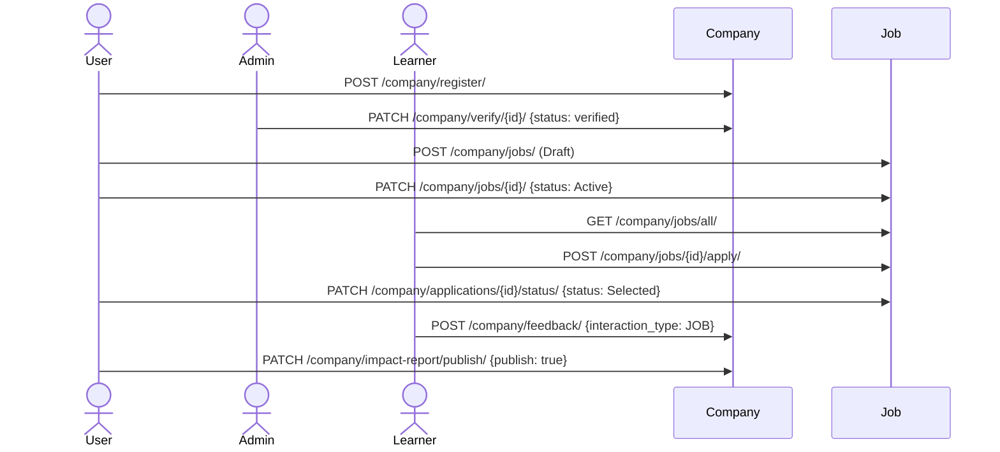
```mermaid
sequenceDiagram
    actor U as User
    actor A as Admin
    actor L as Learner
    participant C as Company
    participant J as Job

    U->>C: POST /company/register/
    A->>C: PATCH /company/verify/{id}/ {status: verified}
    U->>J: POST /company/jobs/ (Draft)
    U->>J: PATCH /company/jobs/{id}/ {status: Active}
    L->>J: GET /company/jobs/all/
    L->>J: POST /company/jobs/{id}/apply/
    U->>J: PATCH /company/applications/{id}/status/ {status: Selected}
    L->>C: POST /company/feedback/ {interaction_type: JOB}
    U->>C: PATCH /company/impact-report/publish/ {publish: true}
```

### B. Mentor-sourced job needing approval

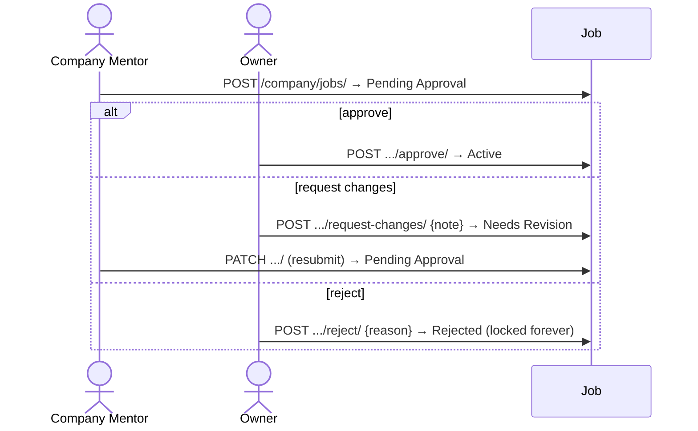
```mermaid
sequenceDiagram
    actor CM as Company Mentor
    actor O as Owner
    participant J as Job

    CM->>J: POST /company/jobs/ → Pending Approval
    alt approve
        O->>J: POST .../approve/ → Active
    else request changes
        O->>J: POST .../request-changes/ {note} → Needs Revision
        CM->>J: PATCH .../ (resubmit) → Pending Approval
    else reject
        O->>J: POST .../reject/ {reason} → Rejected (locked forever)
    end
```

### C. Mentor application → running a session → getting rated

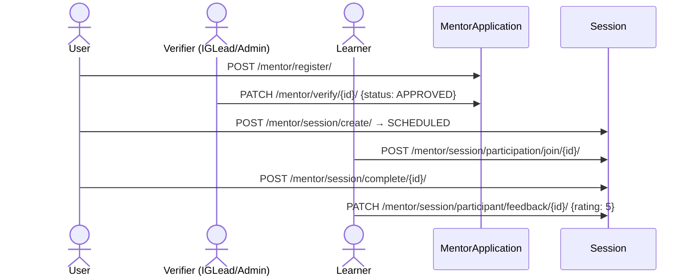
```mermaid
sequenceDiagram
    actor U as User
    actor V as Verifier (IGLead/Admin)
    actor L as Learner
    participant MA as MentorApplication
    participant S as Session

    U->>MA: POST /mentor/register/
    V->>MA: PATCH /mentor/verify/{id}/ {status: APPROVED}
    U->>S: POST /mentor/session/create/ → SCHEDULED
    L->>S: POST /mentor/session/participation/join/{id}/
    U->>S: POST /mentor/session/complete/{id}/
    L->>S: PATCH /mentor/session/participant/feedback/{id}/ {rating: 5}
```

### D. Student requests a session instead of waiting for one

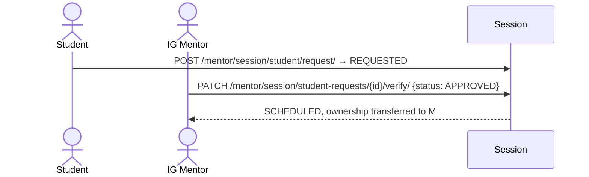
```mermaid
sequenceDiagram
    actor S as Student
    actor M as IG Mentor
    participant Sess as Session

    S->>Sess: POST /mentor/session/student/request/ → REQUESTED
    M->>Sess: PATCH /mentor/session/student-requests/{id}/verify/ {status: APPROVED}
    Sess-->>M: SCHEDULED, ownership transferred to M
```

### E. Company sponsors an IG, then posts an opportunity through a company-mentor

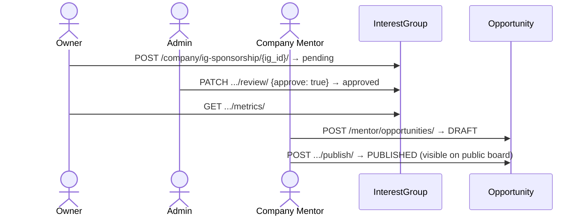
```mermaid
sequenceDiagram
    actor O as Owner
    actor A as Admin
    actor CM as Company Mentor
    participant IG as InterestGroup
    participant Opp as Opportunity

    O->>IG: POST /company/ig-sponsorship/{ig_id}/ → pending
    A->>IG: PATCH .../review/ {approve: true} → approved
    O->>IG: GET .../metrics/
    CM->>Opp: POST /mentor/opportunities/ → DRAFT
    CM->>Opp: POST .../publish/ → PUBLISHED (visible on public board)
```

### F. Revoking mentor authority (three triggers, one outcome)

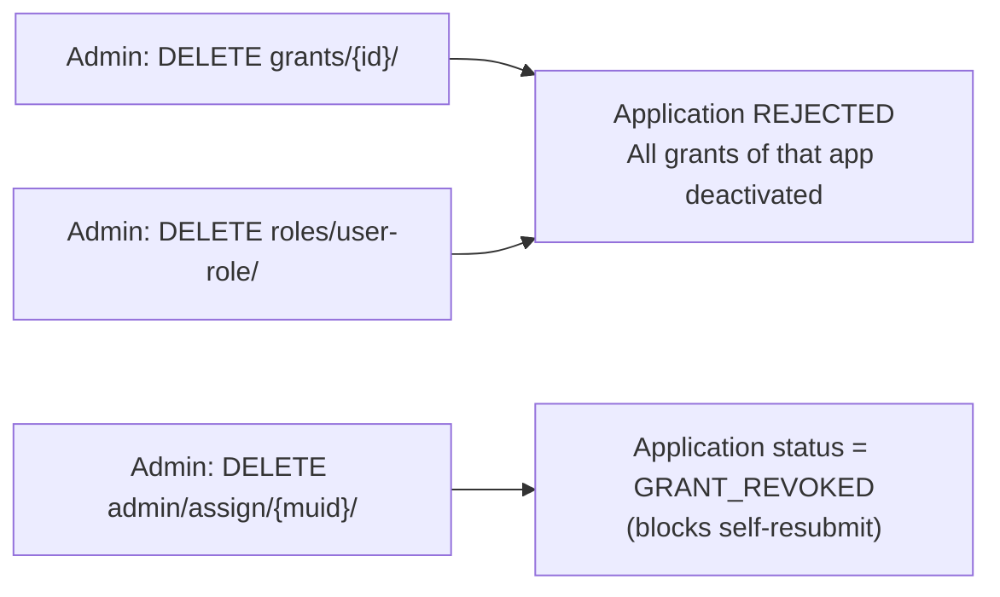
```mermaid
flowchart LR
    A["Admin: DELETE grants/{id}/"] --> X["Application REJECTED\nAll grants of that app deactivated"]
    B["Admin: DELETE admin/assign/{muid}/"] --> Y["Application status = GRANT_REVOKED\n(blocks self-resubmit)"]
    C["Admin: DELETE roles/user-role/"] --> X
```

---

# Key Data Model Reference

| Model | Key fields | Notes |
|---|---|---|
| `Company` (`db/company.py`) | `status` (`pending\|verified\|rejected\|deactivated`), unique `name`/`slug`, `org` FK (set on verify), `publish_impact_report` | One owner (`company_user`) + up to 5 accepted co-admins |
| `CompanyAdminLink` | unique `(company, user)`, `status` (`Pending\|Accepted\|Declined\|Revoked`) | Only `Accepted` grants authority |
| `CompanyTalentShortlist` | unique `(company, user)` | |
| `CompanyFeedback` | unique `(company, interaction_type, entity_id, submitted_by)`, `rating` 1–5 | Polymorphic `entity_id` per `interaction_type` |
| `Collaboration` | `collab_type`, `target_type` (`IG\|CAMPUS`), `status` (`OPEN\|PENDING\|ACCEPTED\|DECLINED\|WITHDRAWN`) | Polymorphic `target_org_id` |
| `CompanyJob` | `status` (`Draft\|Pending Approval\|Needs Revision\|Active\|Closed\|Expired\|Rejected`), `total_views`, `expires_at` (auto-expired daily via Celery) | |
| `CompanyJobRule` | `rule_type` (`min_karma\|max_karma\|min_level\|max_level\|skill\|degree\|...`), `rule_value` (string) | Drives computed `eligibility` on `jobs/all/` |
| `UserJobApplication` | unique `(job, user)`, `status` free string | |
| `MentorApplication` (`db/user.py`) | `mentor_tier` (`IG_MENTOR\|MENTOR\|COMPANY_MENTOR\|CAMPUS_MENTOR`), `status` (`PENDING\|APPROVED\|REJECTED\|GRANT_REVOKED`), `preferred_ig_ids` (JSON), `nomination_expires_at` (auto-reject via Celery when overdue) | One row per tier per user |
| `UserMentor` | OneToOne on `user`, `is_active` (global kill-switch), `about/expertise/hours` | One profile regardless of tier count |
| `MentorScopeGrant` | `application` FK, `scope_type`, `scope_id`, `is_active`, `expires_at` (auto-revoke via Celery) | Actual source of authority |
| `MentorshipSession` (`db/mentor.py`) | `session_type` (`IG_SESSION\|CAMPUS_SESSION\|COMPANY_SESSION`), `status` (`REQUESTED\|PENDING_APPROVAL\|SCHEDULED\|COMPLETED\|CANCELLED\|REJECTED`), `is_recurring`, `parent_session_id` | |
| `MentorshipSessionUserLink` | `participant_role` (`MENTOR\|MENTEE`), `attendance_status`, `rating`, `contributed_minutes` | |
| `MentorAvailabilitySlot` | `weekday` (1–7), `start_time`/`end_time`, `valid_from`/`valid_to` | |
| `IgOpportunity` (`db/mentor.py`) | `type` (`CHALLENGE\|INTERNSHIP\|HACKATHON\|JOB`), `status` (`DRAFT\|PUBLISHED\|CLOSED\|ARCHIVED`) | Requires `ig` and/or `org` |
| `TaskList` (`db/task.py`) | `approval_status` (`approved\|pending\|rejected\|changes_requested`), `active`, `submitted_by_company`, globally-unique `hashtag` (never recycled) | Shared by Company and Mentor task-submission flows |
| `InterestGroup` (`db/task.py`) | `status` (`active\|inactive\|requested\|cancelled\|rejected`), `sponsor_status`/`sponsor_company` | |
| `Hiring` (`db/career_lab.py`) | `lastdate` (drives ongoing/previous), no status field | Admin-curated, no approval workflow |
