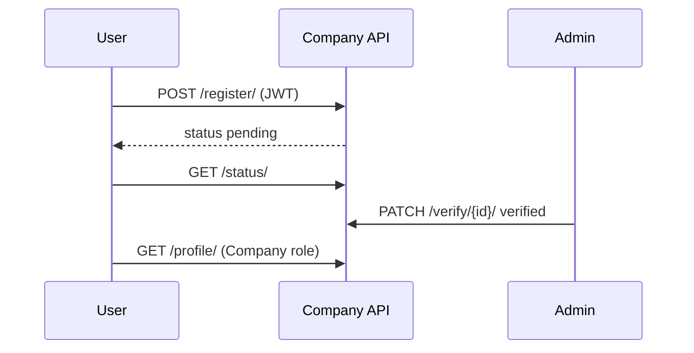
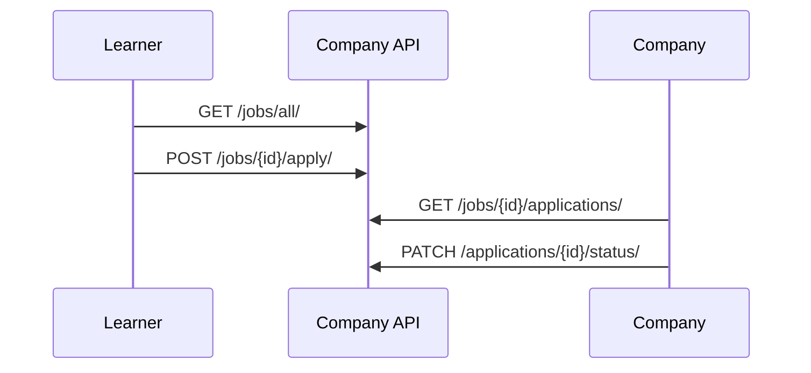

# Dashboard — Company API

**Base path:** `/api/v1/dashboard/company/`  
**Source:** `api/dashboard/company/`  
**OpenAPI tag:** `Dashboard - Company`, `Dashboard - Company Jobs`, `Dashboard - Company Analytics`, `Public - Company`, `Public - Jobs`

---

## Table of Contents

| # | Endpoint | Method(s) | Auth / Role |
|---|----------|-----------|-------------|
| 1 | [`register/`](#1-register) | `POST`, `PATCH` | Authenticated user |
| 2 | [`status/`](#2-status) | `GET` | Authenticated user |
| 3 | [`profile/`](#3-profile) | `GET`, `PATCH` | Company |
| 4 | [`profile/public/<slug>/`](#4-profilepublicslug) | `GET` | None (public) |
| 5 | [`profile/public/<slug>/jobs/`](#5-profilepublicslugjobs) | `GET` | None (public) |
| 6 | [`list/`](#6-list) | `GET` | Admin |
| 7 | [`<company_id>/`](#7-company_id) | `GET` | Admin |
| 8 | [`verify/<company_id>/`](#8-verifycompany_id) | `PATCH` | Admin |
| 9 | [`jobs/`](#9-jobs) | `GET`, `POST` | Company |
| 10 | [`jobs/all/`](#10-jobsall) | `GET` | Authenticated user |
| 11 | [`jobs/<job_id>/`](#11-jobsjob_id) | `GET`, `PATCH`, `DELETE` | Company |
| 12 | [`jobs/<job_id>/apply/`](#12-jobsjob_idapply) | `POST` | Authenticated user |
| 13 | [`jobs/<job_id>/applications/`](#13-jobsjob_idapplications) | `GET` | Company |
| 14 | [`applications/me/`](#14-applicationsme) | `GET` | Authenticated user |
| 15 | [`applications/<app_id>/status/`](#15-applicationsapp_idstatus) | `PATCH` | Company |
| 16 | [`applications/<app_id>/withdraw/`](#16-applicationsapp_idwithdraw) | `DELETE` | Authenticated user (owner) |
| 17 | [`applications/<app_id>/resubmit/`](#17-applicationsapp_idresubmit) | `PATCH` | Authenticated user (owner) |
| 18 | [`mulearners/`](#18-mulearners) | `GET` | Company |
| 19 | [`analytics/gigs/`](#19-analyticsgigs) | `GET` | Company |

---

## Overview

### Response envelope

All endpoints return a `CustomResponse` wrapper:

**Success:**

```json
{
  "hasError": false,
  "statusCode": 200,
  "message": { "general": ["Human-readable success message"] },
  "response": {}
}
```

**Failure:**

```json
{
  "hasError": true,
  "statusCode": 400,
  "message": {
    "general": ["Error summary"],
    "field_name": ["Validation detail"]
  },
  "response": {}
}
```

HTTP status codes follow `statusCode` in the body (typically `400` or `404` on failure).

### Authentication

Most endpoints require a JWT:

```http
Authorization: Bearer <access_token>
```

Exceptions are noted per endpoint (`permission_classes = []`).

### Pagination & search

List endpoints use `CommonUtils.get_paginated_queryset`:

| Query param | Default | Description |
|-------------|---------|-------------|
| `pageIndex` | `1` | Page number |
| `perPage` | `10` | Items per page |
| `search` | — | Case-insensitive search (fields vary per endpoint) |
| `sortBy` | — | Sort key; prefix with `-` for descending |

**Paginated response shape:**

```json
{
  "response": {
    "data": [],
    "pagination": {
      "count": 42,
      "totalPages": 5,
      "isNext": true,
      "isPrev": false,
      "nextPage": 2
    }
  }
}
```

### Company lifecycle

| `status` value | Meaning |
|----------------|---------|
| `pending` | Awaiting admin verification |
| `verified` | Approved; `Company` role assigned; profile endpoints available |
| `rejected` | Rejected; can PATCH `register/` to resubmit |

---

## 1. `register/`

**`POST /api/v1/dashboard/company/register/`**

Submit a new company registration for the authenticated user. One registration per user.

**Roles:** Any authenticated user (no `Company` role required yet)

**Request body:**

```json
{
  "name": "Acme Labs",
  "logo": "https://cdn.example.com/logo.png",
  "description": "We build developer tools for campuses.",
  "short_pitch": "A short pitch under 150 words.",
  "industry_sector": "Technology",
  "website_link": "https://acme.com",
  "email": "contact@acme.com",
  "location": "Kochi, Kerala",
  "district_id": "district-uuid",
  "state_id": "state-uuid",
  "country_id": "country-uuid",
  "legal_name": "Acme Labs Pvt Ltd",
  "registration_number": "REG-12345",
  "tax_id": "GSTIN-12345",
  "company_size": "51-200",
  "linkedin_url": "https://linkedin.com/company/acme",
  "founded_year": 2018,
  "remote_policy": "Hybrid",
  "culture_text": "We move fast and care deeply.",
  "tech_stack": ["Python", "React", "PostgreSQL"],
  "perks": ["Health Insurance", "Remote Fridays"],
  "testimonials": [],
  "gallery": []
}
```

| Field | Required | Notes |
|-------|----------|-------|
| `name` | Yes | Unique company name; slug auto-generated |
| `description` | Yes | Company description |
| Other fields | No | `short_pitch` max 150 words |

**Success response:**

```json
{
  "hasError": false,
  "statusCode": 200,
  "message": { "general": ["Company registration submitted successfully."] },
  "response": {
    "name": "Acme Labs",
    "logo": "https://cdn.example.com/logo.png",
    "description": "We build developer tools for campuses.",
    "short_pitch": "A short pitch under 150 words.",
    "industry_sector": "Technology",
    "website_link": "https://acme.com",
    "email": "contact@acme.com",
    "location": "Kochi, Kerala",
    "district_id": "district-uuid",
    "state_id": "state-uuid",
    "country_id": "country-uuid",
    "legal_name": "Acme Labs Pvt Ltd",
    "registration_number": "REG-12345",
    "tax_id": "GSTIN-12345",
    "company_size": "51-200",
    "linkedin_url": "https://linkedin.com/company/acme",
    "founded_year": 2018,
    "remote_policy": "Hybrid",
    "culture_text": "We move fast and care deeply.",
    "tech_stack": ["Python", "React", "PostgreSQL"],
    "perks": ["Health Insurance", "Remote Fridays"],
    "testimonials": [],
    "gallery": []
  }
}
```

**Common errors:** Registration already exists for this account.

---

**`PATCH /api/v1/dashboard/company/register/`**

Update a pending or rejected registration. If status is `rejected`, saving resets status to `pending` and clears `rejection_reason`.

**Request body:** Same fields as POST (partial update supported).

**Success response:** Updated registration fields (same shape as POST response).

**Errors:** No registration found; company already `verified` (use `profile/` instead).

---

## 2. `status/`

**`GET /api/v1/dashboard/company/status/`**

Check onboarding status for the authenticated user's company request.

**Roles:** Authenticated user

**Request body:** None

**Success response:**

```json
{
  "hasError": false,
  "statusCode": 200,
  "message": { "general": ["Success"] },
  "response": {
    "status": "pending",
    "rejection_reason": null,
    "company_id": "company-uuid",
    "name": "Acme Labs",
    "slug": "acme-labs"
  }
}
```

---

## 3. `profile/`

**`GET /api/v1/dashboard/company/profile/`**

Full company profile for the logged-in company user.

**Roles:** `Company`

**Success response:**

```json
{
  "hasError": false,
  "statusCode": 200,
  "message": { "general": ["Success"] },
  "response": {
    "id": "company-uuid",
    "company_user": "user-uuid",
    "company_user_name": "Jane Doe",
    "company_user_email": "jane@example.com",
    "name": "Acme Labs",
    "slug": "acme-labs",
    "logo": "https://cdn.example.com/logo.png",
    "description": "We build developer tools.",
    "short_pitch": "Short pitch text.",
    "industry_sector": "Technology",
    "website_link": "https://acme.com",
    "email": "contact@acme.com",
    "status": "verified",
    "location": "Kochi, Kerala",
    "district": "district-uuid",
    "district_name": "Ernakulam",
    "state": "state-uuid",
    "country": "country-uuid",
    "legal_name": "Acme Labs Pvt Ltd",
    "registration_number": "REG-12345",
    "tax_id": "GSTIN-12345",
    "company_size": "51-200",
    "linkedin_url": "https://linkedin.com/company/acme",
    "verification_document_url": null,
    "verification_requested_at": "2026-01-05T10:00:00Z",
    "verified_at": "2026-01-10T09:00:00Z",
    "verified_by": "admin-uuid",
    "rejection_reason": null,
    "created_at": "2026-01-01T10:00:00Z",
    "updated_at": "2026-05-01T10:00:00Z",
    "deleted_at": null,
    "updated_by": "user-uuid",
    "deleted_by": null,
    "founded_year": 2018,
    "remote_policy": "Hybrid",
    "culture_text": "Culture text.",
    "tech_stack": ["Python", "Django"],
    "perks": ["WFH"],
    "testimonials": [],
    "gallery": []
  }
}
```

---

**`PATCH /api/v1/dashboard/company/profile/`**

Update verified company profile (partial).

**Request example:**

```json
{
  "description": "Updated description.",
  "tech_stack": ["Python", "Django", "Next.js"],
  "perks": ["Health Insurance", "WFH"]
}
```

**Success response:** Updated profile object (same shape as GET).

---

## 4. `profile/public/<slug>/`

**`GET /api/v1/dashboard/company/profile/public/<slug>/`**

Public company profile. Only companies with `status = verified`.

**Auth:** None

**Path params:** `slug` — company URL slug (e.g. `acme-labs`)

**Success response:**

```json
{
  "hasError": false,
  "statusCode": 200,
  "message": { "general": ["Success"] },
  "response": {
    "id": "company-uuid",
    "name": "Acme Labs",
    "slug": "acme-labs",
    "logo": "https://cdn.example.com/logo.png",
    "description": "We build developer tools.",
    "short_pitch": "Short pitch.",
    "industry_sector": "Technology",
    "website_link": "https://acme.com",
    "email": "contact@acme.com",
    "location": "Kochi, Kerala",
    "district_name": "Ernakulam",
    "state_name": "Kerala",
    "country_name": "India",
    "company_size": "51-200",
    "linkedin_url": "https://linkedin.com/company/acme",
    "founded_year": 2018,
    "remote_policy": "Hybrid",
    "culture_text": "Culture text.",
    "tech_stack": ["Python"],
    "perks": ["WFH"],
    "testimonials": [],
    "gallery": []
  }
}
```

---

## 5. `profile/public/<slug>/jobs/`

**`GET /api/v1/dashboard/company/profile/public/<slug>/jobs/`**

Active jobs for a verified company (paginated).

**Auth:** None

**Query params:** `pageIndex`, `perPage`, `search`, `sortBy` (`title`, `created_at`)

**Success response:**

```json
{
  "hasError": false,
  "statusCode": 200,
  "message": { "general": ["Success"] },
  "response": {
    "data": [
      {
        "id": "job-uuid",
        "company_name": "Acme Labs",
        "company_logo": "https://cdn.example.com/logo.png",
        "title": "Backend Engineer",
        "experience": "1-3 years",
        "job_description": "Build REST APIs.",
        "location": "Kochi",
        "salary_range": "6-10 LPA",
        "job_type": "Full-Time",
        "status": "Active",
        "duration_value": null,
        "duration_unit": null,
        "hourly_rate": null,
        "deliverables": null,
        "stipend": null,
        "certificate_provided": null,
        "rules": [
          { "id": "rule-uuid", "rule_type": "min_karma", "rule_value": "1000" }
        ],
        "created_at": "2026-05-01T10:00:00Z"
      }
    ],
    "pagination": {
      "count": 1,
      "totalPages": 1,
      "isNext": false,
      "isPrev": false,
      "nextPage": null
    }
  }
}
```

---

## 6. `list/`

**`GET /api/v1/dashboard/company/list/`**

Admin list of all companies with filters.

**Roles:** `Admin`

**Query params:**

| Param | Description |
|-------|-------------|
| `status` | `pending`, `verified`, `rejected` |
| `industry_sector` | Exact match |
| `company_size` | Exact match |
| `district` | District name |
| `state` | State name |
| `country` | Country name |
| `pageIndex`, `perPage`, `search`, `sortBy` | Pagination / search (`name`, `slug`, `email`, `industry_sector`; sort: `name`, `status`, `created_at`) |

**Success response:**

```json
{
  "hasError": false,
  "statusCode": 200,
  "message": { "general": ["Success"] },
  "response": {
    "data": [
      {
        "id": "company-uuid",
        "name": "Acme Labs",
        "slug": "acme-labs",
        "status": "pending",
        "email": "contact@acme.com",
        "company_user_id": "user-uuid",
        "company_user_name": "Jane Doe",
        "industry_sector": "Technology",
        "company_size": "51-200",
        "location": "Kochi",
        "district_name": "Ernakulam",
        "state_name": "Kerala",
        "country_name": "India",
        "verification_requested_at": "2026-01-05T10:00:00Z",
        "verified_at": null
      }
    ],
    "pagination": { "count": 1, "totalPages": 1, "isNext": false, "isPrev": false, "nextPage": null }
  }
}
```

---

## 7. `<company_id>/`

**`GET /api/v1/dashboard/company/<company_id>/`**

Admin detail view for one company.

**Roles:** `Admin`

**Success response:** Full company object (same shape as [profile GET](#3-profile)).

---

## 8. `verify/<company_id>/`

**`PATCH /api/v1/dashboard/company/verify/<company_id>/`**

Approve or reject a pending company. On `verified`, creates a `Company` organisation and assigns the `Company` role to the POC user.

**Roles:** `Admin`

**Request body — Approve:**

```json
{
  "status": "verified"
}
```

**Request body — Reject:**

```json
{
  "status": "rejected",
  "rejection_reason": "Incomplete verification documents."
}
```

| Field | Required | Notes |
|-------|----------|-------|
| `status` | Yes | `verified` or `rejected` |
| `rejection_reason` | Yes if rejected | Required when `status` is `rejected` |

**Success response:**

```json
{
  "hasError": false,
  "statusCode": 200,
  "message": { "general": ["Company status updated to verified successfully."] },
  "response": {}
}
```

---

## 9. `jobs/`

**`POST /api/v1/dashboard/company/jobs/`**

Create a job or gig for the authenticated company.

**Roles:** `Company`

**Request body:**

```json
{
  "title": "Backend Engineer",
  "experience": "1-3 years",
  "job_description": "Build and maintain REST APIs.",
  "location": "Kochi",
  "salary_range": "6-10 LPA",
  "job_type": "Full-Time",
  "status": "Active",
  "duration_value": null,
  "duration_unit": null,
  "hourly_rate": null,
  "deliverables": null,
  "stipend": null,
  "certificate_provided": null,
  "rules": [
    { "rule_type": "min_karma", "rule_value": "1000" },
    { "rule_type": "min_level", "rule_value": "3" }
  ]
}
```

| Field | Notes |
|-------|-------|
| `job_type` | `Hybrid`, `Full-Time`, `Remote`, `Part-Time`, `Internship`, `Gig` |
| `status` | `Draft`, `Active`, `Closed`, `Expired` |
| `duration_unit` | `days`, `weeks`, `months` (for Gig / Internship) |
| `certificate_provided` | `Yes` or `No` |
| `rules` | Optional array; `rule_type`: `min_karma`, `max_karma`, `min_level`, `max_level`, etc. |

**Gig example:**

```json
{
  "title": "API Integration Gig",
  "job_type": "Gig",
  "status": "Active",
  "duration_value": 2,
  "duration_unit": "weeks",
  "hourly_rate": "500.00",
  "deliverables": ["Integrate payment webhook", "Write API docs"],
  "rules": [{ "rule_type": "min_karma", "rule_value": "500" }]
}
```

**Success response:**

```json
{
  "hasError": false,
  "statusCode": 200,
  "message": { "general": ["Job posted successfully."] },
  "response": {
    "id": "job-uuid",
    "title": "Backend Engineer",
    "experience": "1-3 years",
    "job_description": "Build and maintain REST APIs.",
    "location": "Kochi",
    "salary_range": "6-10 LPA",
    "job_type": "Full-Time",
    "status": "Active",
    "duration_value": null,
    "duration_unit": null,
    "hourly_rate": null,
    "deliverables": null,
    "stipend": null,
    "certificate_provided": null,
    "rules": [
      { "id": "rule-uuid", "rule_type": "min_karma", "rule_value": "1000" }
    ]
  }
}
```

---

**`GET /api/v1/dashboard/company/jobs/`**

List jobs for the logged-in company (non-deleted).

**Roles:** `Company`

**Query params:** `pageIndex`, `perPage`, `search` (`title`, `location`, `job_type`), `sortBy` (`title`, `created_at`)

**Success response:** Paginated `data` array of job objects (same fields as POST response plus `company_name`, `company_logo`, `created_at`).

---

## 10. `jobs/all/`

**`GET /api/v1/dashboard/company/jobs/all/`**

Public catalogue of all active jobs across companies.

**Roles:** Authenticated user

**Query params:** `pageIndex`, `perPage`, `search`, `sortBy`

**Success response:** Paginated job list (same item shape as [jobs GET](#9-jobs)).

---

## 11. `jobs/<job_id>/`

**`GET /api/v1/dashboard/company/jobs/<job_id>/`**

Single job detail (company must own the job).

**Roles:** `Company`

**Success response:** Single job object (not wrapped in `data`).

---

**`PATCH /api/v1/dashboard/company/jobs/<job_id>/`**

Update a job. Replacing `rules` deletes existing rules and recreates them.

**Request example:**

```json
{
  "status": "Closed",
  "salary_range": "8-12 LPA",
  "rules": [
    { "rule_type": "min_karma", "rule_value": "1500" }
  ]
}
```

**Success response:** Updated job fields.

---

**`DELETE /api/v1/dashboard/company/jobs/<job_id>/`**

Soft-delete a job (`is_deleted = true`).

**Success response:**

```json
{
  "hasError": false,
  "statusCode": 200,
  "message": { "general": ["Job deleted successfully."] },
  "response": {}
}
```

---

## 12. `jobs/<job_id>/apply/`

**`POST /api/v1/dashboard/company/jobs/<job_id>/apply/`**

Apply to an active job. Eligibility rules on the job are validated (karma / level).

**Roles:** Authenticated user (learner)

**Request body:**

```json
{
  "resume_link": "https://storage.example.com/resume.pdf",
  "cover_letter": "I am excited to apply for this role."
}
```

| Field | Required |
|-------|----------|
| `resume_link` | No |
| `cover_letter` | No |

**Success response:**

```json
{
  "hasError": false,
  "statusCode": 200,
  "message": { "general": ["Application submitted successfully."] },
  "response": {}
}
```

**Common errors:** Job not active; duplicate application; insufficient karma/level per rules.

---

## 13. `jobs/<job_id>/applications/`

**`GET /api/v1/dashboard/company/jobs/<job_id>/applications/`**

List applicants for a job owned by the company.

**Roles:** `Company`

**Query params:** `pageIndex`, `perPage`, `search`, `sortBy` (`applied_at`, `status`)

**Success response:**

```json
{
  "hasError": false,
  "statusCode": 200,
  "message": { "general": ["Success"] },
  "response": {
    "data": [
      {
        "id": "application-uuid",
        "job": "job-uuid",
        "applicant_name": "Riya Sharma",
        "applicant_email": "riya@example.com",
        "resume_link": "https://storage.example.com/resume.pdf",
        "cover_letter": "I am excited to apply.",
        "status": "Pending",
        "rejection_reason": null,
        "applied_at": "2026-05-10T10:00:00Z"
      }
    ],
    "pagination": { "count": 1, "totalPages": 1, "isNext": false, "isPrev": false, "nextPage": null }
  }
}
```

**Application status values:** `Pending`, `In-Review`, `Shortlisted`, `Interview`, `Rejected`, `Selected`

---

## 14. `applications/me/`

**`GET /api/v1/dashboard/company/applications/me/`**

List all jobs the current user has applied to.

**Roles:** Authenticated user

**Success response:**

```json
{
  "hasError": false,
  "statusCode": 200,
  "message": { "general": ["Success"] },
  "response": {
    "data": [
      {
        "id": "application-uuid",
        "job": {
          "id": "job-uuid",
          "company_name": "Acme Labs",
          "company_logo": "https://cdn.example.com/logo.png",
          "title": "Backend Engineer",
          "job_type": "Full-Time",
          "status": "Active",
          "rules": []
        },
        "resume_link": "https://storage.example.com/resume.pdf",
        "cover_letter": "Cover letter text.",
        "status": "Shortlisted",
        "rejection_reason": null,
        "applied_at": "2026-05-10T10:00:00Z"
      }
    ],
    "pagination": { "count": 1, "totalPages": 1, "isNext": false, "isPrev": false, "nextPage": null }
  }
}
```

---

## 15. `applications/<app_id>/status/`

**`PATCH /api/v1/dashboard/company/applications/<app_id>/status/`**

Company updates an application's status or rejection reason.

**Roles:** `Company`

**Request body:**

```json
{
  "status": "Shortlisted",
  "rejection_reason": null
}
```

**Reject example:**

```json
{
  "status": "Rejected",
  "rejection_reason": "Profile does not match required experience."
}
```

**Success response:**

```json
{
  "hasError": false,
  "statusCode": 200,
  "message": { "general": ["Application status updated successfully."] },
  "response": {
    "id": "application-uuid",
    "job": "job-uuid",
    "applicant_name": "Riya Sharma",
    "applicant_email": "riya@example.com",
    "resume_link": "https://storage.example.com/resume.pdf",
    "cover_letter": "Cover letter.",
    "status": "Shortlisted",
    "rejection_reason": null,
    "applied_at": "2026-05-10T10:00:00Z"
  }
}
```

---

## 16. `applications/<app_id>/withdraw/`

**`DELETE /api/v1/dashboard/company/applications/<app_id>/withdraw/`**

Applicant withdraws their application (hard delete).

**Roles:** Authenticated user (must own the application)

**Success response:**

```json
{
  "hasError": false,
  "statusCode": 200,
  "message": { "general": ["Application withdrawn successfully."] },
  "response": {}
}
```

---

## 17. `applications/<app_id>/resubmit/`

**`PATCH /api/v1/dashboard/company/applications/<app_id>/resubmit/`**

Resubmit a rejected application. Sets status back to `Pending` and clears `rejection_reason`.

**Roles:** Authenticated user (must own the application)

**Request body:**

```json
{
  "resume_link": "https://storage.example.com/resume-v2.pdf",
  "cover_letter": "Updated cover letter with more detail."
}
```

**Success response:**

```json
{
  "hasError": false,
  "statusCode": 200,
  "message": { "general": ["Application resubmitted successfully."] },
  "response": {}
}
```

**Error:** Only applications with `status = Rejected` can be resubmitted.

---

## 18. `mulearners/`

**`GET /api/v1/dashboard/company/mulearners/`**

Talent directory of public muLearn users for company discovery.

**Roles:** `Company`

**Query params:**

| Param | Description |
|-------|-------------|
| `min_karma` | Minimum karma |
| `max_karma` | Maximum karma |
| `level` | Level order (integer) |
| `college` | College name (contains) |
| `department` | Department title (contains) |
| `graduation_year` | Graduation year |
| `ig` | Interest group name (contains) |
| `skill` | Skill UUID |
| `achievement` | Achievement UUID |
| `task` | Task UUID (users with karma log for task) |
| `pageIndex`, `perPage`, `search`, `sortBy` | Search `full_name`, `muid`, `email`; sort `full_name`, `created_at`, `karma` |

Only users with `is_public = true` in user settings are returned.

**Success response:**

```json
{
  "hasError": false,
  "statusCode": 200,
  "message": { "general": ["Success"] },
  "response": {
    "data": [
      {
        "id": "user-uuid",
        "full_name": "Riya Sharma",
        "muid": "riya-sharma@mulearn",
        "email": "riya@example.com",
        "karma": 3200,
        "level": 4,
        "college": "Example College of Engineering",
        "department": "Computer Science",
        "graduation_year": 2026
      }
    ],
    "pagination": { "count": 50, "totalPages": 5, "isNext": true, "isPrev": false, "nextPage": 2 }
  }
}
```

---

## 19. `analytics/gigs/`

**`GET /api/v1/dashboard/company/analytics/gigs/`**

Analytics for gig-type jobs posted by the company.

**Roles:** `Company`

**Success response:**

```json
{
  "hasError": false,
  "statusCode": 200,
  "message": { "general": ["Success"] },
  "response": {
    "total_gigs_posted": 8,
    "active_gigs": 3,
    "closed_gigs": 2,
    "average_hourly_rate": 450.5,
    "application_funnel": {
      "Total": 24,
      "Pending": 10,
      "In-Review": 4,
      "Shortlisted": 3,
      "Interview": 2,
      "Selected": 2,
      "Rejected": 3
    },
    "conversion_rate": "8.33%"
  }
}
```

---

## Usage flows

### Company onboarding



### Job application (learner)



---

## Related

- Interactive schema: `/api/docs/` (when `ENABLE_SWAGGER=true`)
- OpenAPI: `/api/schema/`
