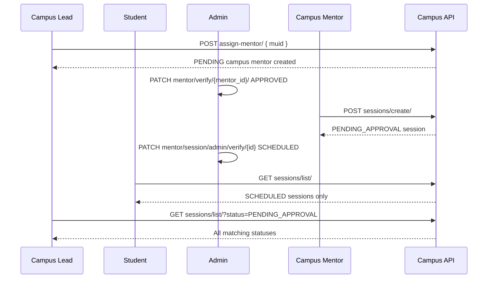

# Dashboard — Campus Mentor & Sessions

**Base path:** `/api/v1/dashboard/campus/`  
**Source:** `api/dashboard/campus/campus_views.py`, `api/dashboard/campus/session_views.py`  
**OpenAPI tags:** `Dashboard - Campus`, `Dashboard - Campus Sessions`

Related docs: [Dashboard_Campus.md](./Dashboard_Campus.md), [Dashboard_Mentor.md](./Dashboard_Mentor.md) (admin session approval: `session/admin/verify/<session_id>/`)

---

## Table of Contents

| # | Endpoint | Method | Role |
|---|----------|--------|------|
| 1 | [`assign-mentor/`](#1-assign-mentor) | `POST` | Campus Lead, Lead Enabler |
| 2 | [`sessions/create/`](#2-sessionscreate) | `POST` | Mentor (approved Campus Mentor) |
| 3 | [`sessions/list/`](#3-sessionslist) | `GET` | Authenticated user linked to a campus |

---

## Overview

### Response envelope

**Success:**

```json
{
  "hasError": false,
  "statusCode": 200,
  "message": { "general": ["Human-readable success message"] },
  "response": {}
}
```

**Failure:**

```json
{
  "hasError": true,
  "statusCode": 400,
  "message": {
    "general": ["Error summary"],
    "field_name": ["Validation detail"]
  },
  "response": {}
}
```

### Authentication

```http
Authorization: Bearer <access_token>
```

Required on all endpoints below.

### Pagination & search (`sessions/list/`)

| Query param | Default | Description |
|-------------|---------|-------------|
| `pageIndex` | `1` | Page number |
| `perPage` | `10` | Items per page |
| `search` | — | Searches `title`, `description` |
| `sortBy` | — | `created_at`, `starts_at` (prefix `-` for descending) |

### Campus mentor lifecycle

| Step | Actor | Action | Result |
|------|-------|--------|--------|
| 1 | Campus Lead / Enabler | `POST assign-mentor/` | `UserMentor` row: `mentor_tier=CAMPUS_MENTOR`, `status=PENDING`, `org` = campus |
| 2 | Admin | `PATCH /api/v1/dashboard/mentor/verify/<mentor_id>/` | `status=APPROVED`; global `Mentor` role assigned |
| 3 | Approved campus mentor | `POST sessions/create/` | Session: `session_type=campus_session`, `status=PENDING_APPROVAL` |
| 4 | Admin | `PATCH /api/v1/dashboard/mentor/session/admin/verify/<session_id>/` | `status=SCHEDULED`; learners can join |

### Session status values

| `status` | Meaning |
|----------|---------|
| `PENDING_APPROVAL` | Created; awaiting admin approval |
| `SCHEDULED` | Approved; visible to regular campus students in list |
| `COMPLETED` | Finished |
| `CANCELLED` | Cancelled |
| `REJECTED` | Rejected by admin |

### Session modes

`ONLINE`, `OFFLINE`, `HYBRID`

---

## 1. `assign-mentor/`

**`POST /api/v1/dashboard/campus/assign-mentor/`**

Nominates an active, non-alumni student at the caller’s college as a **Campus Mentor**. Creates a `user_mentor` record in `PENDING` status scoped to that campus (`org_id`). An admin must approve the mentor before they can create sessions.

**Roles:** `Campus Lead`, `Lead Enabler`

**Prerequisites:**

- Caller is linked to a college via `user_organization_link`.
- Target student exists, belongs to the same campus, and `is_alumni=false`.

**Request body:**

```json
{
  "muid": "MU-2024-00123"
}
```

| Field | Required | Notes |
|-------|----------|-------|
| `muid` | Yes | Student’s muLearn ID |

**Success response:**

```json
{
  "hasError": false,
  "statusCode": 200,
  "message": { "general": ["Student successfully nominated as a Campus Mentor"] },
  "response": {}
}
```

**Error responses:**

| Condition | Message |
|-----------|---------|
| Missing `muid` | `muid is required` |
| Caller has no campus | `User have no organization` |
| Unknown `muid` | `Student not found` |
| Student not on caller’s campus / is alumni | `Student is not a member of your campus` |
| Already campus mentor (same org) | `Student is already a Campus Mentor or has a pending request` |
| Other `user_mentor` row exists | `Student is already a mentor with tier <tier>` |

**Example — already nominated:**

```json
{
  "hasError": true,
  "statusCode": 400,
  "message": {
    "general": ["Student is already a Campus Mentor or has a pending request"]
  },
  "response": {}
}
```

**Database record created:**

| Field | Value |
|-------|-------|
| `mentor_tier` | `CAMPUS_MENTOR` |
| `status` | `PENDING` |
| `org` | Caller’s college organization |
| `user` | Nominated student |

---

## 2. `sessions/create/`

**`POST /api/v1/dashboard/campus/sessions/create/`**

Creates a mentorship session for the authenticated user’s campus. The API sets `entity_id` to the user’s college org and `session_type` to `campus_session`. Initial status is `PENDING_APPROVAL` until an admin approves it.

**Roles:** `Mentor` (JWT role) **and** approved campus mentor record:

- `user_mentor.status = APPROVED`
- `user_mentor.mentor_tier = CAMPUS_MENTOR`

**Prerequisites:**

- User has an active college `user_organization_link`.
- User is an approved Campus Mentor for that org.

**Request body:**

Do **not** send `entity_id` or `session_type`; they are set server-side.

```json
{
  "title": "Career Guidance: Internships",
  "description": "Open Q&A on internship applications and interviews.",
  "mode": "ONLINE",
  "starts_at": "2026-06-15T10:00:00Z",
  "ends_at": "2026-06-15T11:30:00Z",
  "meeting_link": "https://meet.example.com/abc-defg-hij",
  "venue": null,
  "max_participants": 50
}
```

| Field | Required | Notes |
|-------|----------|-------|
| `title` | Yes | Max 150 chars |
| `description` | No | Text |
| `mode` | Yes | `ONLINE`, `OFFLINE`, or `HYBRID` |
| `starts_at` | Yes | ISO 8601 datetime; must be before `ends_at` |
| `ends_at` | Yes | ISO 8601 datetime |
| `meeting_link` | No | Max 500 chars; typical for online/hybrid |
| `venue` | No | Max 255 chars; typical for offline/hybrid |
| `max_participants` | No | Integer cap for joins |

**Success response:**

```json
{
  "hasError": false,
  "statusCode": 200,
  "message": { "general": ["Campus session created successfully and is pending approval."] },
  "response": {
    "entity_id": "org-uuid-college",
    "session_type": "campus_session",
    "title": "Career Guidance: Internships",
    "description": "Open Q&A on internship applications and interviews.",
    "mode": "ONLINE",
    "starts_at": "2026-06-15T10:00:00.000000Z",
    "ends_at": "2026-06-15T11:30:00.000000Z",
    "meeting_link": "https://meet.example.com/abc-defg-hij",
    "venue": null,
    "max_participants": 50
  }
}
```

**Error responses:**

| HTTP | Condition | Message |
|------|-----------|---------|
| 403 | Not approved campus mentor | `You are not an approved Campus Mentor.` |
| 404 | No college link | `You are not associated with any campus.` |
| 400 | Validation | Field errors, e.g. start ≥ end |

**Validation error example:**

```json
{
  "hasError": true,
  "statusCode": 400,
  "message": {
    "non_field_errors": ["Session start time must be before end time."]
  },
  "response": {}
}
```

---

## 3. `sessions/list/`

**`GET /api/v1/dashboard/campus/sessions/list/`**

Lists campus mentorship sessions (`session_type=campus_session`) for the authenticated user’s college. Visibility depends on role.

**Roles:** Any authenticated user with a college `user_organization_link`

**Query params:**

| Param | Required | Who can use | Description |
|-------|----------|-------------|-------------|
| `status` | No | Elevated users only | Filter: `PENDING_APPROVAL`, `SCHEDULED`, `COMPLETED`, `CANCELLED`, `REJECTED` |
| `pageIndex` | No | All | Page number |
| `perPage` | No | All | Page size |
| `search` | No | All | Search `title`, `description` |
| `sortBy` | No | All | e.g. `starts_at`, `-created_at` |

**Visibility rules:**

| User type | Sessions returned |
|-----------|-------------------|
| **Elevated:** Admin, Campus Lead, Lead Enabler | All non-deleted campus sessions; optional `status` filter |
| **Approved campus mentor** (same org) | Same as elevated |
| **Everyone else** (regular students) | Only `status=SCHEDULED` |

**Request body:** None

**Success response:**

```json
{
  "hasError": false,
  "statusCode": 200,
  "message": { "general": ["Success"] },
  "response": {
    "data": [
      {
        "id": "session-uuid-001",
        "entity_id": "org-uuid-college",
        "entity_name": "ABC Engineering College",
        "session_type": "campus_session",
        "title": "Career Guidance: Internships",
        "mode": "ONLINE",
        "starts_at": "2026-06-15T10:00:00Z",
        "ends_at": "2026-06-15T11:30:00Z",
        "status": "SCHEDULED",
        "created_by_id": "user-uuid-mentor",
        "created_by_name": "Priya Sharma",
        "created_at": "2026-06-01T08:00:00Z",
        "max_participants": 50
      },
      {
        "id": "session-uuid-002",
        "entity_id": "org-uuid-college",
        "entity_name": "ABC Engineering College",
        "session_type": "campus_session",
        "title": "Resume Workshop",
        "mode": "OFFLINE",
        "starts_at": "2026-06-20T14:00:00Z",
        "ends_at": "2026-06-20T16:00:00Z",
        "status": "PENDING_APPROVAL",
        "created_by_id": "user-uuid-mentor",
        "created_by_name": "Priya Sharma",
        "created_at": "2026-06-02T09:00:00Z",
        "max_participants": 30
      }
    ],
    "pagination": {
      "count": 2,
      "totalPages": 1,
      "isNext": false,
      "isPrev": false,
      "nextPage": null
    }
  }
}
```

**Example — campus lead views pending sessions:**

```http
GET /api/v1/dashboard/campus/sessions/list/?status=PENDING_APPROVAL&pageIndex=1&perPage=10
```

**Example — regular student (only scheduled returned):**

```http
GET /api/v1/dashboard/campus/sessions/list/
```

Even if `?status=PENDING_APPROVAL` is passed, non-elevated users still receive only `SCHEDULED` sessions.

**Error response:**

```json
{
  "hasError": true,
  "statusCode": 404,
  "message": {
    "general": ["You are not associated with any campus."]
  },
  "response": {}
}
```

---

## End-to-end flow



---

## Related endpoints

| Action | Endpoint |
|--------|----------|
| Admin approve campus mentor | `PATCH /api/v1/dashboard/mentor/verify/<mentor_id>/` |
| Admin approve/reject campus session | `PATCH /api/v1/dashboard/mentor/session/admin/verify/<session_id>/` |
| Admin list all sessions | `GET /api/v1/dashboard/mentor/session/admin/list/` |
| Student join scheduled session | `POST /api/v1/dashboard/mentor/session/participation/join/<session_id>/` |
| IG mentor sessions (not campus) | `POST /api/v1/dashboard/mentor/session/create/` |
