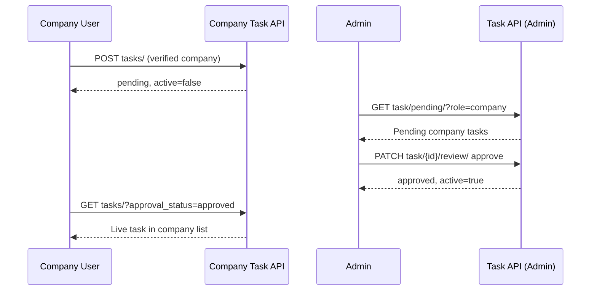

# Dashboard — Company Tasks & Admin Approval

**Company base path:** `/api/v1/dashboard/company/`  
**Admin approval base path:** `/api/v1/dashboard/task/`  
**Source:** `api/dashboard/company/task_views.py`, `api/dashboard/company/task_serializers.py`, `api/dashboard/task/dash_task_view.py`  
**OpenAPI tags:** `Dashboard - Company Task`, `Dashboard - Task`

Related docs: [Dashboard_Company.md](./Dashboard_Company.md), [Dashboard_Mentor_Tasks.md](./Dashboard_Mentor_Tasks.md) (shared admin approval flow)

---

## Table of Contents

| # | Endpoint | Method(s) | Role |
|---|----------|-----------|------|
| 1 | [`tasks/`](#1-tasks) | `GET`, `POST` | Company |
| 2 | [`tasks/<task_id>/`](#2-taskstask_id) | `GET`, `PUT`, `DELETE` | Company |
| 3 | [`task/pending/`](#3-admin-list-pending-tasks) | `GET` | Admin |
| 4 | [`task/<task_id>/review/`](#4-admin-approve-or-reject-task) | `PATCH` | Admin |

---

## Overview

### Response envelope

**Success:**

```json
{
  "hasError": false,
  "statusCode": 200,
  "message": { "general": ["Human-readable success message"] },
  "response": {}
}
```

**Failure:**

```json
{
  "hasError": true,
  "statusCode": 400,
  "message": {
    "general": ["Error summary"],
    "field_name": ["Validation detail"]
  },
  "response": {}
}
```

### Authentication

```http
Authorization: Bearer <access_token>
```

Required on all endpoints below.

### Pagination & search (`tasks/` GET)

| Query param | Default | Description |
|-------------|---------|-------------|
| `pageIndex` | `1` | Page number |
| `perPage` | `10` | Items per page |
| `search` | — | Searches `hashtag`, `title`, `description`, `karma`, `ig__name`, `type__title`, `approval_status` |
| `sortBy` | — | e.g. `title`, `-created_at`, `approval_status`, `karma` |

**Paginated response shape:**

```json
{
  "hasError": false,
  "statusCode": 200,
  "message": { "general": [] },
  "response": {
    "data": [],
    "pagination": {
      "count": 10,
      "totalPages": 1,
      "isNext": false,
      "isPrev": false,
      "nextPage": null
    }
  }
}
```

### Prerequisites

| Action | Requirement |
|--------|-------------|
| List / detail / update / delete tasks | JWT role `Company`; tasks must have `requested_by` = current user |
| **Create** task | Same as above **plus** a **verified** company profile (`company.status = verified` linked to `company_user_id`) |

### Task approval lifecycle

| `approval_status` | `active` | Meaning |
|-------------------|----------|---------|
| `pending` | `false` | Submitted by company; awaiting admin review |
| `approved` | `true` | Admin approved; task is live for learners |
| `rejected` | `false` | Admin rejected; see `rejection_reason` |

- On **create**, tasks are saved as `pending` / `active=false`.
- On **edit** (`PUT`), status resets to `pending` and `active=false` (re-approval required).
- Only **pending** tasks can be **deleted**.

Unlike mentor tasks, company tasks do **not** require an Interest Group (`ig` is optional and not part of the create/update serializer fields).

---

## 1. `tasks/`

### List company-submitted tasks

**`GET /api/v1/dashboard/company/tasks/`**

Lists all tasks where `requested_by` is the authenticated company user.

**Roles:** `Company`

**Query params:**

| Param | Required | Description |
|-------|----------|-------------|
| `approval_status` | No | Filter: `pending`, `approved`, or `rejected` |
| `pageIndex`, `perPage`, `search`, `sortBy` | No | Pagination and sorting |

**Request body:** None

**Success response:**

```json
{
  "hasError": false,
  "statusCode": 200,
  "message": { "general": [] },
  "response": {
    "data": [
      {
        "id": "task-uuid-001",
        "hashtag": "#acme-api-challenge",
        "discord_link": null,
        "title": "Build a Rate Limiter",
        "description": "Implement a token-bucket rate limiter in your language of choice.",
        "karma": 500,
        "channel": null,
        "type": "Implementation",
        "active": false,
        "variable_karma": false,
        "usage_count": 1,
        "level": "Level 4",
        "org": null,
        "ig": null,
        "event": null,
        "bonus_karma": null,
        "bonus_time": null,
        "approval_status": "pending",
        "rejection_reason": null,
        "reviewed_at": null,
        "requested_by_name": "Acme Corp HR",
        "requested_at": "2026-05-20T09:00:00Z",
        "skills": [
          {
            "id": "skill-uuid-go",
            "name": "Go",
            "code": "go"
          }
        ],
        "created_at": "2026-05-20T09:00:00Z",
        "updated_at": "2026-05-20T09:00:00Z"
      }
    ],
    "pagination": {
      "count": 1,
      "totalPages": 1,
      "isNext": false,
      "isPrev": false,
      "nextPage": null
    }
  }
}
```

---

### Create a task (submit for approval)

**`POST /api/v1/dashboard/company/tasks/`**

Creates a task for admin approval. Requires a **verified** company profile.

**Roles:** `Company`

**Request body:**

```json
{
  "hashtag": "#acme-api-challenge",
  "title": "Build a Rate Limiter",
  "karma": 500,
  "usage_count": 1,
  "description": "Implement a token-bucket rate limiter with tests and a short write-up.",
  "type": "task-type-uuid",
  "level": "level-uuid",
  "skill_ids": [
    "skill-uuid-go",
    "skill-uuid-system-design"
  ]
}
```

| Field | Required | Notes |
|-------|----------|-------|
| `hashtag` | Yes | Globally unique |
| `title` | Yes | Max 75 chars |
| `karma` | Yes | Integer |
| `usage_count` | No | Default `1` on model |
| `description` | No | Text |
| `type` | Yes | `TaskType` UUID |
| `level` | No | `Level` UUID |
| `skill_ids` | No | Array of active skill UUIDs |

**Success response:**

```json
{
  "hasError": false,
  "statusCode": 200,
  "message": { "general": ["Task submitted for approval."] },
  "response": {}
}
```

**Error — unverified company (403):**

```json
{
  "hasError": true,
  "statusCode": 403,
  "message": {
    "general": ["You must have a verified company profile to submit tasks."]
  },
  "response": {}
}
```

**Validation error example:**

```json
{
  "hasError": true,
  "statusCode": 400,
  "message": {
    "hashtag": ["A task with this hashtag already exists."]
  },
  "response": {}
}
```

---

## 2. `tasks/<task_id>/`

### Get task detail

**`GET /api/v1/dashboard/company/tasks/<task_id>/`**

**Roles:** `Company` (only tasks where `requested_by` is the current user)

**Request body:** None

**Success response:** Single task object (same shape as one item in the list `data` array above).

**Error:** `404` — Task not found or not owned by this company user.

---

### Update task (re-submit for approval)

**`PUT /api/v1/dashboard/company/tasks/<task_id>/`**

Partial updates allowed. After save, task is reset to `pending`, `active=false`, and review fields cleared.

**Roles:** `Company`

**Request body (partial example):**

```json
{
  "title": "Build a Rate Limiter (v2)",
  "karma": 600,
  "description": "Added distributed-systems requirements.",
  "skill_ids": ["skill-uuid-go"]
}
```

Writable fields: `hashtag`, `title`, `karma`, `usage_count`, `description`, `type`, `level`, `skill_ids`.

**Success response:**

```json
{
  "hasError": false,
  "statusCode": 200,
  "message": { "general": ["Task updated and re-submitted for approval."] },
  "response": {}
}
```

---

### Delete task

**`DELETE /api/v1/dashboard/company/tasks/<task_id>/`**

**Roles:** `Company`

**Request body:** None

**Success response:**

```json
{
  "hasError": false,
  "statusCode": 200,
  "message": { "general": ["Task deleted successfully."] },
  "response": {}
}
```

**Error:** Only `pending` tasks can be deleted.

```json
{
  "hasError": true,
  "statusCode": 400,
  "message": {
    "general": ["Cannot delete a task with status 'approved'. Only pending tasks can be deleted."]
  },
  "response": {}
}
```

---

# Admin — Company task verification

Admins review company-submitted tasks using the shared task approval API (same as mentor tasks).

**Base path:** `/api/v1/dashboard/task/`

---

## 3. Admin — list pending tasks

**`GET /api/v1/dashboard/task/pending/`**

**Roles:** `Admin`

**Example — company tasks awaiting review:**

```http
GET /api/v1/dashboard/task/pending/?approval_status=pending&role=company&pageIndex=1&perPage=10
```

Optional: `?company_name=Acme` to filter by company profile name.

**Request body:** None

**Success response:**

```json
{
  "hasError": false,
  "statusCode": 200,
  "message": { "general": ["Tasks fetched successfully."] },
  "response": {
    "tasks": [
      {
        "id": "task-uuid-001",
        "title": "Build a Rate Limiter",
        "hashtag": "#acme-api-challenge",
        "description": "Implement a token-bucket rate limiter with tests.",
        "karma": 500,
        "approval_status": "pending",
        "ig": null,
        "type": {
          "id": "task-type-uuid",
          "title": "Implementation"
        },
        "company_name": "Acme Technologies",
        "requested_by": {
          "id": "user-uuid-company",
          "full_name": "Acme Corp HR"
        },
        "requested_at": "2026-05-20T09:00:00+00:00",
        "created_at": "2026-05-20T09:00:00+00:00"
      }
    ],
    "pagination": {
      "count": 1,
      "totalPages": 1,
      "isNext": false,
      "isPrev": false,
      "nextPage": null
    }
  }
}
```

---

## 4. Admin — approve or reject task

**`PATCH /api/v1/dashboard/task/<task_id>/review/`**

**Roles:** `Admin` — only tasks with `approval_status=pending`.

### Approve

**Request body:**

```json
{
  "action": "approve"
}
```

**Success response:**

```json
{
  "hasError": false,
  "statusCode": 200,
  "message": { "general": ["Task approved and is now live."] },
  "response": {
    "task_id": "task-uuid-001",
    "approval_status": "approved",
    "active": true,
    "rejection_reason": null,
    "reviewed_by": "admin-user-uuid",
    "reviewed_at": "2026-05-21T10:30:00+00:00"
  }
}
```

### Reject

**Request body:**

```json
{
  "action": "reject",
  "reason": "Task description does not meet platform content guidelines. Please add learning outcomes and resubmit."
}
```

| Field | Required | Notes |
|-------|----------|-------|
| `action` | Yes | `approve` or `reject` |
| `reason` | Yes when `action=reject` | Stored in `rejection_reason` |

**Success response:**

```json
{
  "hasError": false,
  "statusCode": 200,
  "message": { "general": ["Task rejected."] },
  "response": {
    "task_id": "task-uuid-001",
    "approval_status": "rejected",
    "active": false,
    "rejection_reason": "Task description does not meet platform content guidelines. Please add learning outcomes and resubmit.",
    "reviewed_by": "admin-user-uuid",
    "reviewed_at": "2026-05-21T10:35:00+00:00"
  }
}
```

---

## End-to-end flow



---

## Company vs mentor tasks

| Aspect | Company (`/company/tasks/`) | Mentor (`/mentor/tasks/`) |
|--------|----------------------------|---------------------------|
| Role | `Company` | `Mentor` |
| Create prerequisite | Verified `company` profile | Active IG mentor assignment |
| `ig` field | Not used on create/update | Required |
| Admin list filter | `?role=company` | `?role=mentor` |

---

## Related endpoints

| Action | Endpoint |
|--------|----------|
| Company registration / verification | `/api/v1/dashboard/company/register/`, `verify/<company_id>/` |
| Admin task dropdowns (`type`, `level`) | `/api/v1/dashboard/task/task-types/`, `level/` |
| Full admin task CRUD | `/api/v1/dashboard/task/` |
