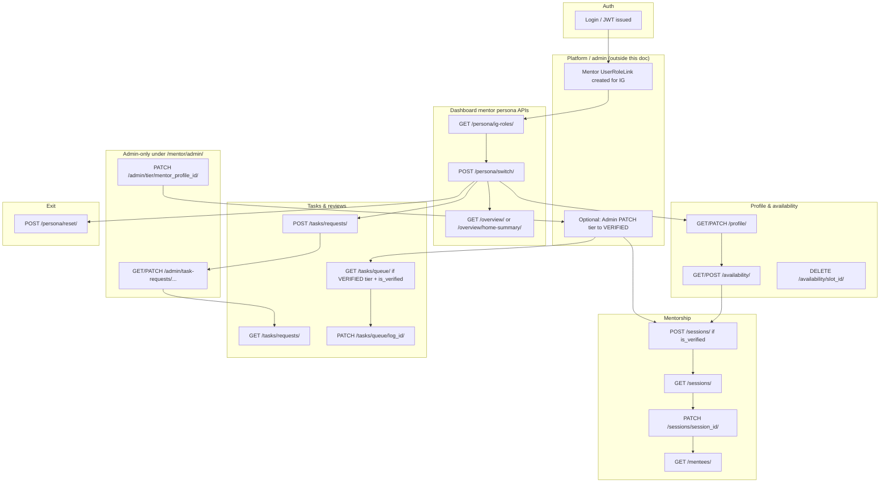

# Mentor APIs — Technical Reference

This document describes every HTTP API under the dashboard **mentor** module in **mulearnbackend**. Paths are relative to the API root:

**Base URL:** `https://<host>/api/v1/dashboard/mentor/`

---

## Conventions

### Authentication

All endpoints require a valid JWT unless noted otherwise.

- **Header:** `Authorization: Bearer <access_token>`

The project uses `CustomizePermission` (JWT validation via `JWTUtils`).

### Response envelope (`CustomResponse`)

Successful responses generally look like:

```json
{
  "hasError": false,
  "statusCode": 200,
  "message": {
    "general": ["Human-readable summary message"]
  },
  "response": { }
}
```

Failures use `hasError: true`, a `statusCode` field (often 400), and `message` may include field-level validation under keys such as `general` or nested objects. Some views omit a populated `response` on failure.

### Mentor persona (critical)

Most mentor-scoped endpoints are **not** satisfied by merely having a “Mentor” role in the database. The server reads **`user_settings`** on each request:

- `active_persona` must be **`mentor`**
- `active_role_link_id` and `active_ig_id` must be set and must match an **active** `UserRoleLink` for that user

You activate this state by calling **Persona Switch** (`POST .../persona/switch/`). Permission class **`IsIGMentor`** enforces this; **`IsVerifiedIGMentor`** additionally requires a `UserMentor` row with **`is_verified === true`** and **`mentor_tier === "VERIFIED"`**.

---

## API index

| Area | Method | Endpoint |
|------|--------|----------|
| Persona | `GET` | `/persona/ig-roles/` |
| Persona | `POST` | `/persona/switch/` |
| Persona | `POST` | `/persona/reset/` |
| Profile | `GET` | `/profile/` |
| Profile | `PATCH` | `/profile/` |
| Overview | `GET` | `/overview/` |
| Overview | `GET` | `/overview/home-summary/` |
| Availability | `GET` | `/availability/` |
| Availability | `POST` | `/availability/` |
| Availability | `DELETE` | `/availability/<slot_id>/` |
| Sessions | `GET` | `/sessions/` |
| Sessions | `POST` | `/sessions/` |
| Sessions | `PATCH` | `/sessions/<session_id>/` |
| Mentees | `GET` | `/mentees/` |
| Tasks (review) | `GET` | `/tasks/queue/` |
| Tasks (review) | `PATCH` | `/tasks/queue/<log_id>/` |
| Tasks (requests) | `GET` | `/tasks/requests/` |
| Tasks (requests) | `POST` | `/tasks/requests/` |
| Admin | `GET` | `/admin/task-requests/` |
| Admin | `PATCH` | `/admin/task-requests/<req_id>/` |
| Admin | `PATCH` | `/admin/tier/<mentor_profile_id>/` |

---

## 1. Persona — list IG mentor roles

**Endpoint:** `GET /api/v1/dashboard/mentor/persona/ig-roles/`

**Usage:** Populate a persona switcher with every **active**, **IG-scoped** Mentor `UserRoleLink` for the current user. Includes tier/verification from the shared `UserMentor` profile (one profile per user; tier/verification apply across IGs in the serializer output).

**Role / access:** Any **authenticated** user (`CustomizePermission` only). Does **not** require active mentor persona.

**Request body:** None.

**Query parameters:** None.

**Response body (`response`):**

```json
{
  "ig_roles": [
    {
      "role_link_id": "<uuid>",
      "ig_id": "<uuid>",
      "ig_name": "string",
      "role": "Mentor",
      "is_primary": true,
      "is_verified": false,
      "mentor_tier": "NORMAL"
    }
  ]
}
```

**Constraints:**

- Only role links with `role.title == "Mentor"`, non-null `ig`, and `is_active == true` are returned.

**Example flow:**

1. User logs in and receives JWT.
2. Client calls `GET .../ig-roles/` to show which IGs they can mentor.
3. User picks an IG; client calls `POST .../persona/switch/` with that role link id.

---

## 2. Persona — switch to mentor

**Endpoint:** `POST /api/v1/dashboard/mentor/persona/switch/`

**Usage:** Set `user_settings.active_persona` to `mentor`, bind `active_role_link` and `active_ig`, and refresh `last_persona_switched_at`. Ensures a `UserMentor` row exists (`get_or_create` with tier `NORMAL` if new).

**Role / access:** **Authenticated** (any valid JWT). The role link itself must be a Mentor role you own.

**Request body (JSON):**

| Field | Type | Required | Description |
|-------|------|----------|-------------|
| `active_role_link_id` | string (UUID, max 36) | Yes | `UserRoleLink.id` for an IG-scoped Mentor assignment you own |

**Response body (`response`):**

```json
{
  "active_persona": "mentor",
  "active_role_link_id": "<uuid>",
  "active_ig_id": "<uuid>",
  "ig_name": "string",
  "is_verified": false,
  "mentor_tier": "NORMAL",
  "profile_created": false,
  "last_persona_switched_at": "2026-05-14T12:00:00+00:00",
  "access": null
}
```

**Constraints:**

- `active_role_link_id` must belong to the current user, be **active**, have a non-null IG, and `role.title` must be **`Mentor`**.
- `ig_id` is **never** taken from the client for security; it is derived from the role link.

**Example flow:**

1. `GET /persona/ig-roles/`
2. `POST /persona/switch/` with chosen `active_role_link_id`
3. Subsequent calls to `/profile/`, `/overview/`, etc. succeed with `IsIGMentor`.

---

## 3. Persona — reset to learner

**Endpoint:** `POST /api/v1/dashboard/mentor/persona/reset/`

**Usage:** Clear mentor context: set persona to `learner`, null out `active_role_link` and `active_ig`.

**Role / access:** **Authenticated**. Requires an existing `UserSettings` row.

**Request body:** None (empty JSON is fine).

**Response body (`response`):**

```json
{
  "active_persona": "learner"
}
```

**Constraints:**

- Fails if `UserSettings` does not exist for the user.

**Example flow:** After mentoring work, call reset so `IsIGMentor` endpoints return 403 until the user switches back.

---

## 4. Mentor profile — get

**Endpoint:** `GET /api/v1/dashboard/mentor/profile/`

**Usage:** Load the current user’s `UserMentor` profile (about, reason, expertise, hours, tier, verification metadata).

**Role / access:** **Authenticated** + **`IsIGMentor`** (active mentor persona).

**Request body:** None.

**Response body (`response`):**

```json
{
  "id": "<uuid>",
  "about": "string or null",
  "reason": "string or null",
  "expertise": "string or null",
  "volunteer_hours": 0,
  "mentor_tier": "NORMAL",
  "is_verified": false,
  "verified_at": "2026-05-14T12:00:00+00:00",
  "verification_note": "string or null"
}
```

**Constraints:** Profile must exist; otherwise failure response.

---

## 5. Mentor profile — patch

**Endpoint:** `PATCH /api/v1/dashboard/mentor/profile/`

**Usage:** Update editable mentor fields only.

**Role / access:** **Authenticated** + **`IsIGMentor`**.

**Request body (JSON):** At least one of:

| Field | Type | Description |
|-------|------|-------------|
| `about` | string | Max length per DB (1000) |
| `reason` | string | Max 1000 |
| `expertise` | string | Text field |

Unknown keys are ignored. Empty patch (no allowed keys) fails.

**Response body (`response`):**

```json
{
  "id": "<uuid>",
  "about": "...",
  "reason": "...",
  "expertise": "...",
  "volunteer_hours": 0,
  "mentor_tier": "NORMAL",
  "is_verified": false
}
```

**Constraints:** Cannot update tier or verification here (admin tier API or provisioning flows).

---

## 6. Overview — full dashboard snapshot

**Endpoint:** `GET /api/v1/dashboard/mentor/overview/`

**Usage:** Single payload for mentor home: user info, mentor profile snippet, active persona context, all authorized mentor IGs, and stats (mentees, completed sessions, pending task approvals) **scoped to the active IG**.

**Role / access:** **Authenticated** + **`IsIGMentor`**.

**Request body:** None.

**Response body (`response`):** (structure from `MentorOverviewView`)

- `user`: `full_name`, `muid`, `profile_pic`
- `mentor_profile`: `about`, `expertise`, `reason`, `volunteer_hours`, `mentor_tier`, `is_verified`
- `active_persona`: `active_persona`, `active_role_link_id`, `active_ig_id`, `ig_name`, `is_verified`
- `authorized_igs`: list of `{ role_link_id, ig_id, ig_name, is_primary, is_verified }` — note `is_verified` comes from the single `UserMentor` when present
- `stats`: `total_mentees`, `sessions_conducted`, `pending_task_approvals`, `volunteer_hours`

**Constraints:** Stats use `KarmaActivityLog` with `mentor_review_status == 'PENDING'` for the active IG.

---

## 7. Overview — home summary

**Endpoint:** `GET /api/v1/dashboard/mentor/overview/home-summary/`

**Usage:** Richer widgets: next session, stat cards, upcoming sessions, mentee progress, expertise tags.

**Role / access:** **Authenticated** + **`IsIGMentor`**.

**Query parameters:**

| Param | Description |
|-------|-------------|
| `ig_id` | Optional; defaults to active persona IG |

**Request body:** None.

**Response body (`response`):** Includes `next_session`, `stat_cards`, `upcoming_sessions`, `session_requests` (currently always `[]`), `mentee_progress`, `expertise_tags` (expertise split by comma into tags when string).

**Constraints:** Unlike `tasks/queue/`, the optional `ig_id` here is **not** re-checked against `UserRoleLink`; clients should only pass IGs the user legitimately mentors to avoid empty or misleading summaries.

---

## 8. Availability — list

**Endpoint:** `GET /api/v1/dashboard/mentor/availability/`

**Usage:** List active weekly slots for the current user where `ig_id` equals the **active persona IG** **or** `ig` is null (“All IGs” global slots).

**Role / access:** **Authenticated** + **`IsIGMentor`**.

**Response (`response`):**

```json
{
  "active_ig_id": "<uuid>",
  "slots": [
    {
      "id": "<uuid>",
      "ig_id": "<uuid or null>",
      "ig_name": "string or All IGs",
      "weekday": 1,
      "start_time": "09:00",
      "end_time": "10:00",
      "timezone": "Asia/Kolkata",
      "is_active": true,
      "valid_from": "2026-01-01",
      "valid_to": null
    }
  ]
}
```

**Constraints:** `weekday` 1 = Monday … 7 = Sunday.

---

## 9. Availability — create slots

**Endpoint:** `POST /api/v1/dashboard/mentor/availability/`

**Usage:** Bulk-create availability slots. **`ig_id` is always the active persona IG** (not client-supplied).

**Role / access:** **Authenticated** + **`IsIGMentor`**.

**Request body (JSON):**

```json
{
  "slots": [
    {
      "weekday": 1,
      "start_time": "09:00:00",
      "end_time": "10:00:00",
      "timezone": "Asia/Kolkata",
      "valid_from": "2026-01-01",
      "valid_to": null
    }
  ]
}
```

| Field | Required | Notes |
|-------|----------|--------|
| `slots` | Yes | Non-empty array |
| `weekday` | Per slot | Integer 1–7 |
| `start_time`, `end_time` | Per slot | Time values; `start_time` must be strictly before `end_time` |
| `timezone` | No | Defaults to `Asia/Kolkata` |
| `valid_from`, `valid_to` | No | Optional date bounds |

**Response (`response`):**

```json
{
  "created_ids": ["<uuid>", "..."],
  "errors": [{ "index": 0, "error": "string" }]
}
```

**Constraints:** Invalid rows are skipped and reported in `errors`; valid rows still save.

---

## 10. Availability — soft-delete slot

**Endpoint:** `DELETE /api/v1/dashboard/mentor/availability/<slot_id>/`

**Usage:** Sets `is_active = false` on a slot you own, for the active IG or a global (`ig` null) slot.

**Role / access:** **Authenticated** + **`IsIGMentor`**.

**Request body:** None.

**Response (`response`):** `{ "slot_id": "<slot_id>" }`

**Constraints:** 404-style failure if slot not found or not owned / not visible for current persona IG.

---

## 11. Sessions — list

**Endpoint:** `GET /api/v1/dashboard/mentor/sessions/`

**Usage:** Paginated sessions where the user is a **MENTOR** participant, filtered to the **active persona IG**.

**Role / access:** **Authenticated** + **`IsIGMentor`**.

**Query parameters:**

| Param | Description |
|-------|-------------|
| `status` | e.g. `SCHEDULED`, `COMPLETED`, `CANCELLED`, `NO_SHOW` |
| `mode` | `ONLINE`, `OFFLINE`, `HYBRID` |
| `date_from`, `date_to` | Filter `starts_at` by date (inclusive) |
| `pageIndex`, `perPage`, `search`, `sortBy` | Pagination / search (`title`) / sort (`starts_at`, `title`; prefix `-` for desc) |

**Response (`response`):**

```json
{
  "data": [
    {
      "id": "<uuid>",
      "ig_name": "string",
      "title": "string",
      "mode": "ONLINE",
      "starts_at": "...",
      "ends_at": "...",
      "status": "SCHEDULED",
      "meeting_link": "string or null",
      "participants": [
        {
          "user_id": "<uuid>",
          "full_name": "string",
          "participant_role": "MENTOR",
          "attendance_status": "INVITED"
        }
      ]
    }
  ],
  "pagination": {
    "count": 0,
    "totalPages": 0,
    "isNext": false,
    "isPrev": false,
    "nextPage": null
  }
}
```

---

## 12. Sessions — create

**Endpoint:** `POST /api/v1/dashboard/mentor/sessions/`

**Usage:** Create a `MentorshipSession` in the **active persona IG** and link mentor + mentee participants (both start as `INVITED`).

**Role / access:** **Authenticated** + **`IsIGMentor`**. **Additional:** `UserMentor` must exist and **`is_verified` must be `true`** (note: this check uses **`is_verified` only**, not `IsVerifiedIGMentor`, which also requires tier `VERIFIED` for task queue).

**Request body (JSON):**

| Field | Type | Required |
|-------|------|----------|
| `mentee_id` | string (user UUID) | Yes |
| `title` | string, max 150 | Yes |
| `description` | string | No |
| `mode` | `ONLINE` \| `OFFLINE` \| `HYBRID` | No (default `ONLINE`) |
| `starts_at` | ISO datetime | Yes |
| `ends_at` | ISO datetime | Yes |
| `meeting_link` | string, max 500 | No |

**Constraints:**

- `ends_at` must be after `starts_at`.
- `mentee_id` must exist and must not equal the mentor’s user id.
- **`ig_id` is not accepted in the body**; always taken from persona context.

**Response:** Success message only (`general_message`); session id is not returned in the shown success path (serializer `save()` does not add it to `response`).

---

## 13. Sessions — update

**Endpoint:** `PATCH /api/v1/dashboard/mentor/sessions/<session_id>/`

**Usage:** Update session status and/or participant attendance, notes, contributed minutes.

**Role / access:** **Authenticated** + **`IsIGMentor`**. You must be a **MENTOR** participant on that session.

**Request body (JSON):** all optional (partial update):

```json
{
  "status": "COMPLETED",
  "participants": [
    {
      "user_id": "<uuid>",
      "participant_role": "MENTEE",
      "attendance_status": "ATTENDED",
      "progress_note": "optional max 500",
      "contributed_minutes": 45
    }
  ]
}
```

**`status` allowed values:** `COMPLETED`, `CANCELLED`, `NO_SHOW` (only these in the update serializer).

**Participant updates:** Each item matches session links; `participant_role` can be used in the filter when locating the link.

**Constraints:** Session must exist; non-mentor participants get a permission-style failure message.

---

## 14. Mentees — list

**Endpoint:** `GET /api/v1/dashboard/mentor/mentees/`

**Usage:** Paginated mentees (users with `MENTEE` role in sessions) for sessions where you were **MENTOR**, filtered by IG (default active persona IG).

**Role / access:** **Authenticated** + **`IsIGMentor`**.

**Query parameters:** `ig_id` (optional override), plus pagination/search/sort: `pageIndex`, `perPage`, `search` (`full_name`, `muid`), `sortBy` (`full_name`, `karma`).

**Response (`response`):**

```json
{
  "active_ig_id": "<uuid>",
  "data": [
    {
      "user_id": "<uuid>",
      "full_name": "string",
      "muid": "string",
      "profile_pic": "url or null",
      "karma": 0,
      "level": "string or null",
      "ig_karma": 0,
      "ig_level": "string or null",
      "session_count": 0,
      "last_session_at": "2026-05-14T12:00:00+00:00"
    }
  ],
  "pagination": { }
}
```

**Constraints:** If `ig_id` is overridden, results are still “mentees from sessions in that IG” but there is no extra role-link authorization check in this view.

---

## 15. Tasks — review queue

**Endpoint:** `GET /api/v1/dashboard/mentor/tasks/queue/`

**Usage:** Paginated `KarmaActivityLog` rows for tasks in an IG, filtered by mentor review status.

**Role / access:** **Authenticated** + **`IsVerifiedIGMentor`** (`UserMentor.is_verified` **and** `mentor_tier == "VERIFIED"`).

**Query parameters:**

| Param | Description |
|-------|-------------|
| `ig_id` | Optional; default = active persona IG. Must be an IG where you have an active Mentor `UserRoleLink`. |
| `status` | `PENDING` (default), `APPROVED`, or `REJECTED` |

Plus `pageIndex`, `perPage`, `search`, `sortBy` (`created_at`).

**Response (`response`):**

```json
{
  "active_ig_id": "<uuid>",
  "data": [
    {
      "id": "<log uuid>",
      "mentee_id": "<uuid>",
      "mentee_name": "string",
      "task_id": "<uuid>",
      "task_title": "string",
      "task_hashtag": "string",
      "task_karma": 10,
      "ig_name": "string",
      "mentor_review_status": "PENDING",
      "mentor_review_feedback": null,
      "created_at": "..."
    }
  ],
  "pagination": { }
}
```

**Constraints:** Rejects invalid `status` filter. Rejects `ig_id` you are not a mentor for.

---

## 16. Tasks — approve / reject submission

**Endpoint:** `PATCH /api/v1/dashboard/mentor/tasks/queue/<log_id>/`

**Usage:** Set `mentor_review_status` to `APPROVED` or `REJECTED`, record reviewer, timestamp, optional feedback. **Does not award karma** (noted in code: appraiser flow handles karma).

**Role / access:** **Authenticated** + **`IsVerifiedIGMentor`**. Must have Mentor role on the task’s IG.

**Request body (JSON):**

| Field | Required | Description |
|-------|----------|-------------|
| `status` | Yes | `APPROVED` or `REJECTED` (case-insensitive) |
| `feedback` | No | String, max 500 chars |

**Constraints:** Only logs currently in **`PENDING`** mentor review can be actioned.

**Response:** Success with general message only (no detailed entity in success path).

---

## 17. Task creation requests — list (mentor)

**Endpoint:** `GET /api/v1/dashboard/mentor/tasks/requests/`

**Usage:** Paginated list of your own `MentorTaskRequest` rows for the **active persona IG**.

**Role / access:** **Authenticated** + **`IsIGMentor`**.

**Query parameters:** `status` optional: `PENDING`, `APPROVED`, `REJECTED`; pagination/search/sort as usual.

**Response (`response`):**

```json
{
  "data": [
    {
      "id": "<uuid>",
      "mentor_name": "string",
      "ig_name": "string",
      "title": "string",
      "hashtag": "string",
      "karma": 10,
      "description": "string or null",
      "status": "PENDING",
      "admin_note": "string or null",
      "reviewed_by_name": "string or null",
      "reviewed_at": "...",
      "created_task_hashtag": "string or null",
      "created_at": "..."
    }
  ],
  "pagination": { }
}
```

---

## 18. Task creation requests — submit (mentor)

**Endpoint:** `POST /api/v1/dashboard/mentor/tasks/requests/`

**Usage:** Create a pending request for admins to turn into a `TaskList` entry upon approval.

**Role / access:** **Authenticated** + **`IsIGMentor`**.

**Request body (JSON):**

| Field | Required | Description |
|-------|----------|-------------|
| `title` | Yes | Non-empty after trim |
| `hashtag` | Yes | Non-empty after trim |
| `karma` | Yes | Positive integer |
| `description` | No | Trimmed; empty becomes null |

**Constraints:**

- No duplicate **pending** request for the same mentor + IG + hashtag (case-insensitive).

**Response (`response`):** Single `MentorTaskRequestSerializer` object (same shape as list items).

---

## 19. Admin — list all task creation requests

**Endpoint:** `GET /api/v1/dashboard/mentor/admin/task-requests/`

**Usage:** Global queue for mentor-proposed tasks.

**Role / access:** **Authenticated** user with **`RoleType.ADMIN`** (`@role_required([RoleType.ADMIN.value])`). Uses `CustomizePermission` as `authentication_classes` (not the same stack as `IsIGMentor`).

**Query parameters:**

| Param | Description |
|-------|-------------|
| `status` | `PENDING` (default), `APPROVED`, `REJECTED`, or `ALL` |
| `ig_id` | Filter by IG |

**Response:** Same list envelope as mentor list (`data` + `pagination`).

---

## 20. Admin — approve / reject task request

**Endpoint:** `PATCH /api/v1/dashboard/mentor/admin/task-requests/<req_id>/`

**Usage:** Approve (creates `TaskList` + links on request) or reject a pending mentor task request.

**Role / access:** **`ADMIN`**.

**Request body (JSON):**

| Field | When | Description |
|-------|------|---------------|
| `action` | Always | `APPROVE` or `REJECT` |
| `admin_note` | Optional | Max 500 chars |
| `type_id` | **Approve** | Required — UUID of `TaskType` |
| `level_id` | Approve | Optional UUID |
| `discord_link` | Approve | Optional string |

**Constraints:**

- Request must be `PENDING`.
- On approve: hashtag must not already exist in `TaskList` (case-insensitive).
- On approve: `type_id` must resolve to a valid `TaskType`.

**Response (`response`):** Serialized request after update (includes `created_task_hashtag` when applicable).

---

## 21. Admin — mentor tier / verification

**Endpoint:** `PATCH /api/v1/dashboard/mentor/admin/tier/<mentor_profile_id>/`

**Usage:** Set `UserMentor.mentor_tier` to `NORMAL` or `VERIFIED`, with verification side effects.

**Role / access:** **`ADMIN`**.

**Request body (JSON):**

| Field | Required | Description |
|-------|----------|-------------|
| `tier` | Yes | `NORMAL` or `VERIFIED` |
| `verification_note` | No | Max 500; stored when moving to verified |

**Behavior summary:**

- **`VERIFIED`:** sets `is_verified`, `verified_at`, `verified_by`, `verification_note`; sets **`verified = true`** on **all active** `UserRoleLink` rows for this user where `role.title == "Mentor"`**.
- **`NORMAL`** when downgrading from **`VERIFIED`:** clears verification fields on `UserMentor`. Role-link `verified` flags are **not** automatically cleared (per code comments).

**Response (`response`):**

```json
{
  "mentor_profile_id": "<uuid>",
  "user_id": "<uuid>",
  "full_name": "string",
  "mentor_tier": "VERIFIED",
  "is_verified": true,
  "verified_at": "...",
  "verification_note": "string or null"
}
```

---

## Verification matrix (mentor-facing)

| Capability | Permission / check |
|------------|----------------------|
| Persona list / switch / reset | JWT only (switch validates Mentor role link) |
| Profile, overview, availability, mentees, sessions list/patch, task requests | `IsIGMentor` |
| Session **create** | `IsIGMentor` + `UserMentor.is_verified` |
| Task review queue & patch | `IsVerifiedIGMentor` (`is_verified` **and** `mentor_tier == "VERIFIED"`) |
| Admin task queue & tier | `RoleType.ADMIN` |

---

## End-to-end flow diagram

High-level journey from assignment to mentoring and admin operations:



---

## Related code (for maintainers)

| Concern | Location |
|---------|----------|
| URL routing | `api/dashboard/mentor/urls.py`, sub-`urls.py` per feature |
| Persona DB rules | `api/dashboard/mentor/persona/persona_views.py`, `persona/serializers.py` |
| Mentor permissions | `utils/mentor_permissions.py` |
| Session serializers | `api/dashboard/mentor/sessions/serializers.py` |
| Models | `db/mentor.py`, `db/user.py` (`UserMentor`, `UserSettings`), `db/mentor_task_request.py` |

---

*Generated from repository source. If behavior diverges in deployment, trust the implementation in the paths above.*
