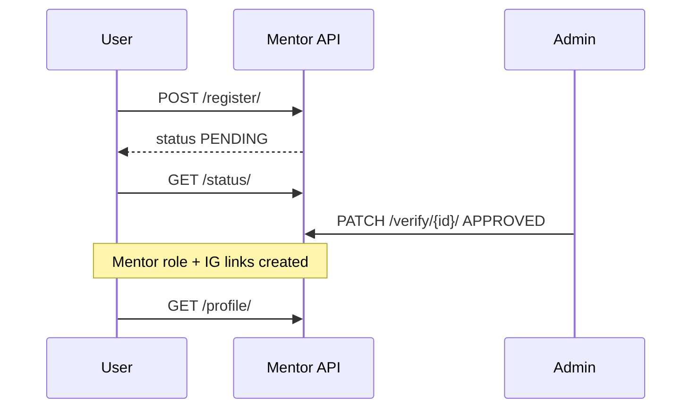
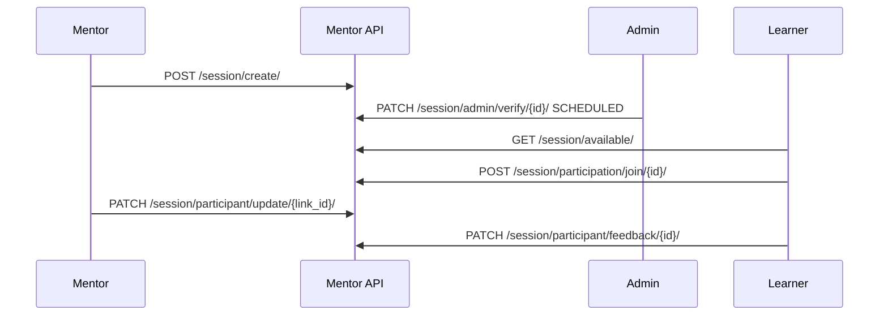

# Dashboard — Mentor API

**Base path:** `/api/v1/dashboard/mentor/`  
**Source:** `api/dashboard/mentor/`  
**OpenAPI tags:** `Dashboard - Mentor`, `Dashboard - Mentor Session`, `Dashboard - Mentor Availability`, `Dashboard - Mentor Session Participant`, `Dashboard - Learner Session`, `Dashboard - Mentor Public`

---

## Table of Contents

| # | Endpoint | Method(s) | Auth / Role |
|---|----------|-----------|-------------|
| 1 | [`register/`](#1-register) | `POST`, `PATCH` | Authenticated user |
| 2 | [`status/`](#2-status) | `GET` | Authenticated user |
| 3 | [`profile/`](#3-profile) | `GET`, `PATCH` | Mentor (approved) |
| 4 | [`list/`](#4-list) | `GET` | Admin |
| 5 | [`detail/<mentor_id>/`](#5-detailmentor_id) | `GET` | Admin |
| 6 | [`verify/<mentor_id>/`](#6-verifymentor_id) | `PATCH` | Admin |
| 7 | [`public/profile/<mentor_id>/`](#7-publicprofilementor_id) | `GET` | Authenticated user |
| 8 | [`public/availability/<mentor_id>/`](#8-publicavailabilitymentor_id) | `GET` | Authenticated user |
| 9 | [`availability/`](#9-availability) | `GET`, `POST` | Mentor |
| 10 | [`availability/<slot_id>/`](#10-availabilityslot_id) | `GET`, `PATCH`, `DELETE` | Mentor |
| 11 | [`session/create/`](#11-sessioncreate) | `POST` | Mentor |
| 12 | [`session/list/`](#12-sessionlist) | `GET` | Mentor |
| 13 | [`session/list/<session_id>/`](#13-sessionlistsession_id) | `GET` | Mentor |
| 14 | [`session/update/<session_id>/`](#14-sessionupdatesession_id) | `PATCH`, `DELETE` | Mentor |
| 15 | [`session/available/`](#15-sessionavailable) | `GET` | Authenticated user (learner) |
| 16 | [`session/admin/list/`](#16-sessionadminlist) | `GET` | Admin |
| 17 | [`session/admin/verify/<session_id>/`](#17-sessionadminverifysession_id) | `PATCH` | Admin |
| 18 | [`session/participation/join/<session_id>/`](#18-sessionparticipationjoinsession_id) | `POST` | Authenticated user |
| 19 | [`session/participant/history/`](#19-sessionparticipanthistory) | `GET` | Authenticated user |
| 20 | [`session/participant/list/<session_id>/`](#20-sessionparticipantlistsession_id) | `GET` | Mentor |
| 21 | [`session/participant/update/<link_id>/`](#21-sessionparticipantupdatelink_id) | `PATCH` | Mentor |
| 22 | [`session/participant/feedback/<session_id>/`](#22-sessionparticipantfeedbacksession_id) | `PATCH` | Authenticated user (participant) |

---

## Overview

### Response envelope

**Success:**

```json
{
  "hasError": false,
  "statusCode": 200,
  "message": { "general": ["Human-readable success message"] },
  "response": {}
}
```

**Failure:**

```json
{
  "hasError": true,
  "statusCode": 400,
  "message": {
    "general": ["Error summary"],
    "field_name": ["Validation detail"]
  },
  "response": {}
}
```

### Authentication

```http
Authorization: Bearer <access_token>
```

Required on all endpoints in this module (including public profile/availability routes).

### Pagination & search

| Query param | Default | Description |
|-------------|---------|-------------|
| `pageIndex` | `1` | Page number |
| `perPage` | `10` | Items per page |
| `search` | — | Case-insensitive search (fields vary) |
| `sortBy` | — | Sort key; prefix `-` for descending |

**Paginated response:**

```json
{
  "response": {
    "data": [],
    "pagination": {
      "count": 10,
      "totalPages": 1,
      "isNext": false,
      "isPrev": false,
      "nextPage": null
    }
  }
}
```

### Mentor application lifecycle

| `status` | Meaning |
|----------|---------|
| `PENDING` | Awaiting admin review |
| `APPROVED` | Mentor role assigned; profile & session APIs available |
| `REJECTED` | Rejected; PATCH `register/` to resubmit |

**Mentor tiers:** `IG_MENTOR`, `MENTOR`, `COMPANY_MENTOR`, `CAMPUS_MENTOR` (default on register: `IG_MENTOR`)

### Session lifecycle

| `status` | Meaning |
|----------|---------|
| `PENDING_APPROVAL` | Created by mentor; awaiting admin |
| `SCHEDULED` | Approved; learners can join |
| `COMPLETED` | Finished |
| `CANCELLED` | Cancelled |
| `REJECTED` | Rejected by admin |

Editing a `SCHEDULED` session resets status to `PENDING_APPROVAL`.

---

## 1. `register/`

**`POST /api/v1/dashboard/mentor/register/`**

Submit a mentor application for the authenticated user.

**Roles:** Authenticated user (one application per user)

**Request body:**

```json
{
  "about": "Software engineer with 8 years of experience mentoring students.",
  "expertise": "Python, Django, system design, career guidance",
  "reason": "I want to give back to the muLearn community.",
  "hours": 5,
  "preferred_ig_ids": [
    "ig-uuid-web-dev",
    "ig-uuid-cloud"
  ]
}
```

| Field | Required | Notes |
|-------|----------|-------|
| `about` | No | Max 1000 chars |
| `expertise` | No | Free text |
| `reason` | No | Max 1000 chars |
| `hours` | No | Weekly hours (integer, default 0) |
| `preferred_ig_ids` | Yes | Non-empty array of valid Interest Group UUIDs |

**Success response:**

```json
{
  "hasError": false,
  "statusCode": 200,
  "message": { "general": ["Mentor registration submitted successfully."] },
  "response": {
    "about": "Software engineer with 8 years of experience mentoring students.",
    "expertise": "Python, Django, system design, career guidance",
    "reason": "I want to give back to the muLearn community.",
    "hours": 5,
    "preferred_ig_ids": ["ig-uuid-web-dev", "ig-uuid-cloud"]
  }
}
```

**Error:** Mentor request already exists for this account.

---

**`PATCH /api/v1/dashboard/mentor/register/`**

Update a pending or rejected application. Rejected applications are resubmitted as `PENDING` with `verification_note` cleared.

**Request body:** Same fields as POST (partial update).

**Success response:** Updated application fields.

**Errors:** No application found; already `APPROVED` (use `profile/`).

---

## 2. `status/`

**`GET /api/v1/dashboard/mentor/status/`**

Check mentor application status.

**Request body:** None

**Success response:**

```json
{
  "hasError": false,
  "statusCode": 200,
  "message": { "general": ["Success"] },
  "response": {
    "status": "PENDING",
    "verification_note": null,
    "mentor_id": "mentor-uuid"
  }
}
```

---

## 3. `profile/`

**`GET /api/v1/dashboard/mentor/profile/`**

Full mentor profile for an approved mentor.

**Roles:** `Mentor` with `status = APPROVED`

**Success response:**

```json
{
  "hasError": false,
  "statusCode": 200,
  "message": { "general": ["Success"] },
  "response": {
    "id": "mentor-uuid",
    "user": "user-uuid",
    "user_full_name": "Arjun Menon",
    "user_email": "arjun@example.com",
    "about": "Software engineer with 8 years of experience.",
    "expertise": "Python, Django",
    "reason": "Giving back to the community.",
    "hours": 5,
    "mentor_tier": "IG_MENTOR",
    "status": "APPROVED",
    "preferred_ig_ids": ["ig-uuid-web-dev"],
    "org": null,
    "verified_by": "admin-uuid",
    "verified_at": "2026-02-01T10:00:00Z",
    "verification_note": null,
    "created_by": "user-uuid",
    "updated_by": "user-uuid",
    "created_at": "2026-01-15T10:00:00Z",
    "updated_at": "2026-05-01T10:00:00Z"
  }
}
```

---

**`PATCH /api/v1/dashboard/mentor/profile/`**

Update approved mentor profile.

**Request example:**

```json
{
  "about": "Updated bio.",
  "hours": 8,
  "preferred_ig_ids": ["ig-uuid-web-dev", "ig-uuid-ml"]
}
```

**Success response:** Full mentor detail object (same shape as GET).

---

## 4. `list/`

**`GET /api/v1/dashboard/mentor/list/`**

Admin list of all mentor applications.

**Roles:** `Admin`

**Query params:**

| Param | Description |
|-------|-------------|
| `status` | `PENDING`, `APPROVED`, `REJECTED` |
| `mentor_tier` | `IG_MENTOR`, `MENTOR`, `COMPANY_MENTOR`, `CAMPUS_MENTOR` |
| `pageIndex`, `perPage`, `search`, `sortBy` | Search `user__full_name`, `user__email`; sort `created_at`, `status`, `user_full_name` |

**Success response:**

```json
{
  "hasError": false,
  "statusCode": 200,
  "message": { "general": ["Success"] },
  "response": {
    "data": [
      {
        "id": "mentor-uuid",
        "user_id": "user-uuid",
        "user_full_name": "Arjun Menon",
        "user_email": "arjun@example.com",
        "mentor_tier": "IG_MENTOR",
        "status": "PENDING",
        "created_at": "2026-01-15T10:00:00Z",
        "updated_at": "2026-01-15T10:00:00Z"
      }
    ],
    "pagination": { "count": 1, "totalPages": 1, "isNext": false, "isPrev": false, "nextPage": null }
  }
}
```

---

## 5. `detail/<mentor_id>/`

**`GET /api/v1/dashboard/mentor/detail/<mentor_id>/`**

Admin detail for one mentor record.

**Roles:** `Admin`

**Success response:** Full mentor object (same shape as [profile GET](#3-profile)).

---

## 6. `verify/<mentor_id>/`

**`PATCH /api/v1/dashboard/mentor/verify/<mentor_id>/`**

Approve or reject a mentor application. On `APPROVED`, assigns the `Mentor` role and creates `UserIgLink` rows for each `preferred_ig_id` when tier is `IG_MENTOR`.

**Roles:** `Admin`

**Request body — Approve:**

```json
{
  "status": "APPROVED"
}
```

**Request body — Reject:**

```json
{
  "status": "REJECTED",
  "verification_note": "Insufficient detail in expertise section."
}
```

| Field | Required |
|-------|----------|
| `status` | Yes — `APPROVED` or `REJECTED` |
| `verification_note` | Required when `REJECTED` |

**Success response:**

```json
{
  "hasError": false,
  "statusCode": 200,
  "message": { "general": ["Mentor status updated to APPROVED successfully."] },
  "response": {}
}
```

---

## 7. `public/profile/<mentor_id>/`

**`GET /api/v1/dashboard/mentor/public/profile/<mentor_id>/`**

View an approved mentor's public profile.

**Roles:** Authenticated user

**Path params:** `mentor_id` — `UserMentor.id` UUID

**Success response:** Full mentor detail (approved mentors only).

---

## 8. `public/availability/<mentor_id>/`

**`GET /api/v1/dashboard/mentor/public/availability/<mentor_id>/`**

List active availability slots for an approved mentor.

**Roles:** Authenticated user

**Success response:**

```json
{
  "hasError": false,
  "statusCode": 200,
  "message": { "general": ["Success"] },
  "response": [
    {
      "id": "slot-uuid",
      "mentor_user_id": "user-uuid",
      "ig_id": "ig-uuid",
      "ig_name": "Web Development",
      "weekday": 2,
      "start_time": "18:00:00",
      "end_time": "20:00:00",
      "timezone": "Asia/Kolkata",
      "is_active": true,
      "valid_from": "2026-05-01",
      "valid_to": "2026-12-31",
      "created_at": "2026-04-01T10:00:00Z",
      "updated_at": "2026-04-01T10:00:00Z"
    }
  ]
}
```

`weekday`: `1` = Monday … `7` = Sunday

---

## 9. `availability/`

**`GET /api/v1/dashboard/mentor/availability/`**

List the logged-in mentor's availability slots (paginated).

**Roles:** `Mentor`

**Query params:**

| Param | Description |
|-------|-------------|
| `ig_id` | Filter by Interest Group |
| `is_active` | `true` or `false` |
| `pageIndex`, `perPage`, `search`, `sortBy` | Sort: `weekday`, `start_time`, `created_at` |

**Success response:** Paginated array of slot objects (same shape as [public availability](#8-publicavailabilitymentor_id)).

---

**`POST /api/v1/dashboard/mentor/availability/`**

Create an availability slot. Mentor must be assigned to the IG with `assignment_type = MENTOR`.

**Request body:**

```json
{
  "ig": "ig-uuid-web-dev",
  "weekday": 2,
  "start_time": "18:00:00",
  "end_time": "20:00:00",
  "timezone": "Asia/Kolkata",
  "is_active": true,
  "valid_from": "2026-05-01",
  "valid_to": "2026-12-31"
}
```

| Field | Required | Notes |
|-------|----------|-------|
| `ig` | Yes | Interest Group UUID |
| `weekday` | Yes | 1–7 (Mon–Sun) |
| `start_time` | Yes | `HH:MM:SS` |
| `end_time` | Yes | Must be after `start_time` |
| `timezone` | No | Default `Asia/Kolkata` |
| `is_active` | No | Default `true` |
| `valid_from`, `valid_to` | No | Optional date range |

**Success response:**

```json
{
  "hasError": false,
  "statusCode": 200,
  "message": { "general": ["Availability slot created successfully."] },
  "response": {
    "ig": "ig-uuid-web-dev",
    "weekday": 2,
    "start_time": "18:00:00",
    "end_time": "20:00:00",
    "timezone": "Asia/Kolkata",
    "is_active": true,
    "valid_from": "2026-05-01",
    "valid_to": "2026-12-31"
  }
}
```

**Error:** Not assigned as mentor for the given IG.

---

## 10. `availability/<slot_id>/`

**`GET /api/v1/dashboard/mentor/availability/<slot_id>/`**

Single slot detail for the logged-in mentor.

**Success response:** Single slot object (not paginated).

---

**`PATCH /api/v1/dashboard/mentor/availability/<slot_id>/`**

Update a slot (partial). Same body fields as POST.

**Success response:** Updated slot fields.

---

**`DELETE /api/v1/dashboard/mentor/availability/<slot_id>/`**

Permanently delete a slot.

**Success response:**

```json
{
  "hasError": false,
  "statusCode": 200,
  "message": { "general": ["Availability slot deleted successfully."] },
  "response": {}
}
```

---

## 11. `session/create/`

**`POST /api/v1/dashboard/mentor/session/create/`**

Create a mentorship session (starts in `PENDING_APPROVAL`). Mentor must be assigned to the session's IG.

**Roles:** `Mentor`

**Request body:**

```json
{
  "ig": "ig-uuid-web-dev",
  "title": "Intro to REST APIs",
  "description": "Hands-on session covering HTTP verbs, status codes, and DRF basics.",
  "mode": "ONLINE",
  "starts_at": "2026-06-15T14:00:00Z",
  "ends_at": "2026-06-15T16:00:00Z",
  "meeting_link": "https://meet.example.com/abc-defg-hij",
  "venue": null,
  "max_participants": 30
}
```

| Field | Required | Notes |
|-------|----------|-------|
| `ig` | Yes | Interest Group UUID |
| `title` | Yes | Max 150 chars |
| `description` | No | |
| `mode` | Yes | `ONLINE`, `OFFLINE`, `HYBRID` |
| `starts_at` | Yes | ISO 8601 datetime |
| `ends_at` | Yes | Must be after `starts_at` |
| `meeting_link` | No | For online/hybrid |
| `venue` | No | For offline/hybrid |
| `max_participants` | No | Cap on joins |

**Success response:**

```json
{
  "hasError": false,
  "statusCode": 200,
  "message": { "general": ["Session created successfully and is pending approval."] },
  "response": {
    "ig": "ig-uuid-web-dev",
    "title": "Intro to REST APIs",
    "description": "Hands-on session covering HTTP verbs, status codes, and DRF basics.",
    "mode": "ONLINE",
    "starts_at": "2026-06-15T14:00:00Z",
    "ends_at": "2026-06-15T16:00:00Z",
    "meeting_link": "https://meet.example.com/abc-defg-hij",
    "venue": null,
    "max_participants": 30
  }
}
```

---

## 12. `session/list/`

**`GET /api/v1/dashboard/mentor/session/list/`**

List sessions created by the logged-in mentor.

**Roles:** `Mentor`

**Query params:**

| Param | Description |
|-------|-------------|
| `status` | Filter by session status |
| `pageIndex`, `perPage`, `search`, `sortBy` | Search `title`, `description`, `ig__name`; sort `created_at`, `starts_at` |

**Success response:**

```json
{
  "hasError": false,
  "statusCode": 200,
  "message": { "general": ["Success"] },
  "response": {
    "data": [
      {
        "id": "session-uuid",
        "ig_id": "ig-uuid",
        "ig_name": "Web Development",
        "title": "Intro to REST APIs",
        "mode": "ONLINE",
        "starts_at": "2026-06-15T14:00:00Z",
        "ends_at": "2026-06-15T16:00:00Z",
        "status": "PENDING_APPROVAL",
        "created_by_id": "user-uuid",
        "created_by_name": "Arjun Menon",
        "created_at": "2026-05-20T10:00:00Z",
        "max_participants": 30
      }
    ],
    "pagination": { "count": 1, "totalPages": 1, "isNext": false, "isPrev": false, "nextPage": null }
  }
}
```

---

## 13. `session/list/<session_id>/`

**`GET /api/v1/dashboard/mentor/session/list/<session_id>/`**

Single session detail (mentor must be the creator).

**Success response:**

```json
{
  "hasError": false,
  "statusCode": 200,
  "message": { "general": ["Success"] },
  "response": {
    "id": "session-uuid",
    "ig_id": "ig-uuid",
    "ig_name": "Web Development",
    "title": "Intro to REST APIs",
    "mode": "ONLINE",
    "starts_at": "2026-06-15T14:00:00Z",
    "ends_at": "2026-06-15T16:00:00Z",
    "status": "SCHEDULED",
    "created_by_id": "user-uuid",
    "created_by_name": "Arjun Menon",
    "created_at": "2026-05-20T10:00:00Z",
    "max_participants": 30,
    "description": "Hands-on session covering HTTP verbs and DRF.",
    "meeting_link": "https://meet.example.com/abc-defg-hij",
    "venue": null
  }
}
```

---

## 14. `session/update/<session_id>/`

**`PATCH /api/v1/dashboard/mentor/session/update/<session_id>/`**

Update a session. Cannot edit `COMPLETED`, `CANCELLED`, or `REJECTED` sessions. Editing a `SCHEDULED` session resets status to `PENDING_APPROVAL`.

**Request example:**

```json
{
  "title": "Intro to REST APIs (Updated)",
  "starts_at": "2026-06-16T14:00:00Z",
  "ends_at": "2026-06-16T16:00:00Z",
  "max_participants": 25
}
```

**Success response:** Updated session fields.

---

**`DELETE /api/v1/dashboard/mentor/session/update/<session_id>/`**

Soft-delete a session (`is_deleted = true`).

**Success response:**

```json
{
  "hasError": false,
  "statusCode": 200,
  "message": { "general": ["Session deleted successfully."] },
  "response": {}
}
```

---

## 15. `session/available/`

**`GET /api/v1/dashboard/mentor/session/available/`**

List `SCHEDULED` sessions for Interest Groups the current user belongs to (learner discovery).

**Roles:** Authenticated user

**Success response:** Paginated session list (same item shape as [session list](#12-sessionlist)).

---

## 16. `session/admin/list/`

**`GET /api/v1/dashboard/mentor/session/admin/list/`**

Admin view of all non-deleted sessions.

**Roles:** `Admin`

**Query params:** `status`, `ig_id`, plus pagination/search

**Success response:** Paginated session list.

---

## 17. `session/admin/verify/<session_id>/`

**`PATCH /api/v1/dashboard/mentor/session/admin/verify/<session_id>/`**

Approve or reject a session in `PENDING_APPROVAL`.

**Roles:** `Admin`

**Request body — Schedule:**

```json
{
  "status": "SCHEDULED"
}
```

**Request body — Reject:**

```json
{
  "status": "REJECTED"
}
```

**Success response:**

```json
{
  "hasError": false,
  "statusCode": 200,
  "message": { "general": ["Session status updated to SCHEDULED successfully."] },
  "response": {}
}
```

**Error:** Only `PENDING_APPROVAL` sessions can be verified.

---

## 18. `session/participation/join/<session_id>/`

**`POST /api/v1/dashboard/mentor/session/participation/join/<session_id>/`**

Join a scheduled session as a mentee.

**Roles:** Authenticated user

**Request body:** None (empty `{}` is fine)

**Rules:**

- Session must be `SCHEDULED`
- User must not already be registered
- Respects `max_participants` if set

**Success response:**

```json
{
  "hasError": false,
  "statusCode": 200,
  "message": { "general": ["Successfully joined the session."] },
  "response": {
    "id": "link-uuid",
    "session_id": "session-uuid",
    "user_id": "user-uuid",
    "user_full_name": "Riya Sharma",
    "mu_id": "riya-sharma@mulearn",
    "participant_role": "MENTEE",
    "attendance_status": "INVITED",
    "progress_note": null,
    "feedback": null,
    "contributed_minutes": null,
    "created_at": "2026-06-10T10:00:00Z"
  }
}
```

**Participant roles:** `MENTOR`, `MENTEE`, `CO_MENTOR`  
**Attendance statuses:** `INVITED`, `ATTENDED`, `ABSENT`

---

## 19. `session/participant/history/`

**`GET /api/v1/dashboard/mentor/session/participant/history/`**

Sessions the current user has joined.

**Success response:** Paginated array of participant link objects (same shape as join response).

---

## 20. `session/participant/list/<session_id>/`

**`GET /api/v1/dashboard/mentor/session/participant/list/<session_id>/`**

Mentor lists all participants for a session they created.

**Roles:** `Mentor` (session creator)

**Success response:**

```json
{
  "hasError": false,
  "statusCode": 200,
  "message": { "general": ["Success"] },
  "response": {
    "data": [
      {
        "id": "link-uuid",
        "session_id": "session-uuid",
        "user_id": "user-uuid",
        "user_full_name": "Riya Sharma",
        "mu_id": "riya-sharma@mulearn",
        "participant_role": "MENTEE",
        "attendance_status": "INVITED",
        "progress_note": null,
        "feedback": null,
        "contributed_minutes": null,
        "created_at": "2026-06-10T10:00:00Z"
      }
    ],
    "pagination": { "count": 1, "totalPages": 1, "isNext": false, "isPrev": false, "nextPage": null }
  }
}
```

---

## 21. `session/participant/update/<link_id>/`

**`PATCH /api/v1/dashboard/mentor/session/participant/update/<link_id>/`**

Mentor updates attendance and progress for a participant.

**Roles:** `Mentor` (must own the parent session)

**Request body:**

```json
{
  "attendance_status": "ATTENDED",
  "progress_note": "Completed exercises 1–3; strong grasp of REST concepts.",
  "contributed_minutes": 90
}
```

| Field | Notes |
|-------|-------|
| `attendance_status` | `INVITED`, `ATTENDED`, `ABSENT` |
| `progress_note` | Max 500 chars |
| `contributed_minutes` | Must be > 0 if provided |

**Success response:**

```json
{
  "hasError": false,
  "statusCode": 200,
  "message": { "general": ["Participant record updated successfully."] },
  "response": {
    "attendance_status": "ATTENDED",
    "progress_note": "Completed exercises 1–3; strong grasp of REST concepts.",
    "contributed_minutes": 90
  }
}
```

---

## 22. `session/participant/feedback/<session_id>/`

**`PATCH /api/v1/dashboard/mentor/session/participant/feedback/<session_id>/`**

Participant submits feedback after attending a session.

**Roles:** Authenticated user (must be a participant with `attendance_status = ATTENDED`)

**Request body:**

```json
{
  "feedback": "Very clear explanations and helpful Q&A. Would attend again."
}
```

**Success response:**

```json
{
  "hasError": false,
  "statusCode": 200,
  "message": { "general": ["Feedback submitted successfully."] },
  "response": {
    "id": "link-uuid",
    "session_id": "session-uuid",
    "user_id": "user-uuid",
    "user_full_name": "Riya Sharma",
    "mu_id": "riya-sharma@mulearn",
    "participant_role": "MENTEE",
    "attendance_status": "ATTENDED",
    "progress_note": null,
    "feedback": "Very clear explanations and helpful Q&A. Would attend again.",
    "contributed_minutes": null,
    "created_at": "2026-06-10T10:00:00Z"
  }
}
```

**Errors:** Not a participant; feedback empty; attendance not `ATTENDED`.

---

## Usage flows

### Mentor onboarding



### Session from creation to feedback



### Availability management

```mermaid
flowchart LR
    A[Mentor assigned to IG] --> B[POST /availability/]
    B --> C[Public GET /public/availability/{mentor_id}/]
    B --> D[PATCH or DELETE /availability/{slot_id}/]
```

---

## Related

- Company dashboard (jobs, talent directory): [Dashboard_Company.md](./Dashboard_Company.md)
- Interactive schema: `/api/docs/` (when `ENABLE_SWAGGER=true`)
- OpenAPI: `/api/schema/`
