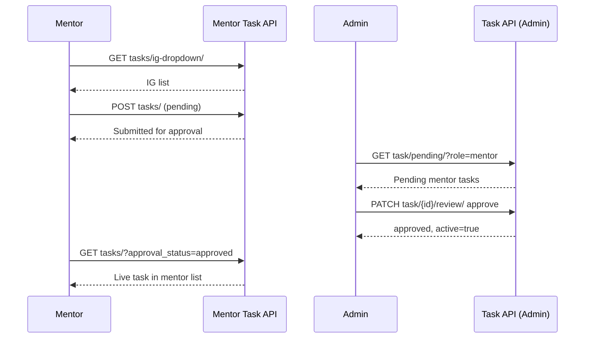

# Dashboard — Mentor Tasks & Admin Task Approval

**Mentor base path:** `/api/v1/dashboard/mentor/`  
**Admin approval base path:** `/api/v1/dashboard/task/`  
**Source:** `api/dashboard/mentor/task_views.py`, `api/dashboard/mentor/mentor_views.py`, `api/dashboard/task/dash_task_view.py`  
**OpenAPI tags:** `Dashboard - Mentor Task`, `Dashboard - Mentor`, `Dashboard - Task`

Related overview: [Dashboard_Mentor.md](./Dashboard_Mentor.md)

---

## Table of Contents

| # | Endpoint | Method(s) | Role |
|---|----------|-----------|------|
| 1 | [`tasks/ig-dropdown/`](#1-tasksig-dropdown) | `GET` | Mentor |
| 2 | [`tasks/`](#2-tasks) | `GET`, `POST` | Mentor |
| 3 | [`tasks/<task_id>/`](#3-taskstask_id) | `GET`, `PUT`, `DELETE` | Mentor |
| 4 | [`activity/`](#4-activity) | `GET` | Mentor, Campus Lead, Lead Enabler |
| 5 | [`task/pending/`](#5-admin-list-pending-tasks) | `GET` | Admin |
| 6 | [`task/<task_id>/review/`](#6-admin-approve-or-reject-task) | `PATCH` | Admin |

---

## Overview

### Response envelope

**Success:**

```json
{
  "hasError": false,
  "statusCode": 200,
  "message": { "general": ["Human-readable success message"] },
  "response": {}
}
```

**Failure:**

```json
{
  "hasError": true,
  "statusCode": 400,
  "message": {
    "general": ["Error summary"],
    "field_name": ["Validation detail"]
  },
  "response": {}
}
```

### Authentication

```http
Authorization: Bearer <access_token>
```

Required on all endpoints below.

### Pagination & search (mentor task list & activity)

| Query param | Default | Description |
|-------------|---------|-------------|
| `pageIndex` | `1` | Page number |
| `perPage` | `10` | Items per page |
| `search` | — | Case-insensitive search (fields vary per endpoint) |
| `sortBy` | — | Sort key; prefix `-` for descending |

**Paginated response shape** (used by `tasks/` GET and `activity/`):

```json
{
  "hasError": false,
  "statusCode": 200,
  "message": { "general": [] },
  "response": {
    "data": [],
    "pagination": {
      "count": 10,
      "totalPages": 1,
      "isNext": false,
      "isPrev": false,
      "nextPage": null
    }
  }
}
```

### Mentor task approval lifecycle

| `approval_status` | `active` | Meaning |
|-------------------|----------|---------|
| `pending` | `false` | Submitted by mentor; awaiting admin review |
| `approved` | `true` | Admin approved; task is live for learners |
| `rejected` | `false` | Admin rejected; see `rejection_reason` |

- On **create**, tasks are saved as `pending` / `active=false`.
- On **edit** (`PUT`), status resets to `pending` and `active=false` (re-approval required).
- Only **pending** tasks can be **deleted** by the mentor.

---

## 1. `tasks/ig-dropdown/`

**`GET /api/v1/dashboard/mentor/tasks/ig-dropdown/`**

Returns Interest Groups where the authenticated user has an active `MENTOR` assignment (`user_ig_link`). Use this to populate the IG selector when creating a task.

**Roles:** `Mentor`

**Query params:** None

**Request body:** None

**Success response:**

```json
{
  "hasError": false,
  "statusCode": 200,
  "message": { "general": ["Success"] },
  "response": [
    {
      "id": "ig-uuid-web-dev",
      "name": "Web Development"
    },
    {
      "id": "ig-uuid-cloud",
      "name": "Cloud & DevOps"
    }
  ]
}
```

**Notes:**

- Empty array if the mentor has no active IG mentor links.
- Only IGs from `UserIgLink` with `assignment_type=MENTOR` and `is_active=true` are returned.

---

## 2. `tasks/`

### List mentor-submitted tasks

**`GET /api/v1/dashboard/mentor/tasks/`**

Lists all tasks where `requested_by` is the authenticated mentor.

**Roles:** `Mentor`

**Query params:**

| Param | Required | Description |
|-------|----------|-------------|
| `approval_status` | No | Filter: `pending`, `approved`, or `rejected` |
| `pageIndex` | No | Page number (default `1`) |
| `perPage` | No | Page size (default `10`) |
| `search` | No | Searches `hashtag`, `title`, `description`, `karma`, `ig__name`, `type__title`, `approval_status` |
| `sortBy` | No | e.g. `title`, `-created_at`, `approval_status`, `karma` |

**Request body:** None

**Success response:**

```json
{
  "hasError": false,
  "statusCode": 200,
  "message": { "general": [] },
  "response": {
    "data": [
      {
        "id": "task-uuid-001",
        "hashtag": "#build-rest-api",
        "discord_link": null,
        "title": "Build a REST API",
        "description": "Create a CRUD API with authentication.",
        "karma": 250,
        "channel": "web-dev",
        "type": "Implementation",
        "active": false,
        "variable_karma": false,
        "usage_count": 1,
        "level": "Level 3",
        "org": null,
        "ig": "Web Development",
        "event": null,
        "bonus_karma": null,
        "bonus_time": null,
        "approval_status": "pending",
        "rejection_reason": null,
        "reviewed_at": null,
        "requested_by_name": "Arjun Menon",
        "requested_at": "2026-05-20T09:00:00Z",
        "skills": [
          {
            "id": "skill-uuid-python",
            "name": "Python",
            "code": "python"
          }
        ],
        "created_at": "2026-05-20T09:00:00Z",
        "updated_at": "2026-05-20T09:00:00Z"
      }
    ],
    "pagination": {
      "count": 1,
      "totalPages": 1,
      "isNext": false,
      "isPrev": false,
      "nextPage": null
    }
  }
}
```

---

### Create a task (submit for approval)

**`POST /api/v1/dashboard/mentor/tasks/`**

Creates a task for an IG the mentor belongs to. Saved as `approval_status=pending`, `active=false` until an admin approves it.

**Roles:** `Mentor`

**Request body:**

```json
{
  "hashtag": "#build-rest-api",
  "title": "Build a REST API",
  "karma": 250,
  "usage_count": 1,
  "description": "Create a CRUD API with authentication and tests.",
  "type": "task-type-uuid",
  "level": "level-uuid",
  "ig": "ig-uuid-web-dev",
  "skill_ids": [
    "skill-uuid-python",
    "skill-uuid-django"
  ]
}
```

| Field | Required | Notes |
|-------|----------|-------|
| `hashtag` | Yes | Must be globally unique |
| `title` | Yes | Max 75 chars |
| `karma` | Yes | Integer |
| `usage_count` | No | Default `1` on model |
| `description` | No | Text |
| `type` | Yes | `TaskType` UUID |
| `level` | No | `Level` UUID |
| `ig` | Yes | Must be an IG from `tasks/ig-dropdown/` (active mentor assignment) |
| `skill_ids` | No | Array of active skill UUIDs; replaces skill links on create |

**Success response:**

```json
{
  "hasError": false,
  "statusCode": 200,
  "message": { "general": ["Task submitted for approval."] },
  "response": {}
}
```

**Validation errors (example):**

```json
{
  "hasError": true,
  "statusCode": 400,
  "message": {
    "hashtag": ["A task with this hashtag already exists."],
    "ig": ["You are not assigned as a mentor for this Interest Group."]
  },
  "response": {}
}
```

---

## 3. `tasks/<task_id>/`

### Get task detail

**`GET /api/v1/dashboard/mentor/tasks/<task_id>/`**

**Roles:** `Mentor` (only tasks where `requested_by` is the current user)

**Request body:** None

**Success response:** Single task object (same shape as one item in the list `data` array above).

**Error:** `404` — Task not found or not owned by this mentor.

---

### Update task (re-submit for approval)

**`PUT /api/v1/dashboard/mentor/tasks/<task_id>/`**

Partial updates allowed. After save, task is reset to `pending`, `active=false`, and review fields cleared.

**Roles:** `Mentor`

**Request body (partial example):**

```json
{
  "title": "Build a REST API (updated)",
  "karma": 300,
  "description": "Added pagination requirements.",
  "skill_ids": ["skill-uuid-python"]
}
```

Writable fields: `hashtag`, `title`, `karma`, `usage_count`, `description`, `type`, `level`, `ig`, `skill_ids`.

**Success response:**

```json
{
  "hasError": false,
  "statusCode": 200,
  "message": { "general": ["Task updated and re-submitted for approval."] },
  "response": {}
}
```

---

### Delete task

**`DELETE /api/v1/dashboard/mentor/tasks/<task_id>/`**

**Roles:** `Mentor`

**Request body:** None

**Success response:**

```json
{
  "hasError": false,
  "statusCode": 200,
  "message": { "general": ["Task deleted successfully."] },
  "response": {}
}
```

**Error:** Only `pending` tasks can be deleted.

```json
{
  "hasError": true,
  "statusCode": 400,
  "message": {
    "general": ["Cannot delete a task with status 'approved'. Only pending tasks can be deleted."]
  },
  "response": {}
}
```

---

## 4. `activity/`

**`GET /api/v1/dashboard/mentor/activity/`**

Returns a merged, paginated timeline of:

1. **Sessions created** by the user (`SESSION_CREATED`)
2. **Learner task submissions appraised** by the user (`TASK_APPRAISED` — karma activity logs where `appraiser_approved_by` is this user)

This is **not** the admin task-approval queue; it is the mentor’s own activity feed.

**Roles:** `Mentor`, `Campus Lead`, `Lead Enabler`

**Query params:** `pageIndex`, `perPage`, `search` (on `title`, `activity_type`, `status`), `sortBy` (e.g. `date`, `-date`)

**Request body:** None

**Success response:**

```json
{
  "hasError": false,
  "statusCode": 200,
  "message": { "general": ["Success"] },
  "response": {
    "data": [
      {
        "id": "session-uuid-abc",
        "activity_type": "SESSION_CREATED",
        "title": "Intro to System Design",
        "description": "Weekly mentorship session for Web Dev IG.",
        "date": "2026-05-28T14:00:00Z",
        "status": "SCHEDULED"
      },
      {
        "id": "karma-log-uuid-xyz",
        "activity_type": "TASK_APPRAISED",
        "title": "Build a REST API",
        "description": null,
        "date": "2026-05-27T11:30:00Z",
        "status": "Approved"
      },
      {
        "id": "karma-log-uuid-def",
        "activity_type": "TASK_APPRAISED",
        "title": "Deploy to AWS",
        "description": null,
        "date": "2026-05-26T09:15:00Z",
        "status": "Pending"
      }
    ],
    "pagination": {
      "count": 3,
      "totalPages": 1,
      "isNext": false,
      "isPrev": false,
      "nextPage": null
    }
  }
}
```

| `activity_type` | `status` values |
|-----------------|-----------------|
| `SESSION_CREATED` | Session status: `PENDING_APPROVAL`, `SCHEDULED`, `COMPLETED`, `CANCELLED`, `REJECTED` |
| `TASK_APPRAISED` | `Pending`, `Approved`, or `Rejected` (from `KarmaActivityLog.appraiser_approved`) |

---

# Admin — Mentor task verification

Admins review mentor-submitted tasks (and company-submitted tasks) via the task dashboard module.

**Base path:** `/api/v1/dashboard/task/`

---

## 5. Admin — list pending tasks

**`GET /api/v1/dashboard/task/pending/`**

Lists tasks filtered by approval status and optional submitter role.

**Roles:** `Admin`

**Query params:**

| Param | Default | Description |
|-------|---------|-------------|
| `approval_status` | `pending` | `pending`, `approved`, or `rejected` |
| `role` | — | Filter submitter: `mentor`, `company`, or `admin` (tasks with no `requested_by`) |
| `mentor_name` | — | Filter by mentor full name (when reviewing mentor tasks) |
| `company_name` | — | Filter by company name |
| `pageIndex`, `perPage`, `search`, `sortBy` | — | Pagination; search on `title`, `hashtag`, company/mentor names |

**Example — mentor tasks awaiting review:**

```http
GET /api/v1/dashboard/task/pending/?approval_status=pending&role=mentor&pageIndex=1&perPage=10
```

**Request body:** None

**Success response:**

```json
{
  "hasError": false,
  "statusCode": 200,
  "message": { "general": ["Tasks fetched successfully."] },
  "response": {
    "tasks": [
      {
        "id": "task-uuid-001",
        "title": "Build a REST API",
        "hashtag": "#build-rest-api",
        "description": "Create a CRUD API with authentication.",
        "karma": 250,
        "approval_status": "pending",
        "ig": {
          "id": "ig-uuid-web-dev",
          "name": "Web Development"
        },
        "type": {
          "id": "task-type-uuid",
          "title": "Implementation"
        },
        "company_name": null,
        "requested_by": {
          "id": "user-uuid-mentor",
          "full_name": "Arjun Menon"
        },
        "requested_at": "2026-05-20T09:00:00+00:00",
        "created_at": "2026-05-20T09:00:00+00:00"
      }
    ],
    "pagination": {
      "count": 1,
      "totalPages": 1,
      "isNext": false,
      "isPrev": false,
      "nextPage": null
    }
  }
}
```

---

## 6. Admin — approve or reject task

**`PATCH /api/v1/dashboard/task/<task_id>/review/`**

Approve or reject a **pending** task. Only tasks with `approval_status=pending` can be reviewed.

**Roles:** `Admin`

### Approve

**Request body:**

```json
{
  "action": "approve"
}
```

**Success response:**

```json
{
  "hasError": false,
  "statusCode": 200,
  "message": { "general": ["Task approved and is now live."] },
  "response": {
    "task_id": "task-uuid-001",
    "approval_status": "approved",
    "active": true,
    "rejection_reason": null,
    "reviewed_by": "admin-user-uuid",
    "reviewed_at": "2026-05-21T10:30:00+00:00"
  }
}
```

### Reject

**Request body:**

```json
{
  "action": "reject",
  "reason": "Hashtag does not follow IG naming guidelines. Please resubmit with #webdev- prefix."
}
```

| Field | Required | Notes |
|-------|----------|-------|
| `action` | Yes | `approve` or `reject` |
| `reason` | Yes when `action=reject` | Stored in `rejection_reason` |

**Success response:**

```json
{
  "hasError": false,
  "statusCode": 200,
  "message": { "general": ["Task rejected."] },
  "response": {
    "task_id": "task-uuid-001",
    "approval_status": "rejected",
    "active": false,
    "rejection_reason": "Hashtag does not follow IG naming guidelines. Please resubmit with #webdev- prefix.",
    "reviewed_by": "admin-user-uuid",
    "reviewed_at": "2026-05-21T10:35:00+00:00"
  }
}
```

### Error responses

**Invalid action:**

```json
{
  "hasError": true,
  "statusCode": 400,
  "message": {
    "general": ["Invalid action. Must be 'approve' or 'reject'."],
    "error_code": ["INVALID_ACTION"]
  },
  "response": {}
}
```

**Task not pending:**

```json
{
  "hasError": true,
  "statusCode": 400,
  "message": {
    "general": ["Only pending tasks can be reviewed. Current status: 'approved'."],
    "error_code": ["INVALID_STATUS_TRANSITION"]
  },
  "response": {}
}
```

**Reject without reason:**

```json
{
  "hasError": true,
  "statusCode": 400,
  "message": {
    "general": ["A rejection reason is required."],
    "error_code": ["REASON_REQUIRED"]
  },
  "response": {}
}
```

---

## End-to-end flow



---

## Related endpoints (not in this module)

| Concern | Where |
|---------|--------|
| Mentor registration / profile | `/api/v1/dashboard/mentor/register/`, `profile/` — [Dashboard_Mentor.md](./Dashboard_Mentor.md) |
| Admin task CRUD (non-approval) | `/api/v1/dashboard/task/` — full task management |
| Learner karma submission appraisal | Discord moderator / LC flows (`KarmaActivityLog.appraiser_approved`) — surfaced in mentor `activity/` as `TASK_APPRAISED` |
| Dropdowns for `type`, `level`, `channel` (admin) | `/api/v1/dashboard/task/task-types/`, `level/`, `channel/` |
