# muLearn Mentor System — Enterprise Redesign Project Plan

---

## 0. North-Star Product Rules (Non-Negotiable)

Before any diagram or code, these six invariants define every decision that follows:

| # | Rule | Source |
|---|------|--------|
| R1 | A mentor's **company is their identity**, not a permission scope. It must survive every tier/scope operation. | Product owner |
| R2 | **Company Mentor** and **IG Mentor** are *badges* (permission scopes). Changing or removing a badge never removes the company relationship. | Product owner |
| R3 | **Campus Mentor** is internal campus machinery only. It has no cross-domain visibility and is excluded from the company-identity guarantee. | Product owner |
| R4 | If a Company Admin later grants **Company Mentor** to an existing IG Mentor, the user gains company-event capabilities **immediately**, without re-verify. | Product owner |
| R5 | **Verification authority moves from Admin → Company Owner** for mentor applications scoped to that company. | Product owner |
| R6 | Any flag that can be set to "off" must have a defined actor who can set it back to "on". | Architecture principle |

---

## 1. Mentor Tier Capabilities

> This table is the single source of truth for what each badge can and cannot do.

| Feature / Action | IG Mentor | Company Mentor | Campus Mentor |
|---|:---:|:---:|:---:|
| **Profile & Identity** | | | |
| View own mentor profile | ✅ | ✅ | ✅ |
| Edit bio / expertise / hours | ✅ | ✅ | ✅ |
| Change employer (company) | ✅ | ✅ | ✅ |
| Appear on public mentor listing | ✅ | ✅ | ❌ (internal only) |
| Employer shown on public card | ✅ | ✅ | ❌ |
| **Interest Group (IG)** | | | |
| Choose preferred IGs (self-service) | ✅ | ✅ | ❌ |
| Appear as mentor on IG detail page | ✅ | ✅ (if IG grant held) | ❌ |
| Create IG mentorship sessions | ✅ | ✅ (if IG grant held) | ❌ |
| Appraise tasks for IG learners | ✅ | ✅ (if IG grant held) | ❌ |
| Post IG-scoped opportunities | ✅ | ✅ | ❌ |
| **Company Actions** | | | |
| Create company events | ❌ | ✅ | ❌ |
| Create company mentorship sessions | ❌ | ✅ | ❌ |
| Post company job listings | ❌ | ✅ | ❌ |
| Post company internships / gigs | ❌ | ✅ | ❌ |
| Appraise company-scoped tasks | ❌ | ✅ | ❌ |
| Access company analytics dashboard | ❌ | ✅ | ❌ |
| **Campus Actions** | | | |
| View campus learner roster | ❌ | ❌ | ✅ |
| Create campus mentorship sessions | ❌ | ❌ | ✅ |
| Appraise campus-scoped tasks | ❌ | ❌ | ✅ |
| Manage campus learning circles | ❌ | ❌ | ✅ |
| View campus analytics dashboard | ❌ | ❌ | ✅ |
| **Verification** | | | |
| Verified by | Company Owner | Company Owner | Platform Admin |
| Can hold additional IG grants | ✅ | ✅ | ❌ |
| Can hold Company Mentor badge simultaneously | ✅ (promotable) | N/A | ❌ |

> [!IMPORTANT]
> An IG Mentor who is later promoted to Company Mentor **retains all IG grants**. No re-application is needed. The Company Mentor badge is additive.

---

## 2. Diagnosis: Why the Current System Breaks

### 2.1 Current Data Model (Broken State)

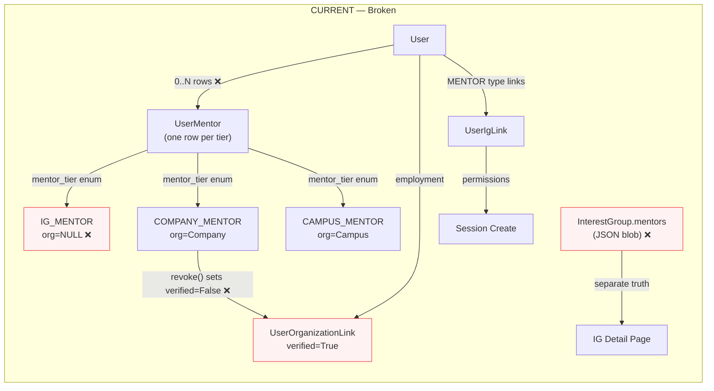

### 2.2 Root Cause Map

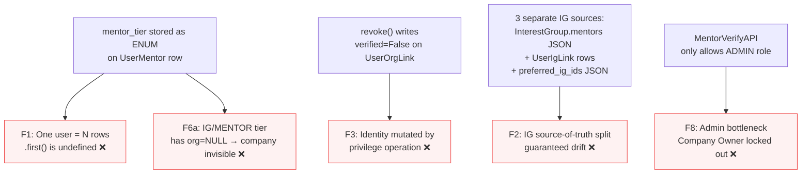

### 2.3 The Core Conflation

The current `UserMentor` row serves **four concepts simultaneously**:

| Concept | Should be stored in | Currently stored in |
|---------|---------------------|---------------------|
| Identity (who you are, where you work) | `User` + `UserOrganizationLink` (employer) | `UserMentor.org` for COMPANY tier only → NULL otherwise |
| Application (asking to become a mentor) | `UserMentor` (one per user) | ✅ Correct, but broken by multi-row pattern |
| Authority (what you may mentor) | Separate grant rows | `UserMentor.mentor_tier` enum (single column, not a set) |
| Preference (what you'd like to mentor) | `preferred_ig_ids` on profile | ✅ Correct field, wrong coupling to grants |

---

## 3. Target Architecture

### 3.1 Concept Map (Post-Redesign)

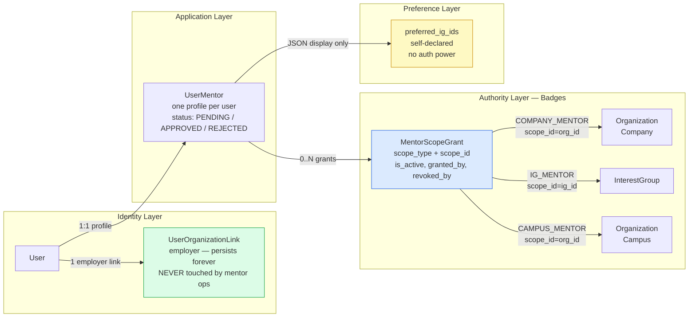

### 3.2 Target Data Model

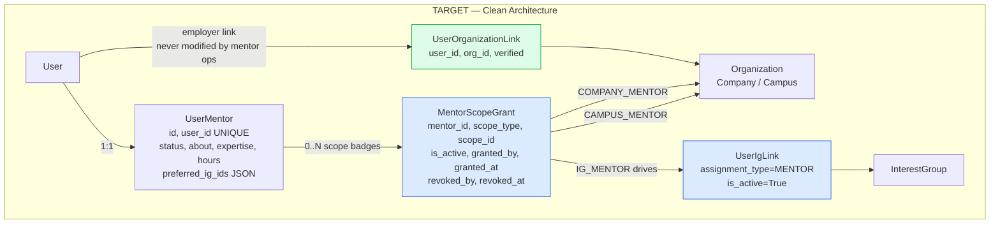

### 3.3 Invariants Enforced by Target Architecture

| Invariant | Mechanism |
|-----------|-----------|
| Identity never mutated by authority ops | `MentorScopeGrant.is_active=False`; `UserOrganizationLink` untouched |
| Company always visible on mentor profile | Profile reads company from `UserOrganizationLink(org_type=COMPANY)`, not from grant |
| Authority is a set, not a single type | `MentorScopeGrant` rows; permissions ask `filter(is_active=True, scope_type=Y, scope_id=Z).exists()` |
| Grant isolation | Adding/removing one grant never affects other grants |
| Company Owner can verify | `MentorVerifyAPI` extended to accept Company Owner JWT |

---

## 4. Complete Tier Flow Diagrams

### 4.1 IG Mentor — Full Lifecycle

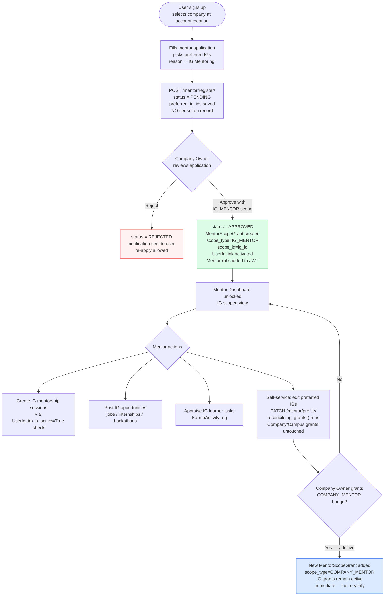

### 4.2 Company Mentor — Full Lifecycle

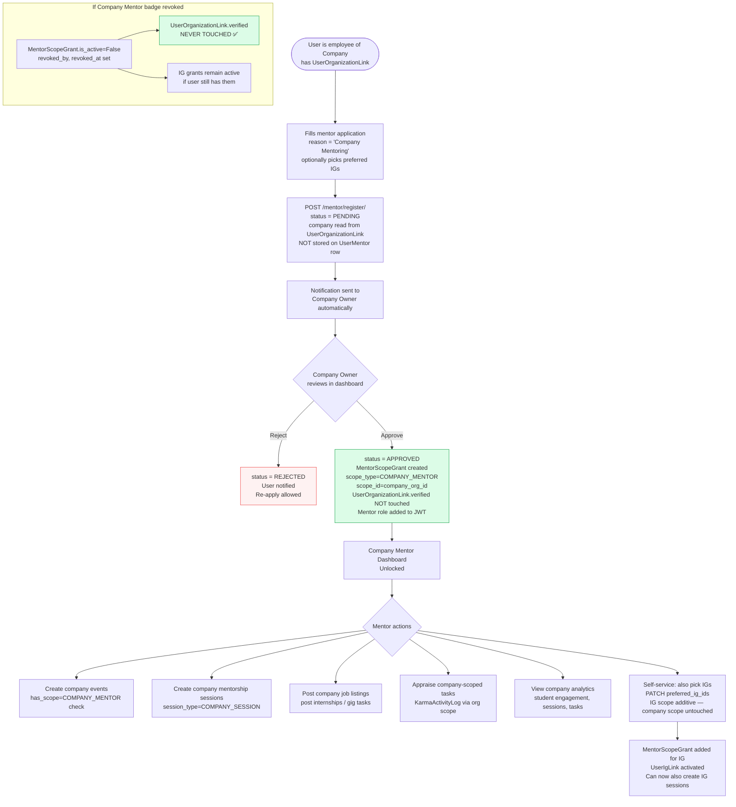

### 4.3 Campus Mentor — Full Lifecycle

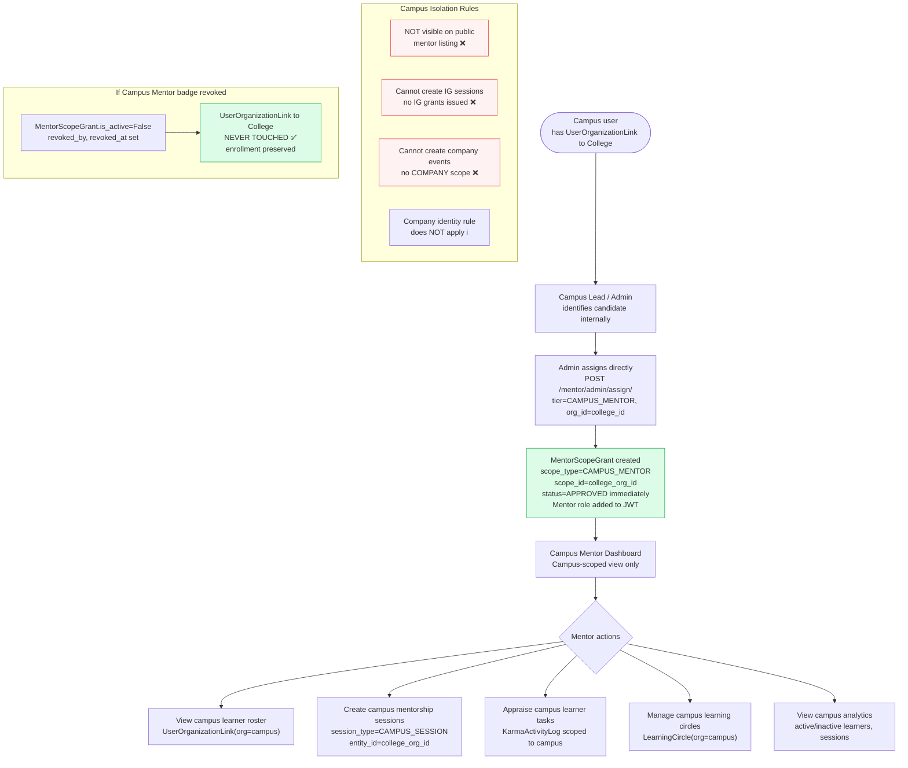

---

## 5. System-Wide Data Flow Diagrams

### 5.1 Sign-Up Flow (New — All Tiers)

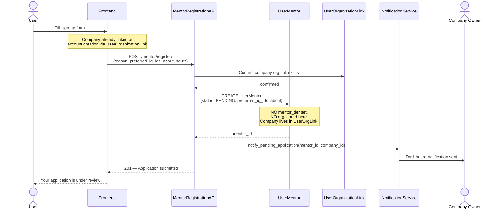

### 5.2 Company Owner Verification Flow

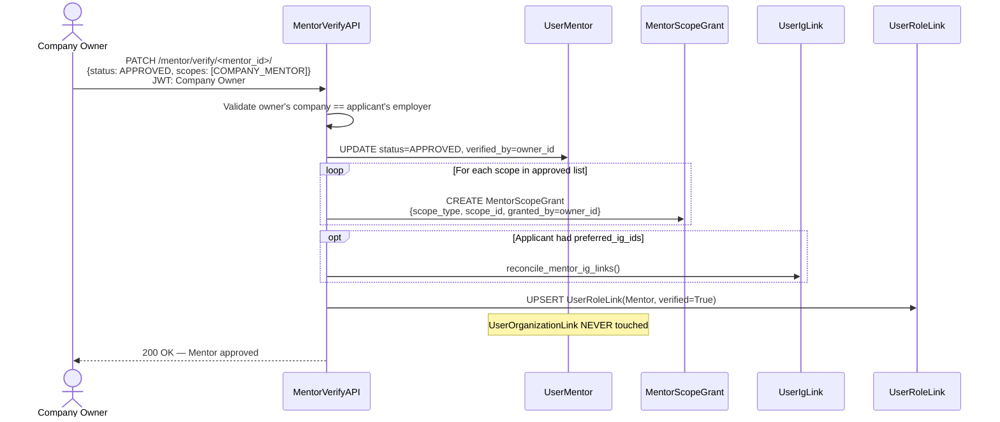

### 5.3 Grant Revocation (No Identity Side-Effects)

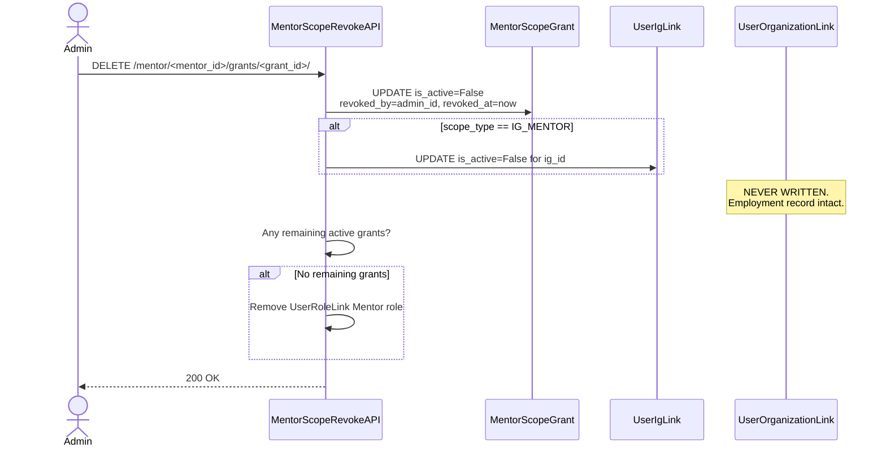

### 5.4 Deterministic Permission Check

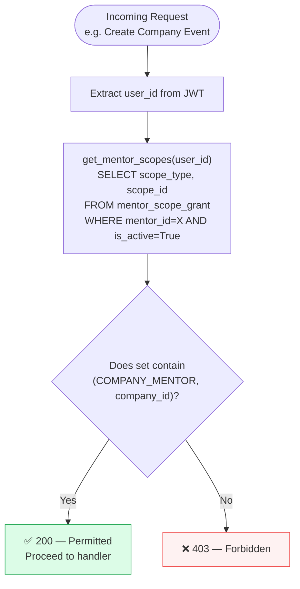

### 5.5 IG Mentor Self-Service Preference Update

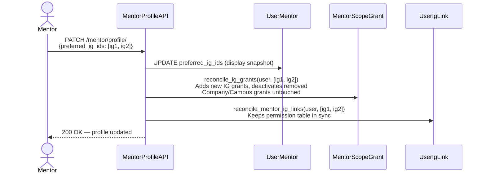

---

## 6. IG Detail Page — Source of Truth Unification

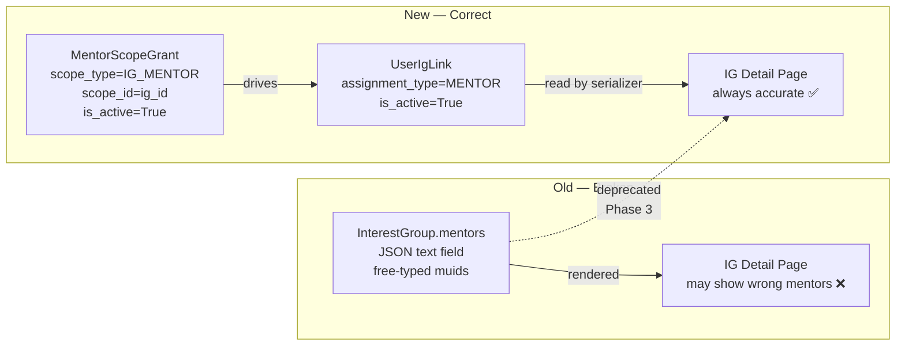

---

## 7. Implementation Plan (Phased)

### Phase 0 — Critical Hotfixes (P0)

Zero-schema-change, zero-risk fixes for the two live bugs.

#### P0.1: Remove identity mutation on revoke

**File:** [`mentor_views.py`](file:///c:/Users/prana/Desktop/for%20auth/mulearnbackend/api/dashboard/mentor/mentor_views.py#L484-L493)

```diff
-               # Unverify org links for campus/company mentors
-               if record.mentor_tier in (
-                   UserMentor.MentorTier.CAMPUS_MENTOR,
-                   UserMentor.MentorTier.COMPANY_MENTOR,
-               ) and record.org:
-                   from db.organization import UserOrganizationLink
-                   UserOrganizationLink.objects.filter(
-                       user=user,
-                       org=record.org,
-                   ).update(verified=False)
```

**Rationale:** Revoking a privilege must never mutate an identity record. `status = REJECTED` already removes all authority.

#### P0.2: Fix company visibility on mentor profile

**File:** [`mentor_views.py`](file:///c:/Users/prana/Desktop/for%20auth/mulearnbackend/api/dashboard/mentor/mentor_views.py#L101-L108)

```python
def _get_mentor_company(user):
    """
    Resolve the mentor's employer.
    Falls back: UserMentor.org → UserOrganizationLink(Company) → None.
    """
    from db.user import UserMentor
    cm = UserMentor.objects.filter(
        user=user,
        mentor_tier=UserMentor.MentorTier.COMPANY_MENTOR,
        status=UserMentor.Status.APPROVED
    ).select_related('org').first()
    if cm and cm.org:
        return {"id": str(cm.org.id), "title": cm.org.title}

    from db.organization import UserOrganizationLink
    uol = UserOrganizationLink.objects.filter(
        user=user, org__org_type="Company"
    ).select_related('org').first()
    if uol:
        return {"id": str(uol.org.id), "title": uol.org.title}

    return None
```

---

### Phase 1 — Schema Extension

Add `MentorScopeGrant` table. No existing columns removed.

#### 1.1 New Model

**File:** [`db/user.py`](file:///c:/Users/prana/Desktop/for%20auth/mulearnbackend/db/user.py)

```python
class MentorScopeGrant(models.Model):
    class ScopeType(models.TextChoices):
        COMPANY_MENTOR = 'COMPANY_MENTOR', 'Company Mentor'
        IG_MENTOR      = 'IG_MENTOR',      'IG Mentor'
        CAMPUS_MENTOR  = 'CAMPUS_MENTOR',  'Campus Mentor'

    id         = models.CharField(primary_key=True, max_length=36, default=uuid.uuid4)
    mentor     = models.ForeignKey(UserMentor, on_delete=models.CASCADE,
                     db_column='mentor_id', related_name='scope_grants')
    scope_type = models.CharField(max_length=14, choices=ScopeType.choices)
    scope_id   = models.CharField(max_length=36, null=True, blank=True)
    is_active  = models.BooleanField(default=True)
    granted_by = models.ForeignKey(User, on_delete=models.CASCADE,
                     db_column='granted_by', related_name='mentor_grants_given')
    granted_at = models.DateTimeField()
    revoked_by = models.ForeignKey(User, on_delete=models.SET_NULL,
                     null=True, blank=True,
                     db_column='revoked_by', related_name='mentor_grants_revoked')
    revoked_at = models.DateTimeField(null=True, blank=True)

    class Meta:
        managed = False
        db_table = 'mentor_scope_grant'
        unique_together = [('mentor', 'scope_type', 'scope_id')]
```

#### 1.2 Alter Script (SQL)

```sql
-- alter-scripts/009_mentor_scope_grant.sql

CREATE TABLE IF NOT EXISTS mentor_scope_grant (
    id          CHAR(36)     NOT NULL PRIMARY KEY,
    mentor_id   CHAR(36)     NOT NULL REFERENCES user_mentor(id) ON DELETE CASCADE,
    scope_type  VARCHAR(14)  NOT NULL,
    scope_id    CHAR(36)     NULL,
    is_active   BOOLEAN      NOT NULL DEFAULT TRUE,
    granted_by  CHAR(36)     NOT NULL REFERENCES user(id),
    granted_at  DATETIME(6)  NOT NULL,
    revoked_by  CHAR(36)     NULL REFERENCES user(id),
    revoked_at  DATETIME(6)  NULL,
    UNIQUE (mentor_id, scope_type, scope_id)
);

-- Backfill from existing UserMentor rows
INSERT INTO mentor_scope_grant
    (id, mentor_id, scope_type, scope_id, is_active, granted_by, granted_at)
SELECT UUID(), um.id, um.mentor_tier,
    CASE WHEN um.mentor_tier IN ('COMPANY_MENTOR','CAMPUS_MENTOR') THEN um.org_id ELSE NULL END,
    (um.status = 'APPROVED'),
    COALESCE(um.verified_by, um.created_by),
    COALESCE(um.verified_at, um.created_at)
FROM user_mentor um WHERE um.mentor_tier != 'MENTOR';

-- Backfill IG grants from authoritative UserIgLink
INSERT INTO mentor_scope_grant
    (id, mentor_id, scope_type, scope_id, is_active, granted_by, granted_at)
SELECT UUID(), um.id, 'IG_MENTOR', uil.ig_id, uil.is_active, uil.assigned_by, uil.created_at
FROM user_ig_link uil
JOIN user_mentor um ON um.user_id = uil.user_id
WHERE uil.assignment_type = 'MENTOR'
ON DUPLICATE KEY UPDATE is_active = uil.is_active;
```

---

### Phase 2 — API Layer

#### 2.1 `get_mentor_scopes()` — Replace All `.first()` Patterns

```python
def get_mentor_scopes(user_id: str) -> set[tuple[str, str | None]]:
    """
    Returns set of active (scope_type, scope_id) pairs.
    Replaces all 9 nondeterministic .first() calls.
    """
    grants = MentorScopeGrant.objects.filter(
        mentor__user_id=user_id,
        mentor__status=UserMentor.Status.APPROVED,
        is_active=True,
    ).values_list('scope_type', 'scope_id')

    if grants.exists():
        return set(grants)

    # Legacy fallback during migration
    mentors = UserMentor.objects.filter(
        user_id=user_id, status=UserMentor.Status.APPROVED
    ).values_list('mentor_tier', 'org_id')
    return {(tier, org_id) for tier, org_id in mentors}


def has_scope(user_id: str, scope_type: str, scope_id: str | None = None) -> bool:
    return (scope_type, scope_id) in get_mentor_scopes(user_id)
```

#### 2.2 New Endpoints

| Method | URL | Auth | Purpose |
|--------|-----|------|---------|
| `GET` | `/mentor/<id>/grants/` | Admin / CompanyOwner | List all grants for a mentor |
| `POST` | `/mentor/<id>/grants/` | Admin / CompanyOwner | Create a scope grant |
| `DELETE` | `/mentor/<id>/grants/<grant_id>/` | Admin / CompanyOwner | Revoke a scope grant |
| `PATCH` | `/mentor/verify/<id>/` *(extended)* | Admin **or** CompanyOwner | Approve/reject application |
| `POST` | `/mentor/profile/company/` | Mentor (self) | Change employer |

#### 2.3 Company Owner Verification

```python
class MentorVerifyAPI(APIView):
    def patch(self, request, mentor_id):
        actor_id = JWTUtils.fetch_user_id(request)
        roles = JWTUtils.fetch_role(request)
        mentor = UserMentor.objects.filter(id=mentor_id).first()

        is_admin = RoleType.ADMIN.value in roles
        is_company_owner = self._is_company_owner_of(actor_id, mentor.user_id)

        if not (is_admin or is_company_owner):
            return CustomResponse(general_message="Forbidden.").get_failure_response(403)

        serializer = MentorVerifySerializer(mentor, data=request.data,
                         context={"user_id": actor_id})
        if serializer.is_valid():
            serializer.save()
            return CustomResponse(general_message="Mentor status updated.").get_success_response()

    @staticmethod
    def _is_company_owner_of(actor_id, applicant_id) -> bool:
        owner_org_ids = UserRoleLink.objects.filter(
            user_id=actor_id, role__title='Company', verified=True
        ).values_list('ig_id', flat=True)
        if not owner_org_ids:
            return False
        return UserOrganizationLink.objects.filter(
            user_id=applicant_id, org_id__in=owner_org_ids, org__org_type='Company'
        ).exists()
```

---

### Phase 3 — IG Detail Page Unification

Change IG detail serializer to read mentors from `UserIgLink`, not the JSON column:

```python
def get_mentors(self, obj):
    links = UserIgLink.objects.filter(
        ig=obj, assignment_type=UserIgLink.AssignmentType.MENTOR, is_active=True
    ).select_related('user')
    return [
        {"id": str(l.user.id), "full_name": l.user.full_name,
         "company": _get_mentor_company(l.user)}
        for l in links
    ]
```

### Phase 4 — Notification System

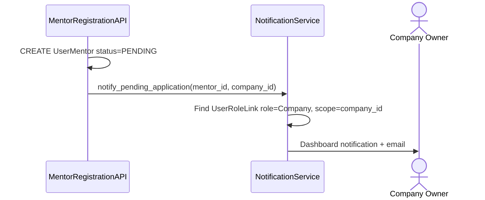

### Phase 5 — Schema Consolidation

After Phases 0–4 are stable:

1. Add `UNIQUE(user_id)` constraint to `user_mentor`
2. Add `company_id` display column to `user_mentor` (snapshot from `UserOrganizationLink`)
3. Deprecate `user_mentor.mentor_tier` enum → authority fully in `mentor_scope_grant`
4. Drop `interest_group.mentors` JSON column
5. Drop `org` FK from `user_mentor`

---

## 8. Priority Order

| Priority | Item | Phase | Files Affected |
|----------|------|-------|----------------|
| **P0** | Remove `verified=False` from revoke | 0 | `mentor_views.py:484-493` |
| **P0** | Company fallback on profile display | 0 | `mentor_views.py`, `serializers.py` |
| **P1** | `get_mentor_scopes()` + replace `.first()` | 1 | `dash_mentor_helper.py`, view files |
| **P1** | `MentorScopeGrant` model + alter script | 1 | `db/user.py`, `alter-scripts/` |
| **P1** | Grant CRUD endpoints | 2 | `mentor_views.py`, `serializers.py`, `urls.py` |
| **P2** | Company Owner verify delegation | 2 | `mentor_views.py`, `serializers.py` |
| **P2** | Company change endpoint (self-service) | 2 | `mentor_views.py`, `serializers.py` |
| **P2** | IG detail reads from `UserIgLink` | 3 | `ig/serializers.py` |
| **P3** | Notification on pending application | 4 | New `notification_service.py` |
| **P3** | Schema consolidation + column drops | 5 | `alter-scripts/`, all affected models |

---

## 9. Files Modified Summary

| Phase | File | Change Type | Description |
|-------|------|-------------|-------------|
| 0 | `api/dashboard/mentor/mentor_views.py` | MODIFY | Delete revoke side-effect (L484–493) |
| 0 | `api/dashboard/mentor/mentor_views.py` | MODIFY | Add `_get_mentor_company()` fallback |
| 0 | `api/dashboard/mentor/serializers.py` | MODIFY | Use helper in `MentorDetailSerializer` |
| 1 | `db/user.py` | MODIFY | Add `MentorScopeGrant` model class |
| 1 | `alter-scripts/009_mentor_scope_grant.sql` | NEW | Create table + backfill SQL |
| 1 | `api/dashboard/mentor/dash_mentor_helper.py` | MODIFY | Add `get_mentor_scopes()`, `has_scope()` |
| 2 | `api/dashboard/mentor/mentor_views.py` | MODIFY | Add Grant CRUD API, extend VerifyAPI |
| 2 | `api/dashboard/mentor/serializers.py` | MODIFY | Add `MentorScopeGrantSerializer` |
| 2 | `api/dashboard/mentor/urls.py` | MODIFY | Add grant and company-change routes |
| 3 | `api/dashboard/ig/dash_ig_serializer.py` | MODIFY | `get_mentors()` reads `UserIgLink` |
| 4 | `utils/notification_service.py` | NEW | Pending application notification |

---

## 10. Testing Strategy

### P0 Tests

```python
def test_revoke_does_not_unverify_org_link():
    # Setup
    mentor = UserMentorFactory(mentor_tier="COMPANY_MENTOR", status="APPROVED")
    org_link = UserOrganizationLinkFactory(user=mentor.user, org=mentor.org, verified=True)
    # Action
    client.delete(f"/api/v1/mentor/admin/assign/{mentor.user.muid}/")
    # Assert
    org_link.refresh_from_db()
    assert org_link.verified is True  # must not change

def test_ig_mentor_profile_shows_company():
    mentor = UserMentorFactory(mentor_tier="IG_MENTOR")
    org_link = UserOrganizationLinkFactory(user=mentor.user, org__org_type="Company", verified=True)
    response = client.get("/api/v1/mentor/status/")
    assert response.data["organization"]["id"] == str(org_link.org.id)
```

### P1 Tests

```python
def test_get_mentor_scopes_returns_all_active_grants():
    scopes = get_mentor_scopes(multi_scope_user.id)
    assert ("COMPANY_MENTOR", str(company.id)) in scopes
    assert ("IG_MENTOR", str(ig.id)) in scopes

def test_has_scope_false_when_revoked():
    grant.is_active = False; grant.save()
    assert has_scope(user.id, "COMPANY_MENTOR", str(company.id)) is False
```

### P2 Tests

```python
def test_company_owner_can_verify_own_employee():
    # Owner verifies employee of their company → 200
    ...

def test_company_owner_cannot_verify_other_company():
    # Owner tries to verify employee of different company → 403
    ...

def test_company_change_does_not_touch_old_org_link():
    old_link = UserOrganizationLinkFactory(user=mentor, verified=True)
    client.post("/api/v1/mentor/profile/company/", {"org_id": new_org.id})
    old_link.refresh_from_db()
    assert old_link.verified is True
```

---

## 11. UX Display Rules

> Binding contracts between backend API and frontend rendering.

| Surface | What to Show | Data Source |
|---------|-------------|-------------|
| Mentor card / public profile | "Software Engineer @ BuiltinBase" | `UserOrganizationLink(Company)` — never `UserMentor.org` |
| Mentor card badges | "IG Mentor: WebDev, CyberSec" | `MentorScopeGrant(IG_MENTOR)` |
| IG detail page — mentors | Avatar, name, company, "Active since" | `UserIgLink(MENTOR)` — not JSON column |
| Admin mentor list | All scope chips, not a single tier | `MentorScopeGrant` rows per mentor |
| Mentor own dashboard | "Your Scopes" chip list | `/mentor/grants/` endpoint |
| Verification queue | Admin sees all; Owner sees only their employees | Filtered by `_is_company_owner_of()` |
| Campus mentor card | Not shown on public listing | Scope = CAMPUS only |

---

## 12. Decision Log

| Decision | Rationale |
|----------|-----------|
| Keep `UserIgLink` as authoritative IG-permission table | Already used correctly by `session_views.py`. `MentorScopeGrant` drives it. |
| `preferred_ig_ids` becomes display-only | Self-service IG preference is UX; actual permissions live in grants. |
| Company Owner verification scope is employer-match only | Cross-company verify is admin-only by policy. |
| `MentorScopeGrant` is `managed=False` | Consistent with muLearn's unmanaged model pattern. |
| Campus Mentor excluded from company-identity guarantee | Product owner confirmed: campus is internal, no cross-domain visibility. |
| Grant addition is always additive (never replaces) | R4 rule: promoting IG Mentor → Company Mentor must not remove IG grants. |

---

## 13. Bug Fix Summary

| Finding | Root Cause | Fix | Phase |
|---------|------------|-----|-------|
| F1 — Nondeterministic auth | `.first()` on multi-row user | `get_mentor_scopes()` + `has_scope()` | P1 |
| F2 — 3 IG sources of truth | JSON + UserIgLink + preferred_ig_ids | `UserIgLink` authoritative; JSON deprecated | P3 |
| F3 — Revoke unverifies employment | `revoke()` writes to `UserOrganizationLink` | Delete 9 lines from `mentor_views.py` | **P0** |
| F5 — `is_verified` crash in IG edit | Field doesn't exist on `UserMentor` | Remove/repair `dash_ig_view.py:422-439` | P0 |
| F6a — Company invisible on profile | `mentor.org` is NULL for IG tier | `_get_mentor_company()` fallback helper | **P0** |
| F6b — No company-change endpoint | No self-service path exists | `MentorCompanyChangeAPI` | P2 |
| F7 — Two "company" definitions | `mentor.org` vs `UserOrganizationLink` | Unified via `_get_mentor_company()` | P0 |
| F8 — Admin bottleneck on verify | Only `ADMIN` role accepted | `MentorVerifyAPI` → Company Owner delegated | P2 |
